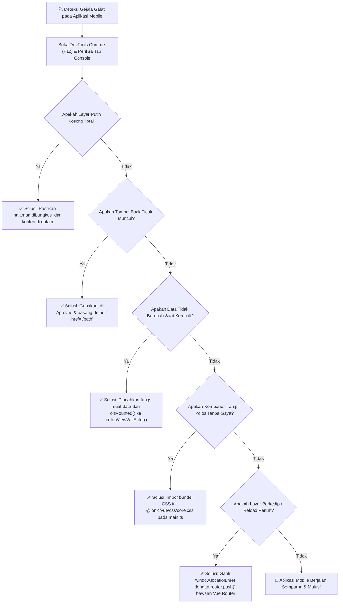

# 🛠️ Panduan Pemecahan Masalah (Troubleshooting) Routing & Komponen Ionic

> **Mata Kuliah:** Pemrograman Berbasis Perangkat Bergerak (STSI4303 / MSIM4401)  
> **Institusi:** Fakultas Sains dan Teknologi, Universitas Terbuka  
> **Materi:** Sesi 04 — Dasar-Dasar Ionic Framework & Navigasi Halaman Mobile

> 💡 **Simulator Diagnostik Interaktif:**  
> Selain membaca panduan teks ini, Anda dapat menguji langsung simulasi interaktif galat vs solusi di peramban web melalui berkas pendamping:  
> 👉 [🌐 Buka Simulator: slide_16_troubleshooting_routing_ionic.html](slide_16_troubleshooting_routing_ionic.html) *(Cukup klik ganda di Google Chrome tanpa instalasi server lokal)*

---

## 📌 Ringkasan Masalah Umum Mahasiswa

Dalam praktikum pengembangan aplikasi mobile berbasis Ionic Vue 3, mahasiswa kerap menghadapi kendala khas arsitektur hybrid. Dokumen ini merangkum diagnosis cepat dan solusi praktis untuk mengatasi galat tersebut.

---

### 1. ⚠️ Layar Putih Kosong (*Blank White Screen*) Saat Navigasi

#### Gejala:
Aplikasi berhasil dikompilasi tanpa galat di terminal, namun saat berpindah halaman melalui menu atau tombol, layar ponsel/browser hanya menampilkan bidang putih kosong total.

#### Penyebab Utama:
* Komponen halaman anak **tidak dibungkus** dengan `<ion-page>`.
* Komponen di dalam template tidak menempatkan konten di dalam `<ion-content>`.

#### Solusi Perbaikan:
Pastikan **setiap file tampilan (`.vue`) yang didaftarkan sebagai rute** memiliki hirarki pembungkus mutlak berikut:

```vue
<template>
  <ion-page>
    <ion-header>
      <ion-toolbar color="primary">
        <ion-title>Judul Layar</ion-title>
      </ion-toolbar>
    </ion-header>

    <ion-content class="ion-padding">
      <!-- KONTEN ANDA WAJIB DI SINI -->
      <p>Isi modul pembelajaran.</p>
    </ion-content>
  </ion-page>
</template>

<script setup lang="ts">
import { IonPage, IonHeader, IonToolbar, IonTitle, IonContent } from '@ionic/vue';
</script>
```

---

### 2. ⚠️ Tombol Kembali (`<ion-back-button>`) Tidak Muncul

#### Gejala:
Di halaman detail, toolbar tidak memunculkan tanda panah kembali, sehingga mahasiswa terjebak tidak bisa kembali ke halaman beranda.

#### Penyebab Utama:
1. Mahasiswa membuka tautan halaman secara langsung (misal mengetik URL langsung di address bar atau me-refresh peramban dengan F5). Pada kondisi ini, tumpukan riwayat (*history stack*) bernilai kosong.
2. Lupa memberikan atribut fallback `default-href`.
3. Menggunakan `<router-view>` milik standar Vue alih-alih `<ion-router-outlet>`.

#### Solusi Perbaikan:
Selalu sertakan atribut `default-href` pada tombol kembali dan gunakan `<ion-router-outlet>` di `App.vue`:

```vue
<!-- Di Toolbar Halaman Detail -->
<ion-buttons slot="start">
  <ion-back-button default-href="/home" text="Kembali"></ion-back-button>
</ion-buttons>
```

```vue
<!-- Di App.vue -->
<template>
  <ion-app>
    <ion-router-outlet />
  </ion-app>
</template>
```

---

### 3. ⚠️ Data Halaman Tidak Pernah Ter-update Saat Kembali dari Layar Lain

#### Gejala:
Mahasiswa telah mengedit profil atau menambahkan KRS di halaman formulir, lalu kembali ke halaman ringkasan, namun angka KRS atau nama mahasiswa tidak berubah.

#### Penyebab Utama:
Mahasiswa meletakkan logika pemanggilan data API di dalam `onMounted()` milik Vue. Karena Ionic menerapkan tumpukan memori (*stack caching*), halaman sebelumnya **tidak pernah dibongkar dari memori**, sehingga `onMounted()` tidak pernah dipanggil kembali!

#### Solusi Perbaikan:
Gunakan lifecycle hook resmi Ionic `onIonViewWillEnter`:

```vue
<script setup lang="ts">
import { onIonViewWillEnter } from '@ionic/vue';
import { ref } from 'vue';

const daftarKRS = ref([]);

// Hook ini terpanggil SETIAP KALI halaman menjadi aktif di layar
onIonViewWillEnter(() => {
  console.log('🔄 Memuat ulang data KRS terbaru...');
  muatDataTerbaru();
});
</script>
```

---

### 4. ⚠️ Komponen Ionic Tampil Sebagai Elemen Teks Mentah Tanpa Gaya

#### Gejala:
Tag `<ion-button>` atau `<ion-card>` tampil seperti teks biasa tanpa warna, tanpa rounded border, dan tanpa efek ripple.

#### Penyebab Utama:
Berkas CSS global bawaan Ionic belum diimpor di berkas utama (`main.ts` atau `index.html`).

#### Solusi Perbaikan:
Pastikan import CSS bundle lengkap di `main.ts`:

```typescript
/* Core CSS required for Ionic components to work properly */
import '@ionic/vue/css/core.css';

/* Basic CSS for apps built with Ionic */
import '@ionic/vue/css/normalize.css';
import '@ionic/vue/css/structure.css';
import '@ionic/vue/css/typography.css';

/* Optional CSS utils that can be commented out */
import '@ionic/vue/css/padding.css';
import '@ionic/vue/css/float-elements.css';
import '@ionic/vue/css/text-alignment.css';
import '@ionic/vue/css/text-transformation.css';
import '@ionic/vue/css/flex-utils.css';
import '@ionic/vue/css/display.css';
```

---

### 5. ⚠️ Navigasi Menggunakan `window.location.href` Merusak Aplikasi

#### Gejala:
Layar berkedip putih, aplikasi memuat ulang dari awal, dan sesi login mahasiswa terputus.

#### Penyebab Utama:
Menggunakan navigasi native web klasik `window.location.href = '/detail'` yang memicu pembacaan ulang seluruh bundle JavaScript.

#### Solusi Perbaikan:
Gunakan fasilitas `useRouter` bawaan Vue / Ionic Vue Router:

```typescript
import { useRouter } from 'vue-router';

const router = useRouter();

// Cara Benar: Navigasi SPA Halus
const keHalamanDetail = (kode: string) => {
  router.push(`/modul/${kode}`);
};
```

---

## 🎯 Intisari Praktikum
| Skenario | Pilihan yang Salah ❌ | Pilihan yang Tepat ✅ |
| :--- | :--- | :--- |
| Wadah Utama Rute | `<router-view>` | `<ion-router-outlet>` |
| Pembungkus Halaman | `<div>` biasa | `<ion-page>` + `<ion-content>` |
| Refresh Data Saat Kembali | `onMounted()` | `onIonViewWillEnter()` |
| Navigasi Antar Layar | `window.location` | `router.push()` |
| Penanganan Back Button | `<ion-back-button>` polos | `<ion-back-button default-href="/home">` |

---

## 🌳 Diagram Pohon Keputusan Diagnostik (Troubleshooting Decision Tree)



---

## 📚 Referensi Akademik
1. **Buku Materi Pokok (BMP) UT:** Prafanto, A., dkk. (2024). *Pemrograman Berbasis Perangkat Bergerak (STSI4303 / MSIM4401)*. Modul 4: Dasar-Dasar Ionic Framework & Navigasi Mobile. Tangerang Selatan: Universitas Terbuka.
2. **Dokumentasi Resmi Ionic Framework:** *Ionic Vue Navigation & Common Issues Troubleshooting Guide* ([ionicframework.com/docs/vue/navigation](https://ionicframework.com/docs/vue/navigation)).
