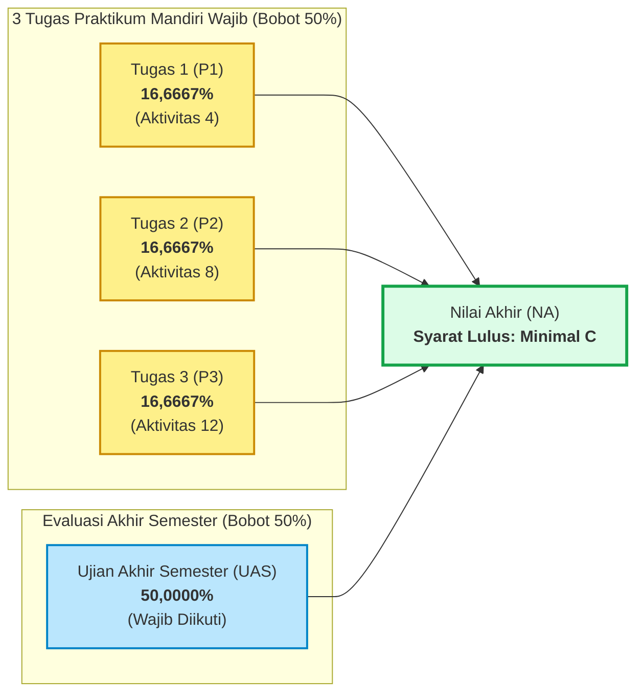

# 📢 INFORMASI & REGULASI RESMI TUGAS MATA KULIAH BERPRAKTIK
## Mata Kuliah: Pemrograman Berbasis Perangkat Bergerak (STSI4303 / MSIM4401 — 3 SKS)
### Dosen Pengampu / Tutor Tuton: Anton Prafanto, S.Kom., M.T.
### Kontak Pengampu: [antonprafanto@unmul.ac.id](mailto:antonprafanto@unmul.ac.id) • WA: [0811-5533-93](https://wa.me/62811553393) • Dukungan: [Trakteer](https://trakteer.id/limitless7/tip)
### Buku Materi Pokok (BMP): Pemrograman Berbasis Piranti Bergerak (MSIM4401) Edisi 1

> [!TIP]
> **Tampilan Versi Web Interaktif & Rapi:**
> Dokumen ini tersedia dalam format Web Modern yang responsif, rapi, dan mudah dibaca:  
> 👉 [**Buka Versi Web Panduan & Informasi Tugas Tuton**](https://antonprafanto.github.io/tuweb_mobile2025/panduan_tutorial_ut/PANDUAN_TUGAS_TUTORIAL_1_2_3.html) *(atau buka berkas lokal `PANDUAN_TUGAS_TUTORIAL_1_2_3.html`)*.

---

## 🏛️ Sambutan & Arahan Tutor (Pak Anton Prafanto)

> *"Rekan-rekan Peserta Tutorial Online (Tuton),*  
> *Perkenalkan, saya Anton Prafanto, tutor tuton untuk mata kuliah Pemrograman Berbasis Perangkat Bergerak. Mata kuliah ini menggunakan Buku Materi Pokok (BMP) Pemrograman Berbasis Piranti Bergerak (MSIM4401) Edisi 1.*  
>  
> *Perlu saya ingatkan bahwa partisipasi dan keaktifan dalam mengerjakan tugas, akan berkontribusi terhadap nilai akhir Saudara.*  
>  
> * **Tugas 1 (P1), Tugas 2 (P2), dan Tugas 3 (P3) pada mata kuliah berpraktik harus lengkap dikerjakan dan diunggah di kelas [elearning.ut.ac.id](https://elearning.ut.ac.id/). Jika salah satu tugas tidak dikerjakan, maka nilai mata kuliah tersebut E.**  
> * **UAS mata kuliah berpraktik wajib diikuti.**  
> * **Komposisi nilai mata kuliah berpraktik adalah 16,6667% P1 + 16,6667% P2 + 16,6667% P3 + 50% UAS.**  
> * **Nilai kelulusan mata kuliah berpraktik minimal C.**  
>  
> *Mata kuliah ini membahas mengenai Pengenalan Lingkungan Pengembangan Aplikasi Perangkat Bergerak, Pemrograman Frontend menggunakan Vue, TypeScript dan Vue, Dasar-dasar Ionic Framework, Layout, Theme, dan Komponen, Intrusion Detection/Prevention System, Ionic pada Platform Android, Pengembangan Aplikasi Mobile terintegrasi menggunakan Ionic, Native API Plugins, dan Aplikasi Terintegrasi.*  
>  
> *Capaian Pembelajaran Mata Kuliah (CPMK) adalah **Mahasiswa mampu mengorganisir data yang tersimpan secara elektronik pada sebuah sistem komputer sehingga menghasilkan informasi yang berguna**.*  
>  
> *Selamat belajar dan tetap semangat! Salam."*

---

## ⚖️ Regulasi Akademik & Formula Nilai Mata Kuliah Berpraktik

> [!CAUTION]
> ### ⚠️ Aturan Kelulusan Kritis (Wajib Diperhatikan):
> 1. **Syarat Kelengkapan Tugas:** Tugas 1 (P1), Tugas 2 (P2), dan Tugas 3 (P3) harus **lengkap dikerjakan seluruhnya** dan diunggah ke kelas Tuton di [elearning.ut.ac.id](https://elearning.ut.ac.id/). **Jika salah satu tugas tidak dikerjakan, maka nilai akhir mata kuliah otomatis E (Gagal)**.
> 2. **Kewajiban UAS:** Ujian Akhir Semester (UAS) mata kuliah berpraktik **wajib diikuti**.
> 3. **Standar Kelulusan Minimal:** Nilai kelulusan mata kuliah berpraktik adalah **minimal C** (Skor Akhir $\ge 56$).

---

## 🎯 Distribusi Tugas & Jadwal Aktivitas Belajar Tuton

Tugas-tugas dikerjakan secara mandiri dengan mengacu pada Panduan Praktikum yang tersedia dalam LMS dan BMP MSIM4401:

| No | Nama Tugas | Topik Praktikum | Jadwal Aktivitas Tuton | Bobot Nilai |
|:---:|:---|:---|:---:|:---:|
| **1** | **Tugas-1 (P1)** | **Praktikum Pemrograman TypeScript dan Vue.js** | Aktivitas Belajar ke-4 | **16,6667%** |
| **2** | **Tugas-2 (P2)** | **Praktikum Perangkat Bergerak dengan Hybrid dan Akses API** | Aktivitas Belajar ke-8 | **16,6667%** |
| **3** | **Tugas-3 (P3)** | **Praktikum Aplikasi Terdistribusi** | Aktivitas Belajar ke-12 | **16,6667%** |
| **-** | **UAS** | **Ujian Akhir Semester Praktikum (Komprehensif Modul 1–9)** | Akhir Semester | **50,0000%** |

---

## 📹 Format Pelaporan & Ketentuan Video Rekaman

Mahasiswa melaporkan kegiatan praktikum yang telah dilakukan dengan mengunggah **tautan (link) rekaman video** (misalnya via YouTube mode *Unlisted* atau Google Drive) yang menampilkan **4 poin wajib**:

1. **Perkenalan identitas mahasiswa:** Menampilkan wajah mahasiswa, menyebutkan Nama Lengkap, Nomor Induk Mahasiswa (NIM), dan UPBJJ-UT.
2. **Langkah-langkah praktik:** Penjelasan baris kode program dan alur konfigurasi yang Anda lakukan, disertai aktivitas kegiatan mahasiswa saat mengoding/menguji.
3. **Hasil praktik yang telah dilakukan:** Demonstrasi langsung aplikasi berjalan di peramban web (*Chrome DevTools*) atau emulator/perangkat Android fisik.
4. **Kata-kata penutup:** Kesimpulan capaian belajar praktikum dan salam penutup dari mahasiswa.

---

## 💡 Studi Kasus Praktikum Mandiri Terbuka di Repositori Ini

Untuk membantu mahasiswa berlatih sebelum mengunggah tugas resmi di LMS UT, repositori ini menyediakan 3 studi kasus praktikum mandiri yang dapat dijalankan secara instan (*zero-friction* tanpa server lokal):

1. 🎯 [**Studi Kasus Praktikum Sesi 03:** Kalkulator IPK & Rekapitulasi SKS Mahasiswa UT](../contoh_kode_program/sesi_03_typescript_vue/slide_17_solusi_tugas_1_kalkulator_nilai.html)  
   *Checklist Kesiapan:* [`slide_16_rubrik_tugas_tutorial_1.html`](../contoh_kode_program/sesi_03_typescript_vue/slide_16_rubrik_tugas_tutorial_1.html)
2. 🎯 [**Studi Kasus Praktikum Sesi 05:** Portal Registrasi KTM Digital & Form Regex](../contoh_kode_program/sesi_05_layout_grid_form/slide_17_solusi_tugas_2_portal_ktm_registrasi.html)  
   *Checklist Kesiapan:* [`slide_16_rubrik_tugas_tutorial_2.html`](../contoh_kode_program/sesi_05_layout_grid_form/slide_16_rubrik_tugas_tutorial_2.html)
3. 🎯 [**Studi Kasus Praktikum Sesi 07:** Mobile Study Tracker & Native Storage](../contoh_kode_program/sesi_07_api_storage_plugins/slide_17_solusi_tugas_3_study_tracker.html)  
   *Checklist Kesiapan:* [`slide_16_rubrik_tugas_tutorial_3.html`](../contoh_kode_program/sesi_07_api_storage_plugins/slide_16_rubrik_tugas_tutorial_3.html)

---

> [!NOTE]
> Selalu akses kelas resmi Anda di **[https://elearning.ut.ac.id/](https://elearning.ut.ac.id/)** untuk mengunggah tugas, mengikuti forum diskusi mingguan, dan melihat pengumuman jadwal sesi tutorial webinar (Tuweb).
