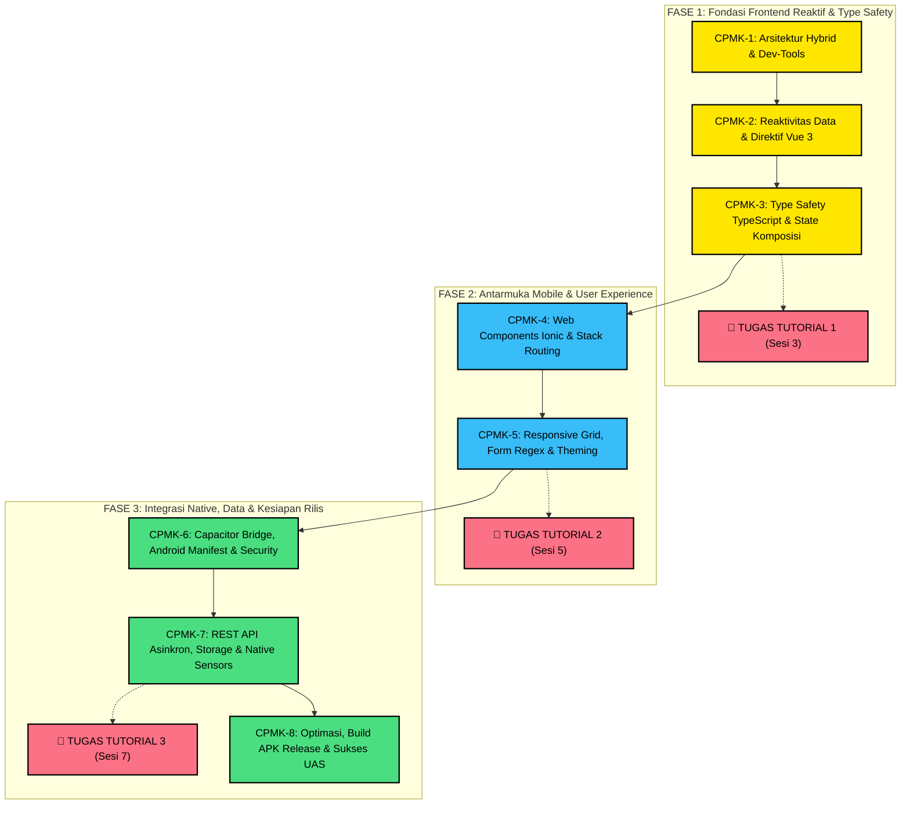

# 📋 RANCANGAN AKTIVITAS TUTORIAL (RAT) & SAT LENGKAP
## Mata Kuliah: Pemrograman Berbasis Perangkat Bergerak (STSI4303 / MSIM4401)
### Program Studi: S1 Sistem Informasi & S1 Informatika
### Fakultas Sains dan Teknologi (FST) — Universitas Terbuka

---

## 1. Identitas Mata Kuliah
* **Nama Mata Kuliah:** Pemrograman Berbasis Perangkat Bergerak
* **Kode Mata Kuliah:** STSI4303 (Ekuivalensi Kurikulum: MSIM4401)
* **Bobot SKS:** 3 SKS (Mata Kuliah Berpraktik Penuh)
* **Pengembang / Penelaah:** Anton Prafanto, S.Kom., M.T.
* **Institusi:** Universitas Terbuka
* **Moda Pelaksanaan:** Tutorial Online (Tuton) di `elearning.ut.ac.id` / Tutorial Webinar (Tuweb)
* **Durasi Tutorial:** 8 Sesi / 8 Pertemuan (@ 120 Menit per pertemuan Tuweb atau 1 minggu per sesi Tuton)
* **Buku Materi Pokok (BMP) Acuan:** BMP STSI4303 / MSIM4401 *Pemrograman Berbasis Piranti Bergerak* (Modul 1 s.d. 9), Penerbit Universitas Terbuka.

---

## 2. Deskripsi Mata Kuliah & Filosofi Pedagogis
Mata kuliah **Pemrograman Berbasis Perangkat Bergerak (STSI4303)** membekali mahasiswa dengan kemampuan komprehensif dalam merancang, membangun, menguji, dan mendistribusikan aplikasi mobile multiplatform modern. Perkuliahan ini menerapkan pendekatan **Hybrid / WebView Architecture** memanfaatkan kombinasi teknologi industri terkini:
1. **Ionic Framework (v7/v8):** Antarmuka pengguna berstandar mobile (Material Design & iOS Cupertino).
2. **Vue.js 3 (Composition API):** Sistem reaktivitas frontend berkinerja tinggi yang deklaratif dan efisien.
3. **TypeScript:** Pengetikan data statis (*static typing*) untuk menjamin keamanan kode dan mencegah galat *runtime*.
4. **Capacitor Runtime:** Jembatan penghubung antara kode web dengan perangkat keras dan sistem operasi Android fisik.

### 🌟 Filosofi "The Zero-Friction Courseware"
Perkuliahan ini dirancang khusus dengan pendekatan ramah bagi mahasiswa dengan latar belakang pemula dan keterbatasan perangkat keras (*hardware-friendly*):
* **Bebas Hambatan Kognitif:** Konsep disajikan bertahap dari pemahaman mental model, visualisasi pohon komponen, hingga contoh kode atomik.
* **Ramah Laptop Spesifikasi Menengah (RAM 4–8GB):** Tidak mewajibkan emulator Android Studio yang berat. Pembelajaran difasilitasi melalui simulasi *Google Chrome Device Toolbar*, live reload, dan pengujian smartphone Android fisik secara instan via kabel USB menggunakan utilitas ringan `scrcpy`.
* **Prinsip One-Slide, One-Runnable-File:** Setiap konsep materi didampingi oleh 1 berkas kode mandiri siap eksekusi tanpa konfigurasi rumit.

---

## 3. Capaian Pembelajaran Mata Kuliah (CPMK)
Setelah menempuh 8 sesi tutorial ini, mahasiswa mampu:
* **CPMK-1:** Menjelaskan arsitektur pengembangan piranti bergerak (Native vs Hybrid) serta menyiapkan lingkungan pengembangan (*development environment*) secara mandiri.
* **CPMK-2:** Membangun antarmuka web reaktif menggunakan sistem reaktivitas, direktif, event handling, dan siklus hidup komponen **Vue.js 3**.
* **CPMK-3:** Menerapkan keamanan tipe data (*type safety*), deklarasi antarmuka (*interface*), dan logika komputasi otomatis menggunakan **TypeScript** dan **Vue Composition API**.
* **CPMK-4:** Mengembangkan struktur navigasi tumpukan (*stack navigation*) dan mengelola siklus hidup layar aplikasi menggunakan **Ionic Framework**.
* **CPMK-5:** Merancang tata letak adaptif (*responsive grid*), validasi masukan formulir berbasis Regular Expression (Regex), serta manipulasi tema dinamis (*Dark/Light Mode*).
* **CPMK-6:** Menghubungkan aplikasi web dengan kapabilitas sistem operasi dan perangkat keras Android melalui runtime **Capacitor** dengan memperhatikan aspek keamanan aplikasi.
* **CPMK-7:** Mengintegrasikan aplikasi mobile dengan layanan data eksternal (**REST API**) secara asinkron, penyimpanan data offline persisten (**Preferences/Local Storage**), dan sensor native (GPS/Kamera).
* **CPMK-8:** Melakukan proses pengujian, optimasi aset, penandatanganan berkas (*code signing keystore*), pembuatan paket instalasi **APK Android Release**, serta menyelesaikan evaluasi komprehensif persiapan UAS.

---

## 4. Peta Hubungan Capaian Pembelajaran (Learning Path Map)

---

## 5. Matriks Rancangan Aktivitas Tutorial (RAT) 8 Sesi

| No | Capaian Pembelajaran Khusus (Sub-CPMK) | Pokok Bahasan | Sub-Pokok Bahasan | Model / Metode Tutorial | Tugas & Tagihan | Waktu | Sumber Belajar & Pustaka |
| :-: | :--- | :--- | :--- | :--- | :---: | :-: | :--- |
| **1** | Mampu membandingkan arsitektur mobile dan menyiapkan dev-tools mandiri | Pengenalan Lingkungan Mobile & Ionic | • Ekosistem mobile: Native vs Hybrid • Setup Node.js LTS, Git, VS Code • Uji diagnostik environment | Tuweb / Tuton, Inisiasi 1, Diskusi Forum | Diskusi 1: Pemilihan Arsitektur Mobile | 120' / 1 pekan | BMP Modul 1; Slide Sesi 01; Kode Sesi 01 |
| **2** | Mampu membangun logika antarmuka reaktif menggunakan Vue.js 3 | Frontend Modern Berbasis Vue.js 3 | • Reactivity state (`ref`, `reactive`) • Direktif `v-if`, `v-for`, `v-model` • Event handling & props komponen | Diskusi, Live Coding, Praktik Mandiri | Diskusi 2: Virtual DOM & Reaktivitas Data | 120' / 1 pekan | BMP Modul 2; Slide Sesi 02; Kode Sesi 02 |
| **3** | Mampu mengimplementasikan tipe data TypeScript dan Vue Composition API | TypeScript & Komposisi Vue 3 | • Interface, Types & Generics • Vue 3 `<script setup lang="ts">` • Computed IPK & Konversi Nilai | Praktikum Terbimbing, Pengerjaan Tugas | 🎯 **TUGAS TUTORIAL 1** *(Kalkulator IPK)* | 120' / 1 pekan | BMP Modul 3; Slide Sesi 03; Solusi Tugas 1 |
| **4** | Mampu merancang navigasi tumpukan (*stack*) dan lifecycle Ionic | Dasar Ionic Framework & Navigasi | • Web Components bawaan Ionic • Ionic Vue Router & Router Outlet • Lifecycle (`ionViewDidEnter`) | Simulasi alur layar, Bedah kode navigasi | Diskusi 4: Pengelolaan Stack Navigasi | 120' / 1 pekan | BMP Modul 4; Slide Sesi 04; Kode Sesi 04 |
| **5** | Mampu merancang form Regex, layout grid responsif, dan Dark Mode | Layout, Theming & Komponen UI | • Grid System 12-Kolom & Cards • Form Regex (NIM 9 digit & Email UT) • Toast, Alert & Dark Mode Switch | Desain antarmuka, Pengerjaan Tugas | 🎯 **TUGAS TUTORIAL 2** *(Portal KTM Digital)* | 120' / 1 pekan | BMP Modul 5; Slide Sesi 05; Solusi Tugas 2 |
| **6** | Mampu menghubungkan web ke Android via Capacitor dan mengamankan izin | Capacitor, Platform Android & Keamanan | • Arsitektur Capacitor Bridge • `AndroidManifest` & Permissions • USB Debugging & scrcpy | Praktik perangkat fisik, Analisis izin | Diskusi 6: Izin Hardware & Sanitasi Webview | 120' / 1 pekan | BMP Modul 6 & 7; Slide Sesi 06; Kode Sesi 06 |
| **7** | Mampu mengintegrasikan REST API, storage offline, dan sensor native | REST API, Local Storage & Native Plugin | • HTTP Asinkron (`async/await`) • Penyimpanan persisten Preferences • Plugin Geolocation (GPS) & Kamera | Integrasi end-to-end, Pengerjaan Tugas | 🎯 **TUGAS TUTORIAL 3** *(Study Tracker)* | 120' / 1 pekan | BMP Modul 8 & 9; Slide Sesi 07; Solusi Tugas 3 |
| **8** | Mampu mengemas APK Android release, menerapkan keamanan, dan siap UAS | Optimasi, Build APK Release & Review UAS | • Bundling production & Tree-shaking • Keystore Signing APK Release • Bedah 50 Soal Kisi-kisi UAS | Simulasi evaluasi, Review komprehensif | Diskusi 8: Refleksi & Kesiapan Portofolio | 120' / 1 pekan | BMP Modul 9; Slide Sesi 08; Bank Soal UAS |

---

## 6. Satuan Acara Tutorial (SAT) Lengkap Sesi 1 s.d. 8

Setiap pertemuan (120 menit) dibagi ke dalam 3 tahapan standar akademik UT:

### 🔹 SAT Sesi 1: Pengenalan Lingkungan Pengembangan & Arsitektur Mobile
* **Pendahuluan (15 Menit):** Penjelasan kontrak kuliah, silabus RAT, sistem penilaian mata kuliah praktik, serta pentingnya pemrograman mobile dalam karir IT.
* **Penyajian (90 Menit):**
  1. Perbandingan Native, Cross-Platform, dan Hybrid (Ionic).
  2. Demonstrasi instalasi Node.js, Git, dan VS Code.
  3. Menjalankan skrip diagnostik environment dan aplikasi mobile pertama di browser.
  4. Pengenalan Chrome DevTools Toggle Device Toolbar (`Ctrl+Shift+M`) dan konfigurasi USB Debugging.
* **Penutup (15 Menit):** Rangkuman sesi, penjelasan topik Diskusi 1 di LMS, dan panduan belajar mandiri Modul 1.

### 🔹 SAT Sesi 2: Frontend Modern Berbasis Vue.js 3
* **Pendahuluan (15 Menit):** Review arsitektur hybrid dan apersepsi transisi dari JavaScript DOM konvensional ke framework reaktif.
* **Penyajian (90 Menit):**
  1. Konsep reaktivitas mendalam: `ref()` vs `reactive()`.
  2. Praktik direktif template: `v-if`, `v-for`, `:key`, dan `v-model`.
  3. Event handling dan implementasi *Computed Properties*.
  4. Komposisi komponen dan alur komunikasi data via `props` dan `emit`.
* **Penutup (15 Menit):** Evaluasi cepat logika reaktif, arahan keaktifan Diskusi 2, dan pengantar TypeScript untuk Sesi 3.

### 🔹 SAT Sesi 3: Keamanan Tipe Data TypeScript & Vue Composition API
* **Pendahuluan (15 Menit):** Reviu Vue 3 dan urgensi *type safety* pada aplikasi skala besar untuk mencegah *runtime crash*.
* **Penyajian (90 Menit):**
  1. Sintaks TypeScript: Interface, Tipe Primitif, Union Types, dan Generics `Array<T>`.
  2. Implementasi Vue 3 `<script setup lang="ts">`.
  3. Membangun logika kalkulasi otomatis nilai huruf ke bobot angka.
  4. **Bedah Skenario Kasus & Rubrik Penilaian TUGAS TUTORIAL 1.**
* **Penutup (15 Menit):** Penegasan tenggat waktu Tugas 1 (2 minggu), kewajiban menyertakan video demonstrasi aplikasi, dan integritas akademik.

### 🔹 SAT Sesi 4: Dasar-Dasar Ionic Framework & Navigasi Halaman
* **Pendahuluan (15 Menit):** Mengingatkan pengumpulan Tugas 1 dan pengenalan konsep antarmuka mobile siap pakai.
* **Penyajian (90 Menit):**
  1. Anatomi komponen Ionic: `ion-app`, `ion-page`, `ion-header`, `ion-content`, `ion-card`, `ion-button`.
  2. Filosofi navigasi mobile berkonsep tumpukan kartu (*stack navigation*).
  3. Konfigurasi Ionic Vue Router dan komponen `ion-router-outlet`.
  4. Siklus hidup halaman: `ionViewDidEnter` vs `ionViewWillLeave`.
* **Penutup (15 Menit):** Rangkuman alur routing, pembahasan pemicu Diskusi 4 di LMS, dan persiapan materi validasi form.

### 🔹 SAT Sesi 5: Layout Responsif, Form Validasi Regex, & Dynamic Theming
* **Pendahuluan (15 Menit):** Apersepsi kenyamanan pengguna (User Experience) di berbagai ukuran layar smartphone.
* **Penyajian (90 Menit):**
  1. Perancangan tata letak dengan Ionic 12-Column Responsive Grid (`ion-grid`, `ion-row`, `ion-col`).
  2. Komponen formulir: `ion-input`, `ion-select`, dan `ion-toggle`.
  3. Validasi Regex: Format 9 digit NIM dan email `@ecampus.ut.ac.id`.
  4. Umpan balik visual interaktif (`ion-toast` / `ion-alert`) dan implementasi sakelar *Dark Mode*.
  5. **Bedah Skenario Kasus & Rubrik Penilaian TUGAS TUTORIAL 2.**
* **Penutup (15 Menit):** Penegasan aturan Tugas 2, batas waktu pengumpulan, dan pengantar runtime Capacitor.

### 🔹 SAT Sesi 6: Capacitor Runtime, Platform Android & Keamanan Aplikasi
* **Pendahuluan (15 Menit):** Mengingatkan tenggat Tugas 2 dan pengenalan jembatan antara web dengan hardware smartphone.
* **Penyajian (90 Menit):**
  1. Arsitektur Capacitor Bridge vs Cordova klasik.
  2. Konfigurasi `capacitor.config.ts` dan struktur folder `android/`.
  3. Bedah `AndroidManifest.xml` dan tata cara meminta *Runtime Permissions*.
  4. Praktik pengujian di ponsel fisik Android melalui USB Debugging dan `scrcpy` (hemat RAM).
  5. Keamanan aplikasi: Sanitasi input masukan terhadap celah XSS dan pengamanan komunikasi HTTPS.
* **Penutup (15 Menit):** Rangkuman integrasi native, arahan forum Diskusi 6, dan persiapan integrasi data eksternal.

### 🔹 SAT Sesi 7: Integrasi REST API Asinkron, Penyimpanan Data & Plugin Native
* **Pendahuluan (15 Menit):** Apersepsi aplikasi modern yang terhubung ke internet dan mampu bekerja saat offline.
* **Penyajian (90 Menit):**
  1. Komunikasi REST API asinkron menggunakan sintaks `async/await` dan penanganan error `try-catch`.
  2. Pengelolaan 3 status UI: *Loading* (spinner), *Success* (data), dan *Error*.
  3. Penyimpanan data lokal persisten offline menggunakan *Capacitor Preferences*.
  4. Mengakses sensor native perangkat: Geolocation GPS dan plugin Kamera.
  5. **Bedah Skenario Kasus & Rubrik Penilaian TUGAS TUTORIAL 3.**
* **Penutup (15 Menit):** Penegasan bobot tertinggi Tugas 3 (25% nilai Tuton), instruksi video demo, dan pengantar sesi rilis.

### 🔹 SAT Sesi 8: Optimasi Kinerja, Build APK Release & Kisi-kisi Evaluasi UAS
* **Pendahuluan (15 Menit):** Refleksi menyeluruh capaian pembelajaran dari Sesi 1 hingga Sesi 7.
* **Penyajian (90 Menit):**
  1. Langkah optimasi produksi: Minifikasi kode dan kompresi aset gambar.
  2. Konsep penandatanganan digital (*code signing*) dan pembuatan berkas *Keystore*.
  3. Pembuatan berkas APK Android Release mandiri (`assembleRelease`).
  4. Checklist 10 parameter keamanan aplikasi mobile sebelum didistribusikan.
  5. Bedah kisi-kisi dan pembahasan 50 bank soal persiapan Ujian Akhir Semester (UAS).
* **Penutup (15 Menit):** Evaluasi akhir perkuliahan, tips menempuh UAS mata kuliah praktik, salam penutup, dan motivasi karir profesional.

---

## 7. Instrumen Evaluasi & Tagihan Tugas Tutorial Wajib

Sesuai aturan baku UT, mahasiswa wajib mengerjakan **3 Tugas Praktik Individu**:

### 🎯 Tugas Tutorial 1 (Diberikan pada Sesi 3, Dikumpulkan Akhir Sesi 4)
* **Topik:** Logika Frontend TypeScript & Reaktivitas Vue 3
* **Studi Kasus:** Aplikasi Kalkulator Indeks Prestasi Semester (IPS) & Nilai Mahasiswa UT.
* **Rubrik Penilaian (Skor 0–100):**
  1. Ketepatan definisi interface TypeScript (`kode`, `nama`, `sks`, `nilaiHuruf`): **20 Poin**
  2. Implementasi Composition API (`ref`/`reactive`) dan direktif (`v-for`, `v-model`): **30 Poin**
  3. Akurasi kalkulasi otomatis total SKS dan IPS menggunakan `computed`: **30 Poin**
  4. Kerapian kode, penanganan error masukan, dan laporan dokumentasi: **20 Poin**

### 🎯 Tugas Tutorial 2 (Diberikan pada Sesi 5, Dikumpulkan Akhir Sesi 6)
* **Topik:** Desain UI Mobile Ionic, Form Validasi Regex, dan Dynamic Theming
* **Studi Kasus:** Portal Layanan Mandiri & Kartu Tanda Mahasiswa (KTM) Digital UT.
* **Rubrik Penilaian (Skor 0–100):**
  1. Pemanfaatan komponen resmi Ionic UI (`ion-card`, `ion-item`, `ion-button`): **25 Poin**
  2. Implementasi validasi form Regex (NIM 9 digit & email kampus `@ecampus.ut.ac.id`): **35 Poin**
  3. Umpan balik interaktif saat submit form (`ion-toast` / `ion-alert`): **20 Poin**
  4. Fungsionalitas Dark/Light Mode switch dan tampilan KTM digital: **20 Poin**

### 🎯 Tugas Tutorial 3 (Diberikan pada Sesi 7, Dikumpulkan Akhir Sesi 8)
* **Topik:** Aplikasi Mobile Terintegrasi (REST API + Local Storage + Native Plugin)
* **Studi Kasus:** UT Mobile Study Tracker (Pencatat Presensi & Lokasi Belajar Mahasiswa).
* **Rubrik Penilaian (Skor 0–100):**
  1. Pengambilan data eksternal via REST API publik asinkron (`async/await`): **30 Poin**
  2. Mekanisme simpan, baca, dan hapus data lokal persisten (*Preferences*): **25 Poin**
  3. Integrasi plugin native Capacitor (Geolocation GPS atau Kamera): **25 Poin**
  4. Struktur arsitektur kode, penanganan galat, dan kejelasan video demo: **20 Poin**

### 🛡️ Standar Integritas Akademik & Video Demonstrasi Wajib
Setiap pengumpulan tugas mahasiswa **WAJIB** menyertakan:
1. Berkas **Laporan PDF** (berisi nama, NIM, UPBJJ-UT, tautan repositori, penjelasan arsitektur, dan tangkapan layar aplikasi).
2. Tautan **Repositori GitHub** publik yang memuat kode sumber.
3. Tautan **Video Demonstrasi (YouTube Unlisted / Google Drive terbuka)** berdurasi 3–5 menit:
   * Menampilkan wajah mahasiswa di awal video sambil menyebutkan identitas diri.
   * Mendemonstrasikan aplikasi yang berjalan di browser / smartphone fisik.
   * Menjelaskan alur baris kode utama yang dikerjakan.
   * *Tugas tanpa video demo atau terindikasi plagiasi dikenakan sanksi nilai 0 (Nol).*

---

## 8. Ketentuan Penilaian Akhir Mata Kuliah Praktik UT

Sesuai regulasi penjaminan mutu akademik Universitas Terbuka:
1. **Bobot Komponen Tutorial Online (Tuton):**
   * Partisipasi Aktif 8 Forum Diskusi: **30%**
   * Tugas Tutorial 1: **20%**
   * Tugas Tutorial 2: **25%**
   * Tugas Tutorial 3: **25%**
2. **Kontribusi Nilai Akhir Semester:**
   $$\text{Nilai Akhir} = 50\% \text{ (Nilai Tuton)} + 50\% \text{ (Nilai UAS)}$$
   *(Nilai Tuton 50% akan dihitung jika nilai Ujian Akhir Semester / UAS mahasiswa mencapai ambang batas minimal $\ge 30$).*

---

## 9. Panduan Teknis Lingkungan Kerja (*Hardware-Friendly*)

| Jalur Praktik | Kebutuhan Minimum | Metode Pengujian | Sasaran Mahasiswa |
| :--- | :--- | :--- | :--- |
| **Jalur Web Preview (CDN Standalone)** | RAM 4GB, Celeron/i3, Chrome/Edge | Buka file `.html` langsung dengan klik dua kali; gunakan Chrome Device Toolbar (`Ctrl+Shift+M`). | Mahasiswa dengan laptop spesifikasi terbatas atau belajar di warnet/kantor. |
| **Jalur USB Debugging + scrcpy** | RAM 4–8GB, Kabel USB, HP Android | Jalankan `ionic serve`, tampilkan layar ponsel ke laptop via `scrcpy` (< 70MB RAM). | **Rekomendasi Utama seluruh mahasiswa UT** (ringan, responsif, tanpa emulator). |
| **Jalur Full Android SDK** | RAM 8–16GB, SSD kosong > 20GB | Kompilasi lokal menggunakan Gradle & Android Studio. | Mahasiswa yang ingin mendalami pembuatan APK release mandiri. |

---

## 10. Alokasi Beban Belajar Mahasiswa (Standar SN-Dikti 3 SKS)

Sesuai Permendikbudristek & Standar Pendidikan Tinggi Jarak Jauh (PTTJJ) Universitas Terbuka, mata kuliah 3 SKS setara dengan **136 jam kegiatan belajar per semester** (~8,5 jam per minggu selama 16 minggu) yang didistribusikan dalam:
1. **Tutorial Terbimbing (Tuweb / Tuton):** 2 jam per sesi tatap maya atau telaah inisiasi aktif di LMS.
2. **Tugas Terstruktur & Praktikum Mandiri:** 3 jam per pekan (mengembangkan kode program, troubleshooting error, menguji di HP fisik).
3. **Belajar Mandiri (Self-Paced Learning):** 3,5 jam per pekan (membaca BMP Modul 1 s.d. 9, menyimak video demo, meninjau dokumentasi resmi).

---

## 11. Glosarium Istilah Kunci Pemrograman Mobile (A–Z)

* **Capacitor:** Runtime lintas platform resmi dari Ionic yang menjembatani panggilan JavaScript ke API native Android/iOS.
* **Composition API:** Paradigma modern Vue 3 berbasis fungsi (`<script setup>`) untuk mengorganisasi logika reaktif secara modular.
* **CORS (Cross-Origin Resource Sharing):** Mekanisme keamanan browser yang membatasi permintaan HTTP ke domain berbeda.
* **Hybrid App:** Aplikasi yang dibangun dengan teknologi web (HTML/CSS/JS) dan dijalankan di dalam container WebView native ponsel.
* **Keystore:** Berkas biner terenkripsi yang memuat kunci privat untuk menandatangani paket APK Android rilis resmi.
* **One-Way Data Binding:** Aliran data satu arah dari variabel state JavaScript ke tampilan antarmuka template (`{{ }}` atau `v-bind`).
* **Reactivity:** Kemampuan framework untuk memperbarui tampilan antarmuka secara otomatis seketika data sumbernya mengalami perubahan.
* **scrcpy:** Aplikasi open source ringan berkinerja tinggi untuk menampilkan layar smartphone Android fisik di layar PC melalui USB.
* **Stack Navigation:** Pola navigasi layar mobile berkonsep tumpukan kartu bertumpuk (*Push* halaman baru ke atas, *Pop* saat kembali).
* **Two-Way Data Binding:** Sinkronisasi data bolak-balik secara simultan antara nilai input pengguna dengan variabel state (`v-model`).
* **Type Safety:** Jaminan keamanan kode saat kompilasi bahwa setiap variabel hanya menampung tipe data yang dideklarasikan secara sah.

---

## 12. Daftar Pustaka & Rujukan Resmi
1. **Pustaka Utama:**
   * Tim Dosen Universitas Terbuka. (2024). *Buku Materi Pokok STSI4303 / MSIM4401: Pemrograman Berbasis Piranti Bergerak*. Tangerang Selatan: Penerbit Universitas Terbuka.
2. **Dokumentasi Resmi & Standar Industri:**
   * Ionic Framework Documentation (v7/v8). *Ionic UI Components & Vue Lifecycle*. [https://ionicframework.com/docs](https://ionicframework.com/docs).
   * Vue.js Official Guide (v3.4+). *Composition API & Reactivity Core*. [https://vuejs.org](https://vuejs.org).
   * TypeScript Documentation (v5.x). *TypeScript Handbook: Interfaces and Type System*. [https://www.typescriptlang.org](https://www.typescriptlang.org).
   * Capacitor by Ionic. *Cross-Platform Native Runtime*. [https://capacitorjs.com](https://capacitorjs.com).
   * Prafanto, Anton. (2026). *The Zero-Friction Courseware Framework*. GitHub Repository: [https://github.com/antonprafanto/mobile2026.git](https://github.com/antonprafanto/mobile2026.git).
