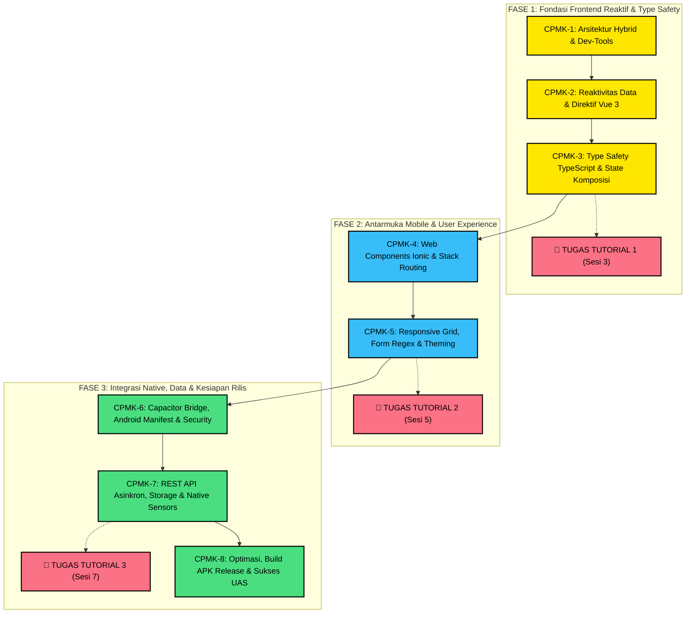
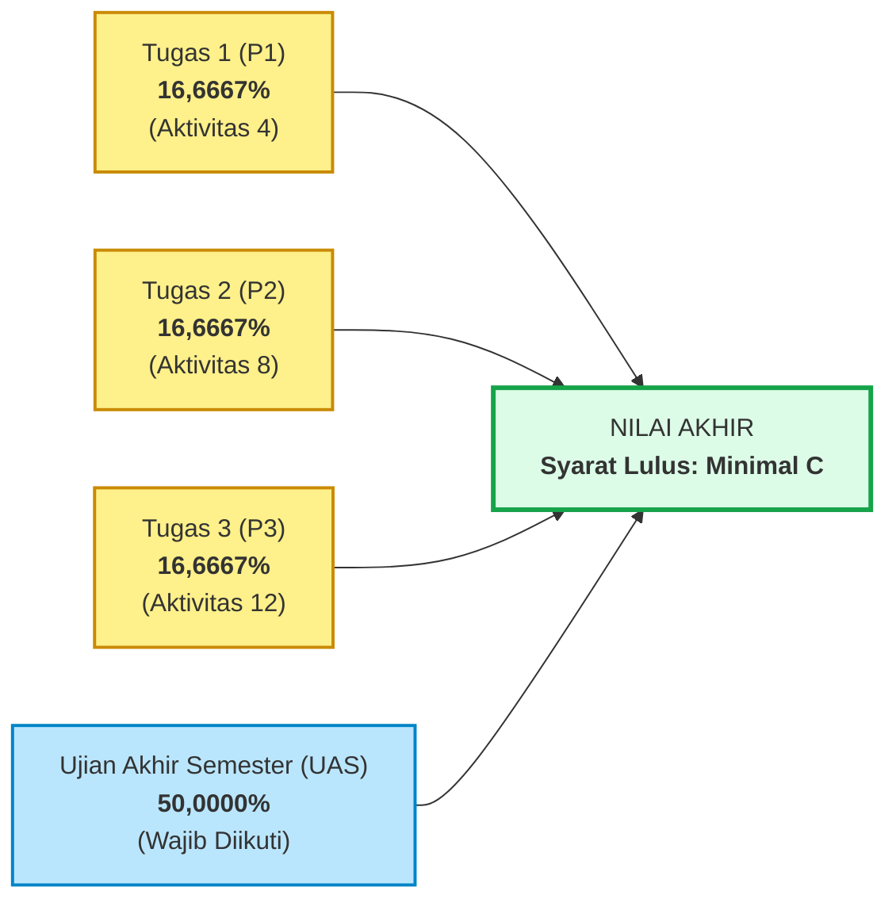

# 📋 RANCANGAN AKTIVITAS TUTORIAL (RAT) & SAT RESMI UT
## Mata Kuliah: Pemrograman Berbasis Piranti Perangkat Bergerak (MSIM4401 / STSI4303)
### Program Studi: S1 Sistem Informasi
### Fakultas Sains dan Teknologi (FST) — Universitas Terbuka
#### Dokumen Mutu Akademik: `BB03-RK15-RII.2` (15 Agustus 2019) • Tahun Pengembangan: 2022

> [!TIP]
> **Tampilan Versi Web Interaktif & Berkas Asli:**
> * 👉 [**Buka Versi Web Silabus RAT/SAT Resmi**](https://antonprafanto.github.io/tuweb_mobile2025/panduan_tutorial_ut/RANCANGAN_AKTIVITAS_TUTORIAL_RAT.html) *(atau buka berkas lokal `RANCANGAN_AKTIVITAS_TUTORIAL_RAT.html`)*.
> * 📥 [**Unduh Berkas Asli Dokumen RAT MSIM4401 (PDF)**](1_RAT_Pemrograman_Mobile_MSIM4401.pdf) *(Berkas pindaian resmi Program Studi Sistem Informasi FST UT)*.
> * 📖 [**Ruang Baca Virtual (RBV) Perpustakaan UT**](https://pustaka.ut.ac.id/lib/msim4401-pemrograman-berbasis-piranti-bergerak/) *(Modul 1 s.d. 9 BMP Digital resmi UT)*.

---

## 1. Identitas Mata Kuliah
* **Nama Mata Kuliah:** Pemrograman Berbasis Piranti Perangkat Bergerak
* **Kode Mata Kuliah:** MSIM 4401 (Ekuivalensi Kurikulum: STSI4303)
* **Bobot SKS:** 3 SKS (Mata Kuliah Berpraktik Penuh)
* **Nama Pengembang:** Andri Suryadi, S.Kom., M.Kom.
* **Tutor Tuton / Dosen Pengampu:** Anton Prafanto, S.Kom., M.T.
* **Kontak Dosen:** [antonprafanto@unmul.ac.id](mailto:antonprafanto@unmul.ac.id) • WhatsApp: [0811-5533-93](https://wa.me/62811553393) • Dukungan: [Trakteer ↗](https://trakteer.id/limitless7/tip)
* **Institusi:** Universitas Terbuka — Fakultas Sains dan Teknologi (FST)
* **Program Studi:** S1 Sistem Informasi
* **Moda Pelaksanaan:** Tutorial Online (Tuton) di `elearning.ut.ac.id` / Tutorial Webinar (Tuweb)
* **Durasi Tutorial:** 8 Sesi / 8 Pertemuan (@ 120 Menit per pertemuan Tuweb atau 1 minggu per sesi Tuton)
* **Tahun Pengembangan:** 2022
* **Buku Materi Pokok (BMP) Acuan:** BMP MSIM4401 / STSI4303 *Pemrograman Berbasis Piranti Bergerak* (Modul 1 s.d. 9), Penulis: **Bambang Purnomosidi, S.Kom., M.Kom.**, Edisi 1, Tangerang Selatan: Penerbit Universitas Terbuka, 2022. ISBN: 978-623-312-884-1 ([Katalog RBV Perpustakaan UT ↗](https://pustaka.ut.ac.id/lib/msim4401-pemrograman-berbasis-piranti-bergerak/)).

---

## 2. Deskripsi Singkat Mata Kuliah & Filosofi Pedagogis
Mata kuliah ini secara umum memberikan pengetahuan dan pengalaman secara praktis kepada mahasiswa agar mampu:
1. Melakukan analisis terhadap suatu masalah pemrograman yang bisa diselesaikan melalui aplikasi perangkat bergerak menggunakan pendekatan **hybrid (WebView)**.
2. Mengimplementasikan hasil analisis tersebut ke dalam suatu aplikasi perangkat bergerak (**Android**) menggunakan **Ionic Framework**, Vue.js 3, dan TypeScript.
3. Melakukan proses **testing** dan **deployment** terhadap hasil aplikasi yang dibuat tersebut.

### 🌟 Filosofi "The Zero-Friction Courseware"
Perkuliahan ini dirancang khusus dengan pendekatan ramah bagi mahasiswa dengan latar belakang pemula dan keterbatasan perangkat keras (*hardware-friendly*):
* **Bebas Hambatan Kognitif:** Konsep disajikan bertahap dari pemahaman mental model, visualisasi arsitektur, hingga contoh kode atomik.
* **Ramah Laptop Spesifikasi Menengah (RAM 4–8GB):** Tidak mewajibkan emulator Android Studio yang berat. Pembelajaran difasilitasi melalui simulasi *Google Chrome Device Toolbar*, live reload, dan pengujian smartphone Android fisik secara instan via kabel USB menggunakan utilitas ringan `scrcpy`.
* **Prinsip One-Slide, One-Runnable-File:** Setiap konsep materi didampingi oleh 1 berkas kode mandiri siap eksekusi tanpa instalasi build tools rumit.

---

## 3. Capaian Pembelajaran Mata Kuliah (CPMK)

Sesuai dokumen resmi RAT MSIM4401 dan arahan akademik Program Studi:
> **Capaian Pembelajaran Mata Kuliah (CPMK Dokumen RAT Resmi):**  
> *"Mahasiswa mampu melakukan analisis, mengimplementasikan hasil analisis ke dalam suatu aplikasi perangkat bergerak, dan melakukan deployment aplikasi."*

> **Capaian Pembelajaran Mata Kuliah (CPMK Kompetensi Pengorganisasian Data LMS Tuton):**  
> *"Mahasiswa mampu mengorganisir data yang tersimpan secara elektronik pada sebuah sistem komputer sehingga menghasilkan informasi yang berguna."*

Secara operasional dalam 8 sesi tutorial perkuliahan, CPMK diturunkan ke dalam 8 Sub-CPMK berikut:
* **Sub-CPMK 1:** Menjelaskan arsitektur pengembangan piranti bergerak (Native vs Hybrid) serta menyiapkan lingkungan pengembangan (*development environment*) secara mandiri.
* **Sub-CPMK 2:** Membangun antarmuka web reaktif menggunakan sistem reaktivitas, direktif, event handling, dan siklus hidup komponen **Vue.js 3**.
* **Sub-CPMK 3:** Menerapkan keamanan tipe data (*type safety*), deklarasi antarmuka (*interface*), dan logika komputasi otomatis menggunakan **TypeScript** dan **Vue Composition API** (*Praktikum P1*).
* **Sub-CPMK 4:** Mengembangkan struktur navigasi tumpukan (*stack navigation*) dan mengelola siklus hidup layar aplikasi menggunakan **Ionic Framework**.
* **Sub-CPMK 5:** Merancang tata letak adaptif (*responsive grid*), validasi masukan formulir berbasis Regular Expression (Regex), serta manipulasi tema dinamis (*Praktikum P2*).
* **Sub-CPMK 6:** Menghubungkan aplikasi web dengan kapabilitas sistem operasi dan perangkat keras Android melalui runtime **Capacitor** dengan memperhatikan aspek keamanan aplikasi.
* **Sub-CPMK 7:** Mengintegrasikan aplikasi mobile dengan layanan data eksternal (**REST API**) secara asinkron, penyimpanan data offline persisten (**Preferences/Local Storage**), dan sensor native (*Praktikum P3*).
* **Sub-CPMK 8:** Melakukan proses pengujian, optimasi aset, penandatanganan berkas (*code signing keystore*), pembuatan paket instalasi **APK Android Release**, serta menyelesaikan evaluasi komprehensif persiapan UAS.

---

## 4. Peta Hubungan Capaian Pembelajaran (Learning Path Map)

---

## 5. Matriks Rancangan Aktivitas Tutorial (RAT) 8 Sesi Resmi UT

Tabel matriks ini mengacu secara utuh pada dokumen resmi RAT Mata Kuliah **MSIM4401** (Universitas Terbuka):

| Tutorial Ke- | Capaian Pembelajaran Khusus (CPK) | Pokok Bahasan | Sub Pokok Bahasan | Aktivitas Belajar | Modus Belajar | Tagihan & Tugas Tutorial | Pustaka Resmi |
| :-: | :--- | :--- | :--- | :--- | :-: | :--- | :-: |
| **1** | Mampu membangun aplikasi dengan menggunakan pendekatan hybrid ini, seorang pemrogram harus memahami pembuatan aplikasi di sisi Web terutama menggunakan HTML, CSS, serta JavaScript dan framework antarmuka (*interface*) Web tertentu menggunakan Vue.js | **Pengenalan Lingkungan Pengembangan Aplikasi Berbasis Perangkat Bergerak** | 1. Lingkungan Pengembangan Aplikasi Perangkat Bergerak, Hybrid App dan Ionic Framework 2. Pemrograman Typescript 3. Pemrograman Typescript (lanjut) | 1. Mahasiswa mempelajari materi dalam Modul 2. Mahasiswa aktif mengikuti kegiatan diskusi tutorial | Tuweb: &check; Tuton: &check; | **Diskusi 1:** Pemilihan Arsitektur Mobile & Setup Dev-Tools | [1][2][3][4][5][6][7] |
| **2** | Mampu memahami pemrograman di sisi frontend menggunakan Vue untuk antarmuka di Web | **Pemrograman Sisi Frontend Menggunakan Vue** | 1. Dasar-Dasar Vue 2. Vue lanjutan (1) 3. Vue lanjutan (2) | 1. Mahasiswa mempelajari materi dalam Modul 2. Mahasiswa aktif mengikuti kegiatan diskusi tutorial | Tuweb: &check; Tuton: &check; | **Diskusi 2:** Reaktivitas Data, Direktif & Virtual DOM | [8][9][10] |
| **3** | Mampu membuat program menggunakan TypeScript dengan tingkat kompleksitas menengah, menggunakan TypeScript untuk Web-API dan RESTful API, dan membuat program untuk frontend menggunakan TypeScript dan Vue. | **Praktikum-1: Typescript dan Vue** | 1. Membuat Aplikasi Command Line Menggunakan Typescript 2. Membuat dan Mengakses Restful API Endpoint 3. Membuat Instan Aplikasi Vue menggunakan Typescript | 1. Mahasiswa mempelajari materi dalam Modul 2. Mahasiswa aktif mengikuti kegiatan diskusi tutorial 3. Mahasiswa aktif mengerjakan tugas khusus | Tuweb: &check; Tuton: &check; Praktik: &check; | 🔥 🎯 **TUGAS TUTORIAL 1 (P1)** *(Bobot 16,6667% - Aktivitas 4)* | [11][12][13][14][15][16][17][18] |
| **4** | Mampu memahami dasar-dasar penggunaan Ionic untuk membangun aplikasi dengan Vue sebagai komponen antarmuka | **Dasar-Dasar Ionic Framework** | 1. Instalasi Ionic Serta Lingkungan Pengembangannya 2. Memulai Ionic Berbasis Vue 3. Struktur Direktori Dan Elemen Ionic Menggunakan Vue | 1. Mahasiswa mempelajari materi dalam Modul 2. Mahasiswa aktif mengikuti kegiatan diskusi tutorial | Tuweb: &check; Tuton: &check; | **Diskusi 4:** Dasar Ionic UI & Stack Navigation | [19][20][21] |
| **5** | Mampu memahami cara mengatur layout serta peletakan komponen di dalam kontainer di layout tampilan menggunakan CSS yang bisa meliputi keseluruhan bagian antarmuka pada aplikasi | **Layout, Theme, dan Komponen** | 1. Layout Untuk Struktur Aplikasi dan Custom Layout Menggunakan Responsive GRID 2. Tema dan CSS 3. Komponen UI (*User Interface*) di Ionic | 1. Mahasiswa mempelajari materi dalam Modul 2. Mahasiswa aktif mengikuti kegiatan diskusi tutorial 3. Mahasiswa aktif mengerjakan tugas khusus | Tuweb: &check; Tuton: &check; Praktik: &check; | 🔥 🎯 **TUGAS TUTORIAL 2 (P2)** *(Bobot 16,6667% - Aktivitas 8)* | [22][23][24][25] |
| **6** | Mampu memahami Integrasi Ionic dengan Vue, Teknik Layout, Theme, dan Komponen Ionic | **Praktikum-2: Integrasi Ionic dengan Vue, Teknik Layout, Theme, dan Komponen Ionic** | 1. Praktikum Instalasi Ionic dan Integrasi Ionic dengan Vue 2. Praktikum Teknik Layout dan Tema/Theme 3. Praktikum Komponen Antarmuka Ionic | 1. Mahasiswa mempelajari materi dalam Modul 2. Mahasiswa aktif mengikuti kegiatan diskusi tutorial | Tuweb: &check; Tuton: &check; | **Diskusi 6:** Capacitor Bridge & Runtime Android | [26][27][28][29][30][31] |
| **7** | Mampu memahami pembuatan aplikasi android menggunakan Ionic | **Ionic pada Platform Android** | 1. Setting Platform Android 2. Native API - Plugins 3. Akses Data 4. Tips dan Tricks Ionic | 1. Mahasiswa mempelajari materi dalam Modul 2. Mahasiswa aktif mengikuti kegiatan diskusi tutorial 3. Mahasiswa aktif mengerjakan tugas khusus | Tuweb: &check; Tuton: &check; Praktik: &check; | 🔥 🎯 **TUGAS TUTORIAL 3 (P3)** *(Bobot 16,6667% - Aktivitas 12)* | [32][33][34][35][36][37][38] |
| **8** | Mampu mengembangkan aplikasi terintegrasi menggunakan Ionic | **Pengembangan Aplikasi Mobile Terintegrasi Menggunakan Ionic dan Praktikum Akses Data, Native-API Plugins, dan Aplikasi Terintegrasi** | 1. Akses Data Restful-API Menggunakan Typescript 2. Aplikasi Mobile dengan Akses Restful-API 3. Praktikum: Akses Data 4. Praktikum: Native API - Plugins 5. Praktikum: Membangun Aplikasi Terintegrasi | 1. Mahasiswa mempelajari materi dalam Modul 2. Mahasiswa aktif mengikuti kegiatan diskusi tutorial | Tuweb: &check; Tuton: &check; | **Diskusi 8 & 🎓 Evaluasi UAS** *(UAS Wajib - Bobot 50,0000%)* | [39][40][41][42][43][44][45][46][47][48][49][50][51][52][53] |

---

## 6. Satuan Acara Tutorial (SAT) Lengkap Sesi 1 s.d. 8

Setiap pertemuan (120 menit) dibagi ke dalam 3 tahapan standar akademik UT:

### 🔹 SAT Sesi 1: Pengenalan Lingkungan Pengembangan & Arsitektur Mobile
* **Pendahuluan (15 Menit):** Penjelasan kontrak kuliah, silabus RAT, sistem penilaian mata kuliah praktik, serta pentingnya pemrograman mobile dalam karir IT.
* **Penyajian (90 Menit):**
  1. Perbandingan Native, Cross-Platform, dan Hybrid (Ionic).
  2. Demonstrasi instalasi Node.js, Git, dan VS Code.
  3. Menjalankan skrip diagnostik environment dan aplikasi mobile pertama di browser.
  4. Pengenalan Chrome DevTools Toggle Device Toolbar (`Ctrl+Shift+M`) dan konfigurasi USB Debugging.
* **Penutup (15 Menit):** Rangkuman sesi, penjelasan topik Diskusi 1 di LMS, dan panduan belajar mandiri Modul 1.

### 🔹 SAT Sesi 2: Frontend Modern Berbasis Vue.js 3
* **Pendahuluan (15 Menit):** Review arsitektur hybrid dan apersepsi transisi dari JavaScript DOM konvensional ke framework reaktif.
* **Penyajian (90 Menit):**
  1. Konsep reaktivitas mendalam: `ref()` vs `reactive()`.
  2. Praktik direktif template: `v-if`, `v-for`, `:key`, dan `v-model`.
  3. Event handling dan implementasi *Computed Properties*.
  4. Komposisi komponen dan alur komunikasi data via `props` dan `emit`.
* **Penutup (15 Menit):** Evaluasi cepat logika reaktif, arahan keaktifan Diskusi 2, dan pengantar TypeScript untuk Sesi 3.

### 🔹 SAT Sesi 3: Keamanan Tipe Data TypeScript & Vue Composition API
* **Pendahuluan (15 Menit):** Reviu Vue 3 dan urgensi *type safety* pada aplikasi skala besar untuk mencegah *runtime crash*.
* **Penyajian (90 Menit):**
  1. Sintaks TypeScript: Interface, Tipe Primitif, Union Types, dan Generics `Array<T>`.
  2. Implementasi Vue 3 `<script setup lang="ts">`.
  3. Membangun logika kalkulasi otomatis nilai huruf ke bobot angka.
  4. **Bedah Skenario Kasus & Rubrik Penilaian TUGAS TUTORIAL 1.**
* **Penutup (15 Menit):** Penegasan tenggat waktu Tugas 1 (2 minggu), kewajiban menyertakan video demonstrasi aplikasi, dan integritas akademik.

### 🔹 SAT Sesi 4: Dasar-Dasar Ionic Framework & Navigasi Halaman
* **Pendahuluan (15 Menit):** Mengingatkan pengumpulan Tugas 1 dan pengenalan konsep antarmuka mobile siap pakai.
* **Penyajian (90 Menit):**
  1. Anatomi komponen Ionic: `ion-app`, `ion-page`, `ion-header`, `ion-content`, `ion-card`, `ion-button`.
  2. Filosofi navigasi mobile berkonsep tumpukan kartu (*stack navigation*).
  3. Konfigurasi Ionic Vue Router dan komponen `ion-router-outlet`.
  4. Siklus hidup halaman: `ionViewDidEnter` vs `ionViewWillLeave`.
* **Penutup (15 Menit):** Rangkuman alur routing, pembahasan pemicu Diskusi 4 di LMS, dan persiapan materi validasi form.

### 🔹 SAT Sesi 5: Layout Responsif, Form Validasi Regex, & Dynamic Theming
* **Pendahuluan (15 Menit):** Apersepsi kenyamanan pengguna (User Experience) di berbagai ukuran layar smartphone.
* **Penyajian (90 Menit):**
  1. Perancangan tata letak dengan Ionic 12-Column Responsive Grid (`ion-grid`, `ion-row`, `ion-col`).
  2. Komponen formulir: `ion-input`, `ion-select`, dan `ion-toggle`.
  3. Validasi Regex: Format 9 digit NIM dan email `@ecampus.ut.ac.id`.
  4. Umpan balik visual interaktif (`ion-toast` / `ion-alert`) dan implementasi sakelar *Dark Mode*.
  5. **Bedah Skenario Kasus & Rubrik Penilaian TUGAS TUTORIAL 2.**
* **Penutup (15 Menit):** Penegasan aturan Tugas 2, batas waktu pengumpulan, dan pengantar runtime Capacitor.

### 🔹 SAT Sesi 6: Capacitor Runtime, Platform Android & Keamanan Aplikasi
* **Pendahuluan (15 Menit):** Mengingatkan tenggat Tugas 2 dan pengenalan jembatan antara web dengan hardware smartphone.
* **Penyajian (90 Menit):**
  1. Arsitektur Capacitor Bridge vs Cordova klasik.
  2. Konfigurasi `capacitor.config.ts` dan struktur folder `android/`.
  3. Bedah `AndroidManifest.xml` dan tata cara meminta *Runtime Permissions*.
  4. Praktik pengujian di ponsel fisik Android melalui USB Debugging dan `scrcpy` (hemat RAM).
  5. Keamanan aplikasi: Sanitasi input masukan terhadap celah XSS dan pengamanan komunikasi HTTPS.
* **Penutup (15 Menit):** Rangkuman integrasi native, arahan forum Diskusi 6, dan persiapan integrasi data eksternal.

### 🔹 SAT Sesi 7: Integrasi REST API Asinkron, Penyimpanan Data & Plugin Native
* **Pendahuluan (15 Menit):** Apersepsi aplikasi modern yang terhubung ke internet dan mampu bekerja saat offline.
* **Penyajian (90 Menit):**
  1. Komunikasi REST API asinkron menggunakan sintaks `async/await` dan penanganan error `try-catch`.
  2. Pengelolaan 3 status UI: *Loading* (spinner), *Success* (data), dan *Error*.
  3. Penyimpanan data lokal persisten offline menggunakan *Capacitor Preferences*.
  4. Mengakses sensor native perangkat: Geolocation GPS dan plugin Kamera.
  5. **Bedah Skenario Kasus & Rubrik Penilaian TUGAS TUTORIAL 3.**
* **Penutup (15 Menit):** Penegasan bobot tertinggi Tugas 3 (25% nilai Tuton), instruksi video demo, dan pengantar sesi rilis.

### 🔹 SAT Sesi 8: Optimasi Kinerja, Build APK Release & Kisi-kisi Evaluasi UAS
* **Pendahuluan (15 Menit):** Refleksi menyeluruh capaian pembelajaran dari Sesi 1 hingga Sesi 7.
* **Penyajian (90 Menit):**
  1. Langkah optimasi produksi: Minifikasi kode dan kompresi aset gambar.
  2. Konsep penandatanganan digital (*code signing*) dan pembuatan berkas *Keystore*.
  3. Pembuatan berkas APK Android Release mandiri (`assembleRelease`).
  4. Checklist 10 parameter keamanan aplikasi mobile sebelum didistribusikan.
  5. Bedah kisi-kisi dan pembahasan 50 bank soal persiapan Ujian Akhir Semester (UAS).
* **Penutup (15 Menit):** Evaluasi akhir perkuliahan, tips menempuh UAS mata kuliah praktik, salam penutup, dan motivasi karir profesional.

---

## 7. Instrumen Evaluasi & Tagihan Tugas Praktikum Wajib

Sesuai ketentuan tutor tuton pada kelas `elearning.ut.ac.id`, mahasiswa wajib mengerjakan **3 Tugas Praktikum Mandiri** yang dilaporkan dalam bentuk rekaman video:

### 🎯 Tugas-1 (P1): Praktikum Pemrograman TypeScript dan Vue JS
* **Jadwal Tagihan:** Aktivitas Belajar ke-4 (Sesi 3 / Modul 3 BMP).
* **Bobot Nilai:** **16,6667%** dari Nilai Akhir Mata Kuliah.
* **Topik Utama:** Keamanan Tipe Data TypeScript, Interface Model, Reaktivitas Vue 3 Composition API (`ref`, `reactive`), dan Kalkulasi Otomatis (`computed`).
* **Studi Kasus Pembelajaran Mandiri:** Aplikasi Kalkulator Indeks Prestasi Semester (IPS) & Nilai Mahasiswa UT.
* **Rubrik Penilaian Teknis (Skor 0–100):**
  1. Ketepatan definisi interface TypeScript (`kode`, `nama`, `sks`, `nilaiHuruf`): **20 Poin**
  2. Implementasi Composition API (`ref`/`reactive`) dan direktif (`v-for`, `v-model`): **30 Poin**
  3. Akurasi kalkulasi otomatis total SKS dan IPS menggunakan `computed`: **30 Poin**
  4. Kerapian kode, penanganan galat masukan, dan pemenuhan 4 poin rekaman video: **20 Poin**

### 🎯 Tugas-2 (P2): Praktikum Perangkat Bergerak dengan Hybrid dan Akses API
* **Jadwal Tagihan:** Aktivitas Belajar ke-8 (Sesi 5 / Modul 5 BMP).
* **Bobot Nilai:** **16,6667%** dari Nilai Akhir Mata Kuliah.
* **Topik Utama:** Desain UI Mobile Ionic, 12-Column Responsive Grid, Form Validasi Regular Expression (Regex), dan Dynamic Theming (Dark Mode).
* **Studi Kasus Pembelajaran Mandiri:** Portal Layanan Mandiri & Kartu Tanda Mahasiswa (KTM) Digital UT.
* **Rubrik Penilaian Teknis (Skor 0–100):**
  1. Pemanfaatan komponen resmi Ionic UI (`ion-card`, `ion-item`, `ion-button`): **25 Poin**
  2. Implementasi validasi form Regex (NIM 9 digit & email kampus `@ecampus.ut.ac.id`): **35 Poin**
  3. Umpan balik interaktif saat submit form (`ion-toast` / `ion-alert`): **20 Poin**
  4. Fungsionalitas Dark/Light Mode switch dan pemenuhan 4 poin rekaman video: **20 Poin**

### 🎯 Tugas-3 (P3): Praktikum Aplikasi Terdistribusi
* **Jadwal Tagihan:** Aktivitas Belajar ke-12 (Sesi 7 / Modul 7–9 BMP).
* **Bobot Nilai:** **16,6667%** dari Nilai Akhir Mata Kuliah.
* **Topik Utama:** Komunikasi Data Jaringan (REST API Publik asinkron), Penyimpanan Lokal Persisten (*Offline Storage Preferences*), dan Sensor Hardware Native (GPS / Kamera via Capacitor).
* **Studi Kasus Pembelajaran Mandiri:** UT Mobile Study Tracker (Pencatat Presensi & Lokasi Belajar Mahasiswa).
* **Rubrik Penilaian Teknis (Skor 0–100):**
  1. Pengambilan data eksternal via REST API publik asinkron (`async/await`): **30 Poin**
  2. Mekanisme simpan, baca, dan hapus data lokal persisten (*Preferences*): **25 Poin**
  3. Integrasi plugin native Capacitor (Geolocation GPS atau Kamera): **25 Poin**
  4. Arsitektur kode terstruktur, error handling, dan pemenuhan 4 poin rekaman video: **20 Poin**

---

### 📹 Ketentuan Wajib Rekaman Video Pelaporan Praktikum
Mahasiswa melaporkan kegiatan praktikum yang telah dilakukan dengan mengunggah **link video rekaman** (YouTube mode *Unlisted*, Google Drive terbuka, dll.) yang memuat **4 poin wajib**:
1. **Perkenalan identitas mahasiswa:** Menampilkan wajah mahasiswa di awal video, menyebutkan Nama Lengkap, NIM, dan UPBJJ-UT.
2. **Langkah-langkah praktik:** Penjelasan alur koding dan konfigurasi yang dilakukan disertai visualisasi aktivitas kegiatan mahasiswa.
3. **Hasil praktik yang telah dilakukan:** Demonstrasi langsung aplikasi berjalan di peramban web (*Chrome DevTools*) atau smartphone fisik.
4. **Kata-kata penutup dari mahasiswa:** Kesimpulan capaian belajar dan salam penutup.

---

## 8. Ketentuan Penilaian Akhir Mata Kuliah Berpraktik UT

Berdasarkan pengumuman resmi tutor untuk mata kuliah berpraktik:

### 📊 Formula Komposisi Nilai:
$$\text{Nilai Akhir} = 16,6667\% \text{ P1} + 16,6667\% \text{ P2} + 16,6667\% \text{ P3} + 50\% \text{ UAS}$$

> [!CAUTION]
> ### ⚠️ Aturan Kelulusan Kritis (Wajib Dipatuhi):
> 1. **Kelengkapan Tugas Mutlak:** Tugas 1 (P1), Tugas 2 (P2), dan Tugas 3 (P3) pada mata kuliah berpraktik **harus lengkap dikerjakan dan diunggah di kelas `elearning.ut.ac.id`**. **Jika salah satu tugas tidak dikerjakan, maka nilai mata kuliah tersebut E (Gagal)**.
> 2. **Kewajiban UAS:** UAS mata kuliah berpraktik **wajib diikuti**.
> 3. **Nilai Kelulusan Minimal:** Nilai kelulusan mata kuliah berpraktik adalah **minimal C** (Skor Akhir $\ge 56$).

---

## 9. Panduan Teknis Lingkungan Kerja (*Hardware-Friendly*)

| Jalur Praktik | Kebutuhan Minimum | Metode Pengujian | Sasaran Mahasiswa |
| :--- | :--- | :--- | :--- |
| **Jalur Web Preview (CDN Standalone)** | RAM 4GB, Celeron/i3, Chrome/Edge | Buka file `.html` langsung dengan klik dua kali; gunakan Chrome Device Toolbar (`Ctrl+Shift+M`). | Mahasiswa dengan laptop spesifikasi terbatas atau belajar di warnet/kantor. |
| **Jalur USB Debugging + scrcpy** | RAM 4–8GB, Kabel USB, HP Android | Jalankan `ionic serve`, tampilkan layar ponsel ke laptop via `scrcpy` (< 70MB RAM). | **Rekomendasi Utama seluruh mahasiswa UT** (ringan, responsif, tanpa emulator). |
| **Jalur Full Android SDK** | RAM 8–16GB, SSD kosong > 20GB | Kompilasi lokal menggunakan Gradle & Android Studio. | Mahasiswa yang ingin mendalami pembuatan APK release mandiri. |

---

## 10. Alokasi Beban Belajar Mahasiswa (Standar SN-Dikti 3 SKS)

Sesuai Permendikbudristek & Standar Pendidikan Tinggi Jarak Jauh (PTTJJ) Universitas Terbuka, mata kuliah 3 SKS setara dengan **136 jam kegiatan belajar per semester** (~8,5 jam per minggu selama 16 minggu) yang didistribusikan dalam:
1. **Tutorial Terbimbing (Tuweb / Tuton):** 2 jam per sesi tatap maya atau telaah inisiasi aktif di LMS.
2. **Tugas Terstruktur & Praktikum Mandiri:** 3 jam per pekan (mengembangkan kode program, troubleshooting error, menguji di HP fisik).
3. **Belajar Mandiri (Self-Paced Learning):** 3,5 jam per pekan (membaca BMP Modul 1 s.d. 9, menyimak video demo, meninjau dokumentasi resmi).

---

## 11. Glosarium Istilah Kunci Pemrograman Mobile (A–Z)

* **Capacitor:** Runtime lintas platform resmi dari Ionic yang menjembatani panggilan JavaScript ke API native Android/iOS.
* **Composition API:** Paradigma modern Vue 3 berbasis fungsi (`<script setup>`) untuk mengorganisasi logika reaktif secara modular.
* **CORS (Cross-Origin Resource Sharing):** Mekanisme keamanan browser yang membatasi permintaan HTTP ke domain berbeda.
* **Hybrid App:** Aplikasi yang dibangun dengan teknologi web (HTML/CSS/JS) dan dijalankan di dalam container WebView native ponsel.
* **Keystore:** Berkas biner terenkripsi yang memuat kunci privat untuk menandatangani paket APK Android rilis resmi.
* **One-Way Data Binding:** Aliran data satu arah dari variabel state JavaScript ke tampilan antarmuka template (`{{ }}` atau `v-bind`).
* **Reactivity:** Kemampuan framework untuk memperbarui tampilan antarmuka secara otomatis seketika data sumbernya mengalami perubahan.
* **scrcpy:** Aplikasi open source ringan berkinerja tinggi untuk menampilkan layar smartphone Android fisik di layar PC melalui USB.
* **Stack Navigation:** Pola navigasi layar mobile berkonsep tumpukan kartu bertumpuk (*Push* halaman baru ke atas, *Pop* saat kembali).
* **Two-Way Data Binding:** Sinkronisasi data bolak-balik secara simultan antara nilai input pengguna dengan variabel state (`v-model`).
* **Type Safety:** Jaminan keamanan kode saat kompilasi bahwa setiap variabel hanya menampung tipe data yang dideklarasikan secara sah.

---

## 12. Daftar Pustaka & Rujukan Resmi

### A. Daftar Pustaka / Open Educational Resources (OER) Dokumen RAT MSIM4401 Resmi UT
* [1] Android Developers and Contributors, *Android Reference*, https://source.android.com/reference, diakses 2 Januari 2021.
* [2] Basarat Ali Syed, *TypeScript Deep Dive*, https://basarat.gitbook.io/typescript/, diakses 28 Desember 2020.
* [3] Express Developers and Contributors, *Express Documentation*, https://expressjs.com/, diakses 29 Desember 2020.
* [4] Marijn Haverbeke, *Eloquent JavaScript*, 3rd edition, 2018, https://eloquentjavascript.net/index.html, diakses pada 20 Desember 2020.
* [5] Node.js Developers and Contributors, *Learn Node.js*, https://nodejs.dev/learn, diakses 29 Desember 2020.
* [6] Node.js Developers and Contributors, *Node.js Documentation*, https://nodejs.org/en/docs/, diakses 28 Desember 2020.
* [7] TypeScript Team and Contributors, *TypeScript Documentation*, https://www.typescriptlang.org/docs, diakses 29 Desember 2020.
* [8] Gregg Pollack, *Vue 3: Start Using it Today*, https://www.vuemastery.com/blog/vue-3-start-using-it-today/, diakses 2 Januari 2021.
* [9] Gregg Pollack, *Vue Router: a Tutorial for Vue 3*, https://www.vuemastery.com/blog/vue-router-a-tutorial-for-vue-3/, diakses 3 Januari 2021.
* [10] Vue Developers and Contributors, *Vue Guide*, https://v3.vuejs.org/guide/introduction.html, diakses 3 Januari 2021.
* [11] Andy Li, *Getting Started with TypeScript + Vue.js*, https://www.vuemastery.com/blog/getting-started-with-typescript-and-vuejs/, 7 Oktober 2020.
* [12] Axios developers and Contributors, *axios - GitHub Repository*, https://github.com/axios/axios, diakses 6 Januari 2021.
* [13] Bilal Haidar, *Your First Vue 3 App Using TypeScript*, https://labs.thisdot.co/blog/your-first-vue-3-app-using-typescript, 17 Agustus 2020, diakses 5 Januari 2021.
* [14] Express Developers and Contributors, *Express Guide and Documentation*, https://expressjs.com/, diakses 5 Januari 2021.
* [15] Gregg Pollack, *Vue 3: Start Using it Today*, https://www.vuemastery.com/blog/vue-3-start-using-it-today/, diakses 2 Januari 2021.
* [16] Gregg Pollack, *Vue Router: a Tutorial for Vue 3*, https://www.vuemastery.com/blog/vue-router-a-tutorial-for-vue-3/, diakses 3 Januari 2021.
* [17] TypeScript Developers and Contributors, *The TypeScript Handbook*, https://www.typescriptlang.org/docs/handbook/intro.html, diakses pada 2 Januari 2021.
* [18] Vue Developers and Contributors, *Vue Guide*, https://v3.vuejs.org/guide/introduction.html, diakses 3 Januari 2021.
* [19] Ionic Framework Team and Contributors, *Ionic Framework Guide*, https://ionicframework.com/docs, diakses 20 Januari 2021.
* [20] Liam DeBeasi, *Announcing Ionic Vue*, https://ionicframework.com/blog/announcing-ionic-vue/, 15 Oktober 2020.
* [21] TypeScript Team and Contributors, *TypeScript Documentation*, https://www.typescriptlang.org/docs, diakses 29 Desember 2020.
* [22] Ionic Framework Team and Contributors, *Ionic Framework Guide*, https://ionicframework.com/docs, diakses 20 Januari 2021.
* [23] Ionic Team and Contributors, *Ionic Framework Documentation*, https://ionicframework.com/docs, diakses 15 Januari 2021.
* [24] Liam DeBeasi, *Announcing Ionic Vue*, https://ionicframework.com/blog/announcing-ionic-vue/, 15 Oktober 2020.
* [25] TypeScript Team and Contributors, *TypeScript Documentation*, https://www.typescriptlang.org/docs, diakses 29 Desember 2020.
* [26] Ionic Team and Contributors, *Ionic Framework Documentation*, https://ionicframework.com/docs, diakses 15 Januari 2021.
* [27] Ionic Team and Contributors, *Ionic Documentation*, https://ionicframework.com/docs, diakses pada 2 Februari 2021.
* [28] Liam DeBeasi, *Announcing Ionic Vue*, https://ionicframework.com/blog/announcing-ionic-vue/, 15 Oktober 2020.
* [29] TypeScript Team and Contributors, *TypeScript Documentation*, https://www.typescriptlang.org/docs, diakses 29 Desember 2020.
* [30] TypeScript Team and Contributors, *TypeScript Documentation*, https://www.typescriptlang.org/docs, diakses 29 Desember 2020.
* [31] Vue Team and Contributors, *Vue Documentation*, https://v3.vuejs.org/guide/introduction.html, diakses pada 2 Februari 2021.
* [32] Apache Cordova Team and Contributors, *Apache Cordova Documentation*, https://cordova.apache.org/docs/en/latest/, diakses pada 5 Februari 2021.
* [33] Capacitor Team and Contributors, *Capacitor Documentation*, https://capacitorjs.com/docs, diakses pada 3 Februari 2021.
* [34] Ionic Team and Contributors, *Ionic Native API Documentation*, https://ionicframework.com/docs/native/, diakses pada 5 Februari 2021.
* [35] Max Lynch, *How Capacitor Works*, https://capacitorjs.com/blog/how-capacitor-works, diakses pada 6 Februari 2021.
* [36] SQLite Team and Contributors, *SQLite Documentation*, https://sqlite.org/docs.html, diakses pada 5 Februari 2021.
* [37] Scott Cook, *Using HTML Canvas with Vue JS*, https://medium.com/@scottmatthew/using-html-canvas-with-vue-js-493e5ae60887, diakses pada 4 Februari 2021.
* [38] TypeScript Team and Contributors, *TypeScript Documentation*, https://www.typescriptlang.org/docs, diakses 29 Desember 2020.
* [39] Anonim, *JSON Reference*, https://www.json.org/json-en.html, diakses 6 Februari 2021.
* [40] Ionic Team and Contributors, *Ionic Documentation*, https://ionicframework.com/docs, diakses 5 Februari 2021.
* [41] Martin Fowler, *Microservices*, https://martinfowler.com/articles/microservices.html, diakses pada 2 Februari 2021.
* [42] TypeScript Team and Contributors, *TypeScript Documentation*, https://www.typescriptlang.org/docs, diakses 29 Desember 2020.
* [43] Zell Liew, *Understanding and Using REST APIs*, Smashing Magazine, 17 Januari 2018, https://www.smashingmagazine.com/2018/01/understanding-using-rest-api/, diakses pada 7 Februari 2021.
* [44] Capacitor Developers and Contributors, *Capacitor Documentation*, https://capacitorjs.com/docs, diakses pada 12 Februari 2021.
* [45] Chris Body dan kontributor, *Cordova Plugin for SQLite*, https://github.com/storesafe/cordova-sqlite-storage, diakses 10 Februari 2021.
* [46] Cordova Plugin - Geolocation Developers and Contributors, *Cordova Geolocation Plugin Documentation*, https://github.com/apache/cordova-plugin-geolocation, diakses pada 10 Februari 2021.
* [47] Cordova Plugin - NativeGeocoder Developers and Contributors, *Cordova NativeGeocoder Plugin Documentation*, https://github.com/apache/cordova-plugin-geolocation, diakses pada 10 Februari 2021.
* [48] Gradle Developers and Contributors, *Gradle User Manual*, https://docs.gradle.org/current/userguide/userguide.html, diakses pada 7 Februari 2021.
* [49] Ionic Developers and Contributors, *Ionic Native API Documentation*, https://ionicframework.com/docs/native, diakses pada 11 Februari 2021.
* [50] Mozilla and Individual Contributors, *MDN Web Docs: JavaScript - Date Documentation*, https://developer.mozilla.org/en-US/docs/Web/JavaScript/Reference/Global_Objects/Date, diakses pada 5 Februari 2021.
* [51] TypeScript Developers and Contributors, *The TypeScript Handbook*, https://www.typescriptlang.org/docs/handbook/intro.html, diakses pada 2 Januari 2021.
* [52] Vue Developers and Contributors, *Vue Guide*, https://v3.vuejs.org/guide/introduction.html, diakses 3 Januari 2021.
* [53] Vuex Developers and Contributors, *Vuex Documentation*, https://next.vuex.vuejs.org/, diakses 10 Februari 2021.

---

### B. Buku Materi Pokok (BMP) & Standar Industri Terkini
1. **Buku Materi Pokok (BMP) Acuan:**
   * Tim Dosen Universitas Terbuka. (2024). *Buku Materi Pokok MSIM4401 / STSI4303: Pemrograman Berbasis Piranti Bergerak* (Modul 1 s.d. 9). Tangerang Selatan: Penerbit Universitas Terbuka.
2. **Dokumentasi Resmi & Standar Industri:**
   * Ionic Framework Documentation (v7/v8). *Ionic UI Components & Vue Lifecycle*. [https://ionicframework.com/docs](https://ionicframework.com/docs).
   * Vue.js Official Guide (v3.4+). *Composition API & Reactivity Core*. [https://vuejs.org](https://vuejs.org).
   * TypeScript Documentation (v5.x). *TypeScript Handbook: Interfaces and Type System*. [https://www.typescriptlang.org](https://www.typescriptlang.org).
   * Capacitor by Ionic. *Cross-Platform Native Runtime*. [https://capacitorjs.com](https://capacitorjs.com).
   * Prafanto, Anton. (2026). *The Zero-Friction Courseware Framework*. Repositori GitHub: [https://github.com/antonprafanto/tuweb_mobile2025.git](https://github.com/antonprafanto/tuweb_mobile2025.git).
