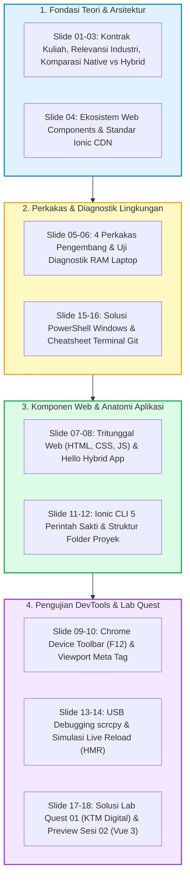

# 📱 NASKAH & SLIDE SESI 01: PENGENALAN LINGKUNGAN PENGEMBANGAN PIRANTI BERGERAK
## Mata Kuliah: Pemrograman Berbasis Perangkat Bergerak (STSI4303 / MSIM4401 — 3 SKS)
### Program Studi: S1 Sistem Informasi & S1 Informatika — Fakultas Sains dan Teknologi (FST) Universitas Terbuka
### Dosen Pengampu: Anton Prafanto, S.Kom., M.T.
### Modul Acuan BMP: Modul 1 (MSIM4401/STSI4303) — Pengenalan Lingkungan Pengembangan Aplikasi Piranti Bergerak

> ⚡ **Akses Cepat Bahan Sesi 01:**  
> [📥 Unduh Slide PPTX](https://github.com/antonprafanto/tuweb_mobile2025/raw/main/slide_presentasi/SESI_01_Pengantar_dan_Lingkungan_Ionic.pptx) • [👁️ Baca Slide Online](https://view.officeapps.live.com/op/view.aspx?src=https%3A%2F%2Fraw.githubusercontent.com%2Fantonprafanto%2Ftuweb_mobile2025%2Fmain%2Fslide_presentasi%2FSESI_01_Pengantar_dan_Lingkungan_Ionic.pptx) • [📁 18 Berkas Kode Mandiri](../contoh_kode_program/sesi_01_lingkungan_dan_tools/) • [🎯 Solusi Lab Quest 01](../contoh_kode_program/sesi_01_lingkungan_dan_tools/slide_17_lab_quest_01_profil_mahasiswa.html) • [💬 Panduan Diskusi 1](../panduan_tutorial_ut/PANDUAN_DISKUSI_TUTON.md)

---

## 🗺️ Gambaran Umum Sesi 01
Sesi inisiasi pertama ini membekali rekan-rekan mahasiswa dengan pemahaman komprehensif arsitektur aplikasi mobile modern, komparasi mendalam Native vs Hybrid vs Cross-Platform vs PWA, panduan instalasi perkakas (*tools*) ramah laptop RAM 4GB, pengenalan komponen web Ionic Framework via CDN tanpa hambatan, teknik pengujian instan menggunakan Chrome DevTools, hingga penyelesaian tugas mandiri **Lab Quest 01 (Kartu Tanda Mahasiswa Digital)**.

Setiap materi slide dilengkapi berkas interaktif mandiri berekstensi `.html` yang dapat **langsung dijalankan di Google Chrome dengan satu klik ganda (*zero-friction*)**, tanpa memerlukan instalasi compiler berukuran gigabytes.



---

## 🛠️ Panduan Alat & Lingkungan Belajar (Ramah Pemula)

Bagi mahasiswa yang baru pertama kali melangkah ke dunia pemrograman perangkat bergerak, Sesi 01 dirancang menggunakan pendekatan **The Zero-Friction Courseware Framework** yang sangat ringan dan ramah laptop (RAM 4–8 GB friendly):

1. **Google Chrome / Peramban Web Desktop:**
   * **Fungsi:** Menjalankan seluruh 18 berkas contoh program `.html` secara instan tanpa perlu instalasi compiler lokal atau dev-server yang berat (protokol `file:///`).
   * **Cara Penggunaan:** Cukup klik ganda (*double-click*) berkas `.html` yang ingin dipelajari langsung dari File Explorer Windows.
2. **Google Chrome DevTools (`F12` / `Ctrl + Shift + I`):**
   * **Fungsi:** Menginspeksi tab **Console** untuk menjalankan skrip JavaScript interaktif, mengamati error log, dan memeriksa struktur elemen antarmuka.
   * **Simulator Layar Smartphone (`Ctrl + Shift + M`):** Mengaktifkan mode **Toggle Device Toolbar** untuk mensimulasikan tampilan berbagai tipe smartphone (iPhone, Samsung Galaxy, Pixel) langsung dari browser Anda.
3. **Visual Studio Code (VS Code):**
   * **Fungsi:** Editor teks utama untuk membuka, menyunting, dan mempelajari kode HTML, CSS, dan JavaScript.
4. **Node.js LTS & Terminal / PowerShell:**
   * **Fungsi:** Menjalankan skrip diagnostik otomatis kesiapan komputer (`slide_06`) dan perintah simulasi Ionic CLI (`slide_11`).
5. **Kabel Data USB & Smartphone Android Fisik (Persiapan Praktik):**
   * **Fungsi:** Untuk persiapan pengujian hemat memori via USB Debugging dan aplikasi *mirroring* ringan `scrcpy` (< 70 MB RAM).

---

## 📊 Daftar 18 Slide Pembahasan & Berkas Praktikum Mandiri

### 📌 Slide 01: Kontrak Perkuliahan, Roadmap 8 Sesi & Aturan Nilai UT
* **Sub-CPMK:** Memahami alur 8 sesi tutorial, capaian pembelajaran, dan formula evaluasi akademik Universitas Terbuka.
* **Narasi Dosen:**  
  *"Halo rekan-rekan mahasiswa Universitas Terbuka! Selamat datang di mata kuliah Pemrograman Berbasis Perangkat Bergerak (STSI4303). Kuliah ini dirancang dengan praktik penuh 3 SKS. Kita akan belajar membuat aplikasi ponsel pintar sungguhan dengan cara yang menyenangkan, tidak membebani laptop, dan langsung bisa dicoba sejak hari pertama!"*
* **Poin Kunci:**
  * Komposisi Nilai Tuton: Keaktifan 8 Diskusi (30%) + 3 Tugas Tutorial Wajib (70%).
  * Formula Nilai Akhir: 50% Nilai Tuton + 50% Nilai UAS (Syarat: Nilai UAS $\ge 30$).
* **Diagram Alur Evaluasi Akademik & Roadmap:**
  ```mermaid
  flowchart LR
      subgraph TUTON ["Aktivitas Tuton Online (Bobot 50%)"]
          D["8 Sesi Diskusi<br/>(Bobot 30%)"]
          T["3 Tugas Tutorial Wajib<br/>(Bobot 70%)"]
      end
      subgraph UAS ["Evaluasi Akhir (Bobot 50%)"]
          U["Ujian Akhir Semester (UAS)<br/>Syarat: Nilai UAS >= 30"]
      end
      D & T --> NT["Nilai Tuton Terkumpul"]
      NT & U --> NA["🎯 Nilai Akhir Kelulusan STSI4303"]
  ```
  > 📚 **Referensi:** Katalog Kurikulum FST Universitas Terbuka & Buku Panduan Penyelenggaraan Pembelajaran Berbantuan Komputer UT.
* **Alat yang Digunakan:** Buka Google Chrome (klik ganda berkas HTML) atau VS Code.
* **Tautan Kode Mandiri:**  
  👉 [🌐 `slide_01_kontrak_dan_roadmap.html`](../contoh_kode_program/sesi_01_lingkungan_dan_tools/slide_01_kontrak_dan_roadmap.html) *(Pendamping: `slide_01_kontrak_dan_roadmap.js`)*

---

### 📌 Slide 02: Lanskap Industri Mobile: Mengapa Arsitektur Hybrid Mendominasi?
* **Sub-CPMK:** Menganalisis efisiensi biaya dan waktu pengembangan aplikasi mobile berbasis web (*hybrid*).
* **Narasi Dosen:**  
  *"Bayangkan sebuah kampus besar seperti UT dengan lebih dari 400.000 mahasiswa yang menggunakan berbagai jenis gawai. Jika kita membuat aplikasi menggunakan Native murni terpisah (tim Android Kotlin dan tim iPhone Swift), biayanya membengkak 3 kali lipat. Dengan arsitektur Hybrid, kita merawat 1 basis kode tunggal untuk Android, iOS, dan Web!"*
* **Poin Kunci:** Strategi *single codebase*, efisiensi waktu hingga ~66%, kemudahan perawatan jangka panjang.
* **Diagram Komparasi Tim & Basis Kode:**
  ```mermaid
  flowchart TD
      subgraph NATIVE ["❌ Pendekatan Native Tradisional (3 Basis Kode Terpisah)"]
          N1["📱 Tim Android (Kotlin / Java)<br/>Tools: Android Studio"]
          N2["🍏 Tim iOS (Swift / Obj-C)<br/>Tools: Xcode di macOS"]
          N3["🌐 Tim Web Portal (HTML / CSS / JS)<br/>Tools: Web Browser"]
      end

      subgraph HYBRID ["✅ Pendekatan Hybrid Modern (1 Single Codebase)"]
          H1["🚀 1 Basis Kode Standar Web Bersama<br/>(Vue.js 3 + TypeScript + Ionic Web Components)"]
          H1 -->|Distribusi via Capacitor| C1["🤖 Android APK / AAB"]
          H1 -->|Distribusi via Capacitor| C2["🍏 iOS IPA Package"]
          H1 -->|Distribusi via Server| C3["🌐 Web Portal PWA"]
      end
  ```
  > 📚 **Referensi:** BMP UT STSI4303 Modul 1 (Konsep Arsitektur Aplikasi Bergerak) & Ionic Industry Report 2026.
* **Alat yang Digunakan:** Google Chrome (tersedia kalkulator efisiensi interaktif & diagram SVG).
* **Tautan Kode Mandiri:**  
  👉 [🌐 `slide_02_relevansi_mobile_hybrid.html`](../contoh_kode_program/sesi_01_lingkungan_dan_tools/slide_02_relevansi_mobile_hybrid.html)

---

### 📌 Slide 03: Komparasi Arsitektur: Native vs Hybrid vs Cross-Platform vs PWA
* **Sub-CPMK:** Membedakan cara kerja lapisan tumpukan (*stack layers*) antara Native, Hybrid (Ionic), Cross-Platform Canvas (Flutter), dan PWA.
* **Narasi Dosen:**  
  *"Aplikasi Native berbicara langsung ke sistem operasi. Cross-platform menggambar elemen antarmuka lewat mesin grafisnya sendiri. Sedangkan Hybrid menggunakan WebView modern yang dijembatani oleh Capacitor ke perangkat keras. Untuk aplikasi portal universitas, bisnis, dan layanan publik, Hybrid adalah pilihan paling efisien dan stabil."*
* **Poin Kunci:** Analogi tumpukan lapisan, perbandingan performa, dan pertimbangan pemilihan arsitektur.
* **Diagram Tumpukan Lapisan (Layer Stack):**
  ```mermaid
  flowchart LR
      subgraph NATIVE ["1. Native Murni"]
          N_UI["UI Native (XML/SwiftUI)"] --> N_OS["OS Android / iOS"] --> N_HW["Hardware Gawai"]
      end
      subgraph HYBRID ["2. Hybrid (Ionic)"]
          H_UI["Web Components (HTML/CSS/JS)"] --> H_WV["WebView Container"] --> H_CP["Capacitor Bridge"] --> H_HW["Hardware Gawai"]
      end
      subgraph CROSS ["3. Cross-Platform (Flutter)"]
          C_UI["Widget Grafis Sendiri"] --> C_SK["Skia / Impeller Engine"] --> C_HW["Hardware Gawai"]
      end
      subgraph PWA ["4. PWA (Browser Web)"]
          P_UI["Laman Web Responsif"] --> P_BR["Peramban (Chrome/Safari)"]
      end
  ```
  > 📚 **Referensi:** BMP UT STSI4303 Modul 1 & W3C Web on Mobile Devices Specification.
* **Alat yang Digunakan:** Google Chrome (tersedia selector tumpukan arsitektur interaktif).
* **Tautan Kode Mandiri:**  
  👉 [🌐 `slide_03_komparasi_arsitektur_mobile.html`](../contoh_kode_program/sesi_01_lingkungan_dan_tools/slide_03_komparasi_arsitektur_mobile.html)

---

### 📌 Slide 04: Ekosistem Ionic Framework & Kekuatan Standar Web Components
* **Sub-CPMK:** Mengidentifikasi keunggulan Web Components bawaan Ionic yang dapat berjalan instan via CDN.
* **Narasi Dosen:**  
  *"Keajaiban Ionic adalah: rekan-rekan tidak perlu menunggu unduhan paket berukuran gigabytes untuk melihat tombol dan kartu mobile. Cukup tautkan pustaka CDN Ionic di berkas HTML, dan peramban Anda langsung menyajikan tampilan berstandar Google Material Design!"*
* **Poin Kunci:**
  * Standar W3C Web Components murni yang dapat berjalan langsung di peramban tanpa build step.
  * Pemanfaatan Shadow DOM untuk enkapsulasi gaya CSS sehingga terisolasi bebas konflik dengan CSS global.
  * Pengiriman pustaka instan melalui CDN (jsDelivr / unpkg) berbobot 0 MB di harddisk lokal mahasiswa.
* **Diagram Arsitektur Web Components & CDN Ionic:**
  ```mermaid
  flowchart TD
      subgraph CDN ["1. Distribusi CDN jsDelivr"]
          ESM["ionic.esm.js (Modul ES Standar)"]
          CSS["ionic.bundle.css (Gaya Material & iOS)"]
      end

      subgraph BROWSER ["2. Peramban Web (Google Chrome / WebView)"]
          CUSTOM["Custom Elements Registry (ion-button, ion-card, ion-badge)"]
          SHADOW["Shadow DOM (Enkapsulasi Gaya Terisolasi Bebas Bocor)"]
          RENDER["Mesin Perenderan Native-like UI (60 FPS)"]
      end

      CDN -->|Dimuat via Tag Script Standar HTML5| CUSTOM
      CUSTOM --> SHADOW
      SHADOW --> RENDER
  ```
  > 📚 **Referensi:** W3C Web Components Specification & Dokumentasi Arsitektur Resmi Ionic Framework (ionicframework.com/docs).
* **Alat yang Digunakan:** Google Chrome (coba tester komponen Ionic interaktif & pengubah warna).
* **Tautan Kode Mandiri:**  
  👉 [🌐 `slide_04_ekosistem_ionic_web_standards.html`](../contoh_kode_program/sesi_01_lingkungan_dan_tools/slide_04_ekosistem_ionic_web_standards.html)

---

### 📌 Slide 05: Menyiapkan Dapur Kerja: Panduan Instalasi 4 Perkakas Utama
* **Sub-CPMK:** Memasang dan memverifikasi perangkat lunak pendukung pengembangan mobile di komputer lokal.
* **Narasi Dosen:**  
  *"Ada 4 perkakas gratis yang wajib disiapkan: Visual Studio Code sebagai editor utama, Node.js versi LTS sebagai mesin runtime, Git SCM untuk mencatat riwayat perubahan dan mengumpulkan tugas, serta Google Chrome untuk pengujian tampilan ponsel."*
* **Poin Kunci:** Verifikasi perintah di terminal (`node -v`, `npm -v`, `git --version`).
* **Diagram Ekosistem 4 Perkakas Pengembang:**
  ```mermaid
  flowchart LR
      VS["💻 1. Visual Studio Code<br/>(Editor Kode & Terminal Utama)"]
      NODE["🟢 2. Node.js LTS<br/>(Mesin Runtime & Manajer Paket NPM)"]
      GIT["🐙 3. Git SCM<br/>(Pencatat Riwayat & Pengumpul Tugas)"]
      CHROME["🌐 4. Google Chrome<br/>(Simulasi Layar Smartphone DevTools)"]

      VS <-->|Jalankan CLI| NODE
      VS <-->|Rekam Komit| GIT
      VS <-->|Pratinjau Aplikasi| CHROME
  ```
  > 📚 **Referensi:** Panduan Instalasi Perkakas Pengembangan BMP UT STSI4303 Modul 1 & Node.js Foundation Documentation.
* **Alat yang Digunakan:** VS Code Terminal (`Ctrl + ~`) atau Windows PowerShell.
* **Tautan Kode Mandiri:**  
  👉 [🌐 `slide_05_panduan_instalasi_tools.html`](../contoh_kode_program/sesi_01_lingkungan_dan_tools/slide_05_panduan_instalasi_tools.html) *(Pendamping: `slide_05_panduan_instalasi_tools.js`)*

---

### 📌 Slide 06: Uji Diagnostik Lingkungan Pengembangan Mandiri
* **Sub-CPMK:** Menjalankan pengujian otomatis kesiapan memori RAM dan menentukan jalur praktikum yang sesuai.
* **Narasi Dosen:**  
  *"Sebelum mulai menulis kode, mari pastikan kesiapan laptop Anda. Jalankan alat diagnostik ini untuk mendeteksi kapasitas RAM dan mendapatkan rekomendasi jalur belajar yang paling aman agar laptop tetap dingin dan lancar!"*
* **Poin Kunci:** Rekomendasi Jalur A (Web First & Chrome DevTools), Jalur B (scrcpy & Ponsel Fisik), Jalur C (Android Studio).
* **Diagram Alur Diagnostik & Penentuan Jalur Belajar:**
  ```mermaid
  flowchart TD
      START["Mulai Diagnostik Laptop Mahasiswa"] --> DETECT["Deteksi Kapasitas RAM Komputer"]
      DETECT --> COND{"Berapa Ukuran RAM Komputer Anda?"}
      COND -->|RAM < 4GB| PATH_A["Jalur A: Web First<br/>(Google Chrome DevTools & F12)"]
      COND -->|RAM 4 - 8GB| PATH_B["Jalur B: USB Debugging<br/>(Ponsel Fisik Android & scrcpy)"]
      COND -->|RAM > 8GB| PATH_C["Jalur C: Android Studio<br/>(SDK Manager & Emulator Native)"]
      PATH_A --> GOAL["✅ Semua Jalur Menghasilkan Nilai Maksimal & Lulus Mata Kuliah"]
      PATH_B --> GOAL
      PATH_C --> GOAL
  ```
  > 📚 **Referensi:** Panduan Spesifikasi Perangkat Komputasi BMP UT STSI4303 Modul 1 & Metodologi Zero-Friction Learning.
* **Alat yang Digunakan:** Buka berkas HTML di Chrome atau ketik `node slide_06_diagnostik_environment.js` di terminal.
* **Tautan Kode Mandiri:**  
  👉 [🌐 `slide_06_diagnostik_environment.html`](../contoh_kode_program/sesi_01_lingkungan_dan_tools/slide_06_diagnostik_environment.html) *(Pendamping: `slide_06_diagnostik_environment.js`)*

---

### 📌 Slide 07: Anatomi Aplikasi Hybrid: Tritunggal HTML, CSS, JS & Wadah WebView
* **Sub-CPMK:** Menguraikan peran struktural, estetika, dan logika interaktivitas dalam arsitektur aplikasi mobile hybrid.
* **Narasi Dosen:**  
  *"Aplikasi mobile hybrid diibaratkan seperti tubuh manusia: HTML adalah kerangka tulangnya, CSS adalah busana dan penampilannya, JavaScript adalah sistem saraf yang memproses aksi, dan WebView adalah rumah tempat aplikasi tersebut berjalan di smartphone."*
* **Poin Kunci:**
  * Tritunggal standar web: HTML5 (tulang struktur), CSS3 (estetika busana), dan JavaScript (saraf logika).
  * Wadah WebView native sebagai mesin peramban mini berkecepatan tinggi di dalam runtime Android OS.
  * Jembatan Capacitor Bridge sebagai penerjemah komunikasi dua arah antara JavaScript dan SDK Kotlin/Java.
* **Diagram 4 Lapisan Arsitektur Hybrid App:**
  ```mermaid
  flowchart TD
      L1["1. Lapisan Aplikasi Web (HTML5 Tulang + CSS3 Busana + JS/Vue Saraf)"]
      L2["2. Wadah WebView Container (Mesin Browser Native Android / iOS)"]
      L3["3. Jembatan Native / Capacitor Bridge (Penerjemah JS <-> Kotlin/Swift)"]
      L4["4. Perangkat Keras Smartphone (Kamera, GPS, Sensor Getar, File System)"]

      L1 -->|Dirender secara visual di dalam| L2
      L2 -->|Panggil API sistem lewat| L3
      L3 -->|Mengakses sensor fisik gawai| L4
  ```
  > 📚 **Referensi:** BMP UT STSI4303 Modul 1 & Dokumentasi Arsitektur Resmi Ionic Framework (ionicframework.com/docs/intro/architecture).
* **Alat yang Digunakan:** Google Chrome (tersedia sakelar interaktif untuk menyalakan/mematikan CSS dan JS).
* **Tautan Kode Mandiri:**  
  👉 [🌐 `slide_07_anatomi_hybrid_app.html`](../contoh_kode_program/sesi_01_lingkungan_dan_tools/slide_07_anatomi_hybrid_app.html)

---

### 📌 Slide 08: Hello Hybrid World: Meluncurkan Aplikasi Mobile Pertama Anda
* **Sub-CPMK:** Membangun antarmuka mobile pertama lengkap dengan status bar, kartu profil, dan deteksi runtime layar sentuh.
* **Narasi Dosen:**  
  *"Selamat! Ini adalah aplikasi mobile pertama Anda: MyUT Mobile. Berkas ini membuktikan bahwa tanpa kompilasi rumit, Anda sudah bisa membuat aplikasi ponsel fungsional yang membaca resolusi layar dan merespon event sentuhan jari."*
* **Poin Kunci:**
  * Inisialisasi wadah utama `<ion-app>` sebagai fondasi kanvas mobile standar Google Material Design.
  * Penataan bingkai visual lengkap dengan status bar dan palet warna resmi Universitas Terbuka (Biru UT `#005691`).
  * Penanganan interaksi layar sentuh (*touch/click events*) dan deteksi orientasi gawai secara *real-time*.
* **Diagram Arsitektur Komponen 'Hello Hybrid App':**
  ```mermaid
  flowchart LR
      HTML["Dokumen HTML5<br/>(index.html)"] --> VIEWPORT["Pengaturan Skala 1:1<br/>(Viewport Meta Tag)"]
      VIEWPORT --> SHELL["Bingkai Ponsel Mobile Shell<br/>(Status Bar + Layar Sentuh)"]
      SHELL --> UI["Komponen UI Ionic<br/>(Kartu Mahasiswa & Profil)"]
      UI --> EVENT["Pemroses Sentuhan Jari<br/>(Touch & Click Events)"]
  ```
  > 📚 **Referensi:** BMP UT STSI4303 Modul 1 (Kegiatan Belajar 2) & Ionic Framework Component Basics.
* **Alat yang Digunakan:** Google Chrome (tekan F12 lalu Ctrl + Shift + M untuk mode smartphone).
* **Tautan Kode Mandiri:**  
  👉 [🌐 `slide_08_hello_hybrid_app.html`](../contoh_kode_program/sesi_01_lingkungan_dan_tools/slide_08_hello_hybrid_app.html)

---

### 📌 Slide 09: 3 Langkah Menguji Tampilan Ponsel di Google Chrome DevTools
* **Sub-CPMK:** Mengoperasikan Toggle Device Toolbar di peramban untuk simulasi berbagai dimensi smartphone tanpa emulator berat.
* **Narasi Dosen:**  
  *"Laptop rekan-rekan tidak perlu terbebani emulator berbobot 10GB. Cukup buka Google Chrome, tekan F12, lalu tekan Ctrl + Shift + M. Seketika Anda dapat memilih simulasi layar Pixel 7, iPhone 14 Pro, atau menguji koneksi internet lambat!"*
* **Poin Kunci:**
  * Pintasan tombol sakti pengembang web: `F12` (DevTools) dilanjutkan `Ctrl + Shift + M` (Toggle Device Toolbar).
  * Pemilihan preset dimensi smartphone populer (Pixel 7, Samsung Galaxy, iPhone 14 Pro).
  * Emulasi sentuhan jari (*touch cursor*) dan simulasi jaringan lambat (*throttling*) super hemat RAM (< 100MB).
* **Pintasan Tombol Sakti:** `F12` lalu `Ctrl + Shift + M`.
* **Diagram Alur Pengujian Cepat Device Mode:**
  ```mermaid
  flowchart TD
      S1["Buka Berkas HTML di Google Chrome"] --> S2["Tekan Tombol F12 (Buka DevTools)"]
      S2 --> S3["Tekan Ctrl + Shift + M (Toggle Device Toolbar)"]
      S3 --> S4["Pilih Preset: Pixel 7 / iPhone 14 Pro"]
      S4 --> S5["Kursor Berubah Jadi Titik Sentuh Jari (Touch Emulation)"]
      S5 --> S6["✅ Uji Tampilan Mobile Selesai (< 100MB RAM, Bebas Lemot!)"]
  ```
  > 📚 **Referensi:** Google Chrome DevTools Documentation: "Simulate mobile devices with Device Mode" & BMP UT STSI4303 Modul 1.
* **Alat yang Digunakan:** Google Chrome / Microsoft Edge.
* **Tautan Kode Mandiri:**  
  👉 [🌐 `slide_09_chrome_device_toolbar_guide.html`](../contoh_kode_program/sesi_01_lingkungan_dan_tools/slide_09_chrome_device_toolbar_guide.html)

---

### 📌 Slide 10: Peran Krusial Viewport Meta Tag pada Layar Ponsel
* **Sub-CPMK:** Menganalisis fungsi tag `<meta name="viewport">` dalam menyamakan kanvas aplikasi dengan dimensi fisik gawai.
* **Narasi Dosen:**  
  *"Pernahkah Anda membuka laman web di ponsel dan teksnya menjadi sekecil semut? Itu terjadi karena peramban mengira Anda menggunakan layar desktop selebar 980px. Dengan menyertakan tag viewport, ponsel otomatis merender aplikasi dengan skala 1:1 yang nyaman dijemari!"*
* **Poin Kunci:**
  * Perilaku default peramban ponsel yang mengasumsikan layar desktop selebar 980px jika tag viewport absen.
  * Properti `width=device-width` untuk menyamakan lebar bidang pandang web dengan piksel fisik gawai.
  * Properti `initial-scale=1.0` untuk menjamin ketajaman visual 1:1, kenyamanan membaca, dan area sentuh jari ergonomis.
* **Diagram Perbandingan Perilaku Viewport Meta Tag:**
  ```mermaid
  flowchart TD
      subgraph NO_VP ["❌ Tanpa Viewport Meta Tag"]
          DESK["Browser Anggap Layar Desktop (980px)"] --> ZOOM["Halaman Mengecil Jauh (Zoom-Out Ekstrem)"]
          ZOOM --> BAD["Teks Sekecil Semut & Tombol Sulit Disentuh"]
      end
      subgraph WITH_VP ["✅ Dengan Viewport Meta Tag (width=device-width)"]
          NATIVE["Browser Baca Resolusi Layar Fisik (1:1)"] --> FIT["Lebar Pas 100% Sesuai Layar Ponsel (360px - 414px)"]
          FIT --> GOOD["Font Nyaman Dibaca & Area Sentuh Ergonomis"]
      end
  ```
  > 📚 **Referensi:** W3C Mobile Web Best Practices & Google Developers Web Fundamentals: "Responsive Web Design Basics".
* **Alat yang Digunakan:** Google Chrome (tersedia simulator perbandingan 1:1 vs 980px).
* **Tautan Kode Mandiri:**  
  👉 [🌐 `slide_10_viewport_meta_scaling.html`](../contoh_kode_program/sesi_01_lingkungan_dan_tools/slide_10_viewport_meta_scaling.html)

---

### 📌 Slide 11: Simulator Interaktif: 5 Perintah Sakti Ionic CLI
* **Sub-CPMK:** Menjelaskan fungsi dan parameter perintah baris `ionic start`, `cd`, `ionic serve`, `ionic build`, dan `npx cap sync`.
* **Narasi Dosen:**  
  *"Saat proyek aplikasi kita berkembang, kita menggunakan Ionic CLI. Ada 5 perintah utama yang akan menjadi sahabat setia rekan-rekan sejak inisialisasi proyek hingga persiapan rilis ke platform Android."*
* **Poin Kunci:**
  * 5 Perintah sakti Ionic CLI: `start` (buat proyek), `cd` (pindah folder), `serve` (live reload), `build` (kompilasi aset), dan `cap sync` (sinkronisasi native).
  * Manajemen paket lokal mandiri tanpa risiko konflik versi global di laptop mahasiswa.
  * Siklus otomatisasi konversi dari kode sumber front-end menuju folder distribusi `dist/`.
* **Diagram Siklus Hidup Perintah Ionic CLI:**
  ```mermaid
  flowchart LR
      C1["1. ionic start<br/>(Inisialisasi Proyek)"] --> C2["2. cd myApp<br/>(Masuk ke Direktori)"]
      C2 --> C3["3. ionic serve<br/>(Live Reload di Browser)"]
      C3 --> C4["4. ionic build<br/>(Kompilasi Berkas Dist)"]
      C4 --> C5["5. npx cap sync<br/>(Sinkronkan ke Android)"]
  ```
  > 📚 **Referensi:** Dokumentasi Resmi Ionic CLI Command Reference (ionicframework.com/docs/cli) & BMP UT STSI4303 Modul 1.
* **Alat yang Digunakan:** VS Code Terminal (`Ctrl + ~`) untuk mempraktikkan perintah yang disalin dari simulator web.
* **Tautan Kode Mandiri:**  
  👉 [🌐 `slide_11_ionic_cli_simulator.html`](../contoh_kode_program/sesi_01_lingkungan_dan_tools/slide_11_ionic_cli_simulator.html) *(Pendamping: `slide_11_ionic_cli_simulator.js`)*

---

### 📌 Slide 12: Eksplorer Interaktif: Struktur Folder Proyek Standar Ionic Vue 3
* **Sub-CPMK:** Menavigasi tata letak berkas tampilan, konfigurasi rute, dan aset publik dalam proyek Ionic.
* **Narasi Dosen:**  
  *"Jangan cemas melihat puluhan folder di proyek Ionic! Tempat kita paling sering menulis kode hanya ada di folder src/views untuk halaman layar dan src/theme untuk memoles warna tema. Folder node_modules tidak boleh diedit manual!"*
* **Poin Kunci:**
  * Folder `src/views/` sebagai ruang kerja utama 90% waktu pengembang untuk membuat halaman layar aplikasi.
  * Folder `src/theme/variables.css` untuk sentralisasi skema warna institusi dan variabel CSS dinamis.
  * Folder `public/` untuk aset gambar bebas kompilasi dan folder `node_modules/` yang dilarang disunting manual.
* **Diagram Pohon Struktur Folder Proyek:**
  ```mermaid
  graph TD
      ROOT["📁 my-app/ (Akar Proyek)"]
      SRC["📁 src/ (Area Kerja Utama Mahasiswa)"]
      PUBLIC["📁 public/ (Aset Statis Gambar & Ikon)"]
      NM["📁 node_modules/ ⚠️ (Jangan Pernah Diedit Manual!)"]
      VIEWS["📁 views/ (Halaman Layar Aplikasi)"]
      COMP["📁 components/ (Komponen Kartu & Tombol)"]
      THEME["📁 theme/ (Warna Biru UT variables.css)"]
      ROUTER["📄 router/index.ts (Navigasi Antar Halaman)"]
      APP["📄 App.vue & main.ts (Titik Masuk Utama)"]

      ROOT --> SRC
      ROOT --> PUBLIC
      ROOT --> NM
      SRC --> VIEWS
      SRC --> COMP
      SRC --> THEME
      SRC --> ROUTER
      SRC --> APP
  ```
  > 📚 **Referensi:** Panduan Struktur Proyek Ionic Framework & Vue.js 3 Project Scaffolding Standard.
* **Alat yang Digunakan:** Google Chrome (eksplorasi pohon folder interaktif) & VS Code.
* **Tautan Kode Mandiri:**  
  👉 [🌐 `slide_12_struktur_folder_proyek.html`](../contoh_kode_program/sesi_01_lingkungan_dan_tools/slide_12_struktur_folder_proyek.html) *(Pendamping: `slide_12_struktur_folder_proyek.js`)*

---

### 📌 Slide 13: Pengujian HP Fisik Hemat RAM via USB Debugging & scrcpy
* **Sub-CPMK:** Mengaktifkan Opsi Pengembang dan USB Debugging pada smartphone Android serta menampilkan layar ke laptop menggunakan `scrcpy`.
* **Narasi Dosen:**  
  *"Metode favorit pengembang profesional: sambungkan smartphone Android Anda menggunakan kabel data USB. Aktifkan USB Debugging dan jalankan scrcpy. Konsumsi RAM kurang dari 70MB, respons layar 60 FPS bebas patah-patah, dan tidak membuat laptop panas!"*
* **Poin Kunci:**
  * Prosedur 7 ketukan sakti pada *Build Number* untuk membuka menu tersembunyi Opsi Pengembang (*Developer Options*).
  * Handshake keamanan sidik jari kunci RSA antara komputer laptop dan ponsel cerdas via kabel USB.
  * Pengoperasian utilitas `scrcpy` untuk *screen mirroring* 60 FPS bebas *lag* dengan beban RAM laptop di bawah 70 MB.
* **Diagram Alur Praktis USB Debugging & scrcpy:**
  ```mermaid
  flowchart TD
      U1["1. Buka Menu 'Setelan / Pengaturan' di HP Android"] --> U2["2. Masuk 'Tentang Ponsel' -> Cari 'Nomor Versi / Build Number'"]
      U2 --> U3["3. Ketuk 'Nomor Versi' Sebanyak 7 Kali Berturut-turut"]
      U3 --> U4["4. Masuk ke 'Opsi Pengembang' -> Aktifkan 'USB Debugging'"]
      U4 --> U5["5. Sambungkan HP ke Laptop Menggunakan Kabel Data USB"]
      U5 --> U6["6. Centang 'Selalu Izinkan dari Komputer Ini' pada Layar HP"]
      U6 --> U7["7. Jalankan scrcpy di Terminal Laptop -> Layar HP Tampil 60 FPS!"]
  ```
  > 📚 **Referensi:** Android Developers Official Guide: "Configure on-device developer options" & Genymobile scrcpy Open Source Documentation.
* **Alat yang Digunakan:** Ponsel Android + Kabel USB + Berkas `scrcpy.exe`.
* **Tautan Kode Mandiri:**  
  👉 [🌐 `slide_13_usb_debugging_scrcpy_guide.html`](../contoh_kode_program/sesi_01_lingkungan_dan_tools/slide_13_usb_debugging_scrcpy_guide.html) *(Pendamping: `slide_13_usb_debugging_scrcpy_guide.md`)*

---

### 📌 Slide 14: Simulasi Hot Module Replacement (HMR) & Live Reload
* **Sub-CPMK:** Memahami mekanisme pembaruan modul instan Vite tanpa mereset status data formulir yang sedang diisi pengguna.
* **Narasi Dosen:**  
  *"Hot Module Replacement (HMR) membuat pengalaman belajar coding sangat memuaskan. Begitu Anda menekan simpan (Ctrl + S), peramban memperbarui tampilan dalam 30 milidetik tanpa menghapus teks yang baru saja Anda ketik pada formulir!"*
* **Poin Kunci:**
  * Kecepatan kompilasi modul delta oleh server Vite dalam hitungan milidetik (< 30ms) via koneksi WebSocket.
  * Preservasi status data formulir (*state preservation*): teks input pengguna tidak terhapus saat kode diubah.
  * Keunggulan mutlak dibanding *full page reload* tradisional yang memuat ulang seluruh aset dan mereset status aplikasi.
* **Diagram Mekanisme Kerja Hot Module Replacement (HMR):**
  ```mermaid
  sequenceDiagram
      autonumber
      participant D as Mahasiswa (VS Code)
      participant V as Vite HMR Server
      participant B as Google Chrome Browser
      D->>D: Menyunting Kode & Tekan Ctrl + S
      D->>V: Berkas Diperbarui Terdeteksi (File Watcher)
      V->>V: Kompilasi Ulang Modul yang Berubah (Hanya Modul Tersebut)
      V->>B: Kirim Sinyal Pembaruan via WebSocket
      B->>B: Ganti Modul di Memory DOM secara Instan
      Note over B: Data Formulir & Status Input Tetap Utuh (Tanpa Refresh Halaman)!
  ```
  > 📚 **Referensi:** Vite Documentation: "Hot Module Replacement Architecture" & BMP UT STSI4303 Modul 1.
* **Alat yang Digunakan:** Google Chrome (uji perbandingan HMR vs Full Page Reload).
* **Tautan Kode Mandiri:**  
  👉 [🌐 `slide_14_hmr_live_reload_demo.html`](../contoh_kode_program/sesi_01_lingkungan_dan_tools/slide_14_hmr_live_reload_demo.html)

---

### 📌 Slide 15: Pertolongan Pertama: Mengatasi Galat PowerShell Windows
* **Sub-CPMK:** Mengatasi galat kebijakan eksekusi skrip (*PSSecurityException*) di terminal Windows dengan solusi 1 langkah aman.
* **Narasi Dosen:**  
  *"Jika terminal VS Code Anda menampilkan teks merah 'running scripts is disabled on this system', jangan khawatir! Itu bukan laptop yang rusak, melainkan kebijakan keamanan default Windows. Jalankan mantra Set-ExecutionPolicy RemoteSigned satu kali, dan perintah CLI akan berjalan mulus."*
* **Poin Kunci:**
  * Akar masalah galat teks merah Windows: Kebijakan keamanan *ExecutionPolicy Restricted* yang mengunci eksekusi skrip CLI.
  * Mantra solusi aman: `Set-ExecutionPolicy RemoteSigned -Scope CurrentUser`.
  * Parameter `-Scope CurrentUser` membatasi izin hanya pada pengguna aktif tanpa menuntut hak akses *Administrator* penuh.
* **Diagram Solusi Eksekusi Skrip PowerShell:**
  ```mermaid
  flowchart TD
      ERR["Galat Terminal: PSSecurityException<br/>'running scripts is disabled on this system'"] --> CAUSE["Penyebab: Kebijakan Keamanan Default Windows Terkunci (Restricted)"]
      CAUSE --> CMD["Buka PowerShell -> Ketik Perintah:<br/>Set-ExecutionPolicy RemoteSigned -Scope CurrentUser"]
      CMD --> VERIFY["Konfirmasi dengan menekan tombol [Y] lalu Enter"]
      VERIFY --> OK["✅ Skrip CLI (ionic, vue, npm) Berjalan Normal & Aman"]
  ```
  > 📚 **Referensi:** Microsoft Learn PowerShell Documentation: "About Execution Policies" & BMP UT STSI4303 Modul 1.
* **Alat yang Digunakan:** VS Code Terminal atau Windows PowerShell.
* **Tautan Kode Mandiri:**  
  👉 [🌐 `slide_15_troubleshooting_powershell_cli.html`](../contoh_kode_program/sesi_01_lingkungan_dan_tools/slide_15_troubleshooting_powershell_cli.html) *(Pendamping: `slide_15_troubleshooting_powershell_cli.md`)*

---

### 📌 Slide 16: Cheatsheet Perintah Sakti Terminal & Git untuk Tugas Kuliah
* **Sub-CPMK:** Menguasai perintah esensial navigasi folder dan alur Git untuk mengelola berkas tugas mandiri.
* **Narasi Dosen:**  
  *"Sebagai calon sarjana bidang teknologi, menguasai perintah terminal seperti cd, ls, dir, git add, dan git commit adalah keterampilan fundamental yang akan mempercepat pengerjaan tugas dan membangun portofolio GitHub Anda."*
* **Poin Kunci:**
  * Penguasaan perintah terminal esensial: `cd` (navigasi direktori), `dir`/`ls` (inspeksi daftar berkas).
  * 3 Wilayah arsitektur Git: *Working Directory* $\rightarrow$ *Staging Area* (`git add`) $\rightarrow$ *Local Commit* (`git commit`).
  * Perintah `git push origin main` untuk mengunggah bukti pengerjaan tugas mandiri ke repositori GitHub publik.
* **Diagram 4 Tingkatan Ekosistem Terminal & Git:**
  ```mermaid
  flowchart LR
      subgraph LOCAL ["Komputer Lokal Mahasiswa"]
          WD["1. Direktori Kerja<br/>(Working Directory)"] -->|git add .| SA["2. Area Persiapan<br/>(Staging Index)"]
          SA -->|git commit -m| LR["3. Repositori Lokal<br/>(Local Commit History)"]
      end
      subgraph CLOUD ["Layanan Awan"]
          LR -->|git push origin main| GH["4. Repositori GitHub<br/>(Pengumpulan Tugas Tuton)"]
      end
  ```
  > 📚 **Referensi:** Pro Git Book by Scott Chacon & Ben Straub; BMP UT STSI4303 Modul 1.
* **Alat yang Digunakan:** Google Chrome (tersedia kolom pencarian cepat dan sandbox latihan terminal).
* **Tautan Kode Mandiri:**  
  👉 [🌐 `slide_16_cheatsheet_terminal_git.html`](../contoh_kode_program/sesi_01_lingkungan_dan_tools/slide_16_cheatsheet_terminal_git.html) *(Pendamping: `slide_16_cheatsheet_terminal_git.md`)*

---

### 📌 Slide 17: 🎯 Master Solusi Lab Quest 01: Kartu Tanda Mahasiswa Digital UT
* **Sub-CPMK:** Merancang antarmuka kartu identitas mahasiswa interaktif menggunakan komponen resmi Ionic Framework 7 Core via CDN.
* **Narasi Dosen:**  
  *"Saatnya membuktikan pemahaman rekan-rekan di Lab Quest 01! Kita akan merancang Kartu Tanda Mahasiswa (KTM) Digital Universitas Terbuka yang elegan dan responsif. Gunakan komponen resmi Ionic seperti `ion-card`, `ion-card-header`, `ion-card-content`, dan `ion-button` dengan balutan warna kebanggaan almamater kita: Biru UT dan Kuning Aksen. Begitu tombol verifikasi ditekan, antarmuka akan menampilkan notifikasi interaktif. Kerjakan tantangan ini dengan penuh percaya diri!"*
* **Poin Kunci:**
  * Struktur kartu identitas berbasis komponen semantik Ionic: `ion-card`, `ion-card-header`, `ion-card-content`, dan `ion-button`.
  * Penerapan identitas visual Universitas Terbuka: Biru Resmi UT (`#005691`) dan Aksen Kuning (`#FFE600`).
  * Rubrik evaluasi 4 pilar (0–100): Struktur Semantik (25), Branding UT (25), Viewport (25), Interaktivitas Sentuhan (25).
* **Tantangan Lab:**
  1. Tampilkan kartu identitas dengan Nama, NIM, Program Studi, dan UPBJJ-UT Anda.
  2. Terapkan warna resmi Universitas Terbuka: Biru UT (`#005691`) dan Kuning Aksen (`#FFE600`).
  3. Lengkapi dengan tombol verifikasi keaslian kartu yang memunculkan notifikasi responsif.
* **Diagram Arsitektur Komponen KTM Digital:**
  ```mermaid
  flowchart TD
      subgraph IONIC_UI ["Komponen Resmi Ionic Framework 7 Core (via CDN)"]
          CARD["ion-card (Kontainer Bingkai KTM Berbayang)"]
          HEADER["ion-card-header (Kop Logo & Nama Universitas Terbuka)"]
          CONTENT["ion-card-content (Biodata Mahasiswa: Nama, NIM, Prodi, UPBJJ)"]
          BTN["ion-button (Tombol Interaktif Verifikasi Status)"]
          TOAST["ion-toast / Alert Notifikasi (Respon Berhasil Verifikasi)"]
      end
      CARD --> HEADER
      CARD --> CONTENT
      CARD --> BTN
      BTN -->|Memicu Event Sentuhan| TOAST
  ```
  > 📚 **Referensi:** Ionic Framework UI Components Documentation: Card & Button Components & Panduan Tugas Mandiri BMP UT STSI4303 Modul 1.
* **Rubrik Penilaian Mandiri (0–100):** Struktur Semantik Ionic (25 Poin) + Branding UT (25 Poin) + Responsivitas Viewport (25 Poin) + Interaktivitas Sentuhan (25 Poin).
* **Alat yang Digunakan:** Google Chrome (tersedia form editor langsung dan tombol salin seluruh kode untuk pengumpulan tugas).
* **Tautan Master Solusi:**  
  👉 [🌐 `slide_17_lab_quest_01_profil_mahasiswa.html`](../contoh_kode_program/sesi_01_lingkungan_dan_tools/slide_17_lab_quest_01_profil_mahasiswa.html)

---

### 📌 Slide 18: Preview Menatap Sesi 02: Beralih ke Reaktivitas Modern Vue.js 3
* **Sub-CPMK:** Menghubungkan konsep manipulasi DOM imperatif tradisional dengan paradigma reaktif deklaratif Vue.js 3 di Sesi 02.
* **Narasi Dosen:**  
  *"Di Sesi 01 ini, kita telah menguasai fondasi lingkungan kerja dan komponen mobile pertama kita. Pekan depan di Sesi 02, kita akan melangkah lebih jauh ke dunia modern: bagaimana menyinkronkan data aplikasi dan tampilan secara otomatis tanpa repot menggunakan Vue.js 3!"*
* **Poin Kunci:**
  * Keterbatasan manipulasi DOM imperatif tradisional (`document.getElementById`): rawan *typo*, kode berbelit, dan sulit dirawat.
  * Keunggulan paradigma deklaratif reaktif Vue 3: sinkronisasi otomatis status data ke tampilan layar via `ref()` dan `v-model`.
  * Jembatan kognitif menuju Sesi 02: Penguasaan *Single File Component* (SFC) dan *Composition API* modern.
* **Diagram Paradigma Manipulasi DOM vs Deklaratif Reaktif (Menuju Sesi 02):**
  ```mermaid
  flowchart TD
      subgraph TRADISIONAL ["Sesi 01: Paradigma Imperatif Tradisional"]
          E1["Cari Elemen: document.getElementById('teks')"] --> E2["Ubah Nilai: elemen.innerHTML = 'Data Baru'"]
          E2 --> E3["Manual Memantau Setiap Perubahan DOM"]
      end
      subgraph MODERN ["Sesi 02: Paradigma Deklaratif Reaktif (Vue.js 3)"]
          V1["Deklarasikan Status: const pesan = ref('Halo')"] --> V2["Ikatkan ke Tampilan: {{ pesan }}"]
          V2 --> V3["Otomatis: Saat 'pesan' Berubah, Tampilan Seketika Diperbarui"]
      end
  ```
  > 📚 **Referensi:** Vue.js 3 Official Guide: "Reactivity Fundamentals" & BMP UT STSI4303 Modul 2.
* **Alat yang Digunakan:** Google Chrome (uji coba komparasi imperatif vs deklaratif reaktif).
* **Tautan Kode Mandiri:**  
  👉 [🌐 `slide_18_preview_sesi_02_vue.html`](../contoh_kode_program/sesi_01_lingkungan_dan_tools/slide_18_preview_sesi_02_vue.html)

---

## 📚 Daftar Referensi Akademik & Standar Mutu
1. **Buku Materi Pokok (BMP) UT:** MSIM4401 / STSI4303 — *Pemrograman Berbasis Perangkat Bergerak*, Modul 1: Pengenalan Lingkungan Pengembangan Aplikasi Piranti Bergerak. Tangerang Selatan: Universitas Terbuka.
2. **Dokumentasi Resmi Ionic Framework:** Architecture Overview & UI Components Reference, 2026. [ionicframework.com/docs](https://ionicframework.com/docs).
3. **Dokumentasi Resmi Android Developer:** Configure on-device developer options, 2026. [developer.android.com/studio/debug/dev-options](https://developer.android.com/studio/debug/dev-options).
4. **W3C Standards:** CSS Device Adaptation & Viewport Meta Specification, 2026. [w3.org/TR/css-device-adapt/](https://www.w3.org/TR/css-device-adapt/).
5. **Vue.js 3 Official Guide:** Reactivity in Depth & Single File Components, 2026. [vuejs.org](https://vuejs.org).
