# 📱 NASKAH & SLIDE SESI 02: REKAYASA FRONTEND MODERN BERBASIS VUE.JS 3
## Mata Kuliah: Pemrograman Berbasis Perangkat Bergerak (STSI4303 / MSIM4401)
### Program Studi: S1 Sistem Informasi & S1 Informatika — Universitas Terbuka
### Dosen Pengampu: Anton Prafanto, S.Kom., M.T.
### Modul Acuan BMP: Modul 2 (MSIM4401/STSI4303 — Rekayasa Perangkat Lunak & Antarmuka Komponen Reaktif)

> ⚡ **Akses Cepat Bahan Sesi 02:**  
> [📥 Unduh Slide PPTX](https://github.com/antonprafanto/tuweb_mobile2025/raw/main/slide_presentasi/SESI_02_Frontend_Modern_Vue.pptx) • [👁️ Baca Slide Online](https://view.officeapps.live.com/op/view.aspx?src=https%3A%2F%2Fraw.githubusercontent.com%2Fantonprafanto%2Ftuweb_mobile2025%2Fmain%2Fslide_presentasi%2FSESI_02_Frontend_Modern_Vue.pptx) • [📁 18 Berkas Kode Mandiri](../contoh_kode_program/sesi_02_vue_frontend/) • [🎯 Solusi Lab Quest 02](../contoh_kode_program/sesi_02_vue_frontend/slide_17_lab_quest_02_krs_interaktif.html) • [💬 Panduan Diskusi 2](../panduan_tutorial_ut/PANDUAN_DISKUSI_TUTON.md)

---

## 🗺️ Gambaran Umum Sesi
Sesi kedua ini mengupas tuntas arsitektur **Vue.js 3 Composition API**, fondasi reaktivitas mutakhir yang menjadi mesin penggerak antarmuka di balik ekosistem **Ionic Vue**. Mahasiswa dibimbing secara bertahap mulai dari pergeseran paradigma imperatif ke deklaratif, reaktivitas primitif (`ref`) dan objek (`reactive`), manipulasi direktif template (`v-bind`, `v-model`, `v-if`, `v-for`), penanganan event cerdas dengan modifiers, properti terkalkulasi berefisiensi tinggi (`computed`), pemantauan efek samping (*watchers*), siklus hidup komponen (*lifecycle hooks*), komunikasi modular antar-komponen (*props, emits, slots*), *clean architecture* berbasis *composables*, hingga penyelesaian tantangan studi kasus terpadu **Lab Quest 02: Aplikasi Manajemen KRS Mandiri Mahasiswa FST UT**.

---

## 🛠️ Panduan Alat & Lingkungan Belajar (Ramah Pemula)

Bagi rekan-rekan mahasiswa yang baru pertama kali mempelajari Vue.js 3, materi Sesi 02 ini dirancang menggunakan standar **The Zero-Friction Courseware Framework** yang sangat ramah pemula dan hemat memori (RAM 4–8 GB friendly):

1. **Google Chrome / Peramban Web Desktop:**
   * **Fungsi:** Menjalankan seluruh 18 berkas contoh program `.html` secara instan tanpa perlu menjalankan server lokal Node.js via protokol `file:///`.
   * **Cara Penggunaan:** Cukup klik ganda (*double-click*) berkas `.html` yang ingin dipelajari langsung dari File Explorer Windows.
2. **Google Chrome DevTools (`F12` / `Ctrl + Shift + I`):**
   * **Fungsi:** Menginspeksi tab **Console** untuk melihat log mutasi reaktivitas data (`ref` dan `reactive`), serta menguji interaktivitas JavaScript secara langsung.
   * **Simulator Layar Smartphone (`Ctrl + Shift + M`):** Mengaktifkan mode tampilan ponsel (*Toggle Device Toolbar*) untuk menguji responsivitas antarmuka di layar ponsel.
3. **Visual Studio Code (VS Code):**
   * **Fungsi:** Editor teks utama untuk membuka, membaca, dan bereksperimen dengan berkas kode. Pasang ekstensi **Vue - Official (Volar)** untuk penyorotan sintaks (*syntax highlighting*) yang optimal.

---

## 📊 Daftar 18 Slide Pembahasan & Berkas Kode Mandiri

### 📌 Slide 01: Paradigma Pemrograman: Imperatif (Vanilla JS) vs Deklaratif (Vue.js 3)
* **Sub-CPMK:** Memahami perbedaan mendasar antara manipulasi DOM manual dan perancangan antarmuka berbasis state reaktif.
* **Alat yang Digunakan:** Google Chrome / Modern Web Browser, VS Code (tekan `F12` untuk Console).
* **Narasi Dosen:**  
  *"Rekan-rekan mahasiswa, di era web konvensional, setiap kali kita ingin mengubah teks tombol atau skor di layar, kita harus menulis `document.getElementById` dan `innerHTML` secara manual. Bayangkan jika aplikasi memiliki 50 tombol interaktif di smartphone, kode kita akan menjadi sangat rapuh (spaghetti DOM). Vue.js 3 memperkenalkan paradigma deklaratif: kita cukup mengubah datanya, dan antarmuka akan memperbarui dirinya sendiri secara cerdas!"*
* **Poin Kunci:**
  * **Imperatif:** Memberitahukan browser *bagaimana langkah-langkah* memanipulasi elemen satu per satu.
  * **Deklaratif:** Memberitahukan browser *tampilan apa yang diharapkan* berdasarkan nilai data (*state-driven UI*).
* **Diagram Arsitektur (Mermaid):**
```mermaid
flowchart TD
    subgraph IMPERATIF["Paradigma Imperatif (DOM Manual)"]
        A1["Klik Tombol"] --> A2["document.getElementById('counter')"]
        A2 --> A3["Ambil teks & ubah parseInt"]
        A3 --> A4["counterSpan.innerText = hasil"]
        A4 --> A5["Rapuh saat UI kompleks & rawan desync"]
    end
    subgraph DEKLARATIF["Paradigma Deklaratif (Vue.js 3)"]
        B1["Klik Tombol @click"] --> B2["counter.value++ (Ubah Data Saja)"]
        B2 --> B3["Vue Reactivity Engine Deteksi Mutasi"]
        B3 --> B4["Virtual DOM Render Otomatis ke Layar"]
        B4 --> B5["Konsisten, terprediksi, dan zero-friction"]
    end
```
* **Tautan Kode Mandiri:**  
  👉 [🌐 Buka File Interaktif: slide_01_paradigma_imperatif_vs_deklaratif.html](../contoh_kode_program/sesi_02_vue_frontend/slide_01_paradigma_imperatif_vs_deklaratif.html)

---

### 📌 Slide 02: Sistem Reaktivitas Dasar: ref() dan Unboxing .value
* **Sub-CPMK:** Menerapkan fungsi `ref()` untuk membungkus tipe data primitif dan memahami aturan unboxing `.value`.
* **Alat yang Digunakan:** Google Chrome (DevTools Console), Editor VS Code.
* **Narasi Dosen:**  
  *"Mengapa kita tidak bisa menggunakan variabel biasa `let count = 0` di Vue? Karena JavaScript tidak memiliki mekanisme bawaan untuk mendeteksi kapan sebuah variabel primitif diubah nilainya. Dengan membungkusnya dalam `ref()`, Vue memasang pelacak getter dan setter. Ingat satu aturan emas ini: di dalam kode JavaScript, Anda wajib menulis `.value`, tetapi saat di dalam template HTML, Vue otomatis membukanya (unboxing) untuk Anda!"*
* **Poin Kunci:**
  * Tipe data primitif (Number, String, Boolean) dibungkus menggunakan `ref()`.
  * Akses di dalam blok script: `counter.value++`.
  * Akses di dalam template HTML: `{{ counter }}` (otomatis di-*unwrap* tanpa `.value`).
* **Diagram Mekanisme (Mermaid):**
```mermaid
flowchart LR
    A["Nilai Primitif: 0"] -->|Dibungkus ref()| B["Wadah Reaktif RefImpl { value: 0 }"]
    B -->|Diakses di Script JS| C["Wajib panggil .value: counter.value++"]
    B -->|Diakses di Template HTML| D["Auto-Unwrap: {{ counter }}"]
    C -->|Memicu Setter| E["Sinyal Pembaruan Virtual DOM"]
```
* **Tautan Kode Mandiri:**  
  👉 [🌐 Buka File Interaktif: slide_02_sistem_reaktivitas_ref.html](../contoh_kode_program/sesi_02_vue_frontend/slide_02_sistem_reaktivitas_ref.html)

---

### 📌 Slide 03: Reaktivitas Objek Majemuk: reactive() & JavaScript Proxy
* **Sub-CPMK:** Mengelola sekumpulan state objek yang saling berhubungan menggunakan `reactive()` dan JavaScript Proxy.
* **Alat yang Digunakan:** Google Chrome, VS Code.
* **Narasi Dosen:**  
  *"Bagaimana jika kita memiliki data profil mahasiswa yang terdiri dari NIM, Nama, Prodi, dan Semester? Menggunakan 4 buah `ref` terpisah akan melelahkan. Di sinilah fungsi `reactive()` hadir. Dengan `reactive()`, kita membungkus seluruh objek dalam JavaScript Proxy canggih. Anda bisa langsung mengakses `mhs.nama` atau `mhs.semester` tanpa repot mengetik `.value`!"*
* **Poin Kunci:**
  * `reactive()` dikhususkan untuk objek majemuk dan array koleksi.
  * Didukung langsung oleh fitur native JavaScript ES6 `Proxy`.
  * Jangan gunakan *object destructuring* secara langsung agar tautan reaktivitas tidak terputus (gunakan `toRefs`).
* **Diagram Arsitektur (Mermaid):**
```mermaid
flowchart TD
    M["Objek JavaScript Asli: { nim, nama, semester }"] -->|Bungkus reactive()| P["ES6 Proxy Interceptor"]
    P -->|Operasi Baca GET| T["Track Dependency: Catat Komponen yang Menggunakan"]
    P -->|Operasi Tulis SET| TR["Trigger Update: Perbarui Elemen DOM Terkait"]
```
* **Tautan Kode Mandiri:**  
  👉 [🌐 Buka File Interaktif: slide_03_reaktivitas_objek_reactive.html](../contoh_kode_program/sesi_02_vue_frontend/slide_03_reaktivitas_objek_reactive.html)

---

### 📌 Slide 04: Text Interpolation {{ }} & Pengikatan Atribut Dinamis (v-bind)
* **Sub-CPMK:** Menghubungkan variabel JavaScript ke atribut HTML, kelas CSS dinamis, dan inline style.
* **Alat yang Digunakan:** Google Chrome, Editor VS Code.
* **Narasi Dosen:**  
  *"Di dalam HTML, kita sering kali ingin menonaktifkan tombol simpan jika formulir belum valid, atau mengubah warna border kartu menjadi hijau saat pembayaran SPP lunas. Direktif `v-bind` (atau cukup ditulis tanda titik dua `:`) adalah jembatan sakti antara state data dengan properti elemen peramban."*
* **Poin Kunci:**
  * Notasi kumis ganda `{{ data }}` hanya untuk teks di antara tag pembuka dan penutup.
  * Untuk atribut HTML, gunakan shorthand `:atribut` (contoh: `:disabled="isBelumBayar"`).
  * Pengikatan class dinamis mendukung sintaks objek: `:class="{ 'lunas': isLunas }"`.
* **Diagram Mekanisme Binding (Mermaid):**
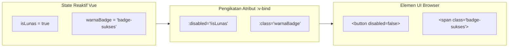
* **Tautan Kode Mandiri:**  
  👉 [🌐 Buka File Interaktif: slide_04_text_interpolation_v_bind.html](../contoh_kode_program/sesi_02_vue_frontend/slide_04_text_interpolation_v_bind.html)

---

### 📌 Slide 05: Pengikatan Data Dua Arah (v-model) & Input Modifiers
* **Sub-CPMK:** Membangun formulir masukan interaktif dengan sinkronisasi dua arah menggunakan `v-model`.
* **Alat yang Digunakan:** Google Chrome / Browser Mobile (Mode Inspeksi `Ctrl + Shift + M`).
* **Narasi Dosen:**  
  *"Saat pengguna mengetik di layar smartphone, antarmuka harus langsung mengetahui masukan tersebut secara real-time. `v-model` adalah sintaks dua arah yang menyederhanakan binding atribut `:value` dan event `@input` menjadi satu baris bersih. Selain itu, modifier seperti `.trim` dan `.number` secara otomatis membersihkan spasi liar dan mengonversi string ke angka numerik!"*
* **Poin Kunci:**
  * Mendukung input teks, textarea, checkbox, radio button, dan select option.
  * Modifiers esensial: `.trim` (pangkas spasi), `.number` (konversi tipe angka otomatis), `.lazy` (update saat event *change*).
* **Diagram Mekanisme (Mermaid):**
```mermaid
flowchart LR
    A["State Reaktif JavaScript: nama = ref('')"] -->|:value (Props Down)| B["Elemen Input HTML &lt;input&gt;"]
    B -->|@input (Event Listener)| A
```
* **Tautan Kode Mandiri:**  
  👉 [🌐 Buka File Interaktif: slide_05_two_way_binding_v_model.html](../contoh_kode_program/sesi_02_vue_frontend/slide_05_two_way_binding_v_model.html)

---

### 📌 Slide 06: Conditional Rendering: v-if (Bongkar Pasang DOM) vs v-show (CSS Toggle)
* **Sub-CPMK:** Menganalisis implikasi konsumsi memori dan kinerja rendering antara `v-if` dan `v-show` pada perangkat bergerak.
* **Alat yang Digunakan:** Google Chrome DevTools Elements Inspector.
* **Narasi Dosen:**  
  *"Ketika membuat aplikasi mobile, efisiensi memori RAM ponsel mahasiswa adalah prioritas nomor satu. Jangan samakan `v-if` dengan `v-show`. `v-if` benar-benar membongkar elemen dari pohon DOM, sangat cocok untuk komponen yang jarang dibuka seperti dialog logout. Sebaliknya, `v-show` hanya menyembunyikan elemen lewat CSS `display:none`, sangat ideal untuk tab bar yang sering berpindah!"*
* **Poin Kunci:**
  * `v-if`: Toggle cost tinggi, initial render cost rendah (kondisional sejati, elemen dicopot dari DOM).
  * `v-show`: Toggle cost sangat rendah, initial render cost tinggi (elemen tetap di DOM, hanya toggle `display: none`).
* **Diagram Perbandingan Mekanisme (Mermaid):**
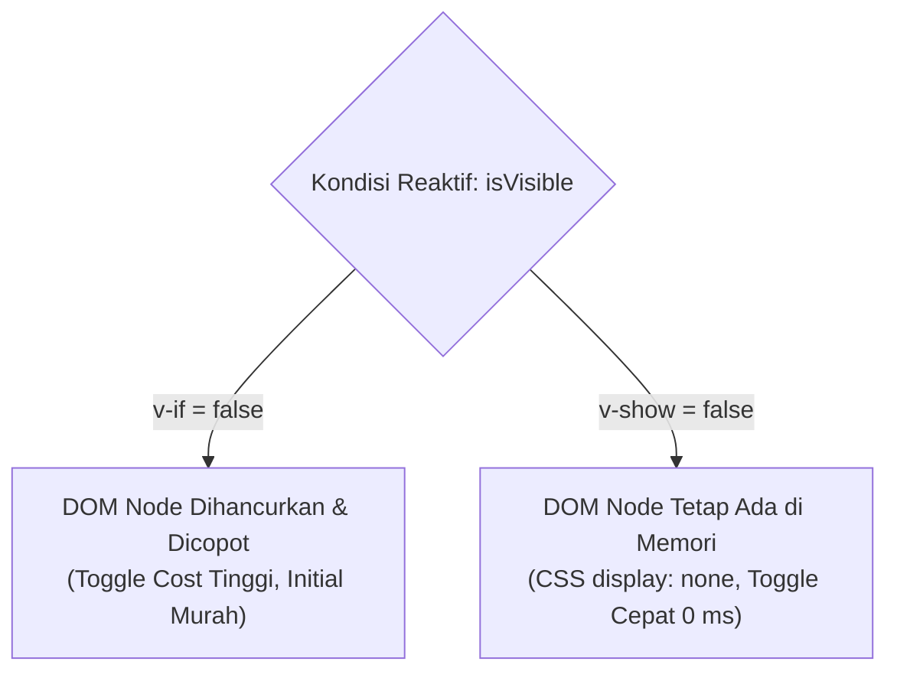
* **Tautan Kode Mandiri:**  
  👉 [🌐 Buka File Interaktif: slide_06_conditional_v_if_vs_v_show.html](../contoh_kode_program/sesi_02_vue_frontend/slide_06_conditional_v_if_vs_v_show.html)

---

### 📌 Slide 07: List Rendering (v-for) & Urgensi Atribut :key Unik
* **Sub-CPMK:** Merender data array secara berulang serta mencegah galat Virtual DOM dengan identitas `:key`.
* **Alat yang Digunakan:** Google Chrome, VS Code.
* **Narasi Dosen:**  
  *"Saat menampilkan katalog mata kuliah atau feed forum diskusi, kita menggunakan `v-for`. Namun, kesalahan paling fatal bagi pemula adalah lupa menyematkan `:key` atau menggunakan `index` sebagai key. Mengapa berbahaya? Algoritma diffing Vue menggunakan key untuk mengenali elemen mana yang bertukar posisi. Jika key-nya keliru, input form atau animasi kartu mobile bisa tertukar secara acak!"*
* **Poin Kunci:**
  * Sintaks perulangan: `v-for="item in koleksi" :key="item.id"`.
  * Wajib gunakan ID unik dari data model, bukan index posisi iterasi.
  * Mendukung mutasi array reaktif: `push()`, `splice()`, `filter()`.
* **Diagram Virtual DOM Diffing (Mermaid):**
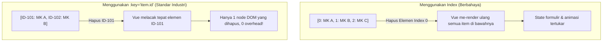
* **Tautan Kode Mandiri:**  
  👉 [🌐 Buka File Interaktif: slide_07_list_rendering_v_for_dan_key.html](../contoh_kode_program/sesi_02_vue_frontend/slide_07_list_rendering_v_for_dan_key.html)

---

### 📌 Slide 08: Penanganan Event (@event) & Event Modifiers (.prevent, .stop)
* **Sub-CPMK:** Menangani sentuhan pengguna dan mencegah aksi standar peramban dengan event modifiers.
* **Alat yang Digunakan:** Google Chrome / Browser Smartphone.
* **Narasi Dosen:**  
  *"Di smartphone, pengguna menekan tombol kirim formulir, apa yang terjadi jika halaman tiba-tiba reload dan layar berkedip putih? Pengalaman pengguna langsung hancur. Dengan modifier `@submit.prevent`, kita memblokir reload peramban dalam 1 detik tanpa perlu menulis `e.preventDefault()`. Begitu pula `@click.stop` untuk mencegah event tembus ke kartu di belakangnya!"*
* **Poin Kunci:**
  * Shorthand `@` menggantikan sintaks panjang `v-on:`.
  * `.prevent`: Menghentikan aksi default peramban (seperti reload form submit).
  * `.stop`: Menghentikan propagasi event (*stopPropagation / bubbling*).
* **Diagram Intersepsi Event (Mermaid):**
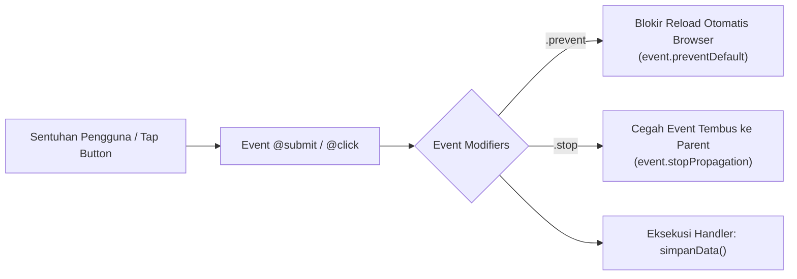
* **Tautan Kode Mandiri:**  
  👉 [🌐 Buka File Interaktif: slide_08_event_handling_dan_modifiers.html](../contoh_kode_program/sesi_02_vue_frontend/slide_08_event_handling_dan_modifiers.html)

---

### 📌 Slide 09: Properti Terkalkulasi (computed) & Efisiensi Caching
* **Sub-CPMK:** Mengoptimalkan performa aplikasi dengan properti terkalkulasi yang memiliki memori *cache*.
* **Alat yang Digunakan:** Google Chrome DevTools (Console log demonstrasi).
* **Narasi Dosen:**  
  *"Bayangkan Anda menghitung Indeks Prestasi Semester (IPS) dari 8 mata kuliah. Jika menggunakan fungsi method biasa, rumus tersebut akan dihitung ulang setiap kali layar disentuh! Sangat boros baterai smartphone. Dengan `computed()`, Vue menyimpan hasil hitungan di memori cache dan hanya menghitung ulang jika ada nilai mata kuliah yang benar-benar berubah."*
* **Poin Kunci:**
  * Menyimpan hasil kalkulasi ke dalam cache berdasarkan dependensi reaktifnya.
  * Murni bersifat pembaca nilai (*pure getter*) tanpa memicu efek samping.
  * Menjadi fondasi pengerjaan studi kasus Tugas 1 Kalkulator Nilai.
* **Diagram Alur Caching (Mermaid):**
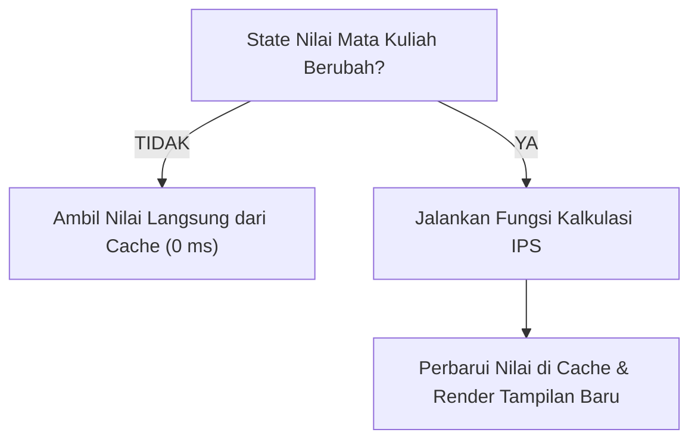
* **Tautan Kode Mandiri:**  
  👉 [🌐 Buka File Interaktif: slide_09_computed_properties_ips.html](../contoh_kode_program/sesi_02_vue_frontend/slide_09_computed_properties_ips.html)

---

### 📌 Slide 10: Pemantau Data (watch) & Efek Samping (Side Effects)
* **Sub-CPMK:** Menerapkan fungsi `watch` untuk mengeksekusi aksi asinkron seperti penyimpanan otomatis ke *local storage*.
* **Alat yang Digunakan:** Google Chrome DevTools Application Tab (Local Storage).
* **Narasi Dosen:**  
  *"Jika `computed` dipakai untuk menghitung nilai baru, maka `watch` dipakai ketika kita ingin melakukan aksi luar (side effect). Contoh nyata: saat mahasiswa mengetik draf tugas di smartphone, kita ingin aplikasi secara otomatis menyimpannya ke `localStorage` agar ketikan tidak hilang jika kuota internet mendadak putus!"*
* **Poin Kunci:**
  * Format sintaks: `watch(sumberData, (nilaiBaru, nilaiLama) => { ... })`.
  * Sangat ideal untuk integrasi REST API, sinkronisasi storage, dan analitik.
  * Dilengkapi teknik *debouncing* untuk menghemat operasi penulisan disk ponsel.
* **Diagram Alur Debounced Watcher (Mermaid):**
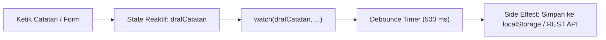
* **Tautan Kode Mandiri:**  
  👉 [🌐 Buka File Interaktif: slide_10_watchers_dan_side_effects.html](../contoh_kode_program/sesi_02_vue_frontend/slide_10_watchers_dan_side_effects.html)

---

### 📌 Slide 11: Siklus Hidup Komponen: onMounted, onUpdated, & onUnmounted
* **Sub-CPMK:** Mengelola siklus hidup komponen dan membersihkan *listener* untuk mencegah kebocoran memori (*memory leak*).
* **Alat yang Digunakan:** Google Chrome Console.
* **Narasi Dosen:**  
  *"Komponen aplikasi mobile seperti manusia: ia dilahirkan (`onMounted`), ia bereaksi saat tumbuh (`onUpdated`), dan ia pensiun (`onUnmounted`). Jika di `onMounted` Anda memasang timer atau sensor GPS, tetapi lupa mematikannya saat halaman ditutup (`onUnmounted`), aplikasi Anda akan terus memakan baterai ponsel di latar belakang hingga HP panas!"*
* **Poin Kunci:**
  * `onMounted()`: Titik paling aman untuk memanggil REST API atau sensor perangkat keras.
  * `onUnmounted()`: Wajib membersihkan `setInterval`, `removeEventListener`, atau socket stream.
* **Diagram Garis Waktu Siklus Hidup (Mermaid):**
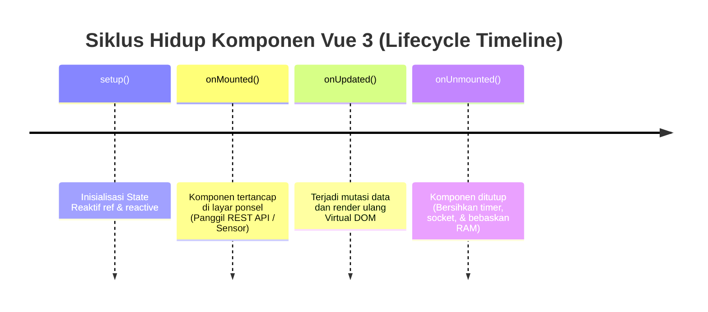
* **Tautan Kode Mandiri:**  
  👉 [🌐 Buka File Interaktif: slide_11_lifecycle_hooks_onmounted.html](../contoh_kode_program/sesi_02_vue_frontend/slide_11_lifecycle_hooks_onmounted.html)

---

### 📌 Slide 12: Anatomi Single File Component (SFC .vue)
* **Sub-CPMK:** Membedah struktur berkas komponen tunggal berbasis `<template>`, `<script setup>`, dan `<style scoped>`.
* **Alat yang Digunakan:** VS Code dengan ekstensi *Vue - Official (Volar)*, Google Chrome.
* **Narasi Dosen:**  
  *"Di dunia industri, kita tidak menulis ribuan baris HTML di satu berkas raksasa. Kita memecahnya menjadi berkas berekstensi `.vue` yang rapi. Tiga bagian suci komponen Vue adalah: Template untuk wujud visual, Script Setup untuk otak logikanya, dan Style Scoped agar warna CSS tidak bocor merusak komponen teman satu tim!"*
* **Poin Kunci:**
  * `<template>`: Struktur elemen deklaratif UI.
  * `<script setup>`: Standar sintaks Composition API paling modern dan ringkas di Vue 3.
  * `<style scoped>`: Isolasi gaya CSS lokal menggunakan atribut hash otomatis (`data-v-xxxx`).
* **Diagram Kompilasi SFC (Mermaid):**
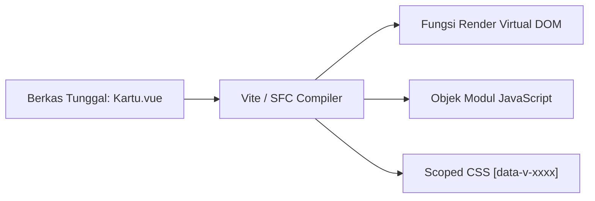
* **Tautan Kode Mandiri:**  
  👉 [🌐 Buka File Interaktif: slide_12_komposisi_komponen_sfc.html](../contoh_kode_program/sesi_02_vue_frontend/slide_12_komposisi_komponen_sfc.html)

---

### 📌 Slide 13: Komunikasi Komponen: Aliran Data Satu Arah via Props (Parent → Child)
* **Sub-CPMK:** Mengirimkan data dari komponen induk ke komponen anak yang dapat digunakan kembali (*reusable*).
* **Alat yang Digunakan:** Google Chrome, VS Code.
* **Narasi Dosen:**  
  *"Aplikasi mobile dibangun seperti susunan balok Lego. Komponen induk (misal: Halaman Daftar Dosen) memegang data mentah, lalu membagikannya ke komponen anak (KartuDosen) melalui `props`. Aturan mutlak: Komponen anak dilarang mengubah isi props! Aliran data selalu satu arah dari atas ke bawah (*One-Way Data Flow*)."*
* **Poin Kunci:**
  * Komponen induk mengirim data via atribut `:namaProp="data"`.
  * Komponen anak mendeklarasikan `defineProps({ ... })` atau opsi `props`.
  * Menjamin integritas data tidak dirusak sembarangan oleh komponen anak (*read-only*).
* **Diagram One-Way Data Flow (Mermaid):**
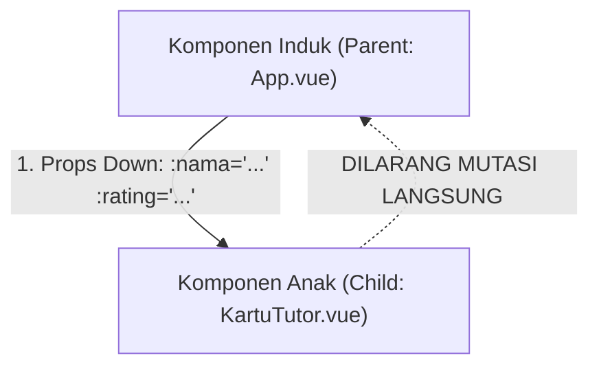
* **Tautan Kode Mandiri:**  
  👉 [🌐 Buka File Interaktif: slide_13_props_aliran_data_induk_anak.html](../contoh_kode_program/sesi_02_vue_frontend/slide_13_props_aliran_data_induk_anak.html)

---

### 📌 Slide 14: Komunikasi Komponen Anak ke Induk: Custom Events via emit()
* **Sub-CPMK:** Mengirimkan notifikasi aksi pengguna dari komponen anak ke komponen induk dengan event kustom.
* **Alat yang Digunakan:** Google Chrome, VS Code.
* **Narasi Dosen:**  
  *"Jika anak tidak boleh mengubah props, bagaimana cara tombol 'Hapus' di dalam kartu dosen memberi tahu halaman utama? Caranya adalah berteriak ke atas melalui `emit`! Komponen anak memancarkan event `emit('hapus-item', id)` dan komponen induk mendengarkannya dengan `@hapus-item`. Filosofi ini dikenal luas dengan istilah: Props Down, Events Up!"*
* **Poin Kunci:**
  * Komponen anak memanggil `$emit('nama-event', payload)`.
  * Komponen induk menangkap sinyal dengan `@nama-event="handler"`.
  * Mempertahankan kopling longgar (*loosely coupled*) antar modul.
* **Diagram Siklus Komunikasi Dua Arah (Mermaid):**
```mermaid
flowchart LR
    P["Komponen Induk"] -->|Props Down :modul| C["Komponen Anak"]
    C -->|Events Up emit('tambah-qty')| P
```
* **Tautan Kode Mandiri:**  
  👉 [🌐 Buka File Interaktif: slide_14_emits_komunikasi_anak_ke_induk.html](../contoh_kode_program/sesi_02_vue_frontend/slide_14_emits_komunikasi_anak_ke_induk.html)

---

### 📌 Slide 15: Proyeksi Konten Fleksibel: Default Slot & Named Slots (<slot>)
* **Sub-CPMK:** Merancang komponen wadah (*container components*) yang fleksibel menggunakan slot konten.
* **Alat yang Digunakan:** Google Chrome, VS Code.
* **Narasi Dosen:**  
  *"Terkadang kita ingin membuat komponen Dialog Pop-up atau Kartu Informasi yang bentuk bingkainya sama, tetapi isinya bisa sangat beragam (ada yang berisi gambar, formulir, atau tabel nilai). Di sinilah tag `<slot>` bekerja sebagai jendela kosong yang siap diisi konten apa pun oleh komponen induk!"*
* **Poin Kunci:**
  * Default `<slot></slot>` untuk wadah konten tubuh utama.
  * Named slots `<slot name="header">` dan `<slot name="footer">` untuk pembagian area spesifik.
  * Komponen induk menyuntikkan konten lewat template kustom: `<template #header>`.
* **Diagram Distribusi Slot (Mermaid):**
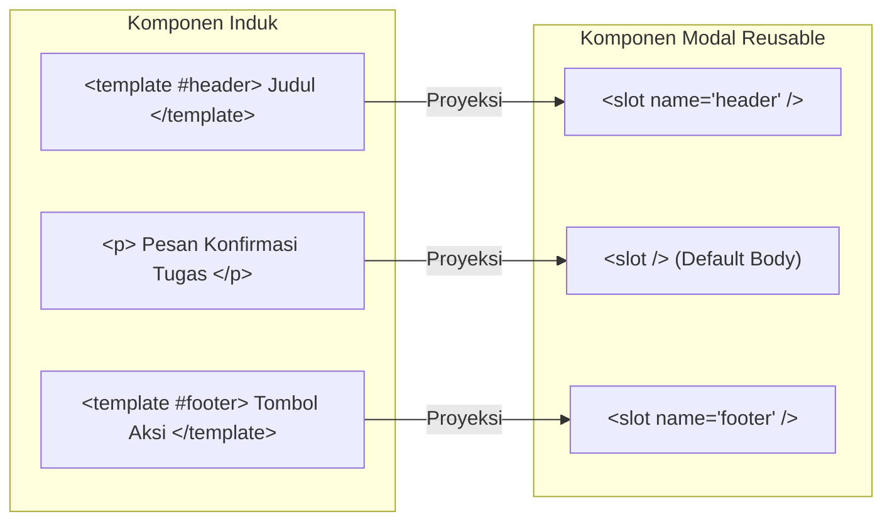
* **Tautan Kode Mandiri:**  
  👉 [🌐 Buka File Interaktif: slide_15_slots_proyeksi_konten_fleksibel.html](../contoh_kode_program/sesi_02_vue_frontend/slide_15_slots_proyeksi_konten_fleksibel.html)

---

### 📌 Slide 16: State Management Ringan: Pola Custom Composables (useKRSManager)
* **Sub-CPMK:** Memisahkan logika bisnis kalkulasi dari kode antarmuka dengan pola arsitektur *Composables*.
* **Alat yang Digunakan:** Google Chrome, VS Code.
* **Narasi Dosen:**  
  *"Jangan tumpuk semua logika perhitungan SKS, validasi batas nilai, dan filter pencarian di dalam template antarmuka. Buatlah sebuah fungsi terpisah bernama `useKRSManager`. Fungsi ini mengemas state dan logic menjadi modul mandiri. Jika besok Anda ingin menggunakan logika KRS ini di layar smartphone lain, Anda cukup mengimpor satu baris fungsi saja!"*
* **Poin Kunci:**
  * Konvensi penamaan standar Composition API diawali kata `use` (contoh: `useKRSManager`).
  * Logika bisnis terisolasi 100% dari elemen DOM (sangat mudah dilakukan unit testing).
  * Pengganti modern dan bersih bagi fitur warisan *Mixins* di Vue versi lama.
* **Diagram Arsitektur Composable (Mermaid):**
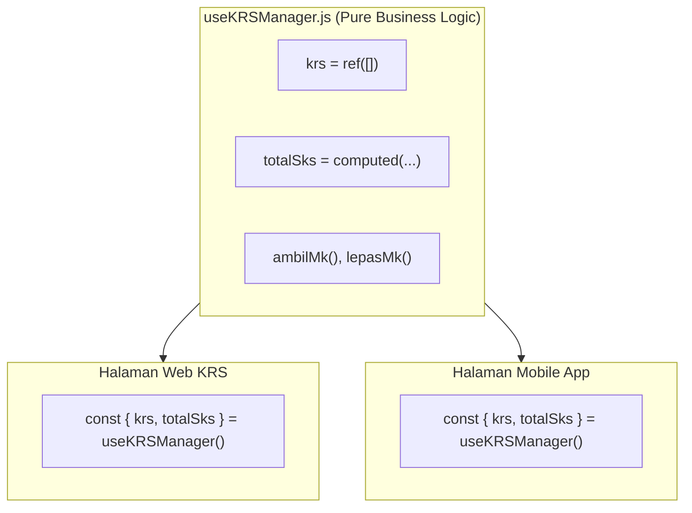
* **Tautan Kode Mandiri:**  
  👉 [🌐 Buka File Interaktif: slide_16_state_reusable_composables.html](../contoh_kode_program/sesi_02_vue_frontend/slide_16_state_reusable_composables.html)

---

### 📌 Slide 17: 🎯 MASTER SOLUSI LAB QUEST 02: Aplikasi Manajemen KRS Mandiri Mahasiswa FST UT
* **Sub-CPMK:** Membangun aplikasi mini interaktif yang mengintegrasikan seluruh konsep Vue 3 secara komprehensif.
* **Alat yang Digunakan:** Google Chrome / Browser Ponsel.
* **Narasi Dosen:**  
  *"Selamat rekan-rekan, ini adalah puncak capaian praktikum Sesi 02! Kita menggabungkan seluruh ilmu: pencarian katalog real-time, filter dropdown semester, penambahan mata kuliah ke KRS, kalkulasi reaktif beban SKS dengan `computed`, validasi batas maksimal 24 SKS dengan peringatan badge dinamis, hingga pengajuan dokumen digital. Ini adalah miniatur dari portal Sistem Informasi Akademik UT sungguhan!"*
* **Fitur Aplikasi:**
  * Pencarian dan filter semester interaktif secara instan (0 milidetik).
  * Tombol aksi tambah dan hapus mata kuliah dengan proteksi kuota SKS.
  * Ringkasan statistik dinamis (Total SKS, Sisa Kuota SKS, Peringatan Kuota Penuh).
* **Diagram Alur Mini-SIA KRS (Mermaid):**
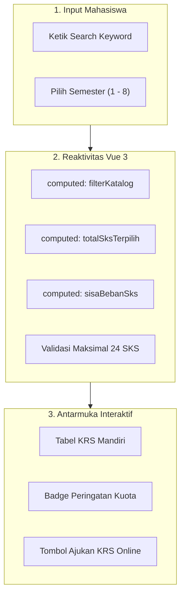
* **Tautan Kode Mandiri:**  
  👉 [🌐 Buka File Interaktif: slide_17_lab_quest_02_krs_interaktif.html](../contoh_kode_program/sesi_02_vue_frontend/slide_17_lab_quest_02_krs_interaktif.html)

---

### 📌 Slide 18: 🚀 Jembatan Menuju Sesi 03: Mengapa Vue 3 Butuh TypeScript?
* **Sub-CPMK:** Menganalisis kelemahan *dynamic typing* JavaScript murni dan mengapresiasi pentingnya keamanan tipe data *type safety*.
* **Alat yang Digunakan:** Google Chrome, VS Code.
* **Narasi Dosen:**  
  *"Hari ini kita telah menguasai Vue.js 3 dengan gemilang! Namun ada satu celah bahaya di JavaScript: jika Anda salah ketik satu huruf nama properti data (misal `mhs.skorIpk` padahal aslinya `mhs.ipk`), JavaScript tidak akan memberi tahu Anda saat ngoding, melainkan menghasilkan `undefined` dan membuat aplikasi crash di tangan pengguna. Pekan depan di Sesi 03, kita akan menyematkan tameng baja bernama TypeScript Interface untuk memastikan kode kita bebas bug sebelum masuk ke Tugas Tutorial 1!"*
* **Poin Kunci:**
  * JavaScript rawan bug typo properti runtime yang sulit dideteksi (*silent failure*).
  * TypeScript memberikan *autocompletion* cerdas dan proteksi kompilasi (*compile-time safety*).
  * Bersiap menghadapi **Sesi 03 & TUGAS TUTORIAL 1 (Kalkulator Nilai Vue + TS)**.
* **Diagram Perbandingan Keamanan (Mermaid):**
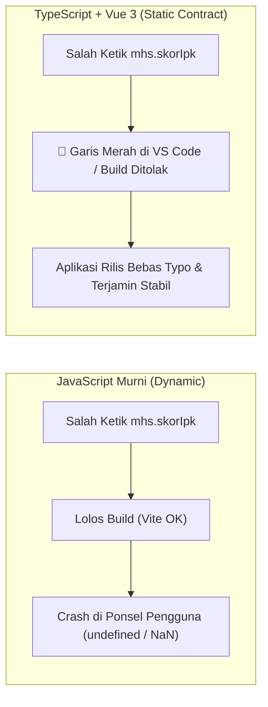
* **Tautan Kode Mandiri:**  
  👉 [🌐 Buka File Interaktif: slide_18_preview_sesi_03_typescript.html](../contoh_kode_program/sesi_02_vue_frontend/slide_18_preview_sesi_03_typescript.html)

---

## 📚 Daftar Referensi Akademik & Standar Mutu
1. **Universitas Terbuka (2024).** *Buku Materi Pokok (BMP) MSIM4401 / STSI4303: Pemrograman Berbasis Perangkat Bergerak & Rekayasa Perangkat Lunak (Modul 2: Arsitektur Antarmuka Komponen Reaktif)*. Tangerang Selatan: Penerbit Universitas Terbuka.
2. **Vue.js Core Team (2025).** *Vue.js 3 Official Documentation & Guide: Composition API, Reactivity Fundamentals, Single-File Components, and Composables*. Diakses daring dari: [https://vuejs.org/](https://vuejs.org/)
3. **Mozilla Developer Network (MDN) (2025).** *JavaScript Proxy and Reflect Reference: Metaprogramming & Interception in Modern ECMAScript*. Diakses daring dari: [https://developer.mozilla.org/en-US/docs/Web/JavaScript/Reference/Global_Objects/Proxy](https://developer.mozilla.org/en-US/docs/Web/JavaScript/Reference/Global_Objects/Proxy)
4. **W3C (World Wide Web Consortium) (2024).** *Document Object Model (DOM) Technical Architecture & Web Components Specifications*. Diakses daring dari: [https://www.w3.org/standards/](https://www.w3.org/standards/)
5. **Martin, Robert C. (2018).** *Clean Architecture: A Craftsman's Guide to Software Structure and Design*. Prentice Hall (Relevansi: Pemisahan logika bisnis dari antarmuka via Composable Functions).
