# 📱 NASKAH & SLIDE SESI 03: KEAMANAN TIPE DATA TYPESCRIPT & VUE COMPOSITION API (TUGAS TUTORIAL 1)
## Mata Kuliah: Pemrograman Berbasis Perangkat Bergerak (STSI4303 / MSIM4401)
### Program Studi: S1 Sistem Informasi & S1 Informatika — Universitas Terbuka
### Dosen Pengampu: Anton Prafanto, S.Kom., M.T.
### Modul Acuan BMP: Modul 3 (MSIM4401/STSI4303 — Fondasi Keamanan Tipe Data & Komposisi Antarmuka)

---

## 🗺️ Gambaran Umum Sesi
Sesi ketiga ini merupakan **titik tolak evaluasi mandiri pertama (Milestone 1)** dalam rangkaian 8 sesi tutorial perkuliahan STSI4303. Mahasiswa mempelajari **TypeScript** sebagai standar industri modern untuk mencegah galat saat aplikasi dijalankan (*runtime errors* atau *silent crashes*) pada perangkat smartphone pengguna. Materi memadukan TypeScript secara mendalam dengan **Vue 3 Composition API** (`<script setup lang="ts">`), mencakup pendefinisian tipe primitif, *literal & union types*, kontrak *interface* model data, *generics* pada koleksi *array*, *typing* fungsi kalkulasi, reaktivitas bertipe (`ref`, `reactive`, `computed`, `props`, `emits`, `DOM events`), hingga bedah tuntas kasus dan rubrik penilaian **TUGAS TUTORIAL 1 (Kalkulator Nilai Mata Kuliah & IPS Mahasiswa UT)**.

---

## 🛠️ Panduan Alat & Lingkungan Belajar (Ramah Pemula)
Bagi rekan-rekan mahasiswa yang baru pertama kali mempelajari TypeScript dan Vue 3, Anda **tidak perlu merasa cemas** dengan instalasi perangkat lunak yang rumit. Seluruh materi dan 18 berkas kode mandiri pada sesi ini telah dirancang dengan prinsip **Zero Friction**:
1. **Google Chrome / Web Browser Modern:**  
   Untuk menguji dan menjalankan aplikasi interaktif, Anda cukup **klik dua kali (double click)** berkas berekstensi `.html` yang tersedia di folder `contoh_kode_program/sesi_03_typescript_vue/`. Berkas akan langsung terbuka dan berjalan mulus tanpa memerlukan *local server*, Node.js, maupun perintah terminal!
2. **Visual Studio Code (VS Code):**  
   Gunakan VS Code untuk membaca dan memodifikasi baris kode program. Sangat disarankan memasang ekstensi resmi:
   * **Vue - Official (Volar):** Memberikan penyorotan sintaks (*syntax highlighting*) dan autocompletion pada komponen Vue.
   * **TypeScript Vue Plugin:** Membantu mendeteksi kesalahan pengetikan tipe data secara langsung dengan garis bawah merah (*compile-time warning*).
3. **Pemeriksaan Konsol Browser (DevTools):**  
   Saat menjalankan berkas `.html`, Anda dapat menekan tombol **F12** (atau klik kanan $\rightarrow$ *Inspect* $\rightarrow$ tab *Console*) pada keyboard Anda untuk melihat pesan log, struktur data objek, dan simulasi proses reaktivitas di balik layar.

---

## 📊 Daftar 18 Slide Pembahasan & Berkas Kode Mandiri

### 📌 Slide 01: Orientasi Sesi 03, Peta Capaian & Tagihan TUGAS TUTORIAL 1
* **Sub-CPMK:** Memahami posisi kompetensi Sesi 03 dalam peta kurikulum semester serta rincian tagihan resmi Tugas Tutorial 1 (bobot penilaian terbesar di paruh pertama semester).
* **Alat yang Digunakan:** Google Chrome / Modern Web Browser, Visual Studio Code.
* **Narasi Dosen:**  
  *"Selamat berjumpa kembali rekan-rekan mahasiswa Universitas Terbuka yang saya banggakan! Hari ini kita memasuki Sesi 03, sebuah sesi yang sangat istimewa dan krusial. Selain kita akan memperkuat kode program kita dengan tameng baja bernama TypeScript, pada sesi ini resmi dibuka tagihan TUGAS TUTORIAL 1. Tugas ini memiliki bobot penilaian yang sangat signifikan (70% nilai tutorial disumbangkan bersama Tugas 2 dan 3). Jangan khawatir atau merasa terbebani! Pada pertemuan ini kita akan membedah seluruh model data akademik, logika kalkulasi IPS, hingga master solusinya secara bertahap dan menyenangkan!"*
* **Poin Kunci:**
  * **Peta Milestone 1:** Tugas Tutorial 1 berdurasi 2 pekan di LMS UT.
  * **Kewajiban Demonstrasi:** Menyertakan tautan video YouTube (status *unlisted*, durasi 3–5 menit) yang menampilkan wajah mahasiswa dan penjelasan kode.
  * **Kesiapan Fondasi:** Menggabungkan logika TypeScript murni dengan reaktivitas antarmuka Vue 3.
* **Diagram Alur Kurikulum & Milestone (Mermaid):**
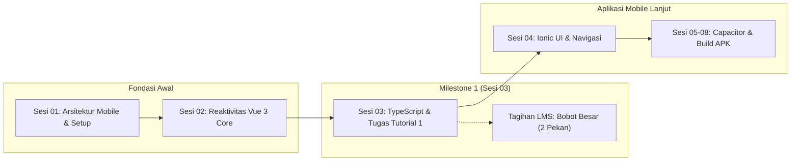
* **Tautan Kode Mandiri:**  
  👉 [🌐 Buka File Interaktif: slide_01_roadmap_sesi_dan_tugas_1.html](../contoh_kode_program/sesi_03_typescript_vue/slide_01_roadmap_sesi_dan_tugas_1.html)

---

### 📌 Slide 02: Urgensi TypeScript: Menghabisi Bug Runtime Typo Sebelum Aplikasi Meluncur
* **Sub-CPMK:** Menganalisis kelemahan sistem pengetikan dinamis (*dynamic typing*) pada JavaScript murni dan membuktikan keunggulan *compile-time safety* TypeScript.
* **Alat yang Digunakan:** Google Chrome (DevTools Console `F12`), Visual Studio Code.
* **Narasi Dosen:**  
  *"Di era smartphone modern, bayangkan pengguna sedang membuka aplikasi kalkulator nilai akademik, tiba-tiba aplikasi mendadak force close (tertutup sendiri) hanya karena programmer salah mengetik nama properti `mhs.skorIpk` padahal aslinya bernama `mhs.ipk`. Di JavaScript murni, kesalahan ketik (typo) seperti ini tidak akan dianggap error saat kita ngoding, melainkan menghasilkan `undefined` atau `NaN` yang membingungkan. TypeScript hadir sebagai asisten cerdas yang langsung memberikan garis merah di editor sebelum kode sempat dikompilasi atau diuji coba pengguna!"*
* **Poin Kunci:**
  * **JavaScript Murni (*Dynamic*):** Menerima kesalahan pengetikan properti secara diam-diam (*silent failure*), memicu bug di tangan pengguna.
  * **TypeScript (*Static Typing*):** Memvalidasi struktur data saat penulisan kode (*compile-time*), menghemat waktu debugging hingga berjam-jam.
* **Diagram Perbandingan Penanganan Galat (Mermaid):**
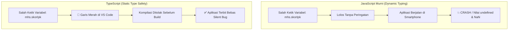
* **Tautan Kode Mandiri:**  
  👉 [🌐 Buka File Interaktif: slide_02_urgensi_typescript_mobile.html](../contoh_kode_program/sesi_03_typescript_vue/slide_02_urgensi_typescript_mobile.html)

---

### 📌 Slide 03: Tipe Data Primitif & Bahaya Penggunaan Kata Kunci 'any'
* **Sub-CPMK:** Mendeklarasikan tipe data primitif secara eksplisit dan menghindari anti-pattern penggunaan `any` dalam pengembangan aplikasi mobile.
* **Alat yang Digunakan:** Visual Studio Code, Web Browser.
* **Narasi Dosen:**  
  *"TypeScript memiliki 3 pilar tipe primitif utama: `string` untuk data tekstual, `number` untuk bilangan bulat maupun desimal, dan `boolean` untuk logika benar atau salah. Sering kali pemula merasa malas dan menggunakan kata kunci `let data: any` agar kode cepat selesai tanpa error garis merah. Ingat pesan penting ini rekan-rekan: memakai `any` sama saja mematikan proteksi TypeScript dan kembali ke era rawan bug! Jika data memang belum kita ketahui tipenya (misalnya respons mentah dari internet), gunakan `unknown` dan periksa terlebih dahulu dengan `typeof`."*
* **Poin Kunci:**
  * **Primitif Eksplisit:** `nim: string`, `sks: number`, `isAktif: boolean`.
  * **Bahaya `any`:** Melemahkan sistem keamanan tipe data (*type bypass*).
  * **Solusi Aman `unknown`:** Memerlukan verifikasi tipe (*type narrowing*) sebelum data dimanipulasi.
* **Diagram Hirarki Keamanan Tipe (Mermaid):**
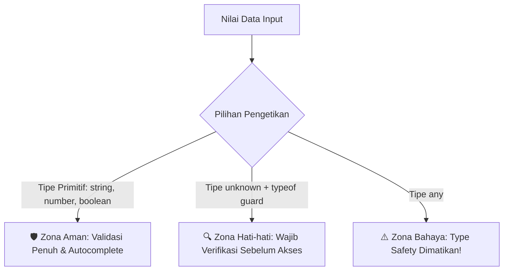
* **Tautan Kode Mandiri:**  
  👉 [🌐 Buka File Interaktif: slide_03_tipe_primitif_dan_any_hazard.html](../contoh_kode_program/sesi_03_typescript_vue/slide_03_tipe_primitif_dan_any_hazard.html)

---

### 📌 Slide 04: Union Types & Literal Types: Membatasi Nilai Sah secara Mutlak
* **Sub-CPMK:** Merancang tipe data kustom yang mengunci nilai variabel hanya pada himpunan data sah (*closed set*).
* **Alat yang Digunakan:** Visual Studio Code, Web Browser Chrome.
* **Narasi Dosen:**  
  *"Berapa banyak nilai huruf resmi yang diakui dalam sistem transkrip nilai akademik Universitas Terbuka? Hanya ada 5: A, B, C, D, dan E. Jika kita menggunakan tipe data `string` biasa, pengguna bisa saja mengetik 'A+', 'B minus', atau kata sembarang yang merusak perhitungan mutu. Dengan Literal Types `type NilaiHuruf = 'A' | 'B' | 'C' | 'D' | 'E'`, kita mengunci nilai variabel secara mutlak. Bila ada baris kode yang mencoba mengisi nilai di luar kelima huruf tersebut, TypeScript akan langsung menolak!"*
* **Poin Kunci:**
  * **Literal Types:** Menggunakan nilai spesifik sebagai tipe data.
  * **Union Operator (`|`):** Menggabungkan beberapa pilihan nilai legal (*closed set*).
  * Sangat cocok untuk status mahasiswa: `'Aktif' | 'Cuti' | 'Lulus'`.
* **Diagram Validasi Nilai Mutlak (Mermaid):**
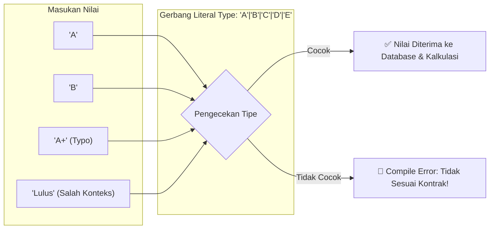
* **Tautan Kode Mandiri:**  
  👉 [🌐 Buka File Interaktif: slide_04_union_dan_literal_types.html](../contoh_kode_program/sesi_03_typescript_vue/slide_04_union_dan_literal_types.html)

---

### 📌 Slide 05: Kontrak Data Resmi: Mendefinisikan Interface Model Mahasiswa & Mata Kuliah
* **Sub-CPMK:** Menyusun model data akademik terstandar menggunakan kata kunci `interface` sebagai cetak biru entitas aplikasi mobile.
* **Alat yang Digunakan:** Visual Studio Code (membuka `.ts`), Google Chrome (membuka validator interaktif `.html`).
* **Narasi Dosen:**  
  *"Dalam rekayasa perangkat lunak profesional, interface berfungsi sebagai 'surat perjanjian' atau kontrak bentuk data antar-programmer. Pada berkas `slide_05_interface_model_mahasiswa.ts`, kita memetakan entitas `MataKuliah` dan `MahasiswaUT`. Setiap komponen antarmuka yang membaca data mahasiswa diwajibkan mematuhi struktur ini. Menariknya, interface di TypeScript memiliki zero runtime overhead: seluruh definisi ini akan dihapus saat diubah ke JavaScript murni, sehingga ukuran aplikasi tetap ringan dan gesit!"*
* **Poin Kunci:**
  * `interface` mendefinisikan bentuk objek tanpa membebani ukuran berkas akhir (*zero runtime overhead*).
  * Struktur hirarki: Objek `MahasiswaUT` menampung koleksi objek `MataKuliah[]`.
* **Diagram Struktur Entitas Mahasiswa UT (Mermaid):**
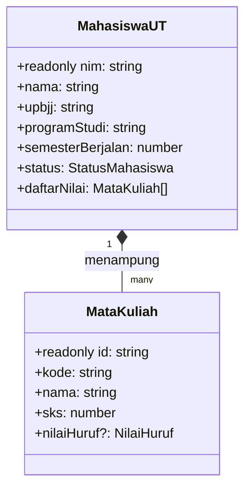
* **Tautan Kode Mandiri:**  
  👉 [🌐 Buka File Interaktif: slide_05_interface_model_mahasiswa.html](../contoh_kode_program/sesi_03_typescript_vue/slide_05_interface_model_mahasiswa.html)  
  👉 [📄 Buka Berkas TypeScript Asli: slide_05_interface_model_mahasiswa.ts](../contoh_kode_program/sesi_03_typescript_vue/slide_05_interface_model_mahasiswa.ts)

---

### 📌 Slide 06: Properti Opsional (?) dan Mutlak Tidak-Dapat-Diubah (readonly)
* **Sub-CPMK:** Mengamankan properti identitas menggunakan kata kunci `readonly` serta menandai properti fleksibel dengan operator opsional (`?`).
* **Alat yang Digunakan:** Google Chrome, VS Code.
* **Narasi Dosen:**  
  *"NIM mahasiswa adalah identitas unik yang bersifat permanen dan tidak boleh diubah-ubah setelah data tersimpan di memori. Kita menyematkan kata kunci `readonly nim: string`. Jika suatu saat ada baris kode yang berniat mengganti `mhs.nim = '04999'`, TypeScript langsung menghentikannya! Sebaliknya, properti seperti `nilaiHuruf?: NilaiHuruf` atau `emailKampus?: string` kita beri tanda tanya (`?`) karena saat mata kuliah baru ditambahkan di KRS, nilainya memang belum ada (*undefined*)."*
* **Poin Kunci:**
  * `readonly`: Menjamin imutabilitas data kunci (*prevent re-assignment*).
  * Tanda tanya (`?`): Menghindari error saat nilai properti belum terisi.
* **Diagram Hak Akses & Mutabilitas (Mermaid):**
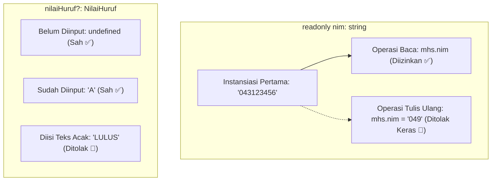
* **Tautan Kode Mandiri:**  
  👉 [🌐 Buka File Interaktif: slide_06_optional_dan_readonly_properties.html](../contoh_kode_program/sesi_03_typescript_vue/slide_06_optional_dan_readonly_properties.html)

---

### 📌 Slide 07: Generics pada Koleksi: Array&lt;T&gt; vs T[] untuk Manipulasi Aman
* **Sub-CPMK:** Mengelola himpunan koleksi objek majemuk menggunakan konsep *Generics* agar operasi array terlindungi secara konsisten.
* **Alat yang Digunakan:** Visual Studio Code, Web Browser Chrome.
* **Narasi Dosen:**  
  *"Saat kita mengelola keranjang daftar nilai mata kuliah, kita memerlukan sebuah array yang menampung banyak data bertipe `MataKuliah`. Jika kita hanya menulis `let list = []`, editor tidak tahu apa isi di dalamnya. Namun dengan menulis `Array<MataKuliah>` atau `MataKuliah[]`, editor VS Code akan memberikan bantuan pengetikan otomatis (autocomplete) ketika kita memanggil method `.map()`, `.filter()`, atau `.reduce()`. Anda langsung disuguhkan pilihan `.sks`, `.nama`, dan `.kode`!"*
* **Poin Kunci:**
  * Penulisan generik: `Array<T>` setara dengan `T[]`.
  * Menjamin fungsi perulangan dan agregasi (`reduce`, `filter`) menerima data yang tepat.
* **Diagram Wadah Generik Berkeamanan Tipe (Mermaid):**
```mermaid
flowchart LR
    subgraph WADAH["Wadah Koleksi: Array&lt;MataKuliah&gt;"]
        MK1["Objek MK 1 { sks: 3, ... }"]
        MK2["Objek MK 2 { sks: 2, ... }"]
    end
    WADAH -->|Operasi reduce()| C["Kalkulasi Total SKS: 3 + 2 = 5"]
    WADAH -.->|Penyusupan Objek Tanpa sks| D["🛑 Ditolak Kompiler TypeScript!"]
```
* **Tautan Kode Mandiri:**  
  👉 [🌐 Buka File Interaktif: slide_07_generics_array_koleksi.html](../contoh_kode_program/sesi_03_typescript_vue/slide_07_generics_array_koleksi.html)

---

### 📌 Slide 08: Anotasi Tipe pada Fungsi: Parameter Ketat & Return Type Eksplisit
* **Sub-CPMK:** Menerapkan pembatasan tipe data pada parameter masukan dan nilai kembalian (*return type*) fungsi kalkulasi akademik.
* **Alat yang Digunakan:** Google Chrome, VS Code.
* **Narasi Dosen:**  
  *"Fungsi kalkulasi mutu adalah inti dari aplikasi Tugas 1. Perhatikan fungsi `function getBobotAngka(huruf: NilaiHuruf): number`. Dengan menetapkan parameter `huruf: NilaiHuruf` dan kembalian `: number`, mustahil bagi siapapun untuk mengirimkan argumen yang salah atau menghasilkan nilai teks yang membuat rumus IPS menghasilkan `NaN`! Kerapian anotasi fungsi mencerminkan kedewasaan seorang software engineer."*
* **Poin Kunci:**
  * Format anotasi parameter: `(huruf: NilaiHuruf): number`.
  * Jika fungsi tidak mengembalikan nilai (hanya aksi), gunakan kembalian `: void`.
* **Diagram Gerbang Verifikasi Fungsi (Mermaid):**
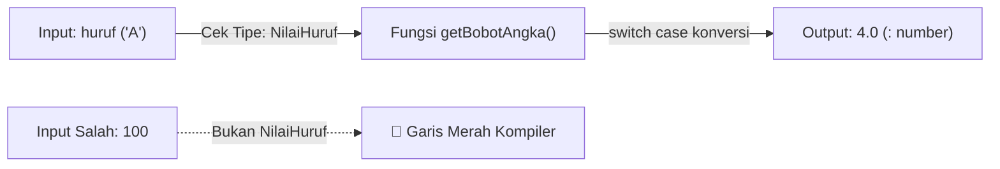
* **Tautan Kode Mandiri:**  
  👉 [🌐 Buka File Interaktif: slide_08_fungsi_type_annotation.html](../contoh_kode_program/sesi_03_typescript_vue/slide_08_fungsi_type_annotation.html)

---

### 📌 Slide 09: Integrasi Vue 3 & TypeScript: &lt;script setup lang="ts"&gt;
* **Sub-CPMK:** Mengonfigurasi berkas komponen Single File Component (SFC) Vue 3 menggunakan blok skrip TypeScript modern.
* **Alat yang Digunakan:** Visual Studio Code, Ekstensi Volar, Browser Chrome.
* **Narasi Dosen:**  
  *"Kombinasi Vue 3 dan TypeScript saat ini adalah salah satu kombinasi terindah di dunia rekayasa web mobile. Kita cukup menambahkan satu atribut sederhana pada tag skrip: `<script setup lang="ts">`. Seketika itu juga, seluruh variabel, fungsi, dan computed properties yang kita buat langsung mendapatkan perlindungan type checking tanpa perlu menuliskan boilerplate Options API yang panjang!"*
* **Poin Kunci:**
  * Penambahan atribut `lang="ts"` mengaktifkan dukungan TypeScript penuh.
  * Variabel di `<script setup>` otomatis tersedia pada template HTML (*auto-exposed*).
* **Diagram Arsitektur Single File Component (Mermaid):**
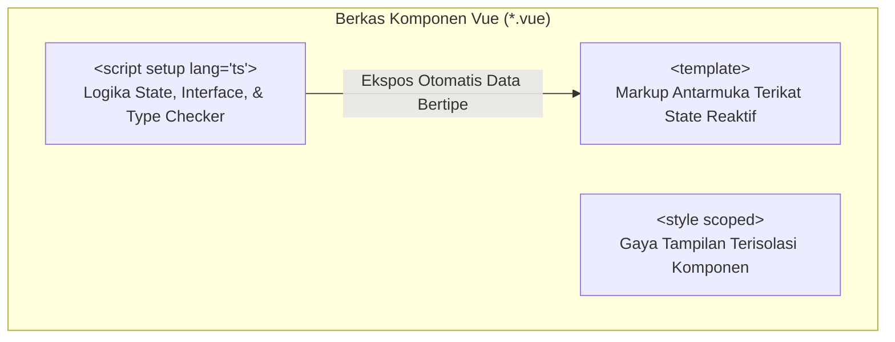
* **Tautan Kode Mandiri:**  
  👉 [🌐 Buka File Interaktif: slide_09_vue3_script_setup_lang_ts.html](../contoh_kode_program/sesi_03_typescript_vue/slide_09_vue3_script_setup_lang_ts.html)

---

### 📌 Slide 10: Deklarasi Typing Reaktif: ref&lt;T&gt; vs reactive&lt;T&gt;
* **Sub-CPMK:** Memanfaatkan sintaks TypeScript Generics untuk mengunci tipe data pada wadah reaktivitas `ref` dan `reactive`.
* **Alat yang Digunakan:** Google Chrome (DevTools Console), VS Code.
* **Narasi Dosen:**  
  *"Bagaimana cara mengunci tipe data pada wadah reaktif Vue? Kita menggunakan kurung sudut generik: `const targetIpk = ref<number>(3.75)`. Bila datanya bisa bernilai kosong pada awalnya, kita pasang tipe serikat: `ref<MahasiswaUT | null>(null)`. Dengan pola cerdas ini, TypeScript akan memaksa kita mengecek apakah data ada (`if (data)`) sebelum mengakses propertinya, sehingga aplikasi Anda terbebas selamanya dari error legendaris 'Cannot read properties of null'!"*
* **Poin Kunci:**
  * Sintaks generik: `ref<T>(nilaiAwal)`.
  * Dukungan tipe gabungan: `ref<MahasiswaUT | null>(null)`.
* **Diagram Reaktivitas Berkeamanan Tipe (Mermaid):**
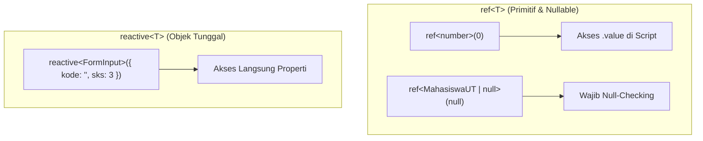
* **Tautan Kode Mandiri:**  
  👉 [🌐 Buka File Interaktif: slide_10_typing_ref_dan_reactive.html](../contoh_kode_program/sesi_03_typescript_vue/slide_10_typing_ref_dan_reactive.html)

---

### 📌 Slide 11: Mengelola Array Koleksi Bertipe: ref&lt;MataKuliah[]&gt;([])
* **Sub-CPMK:** Mengelola mutasi data daftar nilai secara reaktif dan aman dari penyusupan struktur data asing.
* **Alat yang Digunakan:** Google Chrome, VS Code.
* **Narasi Dosen:**  
  *"Pada aplikasi Tugas 1, kita memiliki tabel daftar mata kuliah yang dapat ditambah dan dihapus oleh pengguna secara bebas. Kita menginisialisasinya dengan `const daftarNilai = ref<MataKuliah[]>([])`. Dengan cara ini, ketika kita menjalankan fungsi `daftarNilai.value.push(dataBaru)`, compiler akan memastikan bahwa `dataBaru` memiliki semua properti yang diwajibkan oleh interface `MataKuliah`. Jika ada properti yang kurang, kompilasi langsung gagal!"*
* **Poin Kunci:**
  * Koleksi array reaktif: `ref<MataKuliah[]>([])`.
  * Metode mutasi array (`push`, `splice`, `filter`) tetap mematuhi kontrak tipe data.
* **Diagram Siklus Mutasi Koleksi Reaktif (Mermaid):**
```mermaid
flowchart LR
    A["Form Tambah Nilai"] -->|Validasi Interface| B["Objek MataKuliah Sah"]
    B -->|push()| C["ref&lt;MataKuliah[]&gt;"]
    C -->|Trigger Reaktivitas| D["Tabel Antarmuka Otomatis Terbarui"]
    C -->|filter()| E["Hapus Baris Mata Kuliah"]
```
* **Tautan Kode Mandiri:**  
  👉 [🌐 Buka File Interaktif: slide_11_typing_koleksi_array_reaktif.html](../contoh_kode_program/sesi_03_typescript_vue/slide_11_typing_koleksi_array_reaktif.html)

---

### 📌 Slide 12: Type Safety pada Properti Terkalkulasi: computed&lt;T&gt;()
* **Sub-CPMK:** Mengunci tipe data kembalian hasil perhitungan otomatis menggunakan anotasi generik pada fungsi `computed`.
* **Alat yang Digunakan:** Google Chrome, VS Code.
* **Narasi Dosen:**  
  *"Secara default, computed property di Vue akan menebak tipe data kembaliannya (*type inference*). Namun, untuk rumus penting seperti Indeks Prestasi Semester (IPS), kita sebaiknya menuliskan tipe secara tegas: `const totalSks = computed<number>(...)` dan `const ips = computed<string>(...)`. Jika ada rekan setim yang tidak sengaja mengembalikan objek alih-alih angka atau teks terformat 2 desimal, TypeScript akan langsung memberi tahu!"*
* **Poin Kunci:**
  * Penulisan: `computed<number>(() => { ... })`.
  * Memanfaatkan memori cache berefisiensi tinggi: kalkulasi hanya dijalankan ulang saat data sumber berubah.
* **Diagram Mekanisme Caching & Type Assertion Computed (Mermaid):**
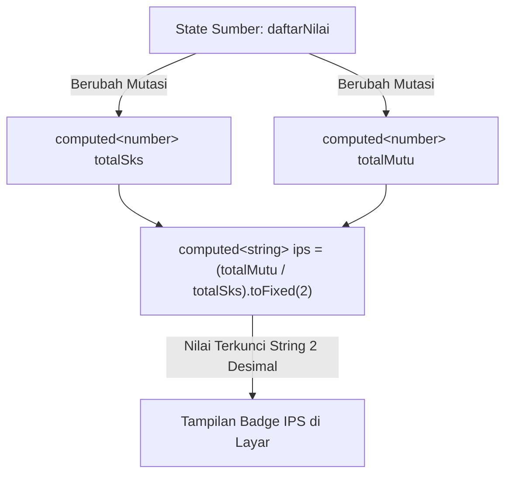
* **Tautan Kode Mandiri:**  
  👉 [🌐 Buka File Interaktif: slide_12_typing_computed_properties.html](../contoh_kode_program/sesi_03_typescript_vue/slide_12_typing_computed_properties.html)

---

### 📌 Slide 13: Deklarasi Props Bertipe: defineProps&lt;T&gt;()
* **Sub-CPMK:** Memvalidasi pengiriman data dari komponen induk (*parent*) ke komponen anak (*child*) menggunakan tipe TypeScript murni.
* **Alat yang Digunakan:** Visual Studio Code, Web Browser Chrome.
* **Narasi Dosen:**  
  *"Di Vue masa lalu, kita harus menulis validasi runtime props yang bertele-tele: `props: { mk: { type: Object, required: true } }`. Di era `<script setup lang="ts">`, kita cukup menulis satu baris ringkas: `defineProps<{ mk: MataKuliah }>()`. Jika komponen induk mencoba mengirim data angka biasa pada atribut `:mk`, editor VS Code Anda seketika memunculkan tanda bahaya!"*
* **Poin Kunci:**
  * *Type-based declaration* menggunakan `defineProps<{ properti: T }>()`.
  * Menghilangkan duplikasi validasi runtime manual.
* **Diagram Aliran Data Props Berkeamanan Tipe (Mermaid):**
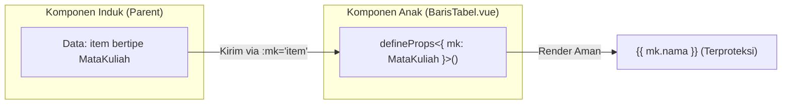
* **Tautan Kode Mandiri:**  
  👉 [🌐 Buka File Interaktif: slide_13_typing_props_komponen.html](../contoh_kode_program/sesi_03_typescript_vue/slide_13_typing_props_komponen.html)

---

### 📌 Slide 14: Deklarasi Emits Bertipe: defineEmits&lt;T&gt;()
* **Sub-CPMK:** Mengunci nama event kustom serta tipe parameter (*payload*) yang dipancarkan dari komponen anak ke komponen induk.
* **Alat yang Digunakan:** Google Chrome, VS Code.
* **Narasi Dosen:**  
  *"Ketika pengguna menekan tombol tong sampah merah pada baris tabel mata kuliah, komponen baris tersebut ingin memberi tahu komponen induk untuk menghapus data. Kita mendefinisikan sinyal kustom dengan `defineEmits<{ (e: 'hapus-mk', id: string): void }>()`. Lewat deklarasi ini, komponen anak diwajibkan menyertakan ID mata kuliah bertipe string saat memancarkan event. Tidak ada lagi risiko typo nama event!"*
* **Poin Kunci:**
  * Penulisan: `defineEmits<{ (e: 'nama-event', payload: T): void }>()`.
  * Memastikan komponen induk menerima argumen dengan tipe data yang tepat.
* **Diagram Sinyal Event Emits Bertipe (Mermaid):**
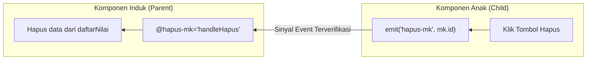
* **Tautan Kode Mandiri:**  
  👉 [🌐 Buka File Interaktif: slide_14_typing_emits_komponen.html](../contoh_kode_program/sesi_03_typescript_vue/slide_14_typing_emits_komponen.html)

---

### 📌 Slide 15: Penanganan DOM Events Bertipe (Event & Type Casting)
* **Sub-CPMK:** Menangani interaksi masukan antarmuka browser menggunakan teknik *Event Type Assertion* yang benar.
* **Alat yang Digunakan:** Visual Studio Code, Web Browser Chrome.
* **Narasi Dosen:**  
  *"Pernahkah Anda mencoba membaca nilai input di TypeScript dengan `event.target.value` lalu muncul pesan error `Property 'value' does not exist on type 'EventTarget'`? Mengapa itu terjadi? Karena bagi TypeScript, target event bisa berupa apa saja, misalnya `div` atau `span` yang memang tidak memiliki `.value`. Solusinya sangat sederhana: lakukan penegasan tipe (*type assertion*) menggunakan kata kunci `as`: `const input = event.target as HTMLInputElement;`."*
* **Poin Kunci:**
  * Objek event bawaan: `e: Event`, `e: KeyboardEvent`, `e: TouchEvent`.
  * Type Casting dengan operator `as`: `(e.target as HTMLInputElement).value`.
* **Diagram Penegasan Tipe DOM Events (Mermaid):**
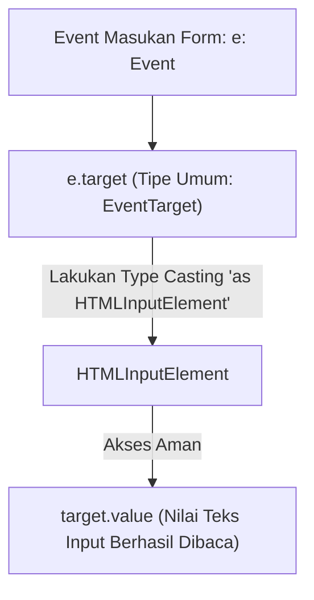
* **Tautan Kode Mandiri:**  
  👉 [🌐 Buka File Interaktif: slide_15_typing_dom_events.html](../contoh_kode_program/sesi_03_typescript_vue/slide_15_typing_dom_events.html)

---

### 📌 Slide 16: Bedah Rubrik Penilaian Resmi TUGAS TUTORIAL 1 UT
* **Sub-CPMK:** Menelaah 4 kriteria penilaian dan tata cara pengumpulan Tugas Tutorial 1 berskala 0–100 sesuai standar mutu Fakultas Sains dan Teknologi UT.
* **Alat yang Digunakan:** Web Browser Chrome (Kalkulator Rubrik Interaktif), Visual Studio Code / Text Editor.
* **Narasi Dosen:**  
  *"Mari kita bedah rubrik resmi Tugas Tutorial 1 ini dengan cermat! Nilai sempurna 100 terbagi atas 4 pilar utama: Model TypeScript & Type Safety (25%), Reaktivitas Vue 3 & Validasi Form (25%), Logika Kalkulasi Otomatis SKS & IPS (30%), serta Video Demonstrasi YouTube Unlisted (20%). Pastikan dalam video demonstrasi, wajah Anda terlihat jelas melalui kamera samping saat Anda menjelaskan kode program dan mendemokan fitur aplikasi!"*
* **Poin Kunci:**
  * **Rentang Nilai:** Skala 0–100 dengan batas waktu pengumpulan 2 pekan di LMS.
  * **Integritas Akademik:** Dilarang keras melakukan plagiasi; kode harus dikuasai dan dipahami secara mandiri.
* **Diagram Kuadran Rubrik Evaluasi Akademik (Mermaid):**
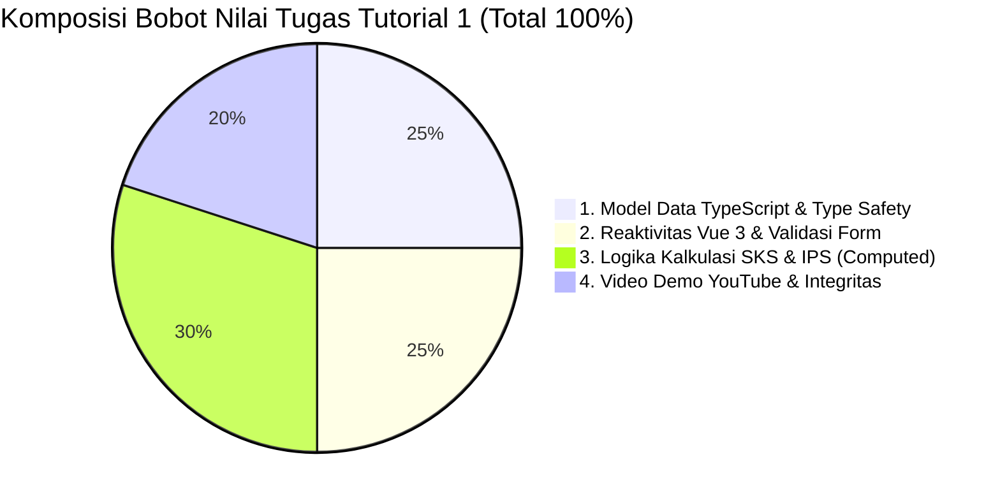
* **Tautan Berkas Rubrik & Kalkulator:**  
  👉 [🌐 Buka Kalkulator Rubrik Interaktif: slide_16_rubrik_tugas_tutorial_1.html](../contoh_kode_program/sesi_03_typescript_vue/slide_16_rubrik_tugas_tutorial_1.html)  
  👉 [📄 Buka Panduan Rubrik Lengkap: slide_16_rubrik_tugas_tutorial_1.md](../contoh_kode_program/sesi_03_typescript_vue/slide_16_rubrik_tugas_tutorial_1.md)

---

### 📌 Slide 17: 🎯 MASTER SOLUSI RESMI TUGAS TUTORIAL 1: Kalkulator Nilai & IPS Mahasiswa UT
* **Sub-CPMK:** Membangun aplikasi lengkap solusi Tugas Tutorial 1 yang memenuhi 100% rubrik penilaian program studi FST Universitas Terbuka.
* **Alat yang Digunakan:** Google Chrome / Browser Modern, Visual Studio Code.
* **Narasi Dosen:**  
  *"Inilah dia mahakarya solusi resmi Tugas Tutorial 1! Kita menggabungkan seluruh pengetahuan yang kita pelajari hari ini ke dalam sebuah aplikasi utuh: Kartu Profil Mahasiswa UT, Formulir Input Nilai dengan validasi ketat, Tabel Rekapitulasi Mata Kuliah yang dinamis, Kalkulator Reaktif otomatis (Total SKS, Total Bobot Mutu, Nilai IPS 2 desimal, Predikat Kelulusan), serta fitur Cetak Ringkasan KTPU. Jadikan berkas `slide_17` ini sebagai tolok ukur utama pengerjaan tugas Anda!"*
* **Fitur Aplikasi Unggulan:**
  * Kontrak Model Data TypeScript (`MahasiswaUT`, `MataKuliah`).
  * Reaktivitas Vue 3 murni (`ref`, `reactive`, `computed`).
  * Konversi skala huruf ke mutu (A=4, B=3, C=2, D=1, E=0).
  * Tombol Cetak / Simpan Ringkasan Hasil Belajar.
* **Diagram Arsitektur Komponen Aplikasi Master Solusi (Mermaid):**
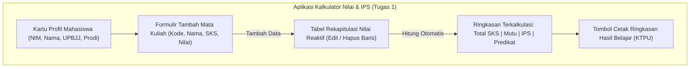
* **Tautan Kode Mandiri:**  
  👉 [🌐 Buka File Interaktif: slide_17_solusi_tugas_1_kalkulator_nilai.html](../contoh_kode_program/sesi_03_typescript_vue/slide_17_solusi_tugas_1_kalkulator_nilai.html)

---

### 📌 Slide 18: 🚀 Jembatan Menuju Sesi 04: Transisi Menuju Komponen Mobile Asli Ionic UI
* **Sub-CPMK:** Menganalisis perbedaan antarmuka web biasa dengan komponen mobile asli serta mempersiapkan diri memasuki ekosistem Ionic UI pada Sesi 04.
* **Alat yang Digunakan:** Google Chrome, VS Code.
* **Narasi Dosen:**  
  *"Selamat untuk rekan-rekan semua! Kita telah berhasil menuntaskan fondasi TypeScript dan logika reaktivitas Vue 3 secara gemilang. Namun perhatikan aplikasi kita saat ini: tombol, kartu, dan tabelnya masih berpenampilan layaknya situs web desktop biasa. Pekan depan di Sesi 04, kita akan melangkah ke dunia mobile sesungguhnya menggunakan Ionic Framework! Kita akan membedah `ion-app`, `ion-page`, `ion-card`, serta navigasi tumpukan kartu mobile khas Android dan iOS!"*
* **Poin Kunci:**
  * **Transisi Ekosistem:** Dari tag HTML browser standar menuju komponen mobile asli Ionic UI.
  * **Mobile Look & Feel:** Efek sentuhan riak (*ripple effect*), transisi geser layar, dan adaptasi Material Design.
  * **Persiapan Sesi 04:** Dasar-Dasar Ionic Framework & Navigasi Halaman.
* **Diagram Evolusi Antarmuka Mobile (Mermaid):**
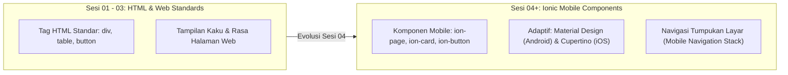
* **Tautan Kode Mandiri:**  
  👉 [🌐 Buka File Interaktif: slide_18_preview_sesi_04_ionic_ui.html](../contoh_kode_program/sesi_03_typescript_vue/slide_18_preview_sesi_04_ionic_ui.html)

---

## 📚 Daftar Referensi Akademik & Standar Mutu
1. **Universitas Terbuka (2024).** *Buku Materi Pokok (BMP) MSIM4401 / STSI4303: Pemrograman Berbasis Perangkat Bergerak & Rekayasa Perangkat Lunak (Modul 3: Fondasi Keamanan Tipe Data & Komposisi Antarmuka Komponen)*. Tangerang Selatan: Penerbit Universitas Terbuka.
2. **Microsoft TypeScript Team (2025).** *TypeScript Official Documentation & The TypeScript Handbook: Generics, Everyday Types, Interfaces, and Type Narrowing*. Diakses daring dari: [https://www.typescriptlang.org/docs/](https://www.typescriptlang.org/docs/)
3. **Vue.js Core Team (2025).** *Vue.js 3 Official Guide: Using Vue with TypeScript, Composition API (<script setup>), and Reactivity Utilities*. Diakses daring dari: [https://vuejs.org/guide/typescript/overview.html](https://vuejs.org/guide/typescript/overview.html)
4. **Fowler, Martin (2018).** *Refactoring: Improving the Design of Existing Code (2nd Edition)*. Boston: Addison-Wesley Professional. (Relevansi: Teknik pencegahan bau kode (*code smells*) menggunakan sistem pengetikan statis).
5. **Gamma, E., Helm, R., Johnson, R., & Vlissides, J. (1994).** *Design Patterns: Elements of Reusable Object-Oriented Software*. Reading: Addison-Wesley. (Relevansi: Penerapan kontrak interface model data).
6. **W3C (World Wide Web Consortium) & ECMA International (2024).** *ECMAScript 2024 Language Specification (ECMA-262, 15th Edition)*. Diakses daring dari: [https://tc39.es/ecma262/](https://tc39.es/ecma262/)
