# 📱 NASKAH & SLIDE SESI 04: DASAR-DASAR IONIC FRAMEWORK & NAVIGASI HALAMAN MOBILE
## Mata Kuliah: Pemrograman Berbasis Perangkat Bergerak (STSI4303 / MSIM4401)
### Program Studi: S1 Sistem Informasi & S1 Informatika — Universitas Terbuka
### Dosen Pengampu: Anton Prafanto, S.Kom., M.T.
### Modul Acuan BMP: Modul 4 (MSIM4401/STSI4303 — Dasar-Dasar Ionic Framework & Navigasi Mobile)

> ⚡ **Akses Cepat Bahan Sesi 04:**  
> [📥 Unduh Slide PPTX](https://github.com/antonprafanto/tuweb_mobile2025/raw/main/slide_presentasi/SESI_04_Dasar_Ionic_dan_Navigasi.pptx) • [👁️ Baca Slide Online](https://view.officeapps.live.com/op/view.aspx?src=https%3A%2F%2Fraw.githubusercontent.com%2Fantonprafanto%2Ftuweb_mobile2025%2Fmain%2Fslide_presentasi%2FSESI_04_Dasar_Ionic_dan_Navigasi.pptx) • [📁 18 Berkas Kode Mandiri](../contoh_kode_program/sesi_04_ionic_dasar_navigasi/) • [🎯 Master Solusi Lab Quest 04](../contoh_kode_program/sesi_04_ionic_dasar_navigasi/slide_17_lab_quest_04_portal_modul_ut.html) • [🛠️ Konsol Troubleshooting](../contoh_kode_program/sesi_04_ionic_dasar_navigasi/slide_16_troubleshooting_routing_ionic.html)

---

## 🗺️ Gambaran Umum Sesi
Sesi keempat ini merupakan gerbang transisi dari pemrograman antarmuka web murni menuju rekayasa aplikasi perangkat bergerak (*mobile application*). Mahasiswa diperkenalkan pada **Ionic Framework**, sebuah *UI Toolkit* mobile terdepan berbasis standar Web Components yang mampu menghadirkan estetika dan performa alami (*native look-and-feel*). Materi mencakup:
1. Konsep *Adaptive Styling* (Material Design untuk Android dan Cupertino untuk iOS).
2. Hierarki tata letak baku mobile (`ion-app`, `ion-page`, `ion-header`, dan `ion-content`).
3. Ragam komponen antarmuka esensial (*button*, *card*, *avatar*, *badge*, *chip*, *list*, dan *ionicons*).
4. Arsitektur navigasi tumpukan (*Stack Navigation*) dengan `@ionic/vue-router` dan `<ion-router-outlet>`.
5. Pengendalian siklus hidup halaman (*Lifecycle Hooks*) untuk mencegah kebocoran memori (*memory leak*).
6. Master solusi studi kasus **Lab Quest 04: Portal Modul BMP UT Multi-Halaman**.
7. Pengarahan jembatan materi menuju Sesi 05 dan pembukaan asesmen resmi **TUGAS TUTORIAL 2**.

---

## 🛠️ Panduan Alat & Lingkungan Belajar (Ramah Pemula)
Bagi rekan-rekan mahasiswa yang baru pertama kali mempelajari pengembangan aplikasi mobile, Anda **tidak perlu cemas** dengan instalasi perangkat lunak SDK yang rumit atau spesifikasi komputer yang berat. Seluruh materi dan 18 berkas kode mandiri pada sesi ini telah dirancang dengan prinsip **The Zero-Friction Courseware Framework**:
1. **Google Chrome / Peramban Web Modern:**  
   Untuk menguji dan menjalankan antarmuka mobile interaktif, Anda cukup **klik ganda (*double click*)** berkas berekstensi `.html` di folder `contoh_kode_program/sesi_04_ionic_dasar_navigasi/`. Berkas akan langsung terbuka dan berjalan sempurna di Google Chrome tanpa memerlukan Node.js, `npm run dev`, maupun server lokal!
2. **Mode Simulator Perangkat Bergerak (DevTools):**  
   Saat membuka berkas `.html` di Chrome, tekan tombol `F12` pada keyboard, lalu tekan pintasan `Ctrl + Shift + M` (atau klik ikon *Toggle device toolbar* di pojok kiri atas jendela DevTools). Peramban akan langsung bertransformasi menjadi simulator smartphone (seperti Pixel 7 atau iPhone 14) sehingga Anda dapat menguji responsivitas sentuhan (*touch event*) secara nyata.
3. **Visual Studio Code (VS Code):**  
   Gunakan VS Code untuk membaca dan mengeksplorasi kode sumber. Ekstensi yang disarankan:
   * **Vue - Official (Volar):** Memberikan pewarnaan sintaks dan autocompletion cerdas untuk tag-tag kustom Ionic.
   * **Ionic Framework Extension:** Membantu dokumentasi cepat komponen antarmuka.

---

## 📊 Daftar 18 Slide Pembahasan & Berkas Kode Mandiri

### 📌 Slide 01: Orientasi Sesi 04, Arsitektur Hybrid & Ekosistem Ionic UI Toolkit
* **Sub-CPMK:** Memahami peran Ionic Framework sebagai penyedia komponen antarmuka mobile multiplatform di atas fondasi Vue 3.
* **Alat yang Digunakan:** Google Chrome / Peramban Modern, Visual Studio Code.
* **Narasi Dosen:**  
  *"Selamat berjumpa di Sesi 04 rekan-rekan mahasiswa Universitas Terbuka! Pada tiga sesi terdahulu, kita telah menguasai fondasi Vue 3 dan TypeScript. Namun, jika tombol dan daftar data yang kita buat hanya menggunakan elemen HTML biasa, antarmuka aplikasi akan terasa kaku dan canggung di genggaman pengguna smartphone. Hari ini kita melangkah ke dunia Ionic Framework: sebuah toolkit UI modern berstandar industri yang menyulap kode web kita menjadi antarmuka mobile berkelas tanpa harus menulis kode Java/Kotlin untuk Android atau Swift untuk iOS dari nol!"*
* **Poin Kunci:**
  * **Web Components Standard:** Komponen Ionic dikompilasi menjadi elemen kustom HTML standar peramban.
  * **Single Codebase Multiplatform:** Satu basis kode Vue 3 dapat didistribusikan ke Android (APK/AAB), iOS (IPA), dan Web (Progressive Web App).
  * **Zero Friction Design:** Tidak membutuhkan kompilasi native yang berat selama perancangan antarmuka visual.
* **Diagram Alur Ekosistem Ionic (Mermaid):**
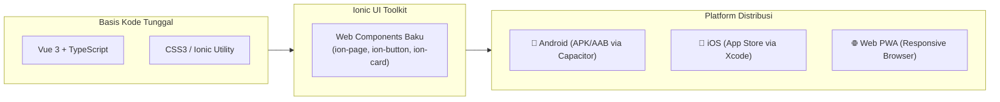
* **Tautan Kode Mandiri:**  
  👉 [🌐 Buka Berkas Interaktif: slide_01_pengenalan_ekosistem_ionic.html](../contoh_kode_program/sesi_04_ionic_dasar_navigasi/slide_01_pengenalan_ekosistem_ionic.html)

---

### 📌 Slide 02: Adaptive Styling: Material Design (Android) vs Cupertino (iOS)
* **Sub-CPMK:** Mengidentifikasi mekanisme *Adaptive Styling* otomatis yang menyesuaikan estetika antarmuka sesuai sistem operasi target.
* **Alat yang Digunakan:** Google Chrome (Toggle Device Toolbar `Ctrl + Shift + M`), VS Code.
* **Narasi Dosen:**  
  *"Pernahkah rekan-rekan memperhatikan bahwa pengguna iPhone menyukai tombol dengan teks berhuruf awal kapital dan judul toolbar tepat di tengah, sedangkan pengguna Android menyukai efek gelombang sentuh (ripple effect) dan judul toolbar di sisi kiri? Ionic memiliki kecerdasan bernama Adaptive Styling. Tanpa perlu kita ubah baris kodenya, komponen Ionic otomatis mengenali sistem operasi ponsel pengguna dan beralih gaya antara Material Design (Android) atau Cupertino (iOS)!"*
* **Poin Kunci:**
  * **Mode Material Design (`md`):** Mengikuti panduan Google; efek ripple beriak, tipografi Roboto, dan bayangan elevasi (*box-shadow* tegas).
  * **Mode Cupertino (`ios`):** Mengikuti panduan Apple; transisi geser halus, font San Francisco, judul toolbar di tengah (*centered*), dan efek latar buram (*backdrop-filter blur*).
  * **Konfigurasi Mode:** Dapat diatur secara eksplisit lewat atribut `mode="ios"` atau `mode="md"`.
* **Diagram Mekanisme Adaptive Styling (Mermaid):**
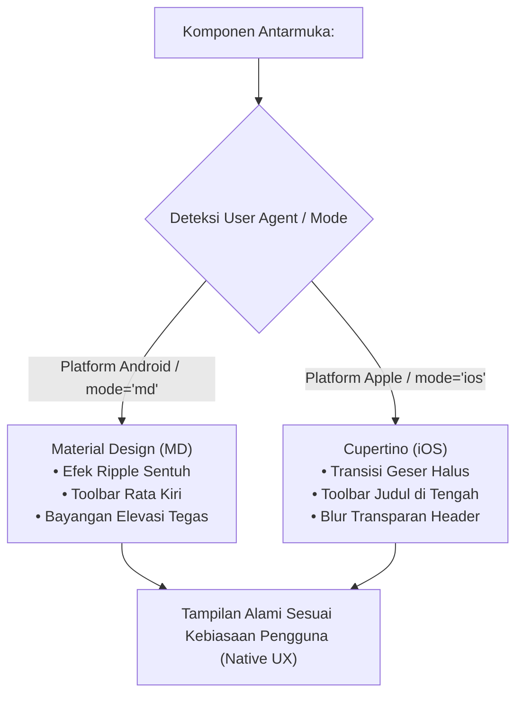
* **Tautan Kode Mandiri:**  
  👉 [🌐 Buka Berkas Interaktif: slide_02_adaptive_styling_md_ios.html](../contoh_kode_program/sesi_04_ionic_dasar_navigasi/slide_02_adaptive_styling_md_ios.html)

---

### 📌 Slide 03: Anatomi Halaman Mobile Baku: Hirarki ion-app, ion-page, ion-header, & ion-content
* **Sub-CPMK:** Menyusun struktur pembungkus halaman mobile yang valid sesuai standar arsitektur Ionic.
* **Alat yang Digunakan:** Google Chrome DevTools (Elements tab), VS Code.
* **Narasi Dosen:**  
  *"Kesalahan paling klasik yang kerap membuat layar aplikasi mobile menjadi putih kosong (blank screen) adalah menyusun tata letak seperti halaman web biasa menggunakan tag `<div>`. Pada aplikasi mobile, viewport perangkat dikunci secara khusus. Seluruh aplikasi wajib dibungkus tag `<ion-app>`, setiap tampilan rute wajib dibungkus `<ion-page>`, dan area yang dapat digulir (scrollable) wajib berada di dalam `<ion-content>`. Ini adalah hukum mutlak hierarki mobile!"*
* **Poin Kunci:**
  * `<ion-app>`: Elemen akar (*root wrapper*) tunggal yang bertindak sebagai host aplikasi mobile di `App.vue`.
  * `<ion-page>`: Wadah utama sebuah layar; mengelola status aktif/pasif saat transisi perutean.
  * `<ion-header>` & `<ion-toolbar>`: Area atas penampung judul, ikon menu, atau tombol navigasi.
  * `<ion-content>`: Area isi aplikasi yang dilengkapi manajemen akselerasi perangkat keras (*momentum scrolling*).
* **Diagram Hierarki Anatomi Mobile (Mermaid):**
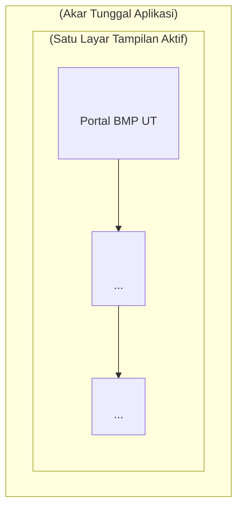
* **Tautan Kode Mandiri:**  
  👉 [🌐 Buka Berkas Interaktif: slide_03_anatomi_halaman_ion_page.html](../contoh_kode_program/sesi_04_ionic_dasar_navigasi/slide_03_anatomi_halaman_ion_page.html)

---

### 📌 Slide 04: Palet Warna Semantik Tema Mobile Ionic
* **Sub-CPMK:** Memanfaatkan sistem pewarnaan semantik Ionic (`color="primary|secondary|danger"`) untuk standarisasi identitas visual.
* **Alat yang Digunakan:** Peramban Web Google Chrome, Visual Studio Code.
* **Narasi Dosen:**  
  *"Dalam desain antarmuka profesional, kita tidak mengodekan nilai heksadesimal warna secara acak di setiap tombol. Ionic menyediakan palet semantik universal: primary untuk branding institusi UT, success untuk konfirmasi pengajuan KRS, warning untuk pengingat batas registrasi, dan danger untuk pembatalan. Melalui variabel semantik ini, antarmuka aplikasi menjadi konsisten dan ramah bagi pengguna!"*
* **Poin Kunci:**
  * **Warna Aksi Semantik:** `primary` (biru utama), `secondary` (aksen toska), `tertiary` (aksen ketiga), `success` (hijau), `warning` (kuning/oranye), `danger` (merah).
  * **Warna Netral:** `light` (putih/abu-abu terang), `medium` (abu-abu perantara), `dark` (hitam/gelap).
  * **Sintaks Atribut:** Cukup sematkan `color="primary"` pada komponen tanpa perlu menulis aturan CSS manual.
* **Diagram Palet Warna Semantik (Mermaid):**
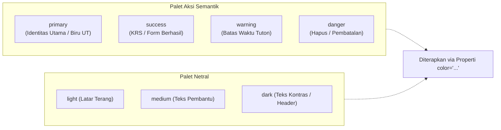
* **Tautan Kode Mandiri:**  
  👉 [🌐 Buka Berkas Interaktif: slide_04_palet_warna_tema_mobile.html](../contoh_kode_program/sesi_04_ionic_dasar_navigasi/slide_04_palet_warna_tema_mobile.html)

---

### 📌 Slide 05: Variasi & Konfigurasi Tombol Mobile: ion-button
* **Sub-CPMK:** Mengonfigurasi properti `expand`, `fill`, `shape`, dan `size` pada `<ion-button>` agar ramah jempol pengguna.
* **Alat yang Digunakan:** Google Chrome, VS Code.
* **Narasi Dosen:**  
  *"Tombol pada layar sentuh smartphone harus mudah dijangkau oleh jempol (thumb-friendly). Di aplikasi mobile, tombol aksi utama lazimnya membentang penuh di bagian bawah layar dengan atribut expand='block', sedangkan aksi pelengkap cukup menggunakan garis tepi fill='outline' atau transparan fill='clear'. Mengetahui hierarki visual tombol akan membuat pengalaman pengguna terasa sangat nyaman!"*
* **Poin Kunci:**
  * `expand="block"`: Melebarkan tombol selebar kontainer dengan margin sisi yang proporsional.
  * `expand="full"`: Membentangkan tombol dari tepi layar ke tepi layar tanpa sela (*edge-to-edge*).
  * `fill="solid"` (default berlatar penuh), `fill="outline"` (bergaris tepi), `fill="clear"` (teks transparan).
  * `shape="round"`: Menghasilkan sudut melengkung kapsul modern.
* **Diagram Variasi Tombol Mobile (Mermaid):**
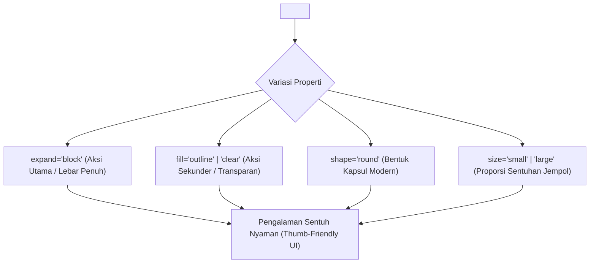
* **Tautan Kode Mandiri:**  
  👉 [🌐 Buka Berkas Interaktif: slide_05_variasi_tombol_ion_button.html](../contoh_kode_program/sesi_04_ionic_dasar_navigasi/slide_05_variasi_tombol_ion_button.html)

---

### 📌 Slide 06: Penyajian Konten Berbasis Kartu: ion-card & Elemen-elemen Bagiannya
* **Sub-CPMK:** Merancang kartu informasi ringkas dengan memadukan `ion-card-header`, `ion-card-title`, `ion-card-subtitle`, dan `ion-card-content`.
* **Alat yang Digunakan:** Google Chrome, Visual Studio Code.
* **Narasi Dosen:**  
  *"Di layar smartphone yang sempit, pengguna tidak suka membaca dinding teks yang padat. Pola desain 'Card UI' membagi informasi ke dalam kotak-kotak terisolasi yang rapi. Di dalam `<ion-card>`, kita menempatkan `<ion-card-subtitle>` sebagai penanda kategori semester, `<ion-card-title>` sebagai judul mata kuliah, dan `<ion-card-content>` sebagai ringkasan modul. Desain ini sangat ideal untuk katalog perpustakaan digital UT!"*
* **Poin Kunci:**
  * `<ion-card>`: Kontainer elevasi dengan sudut membulat dan bayangan halus.
  * `<ion-card-header>`: Pembungkus judul dan subjudul kartu.
  * `<ion-card-content>`: Area penampung deskripsi modul, data nilai, atau tombol aksi terkait.
* **Diagram Anatomi Kartu Informasi (Mermaid):**
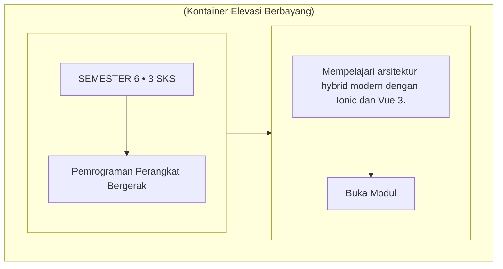
* **Tautan Kode Mandiri:**  
  👉 [🌐 Buka Berkas Interaktif: slide_06_kartu_informasi_ion_card.html](../contoh_kode_program/sesi_04_ionic_dasar_navigasi/slide_06_kartu_informasi_ion_card.html)

---

### 📌 Slide 07: Identitas Visual Mobile: ion-avatar, ion-badge, & ion-chip
* **Sub-CPMK:** Mengimplementasikan avatar profil bundar, lencana notifikasi angka, dan chip tag filter interaktif.
* **Alat yang Digunakan:** Peramban Web Google Chrome, VS Code.
* **Narasi Dosen:**  
  *"Untuk membuat antarmuka terasa hidup dan informatif, kita memerlukan komponen mikro. Gunakan `<ion-avatar>` untuk menampilkan foto mahasiswa yang otomatis terpotong bundar sempurna tanpa CSS rumit, `<ion-badge>` untuk penanda jumlah pesan diskusi Tuton yang belum dibaca, serta `<ion-chip>` sebagai tombol tag interaktif untuk menyaring mata kuliah berdasarkan semester atau program studi!"*
* **Poin Kunci:**
  * `<ion-avatar>`: Komponen pemotong citra bundar otomatis untuk profil pengguna.
  * `<ion-badge>`: Kapsul penanda angka status atau notifikasi aktif.
  * `<ion-chip>`: Tag seleksi interaktif yang dapat memuat teks, ikon pembuka, dan tombol hapus (*dismissible*).
* **Diagram Komponen Mikro Visual (Mermaid):**
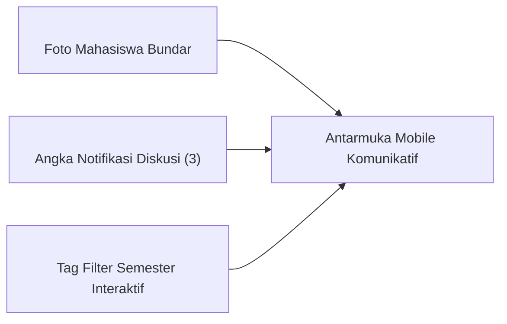
* **Tautan Kode Mandiri:**  
  👉 [🌐 Buka Berkas Interaktif: slide_07_avatar_badge_dan_chip.html](../contoh_kode_program/sesi_04_ionic_dasar_navigasi/slide_07_avatar_badge_dan_chip.html)

---

### 📌 Slide 08: Pengelolaan Informasi Kolektif: ion-list & ion-item
* **Sub-CPMK:** Mengelola tampilan daftar data dengan memanfaatkan Web Component Slots (`slot="start"` dan `slot="end"`).
* **Alat yang Digunakan:** Google Chrome, Visual Studio Code.
* **Narasi Dosen:**  
  *"Sebagian besar aplikasi mobile berbentuk daftar informasi: daftar modul BMP, riwayat nilai ujian, atau daftar tugas Tuton. Komponen `<ion-item>` membagi satu baris menjadi tiga area strategis: slot 'start' di kiri untuk ikon atau thumbnail, area tengah untuk teks bertingkat lewat `<ion-label>`, dan slot 'end' di kanan untuk lencana nilai atau tanda panah detail!"*
* **Poin Kunci:**
  * `<ion-list lines="full | inset | none">`: Pembungkus daftar dengan pilihan garis pemisah.
  * `slot="start"`: Area sisi kiri baris (lazim diisi `<ion-icon>` atau `<ion-avatar>`).
  * `slot="end"`: Area sisi kanan baris (diisi `<ion-badge>`, `<ion-note>`, atau tombol).
  * Atribut `button`: Memberikan efek ripple dan interaksi sentuh alami pada baris daftar.
* **Diagram Arsitektur Pembagian Slot ion-item (Mermaid):**
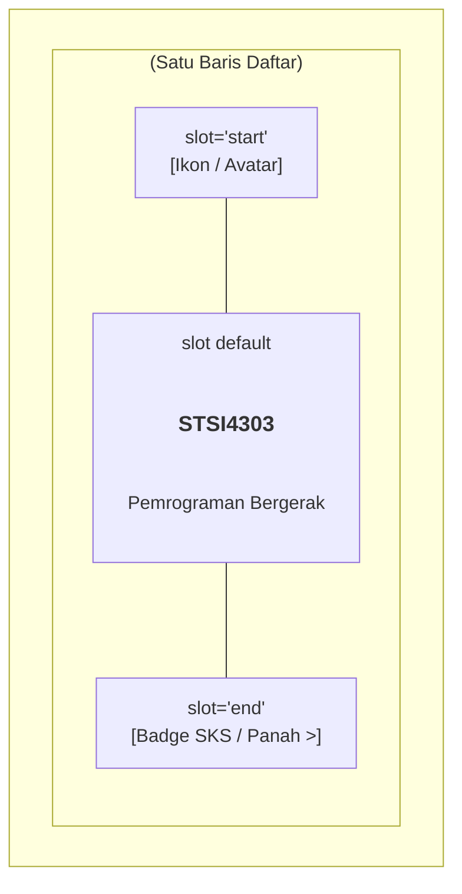
* **Tautan Kode Mandiri:**  
  👉 [🌐 Buka Berkas Interaktif: slide_08_daftar_list_dan_item.html](../contoh_kode_program/sesi_04_ionic_dasar_navigasi/slide_08_daftar_list_dan_item.html)

---

### 📌 Slide 09: Bahasa Visual Antarmuka: Perpustakaan Resmi Ionicons
* **Sub-CPMK:** Mengintegrasikan ikon vektor mobile dengan konfigurasi varian outline, filled, dan sharp.
* **Alat yang Digunakan:** Google Chrome, VS Code.
* **Narasi Dosen:**  
  *"Ikon adalah bahasa visual universal pada aplikasi ponsel pintar. Ionic menyertakan paket resmi Ionicons yang memuat ratusan ikon vektor SVG berkualitas tinggi secara gratis. Cukup ketik `<ion-icon name='book-outline'></ion-icon>`, ikon akan tampil tajam di layar resolusi tinggi (Retina Display) dan warnanya otomatis mengikuti warna teks di sekitarnya tanpa perlu mengolah berkas gambar PNG secara manual!"*
* **Poin Kunci:**
  * Sintaks pemanggilan: `<ion-icon name="book-outline"></ion-icon>` atau menggunakan objek impor di Vue.
  * 3 Varian Desain: Default (solid/tebal), `-outline` (garis tipis modern), dan `-sharp` (sudut tegas).
  * Skalabilitas: Menggunakan teknologi SVG sehingga tidak akan pecah saat diubah ukurannya via atribut `size="small|large"` maupun CSS `font-size`.
* **Diagram Varian & Penerapan Ionicons (Mermaid):**
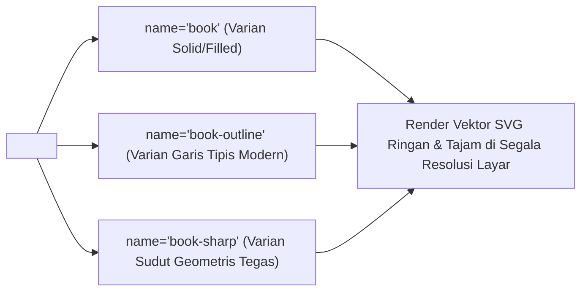
* **Tautan Kode Mandiri:**  
  👉 [🌐 Buka Berkas Interaktif: slide_09_ikonografi_ionicons.html](../contoh_kode_program/sesi_04_ionic_dasar_navigasi/slide_09_ikonografi_ionicons.html)

---

### 📌 Slide 10: Filosofi Stack Navigation: Mental Model LIFO Mobile vs Browser Reload
* **Sub-CPMK:** Menganalisis perbedaan fundamental antara perutean web konvensional (*URL destroy*) dan perutean mobile tumpukan (*Stack Navigation*).
* **Alat yang Digunakan:** Google Chrome DevTools Console, VS Code.
* **Narasi Dosen:**  
  *"Di situs web desktop, ketika pengguna mengklik tautan halaman lain, halaman sebelumnya dihancurkan dan halaman baru dimuat ulang dari nol. Namun di smartphone, perilaku seperti itu membuat aplikasi terasa lambat dan boros kuota! Pada aplikasi mobile, halaman baru ditumpuk di atas halaman lama (Push). Ketika pengguna menekan tombol Kembali (Pop), halaman lama tampil seketika lengkap dengan posisi scroll yang tidak bergeser sama sekali!"*
* **Poin Kunci:**
  * **Prinsip LIFO (Last In, First Out):** Layar yang terakhir masuk (*push*) adalah layar yang aktif di pandangan pengguna.
  * **Stack Caching:** Layar sebelumnya tetap tersimpan di memori (*in-memory DOM preservation*).
  * **Responsivitas Tinggi:** Menghilangkan kedipan putih (*white flicker*) saat berpindah layar.
* **Diagram Urutan Transisi Tumpukan LIFO (Mermaid):**
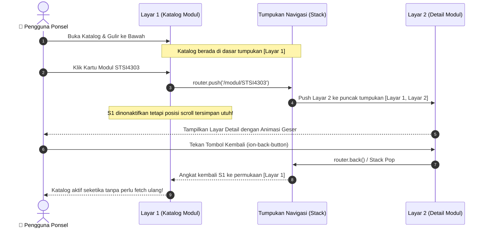
* **Tautan Kode Mandiri:**  
  👉 [🌐 Buka Berkas Interaktif: slide_10_filosofi_stack_navigation.html](../contoh_kode_program/sesi_04_ionic_dasar_navigasi/slide_10_filosofi_stack_navigation.html)

---

### 📌 Slide 11: Konfigurasi Sistem: Integrasi Ionic Vue Router & ion-router-outlet
* **Sub-CPMK:** Mengonfigurasi berkas perutean `@ionic/vue-router` dan menempatkan wadah penampung tumpukan `<ion-router-outlet>`.
* **Alat yang Digunakan:** Visual Studio Code, Google Chrome.
* **Narasi Dosen:**  
  *"Meskipun berbasis Vue, kita tidak menggunakan paket 'vue-router' standar secara langsung, melainkan paket khusus '@ionic/vue-router'. Mengapa? Karena perutean Ionic menyediakan wadah bernama `<ion-router-outlet>`. Jangan menggantinya dengan tag `<router-view>` biasa, karena jika itu terjadi, seluruh animasi geser native dan riwayat tumpukan halaman akan lenyap seketika!"*
* **Poin Kunci:**
  * Inisialisasi router menggunakan fungsi `createRouter` dari `@ionic/vue-router`.
  * Di berkas `App.vue`: Wadah perutean wajib berupa `<ion-router-outlet />` di dalam `<ion-app>`.
  * Mendukung *Lazy Loading* komponen untuk mempercepat waktu buka awal aplikasi (*cold start*).
* **Diagram Konfigurasi Ionic Vue Router (Mermaid):**
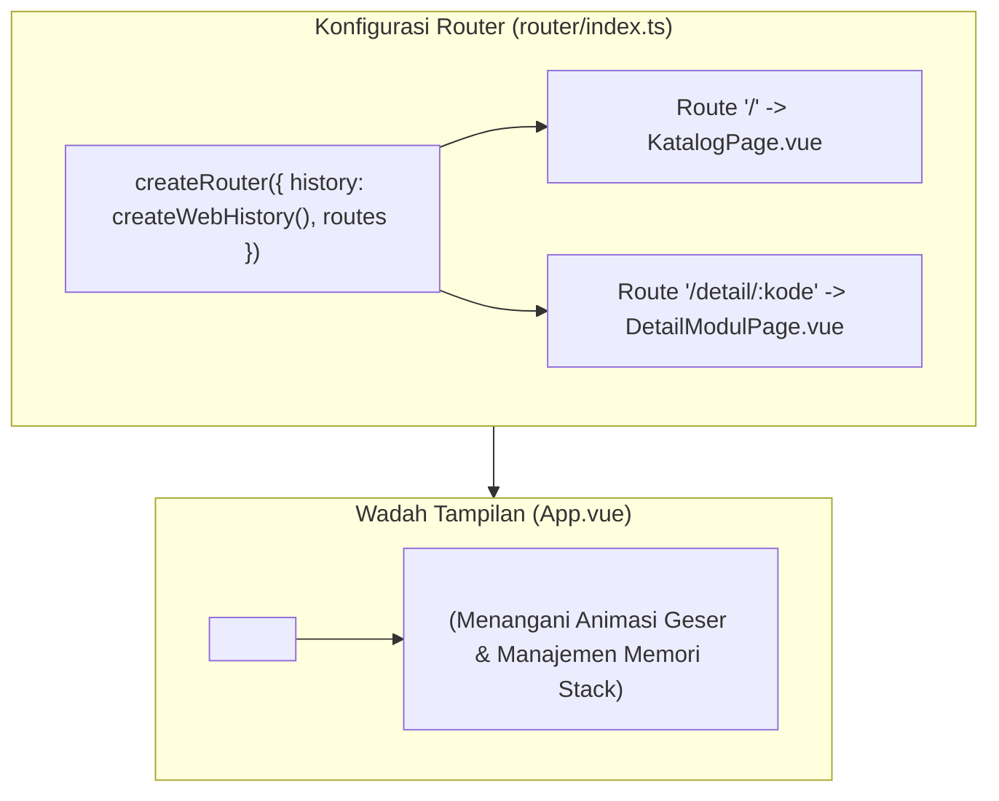
* **Tautan Kode Mandiri:**  
  👉 [🌐 Buka Berkas Interaktif: slide_11_struktur_ionic_vue_router.html](../contoh_kode_program/sesi_04_ionic_dasar_navigasi/slide_11_struktur_ionic_vue_router.html)

---

### 📌 Slide 12: Transisi Antar Layar: useRouter() & Pengiriman Parameter (:kode)
* **Sub-CPMK:** Memprogram perpindahan halaman dengan `router.push()` dan mengekstrak parameter rute dinamis dengan `useRoute()`.
* **Alat yang Digunakan:** Google Chrome, VS Code.
* **Narasi Dosen:**  
  *"Bagaimana cara kita berpindah dari layar katalog menuju layar rincian modul tertentu? Kita menggunakan fungsi `router.push('/modul/' + kode)`. Pada layar tujuan, kita membaca parameter tersebut melalui `route.params.kode`. Dengan teknik ini, satu berkas komponen tampilan detail dapat dipakai ulang secara dinamis untuk menampilkan ratusan judul modul pembelajaran yang berbeda!"*
* **Poin Kunci:**
  * Pengirim: `useRouter().push('/path/' + parameter)`.
  * Penerima: `useRoute().params.namaParameter`.
  * Bungkus pembacaan parameter dengan `computed()` agar komponen bereaksi secara otomatis jika parameter berubah.
* **Diagram Alur Pengiriman & Pembacaan Parameter (Mermaid):**
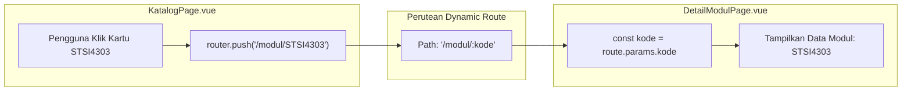
* **Tautan Kode Mandiri:**  
  👉 [🌐 Buka Berkas Interaktif: slide_12_pindah_halaman_dan_parameter.html](../contoh_kode_program/sesi_04_ionic_dasar_navigasi/slide_12_pindah_halaman_dan_parameter.html)

---

### 📌 Slide 13: Navigasi Alami: Komponen ion-back-button & Kewajiban default-href
* **Sub-CPMK:** Mengimplementasikan tombol kembali otomatis `<ion-back-button>` dan mencegah jalan buntu dengan atribut `default-href`.
* **Alat yang Digunakan:** Google Chrome, Visual Studio Code.
* **Narasi Dosen:**  
  *"Di smartphone, tombol panah kembali pada toolbar atas adalah elemen paling vital. Ionic menyediakannya lewat `<ion-back-button>`. Namun ada sebuah jebakan besar: jika pengguna membuka tautan rincian langsung dari chat WhatsApp atau me-refresh browser, tumpukan riwayatnya bernilai kosong! Di sinilah atribut `default-href='/katalog'` menjadi juru selamat agar pengguna tidak terjebak di layar buntu!"*
* **Poin Kunci:**
  * Ditempatkan di dalam `<ion-buttons slot="start">` pada toolbar halaman anak.
  * Tampil secara otomatis hanya apabila terdapat tumpukan halaman sebelumnya.
  * Atribut `default-href` memberikan rute mundur cadangan jika riwayat penjelajahan kosong.
* **Diagram Logika Eksekusi ion-back-button (Mermaid):**
```mermaid
flowchart TD
    Click["Pengguna Menekan <ion-back-button>"] --> Check{"Apakah Ada Tumpukan Halaman Sebelumnya di Stack?"}
    Check -->|Ya (Ada Riwayat)| Pop["Lakukan Stack Pop: Kembali ke Halaman Sebelumnya"]
    Check -->|Tidak (Buka Langsung / Refresh F5)| Fallback["Gunakan Jalur Cadangan: Navigasi ke default-href='/katalog'"]
    Pop --> Ready["Pengguna Tidak Pernah Terjebak di Layar Buntu!"]
    Fallback --> Ready
```
* **Tautan Kode Mandiri:**  
  👉 [🌐 Buka Berkas Interaktif: slide_13_tombol_kembali_back_button.html](../contoh_kode_program/sesi_04_ionic_dasar_navigasi/slide_13_tombol_kembali_back_button.html)

---

### 📌 Slide 14: Siklus Hidup Masuk: ionViewWillEnter vs ionViewDidEnter
* **Sub-CPMK:** Menganalisis perbedaan eksekusi antara `onMounted()` milik Vue dan siklus hidup masuk milik Ionic.
* **Alat yang Digunakan:** Google Chrome DevTools (Console `F12`), VS Code.
* **Narasi Dosen:**  
  *"Banyak mahasiswa bertanya: 'Pak Anton, mengapa saat saya mengubah biodata di formulir lalu kembali ke halaman profil, nama saya tidak berubah? Padahal fungsi ambil data sudah saya pasang di onMounted()!' Jawabannya: karena halaman profil tersimpan di memori tumpukan, onMounted() hanya berjalan satu kali saja saat aplikasi pertama dibuka! Untuk mengambil data terbaru setiap kali layar dikunjungi, Anda wajib menggunakan onIonViewWillEnter!"*
* **Poin Kunci:**
  * `onMounted()`: Hanya dieksekusi 1 kali saat komponen pertama kali dibuat ke DOM.
  * `onIonViewWillEnter()`: Terpanggil SETIAP KALI halaman akan tampil (sebelum animasi transisi dimulai).
  * `onIonViewDidEnter()`: Terpanggil tepat setelah animasi transisi halaman selesai dan elemen siap disentuh.
* **Diagram Garis Waktu Siklus Hidup Masuk (Mermaid):**
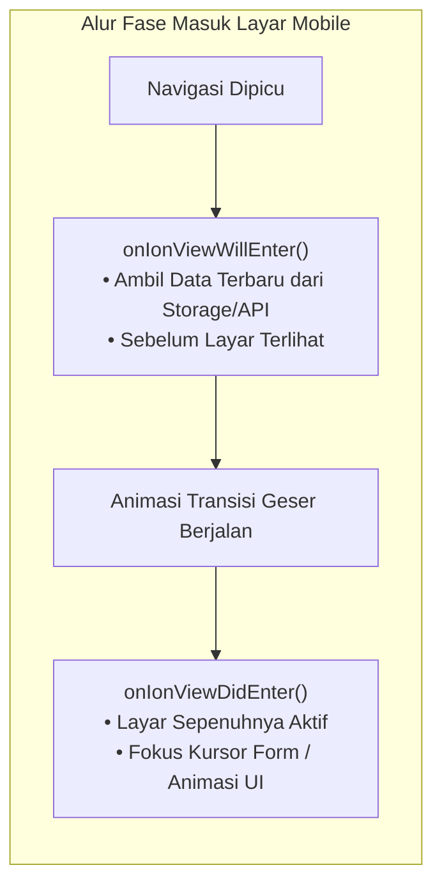
* **Tautan Kode Mandiri:**  
  👉 [🌐 Buka Berkas Interaktif: slide_14_siklus_hidup_masuk_halaman.html](../contoh_kode_program/sesi_04_ionic_dasar_navigasi/slide_14_siklus_hidup_masuk_halaman.html)

---

### 📌 Slide 15: Siklus Hidup Keluar: ionViewWillLeave vs ionViewDidLeave
* **Sub-CPMK:** Mengendalikan penghentian proses latar belakang untuk mencegah kebocoran memori (*memory leak*) pada perangkat smartphone.
* **Alat yang Digunakan:** Google Chrome (DevTools Performance / Console), VS Code.
* **Narasi Dosen:**  
  *"Smartphone memiliki daya baterai dan RAM yang terbatas. Jika Anda menyalakan timer interval ujian online atau pemantauan lokasi GPS di sebuah halaman, proses itu TIDAK AKAN BERHENTI saat pengguna berpindah ke halaman lain karena komponennya tidak di-unmount! Anda wajib mematikan proses tersebut di dalam hook onIonViewWillLeave demi melindungi kesehatan memori dan baterai perangkat mahasiswa!"*
* **Poin Kunci:**
  * `onUnmounted()` milik Vue tidak terpanggil saat halaman hanya tertumpuk di latar belakang.
  * `onIonViewWillLeave()`: Momen terbaik untuk mematikan `setInterval`, koneksi WebSocket, atau audio streaming.
  * `onIonViewDidLeave()`: Terpanggil ketika halaman telah sepenuhnya tersembunyi di bawah tumpukan.
* **Diagram Siklus Hidup Keluar & Pelepasan Memori (Mermaid):**
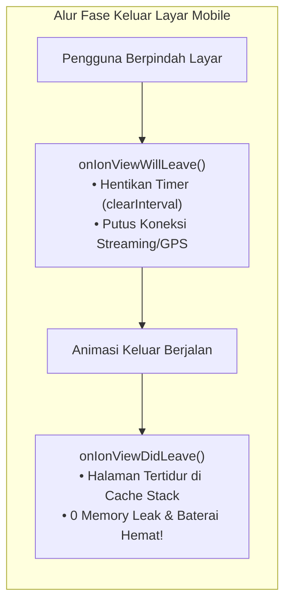
* **Tautan Kode Mandiri:**  
  👉 [🌐 Buka Berkas Interaktif: slide_15_siklus_hidup_keluar_halaman.html](../contoh_kode_program/sesi_04_ionic_dasar_navigasi/slide_15_siklus_hidup_keluar_halaman.html)

---

### 📌 Slide 16: Panduan Pemecahan Masalah (Troubleshooting) Routing & Komponen Ionic
* **Sub-CPMK:** Mendiagnosis dan menyelesaikan 5 galat klasik perutean hybrid, layar putih kosong, dan komponen tanpa stylesheet.
* **Alat yang Digunakan:** Google Chrome DevTools (Console `F12`), Visual Studio Code.
* **Narasi Dosen:**  
  *"Saat pertama kali memprogram dengan Ionic, jangan panik jika layar tiba-tiba kosong atau tombol tampil seperti teks polos tanpa gaya. Berkas panduan ini merangkum 5 masalah paling sering terjadi di laboratorium: lupa membungkus template dengan `<ion-page>`, salah menggunakan tag `<router-view>` standar, kelalaian mengimpor bundel CSS inti, navigasi merusak dengan `window.location`, hingga data tidak berubah karena keliru memilih lifecycle hook!"*
* **Poin Kunci:**
  * **Solusi Layar Putih:** Pastikan hierarki pembungkus adalah `<ion-page>` dan `<ion-content>`.
  * **Solusi Back Button:** Pasang `<ion-router-outlet>` di `App.vue` dan sertakan atribut `default-href`.
  * **Solusi Komponen Polos:** Pastikan paket stylesheet `@ionic/vue/css/core.css` diimpor di `main.ts`.
  * **Solusi Data Caching:** Gunakan `onIonViewWillEnter` alih-alih `onMounted`.
* **Diagram Diagnostik & Solusi Masalah Perutean (Mermaid):**
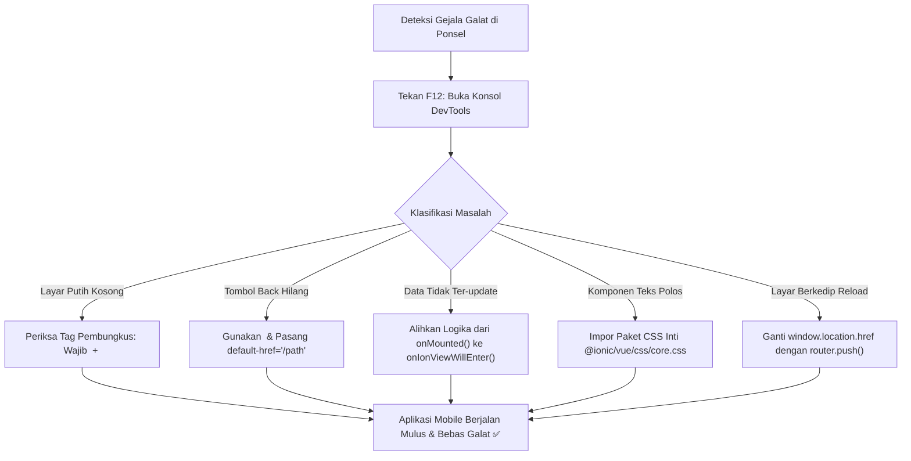
* **Tautan Kode Mandiri:**  
  👉 [🌐 Buka Simulator Interaktif: slide_16_troubleshooting_routing_ionic.html](../contoh_kode_program/sesi_04_ionic_dasar_navigasi/slide_16_troubleshooting_routing_ionic.html)  
  👉 [📄 Baca Panduan Teks Lengkap: slide_16_troubleshooting_routing_ionic.md](../contoh_kode_program/sesi_04_ionic_dasar_navigasi/slide_16_troubleshooting_routing_ionic.md)

---

### 📌 Slide 17: MASTER SOLUSI LAB QUEST 04: Aplikasi Portal Modul BMP UT Multi-Halaman
* **Sub-CPMK:** Mengintegrasikan seluruh komponen antarmuka, perutean tumpukan, dan pemantauan siklus hidup dalam aplikasi terpadu.
* **Alat yang Digunakan:** Google Chrome (Responsive Toolbar `Ctrl + Shift + M`), VS Code.
* **Narasi Dosen:**  
  *"Mari kita satukan seluruh pemahaman hari ini ke dalam Master Solusi Lab Quest 04: Aplikasi Portal Modul BMP Universitas Terbuka! Pada aplikasi ini, kita membangun simulator smartphone lengkap: katalog buku materi pokok dengan filter semester, navigasi dorong (push) ke rincian buku dengan parameter kode, tombol panah kembali alami, sistem bookmark, serta monitor terminal siklus hidup yang mencatat perpindahan hook secara langsung!"*
* **Poin Kunci:**
  * **Arsitektur Multi-Layar:** Menghubungkan layar katalog dengan layar rincian buku modul.
  * **State Reaktif:** Mengelola status bookmark berbintang dan filter semester secara instan.
  * **Pencatatan Lifecycle:** Terminal interaktif membuktikan eksekusi berurutan `ionViewWillLeave` $\rightarrow$ `ionViewDidLeave` $\rightarrow$ `ionViewWillEnter` $\rightarrow$ `ionViewDidEnter`.
* **Diagram Arsitektur Master Solusi Lab Quest 04 (Mermaid):**
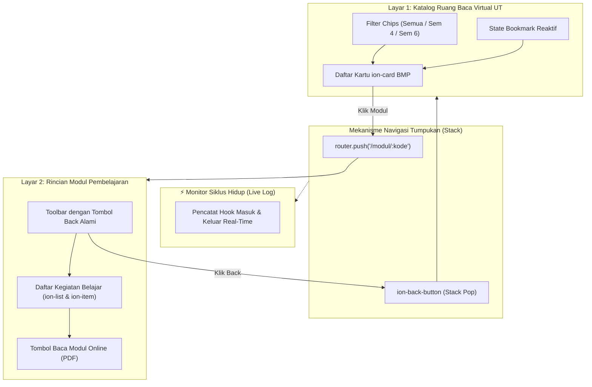
* **Tautan Kode Mandiri:**  
  👉 [🌐 Buka Master Solusi Interaktif: slide_17_lab_quest_04_portal_modul_ut.html](../contoh_kode_program/sesi_04_ionic_dasar_navigasi/slide_17_lab_quest_04_portal_modul_ut.html)

---

### 📌 Slide 18: Jembatan Menuju Sesi 05 & Pengarahan Asesmen TUGAS TUTORIAL 2
* **Sub-CPMK:** Menghubungkan capaian Sesi 04 menuju tata letak grid 12-kolom, validasi formulir masukan dengan regex, dan orientasi Tugas Tutorial 2.
* **Alat yang Digunakan:** Google Chrome, VS Code, Browser Regex Tester.
* **Narasi Dosen:**  
  *"Pencapaian luar biasa rekan-rekan mahasiswa sekalian! Dengan menuntaskan navigasi mobile dan komponen antarmuka dasar hari ini, Anda telah memiliki pondasi seorang Mobile Engineer yang kokoh. Di Sesi 05 mendatang, kita akan mempelajari sistem grid 12-kolom responsif, validasi formulir masukan NIM dan email UT menggunakan Regex, tema gelap dinamis, dan yang paling penting: pembukaan TUGAS TUTORIAL 2 berbobot 20%! Siapkan diri Anda dengan mempraktikkan kode mandiri hari ini!"*
* **Poin Kunci:**
  * **Materi Sesi 05 Mendatang:** Sistem 12-Grid (`ion-grid`, `ion-row`, `ion-col`), Kontrol Formulir (`ion-input`, `ion-select`, `ion-toggle`), dan Validasi Regex.
  * **Asesmen Tugas Tutorial 2:** Studi kasus aplikasi formulir registrasi & kalkulasi akademik berbobot 20% nilai tutorial.
  * **Persiapan Sejak Dini:** Menguasai kembali pembungkus baku `ion-page` dan siklus hidup `ionViewWillEnter`.
* **Diagram Peta Jalan Kompetensi Menuju Sesi 05 & Tugas 2 (Mermaid):**
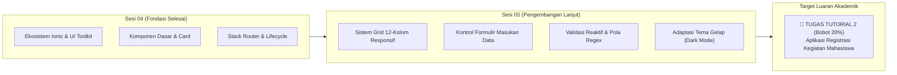
* **Tautan Kode Mandiri:**  
  👉 [🌐 Buka Berkas Interaktif: slide_18_preview_sesi_05_layout_grid_form.html](../contoh_kode_program/sesi_04_ionic_dasar_navigasi/slide_18_preview_sesi_05_layout_grid_form.html)

---

## 📚 Referensi Akademik & Standar Mutu
1. **Buku Materi Pokok (BMP) Universitas Terbuka:**  
   Prafanto, A., dkk. (2024). *Pemrograman Berbasis Perangkat Bergerak (STSI4303 / MSIM4401)*. Modul 4: Dasar-Dasar Ionic Framework dan Navigasi Antarmuka Mobile. Tangerang Selatan: Universitas Terbuka.
2. **Dokumentasi Resmi Framework & Industri:**  
   * Ionic Framework Documentation. (2024). *Ionic Vue Navigation & Routing Architecture*. Diakses dari [ionicframework.com/docs/vue/navigation](https://ionicframework.com/docs/vue/navigation).
   * Ionic Framework Documentation. (2024). *UI Component Library & Adaptive Styling Guide*. Diakses dari [ionicframework.com/docs/components](https://ionicframework.com/docs/components).
   * Vue.js Official Documentation. (2024). *Single Page Component Lifecycle & Virtual DOM*. Diakses dari [vuejs.org](https://vuejs.org).
3. **Standar Desain Antarmuka Mobile:**  
   * Google Material Design 3 Guidelines ([m3.material.io](https://m3.material.io)).
   * Apple Human Interface Guidelines ([developer.apple.com/design](https://developer.apple.com/design)).
