# 📱 NASKAH & SLIDE SESI 05: LAYOUT GRID, FORM VALIDASI REGEX, THEME, & PRAKTIKUM STUDI KASUS MANDIRI
## Mata Kuliah: Pemrograman Berbasis Perangkat Bergerak (STSI4303 / MSIM4401)
### Program Studi: S1 Sistem Informasi & S1 Informatika — Universitas Terbuka
### Dosen Pengampu: Anton Prafanto, S.Kom., M.T.
### Modul Acuan BMP: Modul 5 (MSIM4401/STSI4303 — Layout Grid, Form Validasi, & Theming Mobile)

> ⚡ **Akses Cepat Bahan Sesi 05:**  
> [📥 Unduh Slide PPTX](https://github.com/antonprafanto/tuweb_mobile2025/raw/main/slide_presentasi/SESI_05_Layout_Grid_Form_Regex_Dark_Mode.pptx) • [👁️ Baca Slide Online](https://view.officeapps.live.com/op/view.aspx?src=https%3A%2F%2Fraw.githubusercontent.com%2Fantonprafanto%2Ftuweb_mobile2025%2Fmain%2Fslide_presentasi%2FSESI_05_Layout_Grid_Form_Regex_Dark_Mode.pptx) • [📁 18 Berkas Kode Mandiri](../contoh_kode_program/sesi_05_layout_grid_form/) • [🎯 Studi Kasus KTM Digital](../contoh_kode_program/sesi_05_layout_grid_form/slide_17_solusi_tugas_2_portal_ktm_registrasi.html) • [📋 Checklist Praktikum](../contoh_kode_program/sesi_05_layout_grid_form/slide_16_rubrik_tugas_tutorial_2.html)

> [!NOTE]
> **Pemberitahuan Resmi Penugasan & Penilaian:**  
> Seluruh penugasan resmi (Tugas Tutorial 2), pengumpulan berkas/video, dan evaluasi nilai semester mahasiswa dikelola secara terpusat melalui LMS resmi Universitas Terbuka di [**https://elearning.ut.ac.id/**](https://elearning.ut.ac.id/). Repositori ini difokuskan 100% murni pada penyampaian materi perkuliahan, demonstrasi kode terbuka, dan studi kasus praktikum mandiri.

---

## 🗺️ Gambaran Umum Sesi
Sesi kelima ini merupakan **tonggak pendalaman antarmuka mobile kedua (Milestone 2)** dalam perkuliahan tutorial di Universitas Terbuka. Sesi ini mematangkan kemampuan mahasiswa dalam merancang antarmuka mobile yang adaptif, ramah pengguna, dan berintegritas tinggi. Pembahasan mencakup:
1. **Sistem Tata Letak 12-Kolom Ionic Grid:** Arsitektur berbasis Flexbox (`<ion-grid>`, `<ion-row>`, `<ion-col>`) dengan pembagian titik henti responsif (*breakpoints*) untuk smartphone tegak (*portrait*) maupun tablet mendatar (*landscape*).
2. **Presisi Penjajaran & Offset:** Pemanfaatan `offset` dan kelas utilitas flexbox untuk memusatkan kartu formulir di tengah layar tablet dan desktop.
3. **Kontrol Masukan Formulir Modern:** Eksplorasi mendalam komponen `<ion-input>` (*floating label*, tombol pembersih cepat, dan optimasi papan ketik virtual `inputmode`), `<ion-textarea>` dengan tinggi dinamis (*auto-grow*), `<ion-select>` berantarmuka lembar aksi (*action-sheet*), kontrol biner `<ion-toggle>`, persetujuan `<ion-checkbox>`, pilihan radio eksklusif `<ion-radio-group>`, serta pemilih tanggal `<ion-datetime>` berstandar ISO 8601 terlokalisasi Indonesia (`id-ID`).
4. **Prinsip Validasi Reaktif & Manajemen Status UX:** Mengelola siklus status masukan (*pristine*, *dirty*, *touched*) agar pesan peringatan kesalahan tidak mengintimidasi pengguna sebelum mereka sempat mengetik.
5. **Penegakan Integritas Data dengan Regular Expression (Regex):** Validasi ketat format 9 digit angka Nomor Induk Mahasiswa (NIM) UT (`/^[0-9]{9}$/`) dan domain resmi surel institusi kampus (`/^[a-zA-Z0-9._%+-]+@ecampus\.ut\.ac\.id$/`).
6. **Umpan Balik Dialog Interaktif:** Menghadirkan notifikasi mengambang `<ion-toast>` dengan pewarnaan semantik serta dialog verifikasi dua langkah (*Two-Tier Confirmation*) `<ion-alert>` sebelum data penting disubmit.
7. **Arsitektur Tema Gelap Dinamis (*Dynamic Dark Mode*):** Penyesuaian skema warna global menggunakan variabel CSS (`--ion-background-color`), deteksi preferensi sistem operasi ponsel (`prefers-color-scheme`), sakelar *real-time*, dan persistensi pilihan via `localStorage`.
8. **Bedah Rubrik Penilaian & Master Solusi TUGAS TUTORIAL 2:** Pembahasan transparan 4 pilar rubrik evaluasi resmi skala 0–100 dan penyerahan master solusi **Portal Layanan Mandiri Mahasiswa UT (Penerbitan KTM Digital & Registrasi Sesi)**.
9. **Jembatan Menuju Sesi 06:** Pengantar integrasi lingkungan *native* Android melalui Capacitor Runtime Bridge dan Android Studio.

---

## 🛠️ Panduan Alat & Lingkungan Belajar (Ramah Pemula)
Bagi rekan-rekan mahasiswa yang baru pertama kali merancang formulir antarmuka mobile, Anda **tidak perlu khawatir** dengan instalasi perangkat lunak yang rumit atau komputer berspesifikasi tinggi. Seluruh 18 materi dan berkas kode mandiri pada Sesi 05 telah dirancang dengan prinsip **The Zero-Friction Courseware Framework** yang sangat ringan (ramah RAM 4–8 GB):
1. **Google Chrome / Peramban Web Modern (Tanpa Server Lokal):**  
   Seluruh berkas berekstensi `.html` di dalam folder `contoh_kode_program/sesi_05_layout_grid_form/` dapat langsung Anda jalankan dengan cara **klik ganda (*double click*)** dari File Explorer. Berkas otomatis terbuka di Google Chrome melalui protokol `file:///` tanpa perlu menjalankan Node.js, Vite dev-server, ataupun menginstal pustaka tambahan.
2. **Mode Simulator Smartphone di Chrome DevTools:**  
   Setelah berkas `.html` terbuka di Chrome:
   * Tekan tombol keyboard `F12` (atau klik kanan pada halaman lalu pilih **Inspect / Periksa**).
   * Tekan pintasan keyboard `Ctrl + Shift + M` (pada macOS: `Cmd + Shift + M`) untuk mengaktifkan **Toggle Device Toolbar**.
   * Pilih model perangkat pada bilah atas (misalnya *Pixel 7*, *iPhone 14 Pro*, atau *iPad Air*) untuk menguji responsivitas breakpoint grid 12-kolom dan sentuhan antarmuka secara nyata!
   * Putar orientasi layar dari *Portrait* ke *Landscape* menggunakan ikon rotasi perangkat untuk melihat bagaimana kolom formulir otomatis berdampingan.
3. **Visual Studio Code (VS Code):**  
   Gunakan VS Code untuk membuka dan mempelajari baris kode. Pasang ekstensi yang disarankan:
   * **Vue - Official (Volar):** Memberikan penyorotan sintaks (*syntax highlighting*) yang rapi dan autocompletion untuk tag kustom Ionic.
   * **Live Server (Opsional):** Jika Anda ingin melihat perubahan kode secara instan (*hot-reload*) saat bereksperimen.

---

## 📊 Daftar 18 Slide Pembahasan & Berkas Kode Mandiri

### 📌 Slide 01: Orientasi Sesi 05, Peta Capaian Sub-CPMK 5 & Tagihan TUGAS TUTORIAL 2
* **Sub-CPMK:** Memahami keterkaitan kompetensi antarmuka mobile adaptif dan tagihan resmi penugasan Tugas Tutorial 2 berbobot 20%.
* **Alat yang Digunakan:** Google Chrome / Peramban Modern, Visual Studio Code.
* **Narasi Dosen:**  
  *"Selamat berjumpa kembali rekan-rekan mahasiswa FST Universitas Terbuka di Sesi 05! Hari ini kita memasuki tonggak evaluasi tutorial kedua yang sangat krusial: penugasan resmi TUGAS TUTORIAL 2 berbobot 20% nilai akhir tutorial resmi dibuka! Jika pada sesi sebelumnya kita telah menguasai komponen dasar dan navigasi tumpukan, hari ini kita akan menyempurnakan aplikasi kita menjadi antarmuka tingkat lanjut yang cerdas: tata letak yang otomatis menyesuaikan ukuran layar dari ponsel hingga tablet, formulir masukan yang mampu menolak kesalahan ketik menggunakan Regular Expression, dialog konfirmasi interaktif, serta dukungan tema gelap (*Dark Mode*). Mari kita pelajari seluruh materinya dengan sungguh-sungguh demi meraih nilai maksimal 100!"*
* **Poin Kunci:**
  * **Tonggak Evaluasi Milestone 2:** Tugas Tutorial 2 menyumbang 20% nilai kumulatif Tuton UT dengan masa pengerjaan 2 pekan di LMS `elearning.ut.ac.id`.
  * **Kasus Proyek:** Perancangan Portal Layanan Mandiri Mahasiswa UT untuk penerbitan Kartu Tanda Mahasiswa (KTM) Digital dan registrasi mata kuliah.
  * **Kewajiban Demonstrasi:** Mahasiswa wajib melampirkan tautan video YouTube *Unlisted* (durasi 3–5 menit) yang memperagakan seluruh alur validasi dan peralihan tema.
* **Diagram Alur Orientasi Sesi & Milestone 2 (Mermaid):**
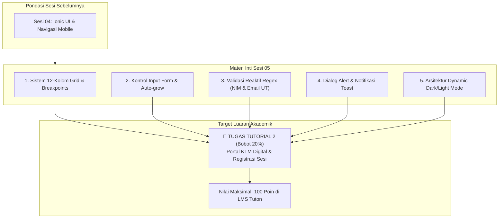
* **Tautan Kode Mandiri:**  
  👉 [🌐 Buka Berkas Interaktif: slide_01_orientasi_sesi_dan_tugas_2.html](../contoh_kode_program/sesi_05_layout_grid_form/slide_01_orientasi_sesi_dan_tugas_2.html)

---

### 📌 Slide 02: Fondasi Tata Letak: Sistem 12-Kolom Ionic Grid
* **Sub-CPMK:** Menyusun hierarki tata letak berbasis Flexbox menggunakan `<ion-grid>`, `<ion-row>`, dan `<ion-col>`.
* **Alat yang Digunakan:** Google Chrome (DevTools Elements Inspector), VS Code.
* **Narasi Dosen:**  
  *"Di dunia perangkat bergerak, mengatur posisi elemen antarmuka menggunakan margin statis berbasis piksel adalah kesalahan fatal, karena ada ribuan tipe ukuran layar smartphone di pasaran. Ionic mengadopsi standar industri Sistem 12-Kolom Grid berbasis Flexbox. Prinsip dasarnya sangat matematis dan logis: satu baris `<ion-row>` selalu bernilai total 12 unit kolom. Jika Anda ingin membagi layar menjadi dua kolom seimbang, berikan atribut `size='6'` pada masing-masing `<ion-col>`. Jika ingin tiga kartu sejajar, gunakan `size='4'`. Sangat konsisten, rapi, dan mudah diprediksi!"*
* **Poin Kunci:**
  * `<ion-grid>`: Kontainer terluar pengatur padding dan pembatas kontainer.
  * `<ion-row>`: Baris horizontal pembungkus kolom yang mengaktifkan flexbox container.
  * `<ion-col size="1..12">`: Sel kolom dengan ukuran proporsional terhadap basis 12 unit.
  * Menghilangkan kebutuhan penulisan CSS `float` atau perhitungan persentase lebar manual yang rawan tumpang-tindih.
* **Diagram Distribusi 12-Kolom Ionic Grid (Mermaid):**
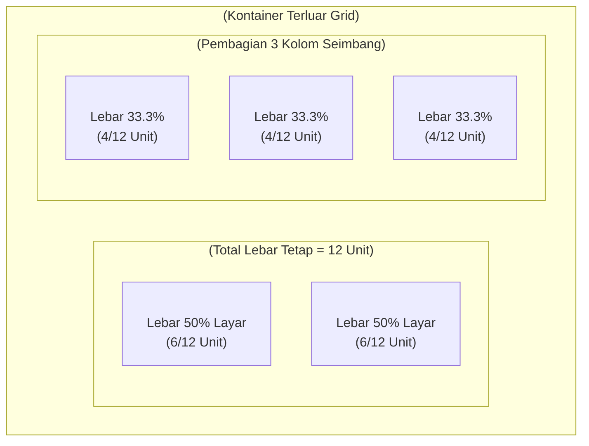
* **Tautan Kode Mandiri:**  
  👉 [🌐 Buka Berkas Interaktif: slide_02_konsep_12_kolom_ion_grid.html](../contoh_kode_program/sesi_05_layout_grid_form/slide_02_konsep_12_kolom_ion_grid.html)

---

### 📌 Slide 03: Tata Letak Responsif: Titik Henti Breakpoints Grid
* **Sub-CPMK:** Menerapkan titik henti responsif (`size`, `size-sm`, `size-md`, `size-lg`) untuk adaptasi ponsel portrait vs tablet landscape.
* **Alat yang Digunakan:** Google Chrome (Toggle Device Toolbar `Ctrl + Shift + M` & Rotate Device), VS Code.
* **Narasi Dosen:**  
  *"Pengguna tidak hanya membuka aplikasi kita di smartphone dengan posisi tegak (*portrait*). Banyak mahasiswa membuka aplikasi di tablet iPad atau memutar ponsel secara mendatar (*landscape*). Dengan atribut responsif `size='12' size-md='6'`, antarmuka kita otomatis menumpuk 1 kolom penuh di layar sempit ponsel, namun otomatis berjajar 2 kolom saat dibuka di tablet atau layar laptop. Kita memperoleh tata letak responsif sekelas aplikasi profesional tanpa perlu menulis satu baris pun media query CSS!"*
* **Poin Kunci:**
  * `size="12"`: Nilai bawaan lebar penuh (100%) untuk smartphone berlayar sempit (< 576px).
  * `size-sm="6"`: Dua kolom sejajar pada perangkat beresolusi sedang (≥ 576px).
  * `size-md="6"` atau `size-md="4"`: Dua atau tiga kolom sejajar pada resolusi tablet (≥ 768px).
  * `size-lg="3"`: Empat kolom sejajar pada layar desktop / laptop besar (≥ 992px).
* **Diagram Transisi Breakpoint Responsif (Mermaid):**
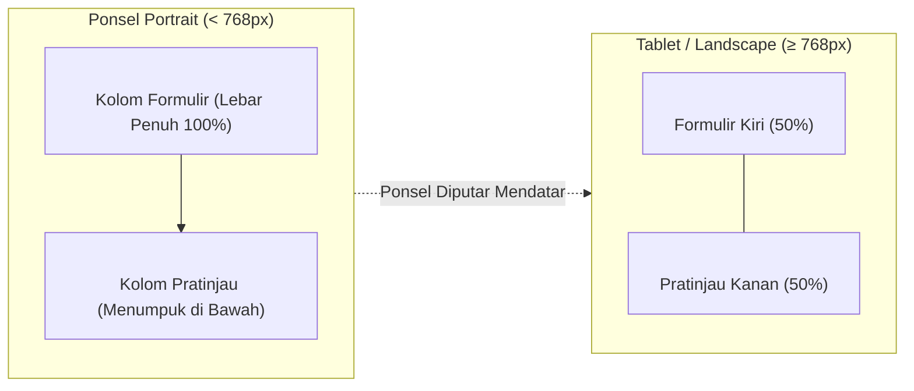
* **Tautan Kode Mandiri:**  
  👉 [🌐 Buka Berkas Interaktif: slide_03_grid_responsif_breakpoints.html](../contoh_kode_program/sesi_05_layout_grid_form/slide_03_grid_responsif_breakpoints.html)

---

### 📌 Slide 04: Presisi Tata Letak: Perataan (Alignment) & Offset Kolom
* **Sub-CPMK:** Mengatur distribusi posisi vertikal/horizontal dan pergeseran kolom menggunakan atribut `offset`.
* **Alat yang Digunakan:** Google Chrome DevTools, VS Code.
* **Narasi Dosen:**  
  *"Bagaimana cara membuat kartu formulir pendaftaran berada persis di tengah-tengah layar tablet tanpa melebar tak terkendali? Kita menggunakan rumus matematis offset: `offset = (12 - size) / 2`. Jika lebar kartu yang kita inginkan adalah 8 unit kolom, maka sisa 4 unit kita bagi dua sama rata, yaitu `offset-md='2'`. Ditambah dengan kelas utilitas `ion-align-items-center` dan `ion-justify-content-center`, kartu antarmuka kita akan melayang di tengah layar secara estetis dan simetris!"*
* **Poin Kunci:**
  * `offset="N"`: Menggeser titik awal kolom ke arah kanan sebanyak N unit kolom.
  * `class="ion-justify-content-center"`: Meratakan sel-sel kolom ke tengah sumbu horizontal (*horizontal centering*).
  * `class="ion-align-items-center"`: Menyamakan titik tengah elemen pada sumbu vertikal (*vertical centering*).
  * Menjaga hierarki visual agar formulir masukan nyaman dipandang pada layar lebar.
* **Diagram Perhitungan Offset & Perataan (Mermaid):**
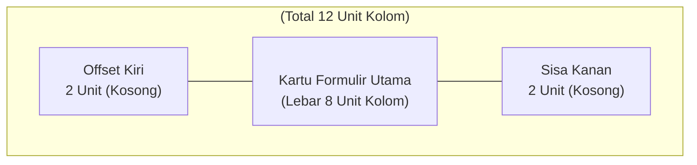
* **Tautan Kode Mandiri:**  
  👉 [🌐 Buka Berkas Interaktif: slide_04_alignment_dan_offset_grid.html](../contoh_kode_program/sesi_05_layout_grid_form/slide_04_alignment_dan_offset_grid.html)

---

### 📌 Slide 05: Kontrol Masukan Modern: Komponen <ion-input> & Inputmode
* **Sub-CPMK:** Mengonfigurasi properti `label-placement`, `clear-input`, dan `inputmode="numeric"` pada kolom masukan mobile.
* **Alat yang Digunakan:** Google Chrome (DevTools Mobile Simulator), VS Code.
* **Narasi Dosen:**  
  *"Pengalaman pengguna saat mengisi data di smartphone sangat dipengaruhi oleh kecerdasan keyboard virtual yang muncul. Saat mahasiswa hendak mengetik NIM, aplikasi yang profesional wajib memerintahkan sistem operasi ponsel untuk langsung menampilkan keyboard papan angka dengan atribut `inputmode='numeric'`. Jangan biarkan mahasiswa kerepotan menekan tombol pengalih simbol secara manual! Kita juga menggunakan `label-placement='floating'` untuk animasi label melayang yang elegan dan `:clear-input='true'` agar pengguna dapat menghapus teks dengan sekali sentuh."*
* **Poin Kunci:**
  * `label-placement="floating"`: Label berada di dalam kotak input dan melayang ke atas dengan animasi halus saat kolom difokuskan.
  * `inputmode="numeric"`: Menampilkan keyboard khusus angka di Android dan iOS tanpa mengubah tipe input menjadi angka bertanda panah kaku.
  * `:clear-input="true"`: Menampilkan ikon silang (*clear button*) di ujung kanan kolom saat teks terisi.
  * `helper-text` & `error-text`: Menyajikan teks petunjuk pembantu dan pesan peringatan status data.
* **Diagram Siklus Status Komponen <ion-input> (Mermaid):**
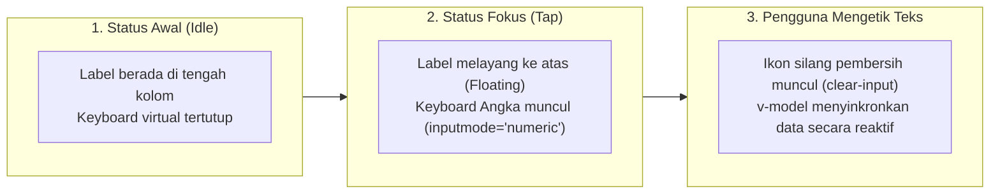
* **Tautan Kode Mandiri:**  
  👉 [🌐 Buka Berkas Interaktif: slide_05_kontrol_input_teks_ion_input.html](../contoh_kode_program/sesi_05_layout_grid_form/slide_05_kontrol_input_teks_ion_input.html)

---

### 📌 Slide 06: Masukan Lanjutan: <ion-select> (Action-Sheet) & <ion-textarea> (Auto-grow)
* **Sub-CPMK:** Merancang dropdown pemilih program studi dengan interface action-sheet dan kolom alamat domisili yang membesar otomatis.
* **Alat yang Digunakan:** Google Chrome, VS Code.
* **Narasi Dosen:**  
  *"Menu drop-down bawaan HTML (`<select>`) terasa sangat kaku dan kuno di layar sentuh ponsel. Ionic menyediakan `<ion-select interface='action-sheet'>` yang memunculkan lembar pilihan anggun dari dasar layar ponsel (*bottom sheet*), area yang sangat ramah dijangkau oleh jempol pengguna (*Thumb Zone*). Sedangkan untuk kolom alamat rumah, kita aktifkan `:auto-grow='true'` pada `<ion-textarea>` sehingga kotak input membesar otomatis ke bawah saat mahasiswa mengetik kalimat panjang tanpa memunculkan bilah gulir vertikal yang mengganggu!"*
* **Poin Kunci:**
  * `interface="action-sheet"`: Mengubah pemilih dropdown menjadi lembar aksi modern dari bawah layar.
  * `:auto-grow="true"`: Ketinggian area teks menyesuaikan otomatis dengan panjang paragraf yang diketik pengguna.
  * `:counter="true"` & `maxlength="200"`: Menampilkan indikator sisa kuota karakter secara real-time di pojok kanan bawah.
* **Diagram Mekanisme Action-Sheet & Auto-Grow (Mermaid):**
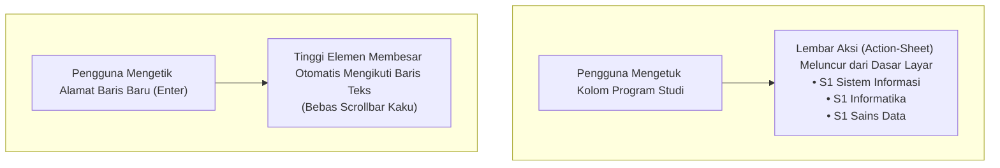
* **Tautan Kode Mandiri:**  
  👉 [🌐 Buka Berkas Interaktif: slide_06_area_teks_dan_pilihan_dropdown.html](../contoh_kode_program/sesi_05_layout_grid_form/slide_06_area_teks_dan_pilihan_dropdown.html)

---

### 📌 Slide 07: Kontrol Pilihan: ion-toggle, ion-checkbox, & ion-radio
* **Sub-CPMK:** Menentukan kontrol pilihan boolean (toggle), seleksi majemuk (checkbox), dan pilihan jalur eksklusif (radio).
* **Alat yang Digunakan:** Google Chrome, VS Code.
* **Narasi Dosen:**  
  *"Kapan kita harus memakai Toggle, Checkbox, atau Radio? Ini adalah pertanyaan fundamental User Experience (UX). Jika mahasiswa mengaktifkan preferensi instan seperti notifikasi WhatsApp atau Dark Mode, gunakan `<ion-toggle>` karena perubahannya langsung berdampak saat digeser. Jika mahasiswa menyetujui pernyataan integritas akademik, gunakan `<ion-checkbox>`. Namun jika memilih salah satu skema registrasi perkuliahan (SIPAS Penuh vs SIPAS Non-TTM), gunakan `<ion-radio-group>` karena pilihannya bersifat saling meniadakan (*mutually exclusive*)!"*
* **Poin Kunci:**
  * `<ion-toggle>`: Sakelar boolean biner (True/False) untuk preferensi yang berefek seketika.
  * `<ion-checkbox>`: Seleksi centang majemuk atau persetujuan klausul hukum & integritas data.
  * `<ion-radio-group>`: Memilih tepat satu opsi dari himpunan opsi yang saling meniadakan.
* **Diagram Pohon Keputusan Pemilihan Kontrol Antarmuka (Mermaid):**
```mermaid
flowchart TD
    Q{"Karakteristik Data Masukan Pengguna?"}
    Q -->|Pilihan Biner On/Off Instan| Tog["<ion-toggle>\nContoh: Aktifkan Notifikasi, Tema Gelap"]
    Q -->|Persetujuan Klausul / Majemuk| Chk["<ion-checkbox>\nContoh: Menyetujui Fakta Integritas UT"]
    Q -->|Satu Opsi Mutlak (Eksklusif)| Rad["<ion-radio-group>\nContoh: Skema SIPAS (Penuh vs Semi vs Non-TTM)"]
```
* **Tautan Kode Mandiri:**  
  👉 [🌐 Buka Berkas Interaktif: slide_07_sakelar_toggle_checkbox_radio.html](../contoh_kode_program/sesi_05_layout_grid_form/slide_07_sakelar_toggle_checkbox_radio.html)

---

### 📌 Slide 08: Pemilih Kalender Modern: Komponen <ion-datetime> (Lokalisasi id-ID)
* **Sub-CPMK:** Mengimplementasikan kalender tanggal lahir mahasiswa dengan lokalisasi Bahasa Indonesia dan pembatas rentang tahun.
* **Alat yang Digunakan:** Google Chrome, VS Code.
* **Narasi Dosen:**  
  *"Mengisi tanggal lahir pada perangkat mobile sering kali memicu kesalahan ketik jika pengguna dipaksa mengetik angka dan tanda strip secara manual. Dengan komponen `<ion-datetime presentation='date' locale='id-ID'>`, kita menyajikan antarmuka kalender visual berstandar Android dan iOS dengan nama hari dan bulan otomatis dalam Bahasa Indonesia. Kita juga dapat mengunci rentang tahun yang logis menggunakan atribut `min` dan `max` agar tidak ada mahasiswa yang mendaftar dengan tahun lahir di masa depan!"*
* **Poin Kunci:**
  * `locale="id-ID"`: Menyajikan lokalisasi nama hari (Senin–Minggu) dan bulan (Januari–Desember) sesuai standar Indonesia.
  * `presentation="date"`: Menampilkan tampilan visual kalender tanggal tanpa pemilih jam dan menit.
  * Format ISO 8601: Nilai data tersimpan dalam format standar internasional `YYYY-MM-DD` yang siap dikirimkan ke server backend.
  * Atribut `min` dan `max`: Menetapkan batas bawah dan batas atas tahun kelahiran yang valid.
* **Diagram Alur Pemrosesan Tanggal Kalender (Mermaid):**
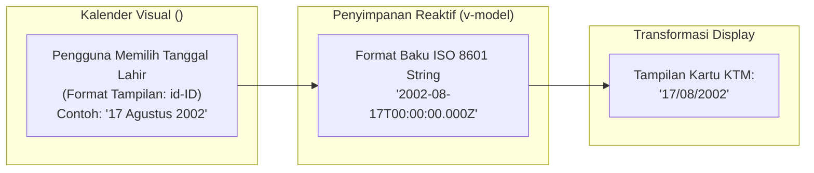
* **Tautan Kode Mandiri:**  
  👉 [🌐 Buka Berkas Interaktif: slide_08_pemilih_tanggal_ion_datetime.html](../contoh_kode_program/sesi_05_layout_grid_form/slide_08_pemilih_tanggal_ion_datetime.html)

---

### 📌 Slide 09: Prinsip Validasi Reaktif: Dirty, Touched, & Umpan Balik Instan
* **Sub-CPMK:** Mengelola siklus status masukan form (*pristine*, *dirty*, *touched*) demi menjaga kenyamanan pengguna (UX).
* **Alat yang Digunakan:** Google Chrome (DevTools Console), VS Code.
* **Narasi Dosen:**  
  *"Dalam prinsip User Experience (UX) mobile, tidak ada hal yang lebih mengesalkan pengguna selain baru saja membuka formulir pendaftaran lalu langsung disambut oleh pesan merah berkedip: 'NIM Anda Masih Kosong!'. Padahal pengguna baru saja melihat layar dan belum sempat menyentuh kolom tersebut! Status formulir harus dikelola secara terhormat: selama kolom masih 'pristine' (perawan), jangan pernah tampilkan pesan galat. Tampilkan peringatan hanya jika kolom sudah 'touched' (pernah diklik lalu ditinggalkan) dan isinya ternyata tidak memenuhi syarat!"*
* **Poin Kunci:**
  * *Pristine:* Status kolom saat formulir baru pertama kali dimuat; pengguna belum menyentuh ataupun mengetik.
  * *Dirty:* Pengguna telah mulai mengetikkan satu atau beberapa karakter ke dalam kolom.
  * *Touched:* Kursor telah memasuki kolom lalu berpindah keluar (*event* `@ion-blur`).
  * *Valid / Invalid:* Hasil evaluasi logika validasi terhadap nilai yang tersimpan di dalam state.
* **Diagram Mesin Status Validasi Kolom Formulir (Mermaid):**
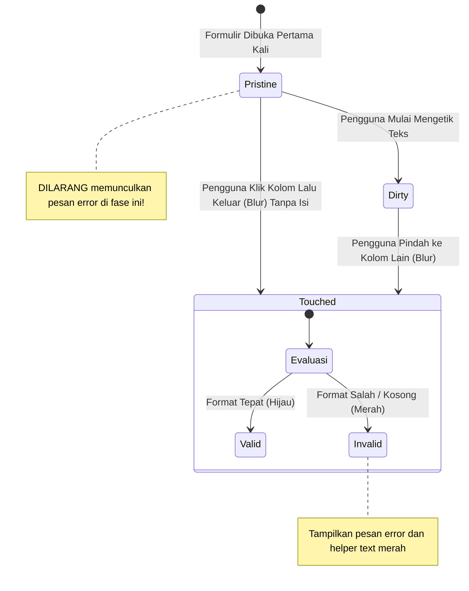
* **Tautan Kode Mandiri:**  
  👉 [🌐 Buka Berkas Interaktif: slide_09_prinsip_validasi_reaktif_form.html](../contoh_kode_program/sesi_05_layout_grid_form/slide_09_prinsip_validasi_reaktif_form.html)

---

### 📌 Slide 10: Validasi Pola Regex: Penegakan Format 9 Digit NIM UT
* **Sub-CPMK:** Menganalisis dan menerapkan Regular Expression `/^[0-9]{9}$/` untuk menjamin integritas data NIM mahasiswa UT.
* **Alat yang Digunakan:** Google Chrome DevTools Console, VS Code.
* **Narasi Dosen:**  
  *"Di Universitas Terbuka, setiap Nomor Induk Mahasiswa (NIM) terdiri dari tepat sembilan digit angka, seperti 043123456. Di JavaScript pemula, mahasiswa sering hanya memeriksa panjang karakter dengan `nim.length === 9`. Namun tahukah Anda bahayanya? Jika pengguna mengetik '043ABCDEF' atau '043-12-34', panjangnya juga 9 karakter, padahal terdapat huruf dan simbol yang merusak database! Oleh karena itu, kita wajib menggunakan Regular Expression `/^[0-9]{9}$/` yang secara mutlak menjamin data hanya terdiri atas angka murni!"*
* **Poin Kunci:**
  * `/^` (Caret): Mematok pencocokan pola harus dimulai dari karakter pertama string.
  * `[0-9]` (Karakter Set Angka): Hanya mengizinkan karakter angka dari 0 sampai 9 (ekuivalen dengan `\d`).
  * `{9}` (Kuantor Mutlak): Menegaskan bahwa karakter angka tersebut wajib berulang tepat sembilan kali, tidak boleh kurang dan tidak boleh lebih.
  * `$/` (Dollar): Mematok akhir pencocokan pola pada karakter terakhir string (mencegah penyusupan karakter asing di belakang).
* **Diagram Anatomi Token Regex NIM UT (Mermaid):**
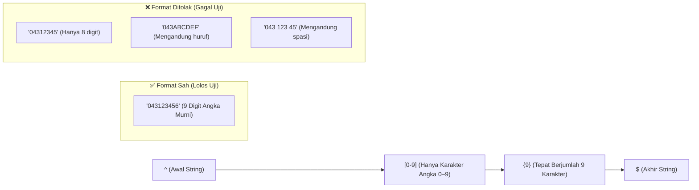
* **Tautan Kode Mandiri:**  
  👉 [🌐 Buka Berkas Interaktif: slide_10_validasi_regex_nim_9_digit.html](../contoh_kode_program/sesi_05_layout_grid_form/slide_10_validasi_regex_nim_9_digit.html)

---

### 📌 Slide 11: Validasi Pola Regex: Domain Resmi Surel Kampus (@ecampus.ut.ac.id)
* **Sub-CPMK:** Merancang pola Regular Expression untuk mengunci domain surel resmi institusi mahasiswa UT.
* **Alat yang Digunakan:** Google Chrome, VS Code.
* **Narasi Dosen:**  
  *"Pada penugasan Tugas Tutorial 2, salah satu syarat ketat adalah memastikan pendaftar menggunakan surel resmi kampus. Kita mengunci domain dengan pola `/^[a-zA-Z0-9._%+-]+@ecampus\.ut\.ac\.id$/`. Perhatikan baik-baik tanda backslash sebelum titik (`\.ut\.ac\.id`). Dalam sintaks Regex, tanda titik tanpa backslash berarti 'sembarang satu karakter'. Tanpa backslash, surel seperti `nama@ecampusXutYacZid` akan dianggap valid! Dengan karakter escape `\.`, kita memastikan bahwa yang dicocokkan adalah tanda titik harfiah!"*
* **Poin Kunci:**
  * Username Bagian Kiri: `^[a-zA-Z0-9._%+-]+` mengizinkan huruf, angka, titik, garis bawah, dan persentase.
  * Simbol Pemisah: `@` memastikan pemisah alamat surel standar.
  * Kunci Domain Resmi: `ecampus\.ut\.ac\.id$` mengunci akhiran domain institusi resmi Universitas Terbuka.
  * Sanitasi Input: Wajib memanggil `.trim().toLowerCase()` sebelum pengujian pola regex dilakukan.
* **Diagram Pembedahan Segmen Regex Surel Kampus (Mermaid):**
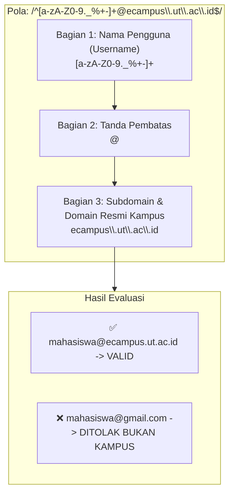
* **Tautan Kode Mandiri:**  
  👉 [🌐 Buka Berkas Interaktif: slide_11_validasi_regex_email_ecampus_ut.html](../contoh_kode_program/sesi_05_layout_grid_form/slide_11_validasi_regex_email_ecampus_ut.html)

---

### 📌 Slide 12: Umpan Balik Halus: Notifikasi Mengambang <ion-toast>
* **Sub-CPMK:** Mengimplementasikan notifikasi popup bawah `<ion-toast>` dengan durasi otomatis dan pewarnaan semantik.
* **Alat yang Digunakan:** Google Chrome, VS Code.
* **Narasi Dosen:**  
  *"Ketika pendaftaran mahasiswa berhasil disimpan atau terjadi kesalahan validasi data, jangan pernah menggunakan fungsi `window.alert()` bawaan browser yang memblokir layar dengan kotak abu-abu kuno! Gunakan komponen `<ion-toast>`. Toast melayang secara anggun di bagian bawah layar smartphone selama 3 detik, memberi tahu mahasiswa dengan warna hijau semantik (*success*) bahwa berkas telah tersimpan, lalu menghilang otomatis tanpa mengganggu alur navigasi aplikasi!"*
* **Poin Kunci:**
  * `:is-open="boolean"`: Properti pemicu tampil reaktif yang dikendalikan oleh variabel state Vue.
  * `:duration="3000"`: Pewaktu otomatis yang menutup notifikasi setelah durasi 3.000 milidetik (3 detik).
  * `position="bottom"`: Posisi ramah sentuhan jempol di bagian bawah layar ponsel.
  * `color="success | danger | warning"`: Pewarnaan semantik status keberhasilan atau kegagalan aksi.
* **Diagram Siklus Notifikasi Mengambang Toast (Mermaid):**
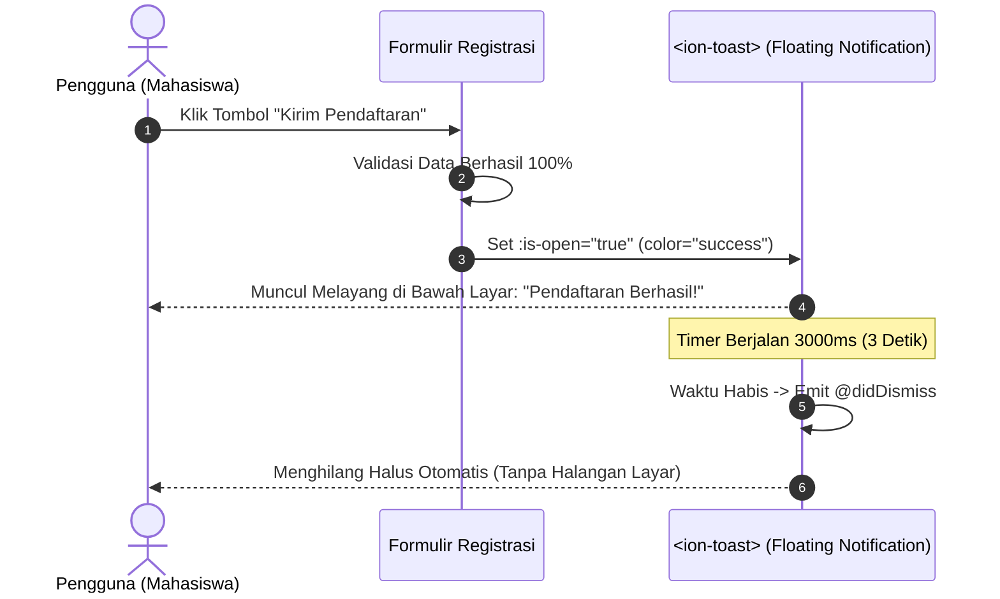
* **Tautan Kode Mandiri:**  
  👉 [🌐 Buka Berkas Interaktif: slide_12_notifikasi_mengambang_ion_toast.html](../contoh_kode_program/sesi_05_layout_grid_form/slide_12_notifikasi_mengambang_ion_toast.html)

---

### 📌 Slide 13: Konfirmasi Krusial: Kotak Dialog Modal <ion-alert>
* **Sub-CPMK:** Merancang dialog verifikasi dua langkah (*Two-Tier Confirmation*) sebelum pengiriman formulir permanen.
* **Alat yang Digunakan:** Google Chrome, VS Code.
* **Narasi Dosen:**  
  *"Menerbitkan Kartu Tanda Mahasiswa Digital adalah proses resmi yang tidak boleh salah. Sebelum data formulir dikirim permanen ke server, aplikasi yang handal menerapkan dialog konfirmasi dua langkah (*Two-Tier Confirmation*) menggunakan `<ion-alert>`. Alert ini memusatkan perhatian mahasiswa dengan menampilkan ringkasan data yang telah diketik: nama lengkap, NIM 9 digit, dan program studi yang dipilih, lalu meminta konfirmasi: 'Apakah data Anda sudah benar?'. Jika mahasiswa klik Batal, form tetap terbuka. Jika klik Ya, barulah submit dieksekusi!"*
* **Poin Kunci:**
  * Dialog modal pemfokus perhatian pengguna (*modal backdrop blocker*) untuk keputusan transaksi krusial.
  * Konfigurasi tombol ganda: `role: 'cancel'` untuk pembatalan aman dan tombol tindakan utama untuk konfirmasi.
  * Menampilkan pesan ringkasan data pendaftaran (*summary message*) sebelum penyimpanan permanen dilakukan.
* **Diagram Alur Konfirmasi Dua Langkah (Two-Tier Confirmation) (Mermaid):**
```mermaid
flowchart TD
    Submit["Pengguna Klik Tombol 'Ajukan Penerbitan KTM'"] --> CheckValid{"Apakah Seluruh Form Valid?"}
    CheckValid -->|Tidak| ShowToast["Munculkan Toast Galat (Merah):\n'Lengkapi data sesuai ketentuan!'"]
    CheckValid -->|Ya| OpenAlert["Buka Dialog Modal <ion-alert>\nMenampilkan Ringkasan: Nama, NIM, & Prodi"]
    OpenAlert --> Decision{"Keputusan Pengguna?"}
    Decision -->|Klik 'Periksa Kembali' (Cancel)| Abort["Tutup Alert, Tetap di Halaman Formulir"]
    Decision -->|Klik 'Konfirmasi & Terbitkan'| Commit["Eksekusi Penyimpanan Data & Terbitkan KTM Digital"]
```
* **Tautan Kode Mandiri:**  
  👉 [🌐 Buka Berkas Interaktif: slide_13_dialog_konfirmasi_ion_alert.html](../contoh_kode_program/sesi_05_layout_grid_form/slide_13_dialog_konfirmasi_ion_alert.html)

---

### 📌 Slide 14: Arsitektur Theming: CSS Variables & prefers-color-scheme
* **Sub-CPMK:** Membedah mekanisme penyesuaian warna global Ionic melalui variabel CSS dan media query sistem operasi.
* **Alat yang Digunakan:** Google Chrome DevTools (Elements Styles & Rendering Emulation), VS Code.
* **Narasi Dosen:**  
  *"Mengapa Ionic Framework begitu populer di kalangan pengembang aplikasi enterprise? Jawabannya terletak pada arsitektur pewarnaannya yang berbasis CSS Custom Properties (Variabel CSS). Seluruh komponen Ionic mengambil warna latar dari `--ion-background-color` dan teks dari `--ion-text-color`. Saat pengguna mengaktifkan mode malam di pengaturan sistem operasi smartphone mereka, peramban secara otomatis membaca media query `@media (prefers-color-scheme: dark)` dan mengalirkan palet warna gelap OLED (#121212) secara global tanpa perlu memuat ulang (*reload*) halaman!"*
* **Poin Kunci:**
  * CSS Custom Properties: Variabel CSS (`--ion-background-color`, `--ion-text-color`, `--ion-card-background`) yang mengontrol tampilan global.
  * `@media (prefers-color-scheme: dark)`: Standar CSS modern pendeteksi preferensi tema bawaan sistem operasi ponsel pengguna.
  * Standar Kontras Dark Mode: Menggunakan latar abu-abu gelap OLED (#121212) dengan teks terang berderajat kontras tinggi demi kenyamanan mata dan efisiensi baterai ponsel.
* **Diagram Alur Arsitektur Pewarnaan CSS Variables (Mermaid):**
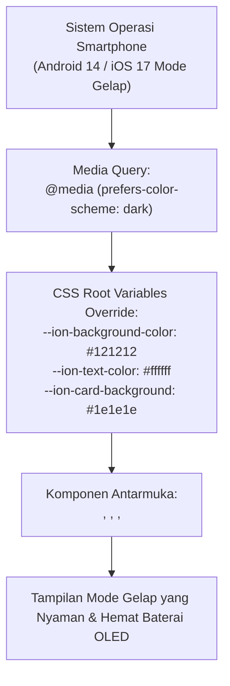
* **Tautan Kode Mandiri:**  
  👉 [🌐 Buka Berkas Interaktif: slide_14_arsitektur_tema_gelap_dark_mode.html](../contoh_kode_program/sesi_05_layout_grid_form/slide_14_arsitektur_tema_gelap_dark_mode.html)

---

### 📌 Slide 15: Peralihan Tema Real-Time: Sakelar Dark & Light Mode
* **Sub-CPMK:** Mengimplementasikan tombol toggle tema yang memanipulasi kelas body dan menyimpan preferensi ke LocalStorage.
* **Alat yang Digunakan:** Google Chrome (DevTools Application -> Local Storage), VS Code.
* **Narasi Dosen:**  
  *"Selain deteksi otomatis dari sistem operasi, pengguna sangat menyukai kebebasan untuk memilih tema secara manual. Di toolbar atas aplikasi, kita menyediakan tombol sakelar `<ion-toggle>`. Saat sakelar digeser, fungsi JavaScript menyuntikkan kelas `.dark` pada dokumen `document.body.classList.toggle('dark', isDark)` dan menyimpan preferensi tersebut ke dalam `localStorage`. Dengan cara ini, ketika mahasiswa menutup peramban lalu membukanya kembali keesokan harinya, tema gelap favoritnya akan langsung pulih secara otomatis!"*
* **Poin Kunci:**
  * Manipulasi Kelas DOM: `document.body.classList.toggle('dark', isDark)` untuk mengaktifkan aturan pewarnaan kelas `.dark`.
  * Penyimpanan Persisten: `localStorage.setItem('user-theme', isDark ? 'dark' : 'light')` agar preferensi tidak hilang saat aplikasi ditutup.
  * Pemulihan Status Saat Startup: Membaca status `localStorage` di dalam hook siklus hidup `onMounted()` aplikasi.
* **Diagram Alur Manipulasi & Persistensi Tema Dinamis (Mermaid):**
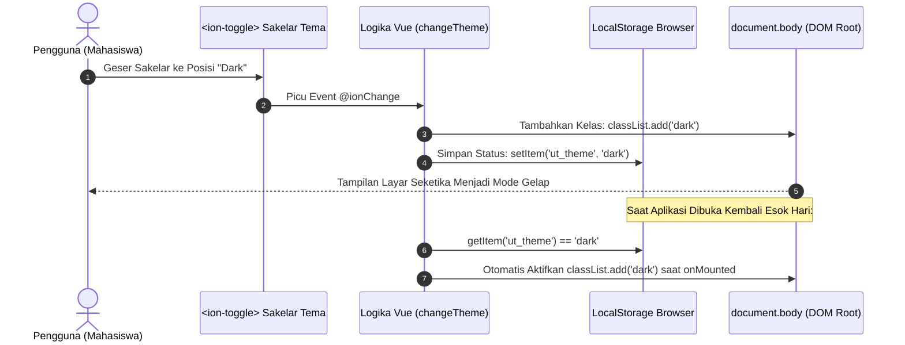
* **Tautan Kode Mandiri:**  
  👉 [🌐 Buka Berkas Interaktif: slide_15_sakelar_tema_dinamis_dark_light.html](../contoh_kode_program/sesi_05_layout_grid_form/slide_15_sakelar_tema_dinamis_dark_light.html)

---

### 📌 Slide 16: Pedoman & Rubrik Penilaian Resmi TUGAS TUTORIAL 2 (Skala 0–100)
* **Sub-CPMK:** Menguraikan 4 kriteria evaluasi resmi, pembagian skor, dan tata cara penyerahan laporan tugas di LMS Tuton.
* **Alat yang Digunakan:** Google Chrome (Buka Kalkulator Rubrik Interaktif), LMS Tuton UT (`elearning.ut.ac.id`).
* **Narasi Dosen:**  
  *"Perhatikan baik-baik slide ini rekan-rekan mahasiswa! Ini adalah rubrik penilaian resmi yang akan saya gunakan sebagai Tutor dalam memeriksa berkas laporan Tugas Tutorial 2 Anda. Penilaian terbagi menjadi 4 pilar objektif: Kerapian komponen antarmuka resmi Ionic (25 poin), Ketepatan validasi Regex NIM 9 digit dan email kampus (35 poin), Interaktivitas umpan balik dialog Toast dan Alert (20 poin), serta Fungsionalitas Dark/Light Mode dan kejelasan video demonstrasi (20 poin). Total skor maksimal adalah 100 poin. Kami telah menyediakan kalkulator interaktif mandiri agar Anda dapat menguji simulasi skor tugas Anda sebelum mengunggahnya ke LMS!"*
* **Poin Kunci:**
  * **Pilar 1 (25 Poin):** Struktur antarmuka rapi menggunakan komponen resmi Ionic UI (`ion-grid`, `ion-card`, `ion-input`, `ion-select`, `ion-button`).
  * **Pilar 2 (35 Poin):** Implementasi validasi form reaktif dan ketepatan pola Regex NIM 9 digit angka serta surel berdomain `@ecampus.ut.ac.id`.
  * **Pilar 3 (20 Poin):** Keberadaan umpan balik interaktif modal dialog konfirmasi `<ion-alert>` dan notifikasi mengambang `<ion-toast>`.
  * **Pilar 4 (20 Poin):** Fungsionalitas sakelar tema dinamis (*Dark/Light Mode*) serta kelengkapan lampiran tautan video YouTube *Unlisted* (3–5 menit).
* **Diagram Komposisi Skor Rubrik Tugas Tutorial 2 (Mermaid):**
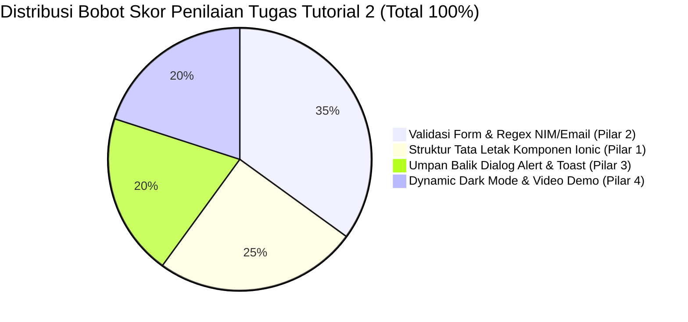
* **Tautan Kode & Rubrik Mandiri:**  
  👉 [🌐 Buka Kalkulator Skor Rubrik Interaktif: slide_16_rubrik_tugas_tutorial_2.html](../contoh_kode_program/sesi_05_layout_grid_form/slide_16_rubrik_tugas_tutorial_2.html)  
  👉 [📄 Baca Panduan Teks & Checklist: slide_16_rubrik_tugas_tutorial_2.md](../contoh_kode_program/sesi_05_layout_grid_form/slide_16_rubrik_tugas_tutorial_2.md)

---

### 📌 Slide 17: MASTER SOLUSI RESMI TUGAS TUTORIAL 2: Portal Layanan Mandiri & KTM Digital
* **Sub-CPMK:** Mengintegrasikan seluruh komponen UI, validasi Regex, dialog konfirmasi, dan theming dalam satu aplikasi utuh.
* **Alat yang Digunakan:** Google Chrome (DevTools Mobile Toolbar `Ctrl + Shift + M`), Visual Studio Code.
* **Narasi Dosen:**  
  *"Inilah Mahakarya kita hari ini: Master Solusi Resmi Tugas Tutorial 2! Aplikasi ini menggabungkan seluruh kompetensi Sesi 05 ke dalam simulator smartphone yang sangat memukau: formulir registrasi lengkap dengan validasi regex real-time, tombol Dark Mode di toolbar, dialog konfirmasi dua langkah `<ion-alert>`, notifikasi mengambang `<ion-toast>`, dan fitur paling menarik: Kartu Tanda Mahasiswa (KTM) Digital yang otomatis menampilkan foto avatar, nama, dan NIM Anda secara reaktif saat Anda mengetik! Pelajari dan jadikan berkas ini sebagai standar rujukan utama dalam menyelesaikan tugas Anda!"*
* **Poin Kunci:**
  * **Arsitektur Terintegrasi:** Menggabungkan Vue 3 Composition API (`ref`, `computed`), Ionic UI Toolkit, dan sistem theming dinamis.
  * **KTM Digital Reaktif:** Kartu mahasiswa virtual dengan avatar otomatis (*DiceBear Bottts*), barcode simulasi, dan status keaktifan akademik.
  * **Inspektur Validasi Real-Time:** Memantau keabsahan setiap kolom input dengan indikator warna visual (hijau jika sah, merah jika format salah).
  * **Zero Friction:** Berjalan langsung di peramban Chrome tanpa instalasi perangkat lunak server yang memberatkan memori RAM.
* **Diagram Arsitektur Master Solusi Tugas Tutorial 2 (Mermaid):**
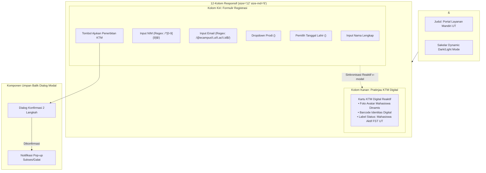
* **Tautan Kode Mandiri:**  
  👉 [🌐 Buka Master Solusi Interaktif: slide_17_solusi_tugas_2_portal_ktm_registrasi.html](../contoh_kode_program/sesi_05_layout_grid_form/slide_17_solusi_tugas_2_portal_ktm_registrasi.html)

---

### 📌 Slide 18: Jembatan Menuju Sesi 06: Capacitor Runtime Bridge & Android Studio
* **Sub-CPMK:** Menghubungkan capaian antarmuka mobile menuju integrasi native SDK Android dan runtime bridge Capacitor.
* **Alat yang Digunakan:** Google Chrome, Terminal / PowerShell, Android Studio (Pratinjau Sesi 06).
* **Narasi Dosen:**  
  *"Selamat dan apresiasi setinggi-tingginya kepada rekan-rekan mahasiswa FST Universitas Terbuka yang telah menuntaskan seluruh materi antarmuka, tata letak grid, validasi regex, dan menyelesaikan Tugas Tutorial 2! Namun selama lima sesi ini, kita masih menguji aplikasi di dalam lingkungan simulator peramban web. Di Sesi 06 mendatang, kita akan melompat ke dunia nyata: kita akan menghubungkan kode web kita ke sistem operasi Android menggunakan Capacitor Runtime Bridge, membuka Android Studio, mengelola izin AndroidManifest, dan menjalankan aplikasi langsung di ponsel fisik Anda menggunakan scrcpy! Siapkan smartphone dan kabel data USB Anda!"*
* **Poin Kunci:**
  * **Topik Sesi 06 Mendatang:** Capacitor Runtime Bridge, integrasi Android Studio, penanganan berkas `AndroidManifest.xml`, dan konfigurasi `build.gradle`.
  * **Solusi Hemat RAM:** Menjalankan aplikasi langsung di smartphone Android fisik melalui USB Debugging dan *mirroring* layar via `scrcpy` (konsumsi RAM laptop < 70 MB dibandingkan emulator yang memakan > 4 GB).
  * **Persiapan Rilis Native:** Mengompilasi kode Vue/Ionic menjadi paket aplikasi Android asli.
* **Diagram Peta Jalan Menuju Sesi 06 & Android Native (Mermaid):**
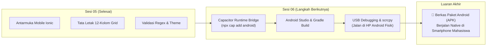
* **Tautan Kode Mandiri:**  
  👉 [🌐 Buka Berkas Interaktif: slide_18_preview_sesi_06_capacitor_android.html](../contoh_kode_program/sesi_05_layout_grid_form/slide_18_preview_sesi_06_capacitor_android.html)

---

## 📚 Referensi Akademik & Standar Mutu
1. **Buku Materi Pokok (BMP) Universitas Terbuka:**  
   Prafanto, A., dkk. (2024). *Pemrograman Berbasis Perangkat Bergerak (STSI4303 / MSIM4401)*. Modul 5: Sistem Tata Letak Grid, Kontrol Formulir Masukan, Validasi Data, dan Penataan Tema Mobile. Tangerang Selatan: Universitas Terbuka.
2. **Dokumentasi Resmi Framework & Ekosistem:**  
   * Ionic Framework Documentation. (2024). *Ionic Grid Layout (ion-grid, ion-row, ion-col)*. Diakses dari [ionicframework.com/docs/api/grid](https://ionicframework.com/docs/api/grid).
   * Ionic Framework Documentation. (2024). *Form Inputs & Floating Labels Architecture*. Diakses dari [ionicframework.com/docs/api/input](https://ionicframework.com/docs/api/input).
   * Ionic Framework Documentation. (2024). *Dark Mode & CSS Custom Properties Theming*. Diakses dari [ionicframework.com/docs/theming/dark-mode](https://ionicframework.com/docs/theming/dark-mode).
   * MDN Web Docs. (2024). *Regular Expressions (RegExp) Guide & Token Specifications*. Mozilla Developer Network. Diakses dari [developer.mozilla.org](https://developer.mozilla.org).
3. **Standar Desain Antarmuka Pengguna & Aksesibilitas:**  
   * Google Material Design 3. (2024). *Form Fields, Layout Responsive Grid, and Ergonomics Guidelines*. Diakses dari [m3.material.io](https://m3.material.io).
   * World Wide Web Consortium (W3C). (2023). *Web Content Accessibility Guidelines (WCAG) 2.1 — Contrast and Form Validation Feedback*.
