# 📱 NASKAH & SLIDE SESI 06: CAPACITOR RUNTIME BRIDGE & ANDROID STUDIO
## Mata Kuliah: Pemrograman Berbasis Perangkat Bergerak (STSI4303 / MSIM4401)
### Program Studi: S1 Sistem Informasi & S1 Informatika — Fakultas Sains dan Teknologi (FST) Universitas Terbuka
### Dosen Pengampu: Anton Prafanto, S.Kom., M.T.
### Modul Acuan BMP: Modul 6 & 7 (MSIM4401/STSI4303)

---

> [!TIP]
> **Akses Cepat Materi & Kode Program Sesi 06:**
> - 🌐 **18 Berkas Contoh Program HTML Siap Jalankan:** [`contoh_kode_program/sesi_06_capacitor_android/`](../contoh_kode_program/sesi_06_capacitor_android/)
> - 📱 **Simulator USB Debugging (Slide 12):** [`slide_12_panduan_usb_debugging_android.html`](../contoh_kode_program/sesi_06_capacitor_android/slide_12_panduan_usb_debugging_android.html) • [📄 Panduan Markdown](../contoh_kode_program/sesi_06_capacitor_android/slide_12_panduan_usb_debugging_android.md)
> - 🚨 **Konsol Troubleshooting (Slide 16):** [`slide_16_troubleshooting_build_android.html`](../contoh_kode_program/sesi_06_capacitor_android/slide_16_troubleshooting_build_android.html) • [📄 Cheatsheet Markdown](../contoh_kode_program/sesi_06_capacitor_android/slide_16_troubleshooting_build_android.md)
> - 🖥️ **Slide Presentasi PowerPoint (PPTX 18 Slide Neo-Brutalisme):** [`SESI_06_Capacitor_Bridge_dan_Android_Studio.pptx`](SESI_06_Capacitor_Bridge_dan_Android_Studio.pptx)

---

## 🛠️ Panduan Alat & Lingkungan Belajar (Ramah Pemula)

Bagi mahasiswa yang baru pertama kali melangkah dari pemrograman web menuju ranah mobile Android native, berikut adalah panduan perangkat kerja yang digunakan dalam Sesi 06:

1. **Google Chrome / Peramban Web Desktop:**
   * **Fungsi:** Menjalankan seluruh berkas contoh program `.html` secara instan tanpa perlu menyalakan server lokal (*zero friction* via protokol `file:///`).
   * **Cara Penggunaan:** Cukup klik ganda (*double-click*) berkas `.html` yang ingin Anda pelajari, atau seret berkas tersebut ke jendela Chrome.
2. **Google Chrome DevTools (`F12` / `Ctrl + Shift + I`):**
   * **Fungsi:** Menginspeksi konsol JavaScript, meninjau struktur elemen antarmuka, dan mengamati simulasi paket data JSON-RPC yang melintasi jembatan Capacitor Bridge.
3. **Visual Studio Code (VS Code):**
   * **Fungsi:** Editor teks utama untuk menyunting kode proyek web Vue 3, berkas konfigurasi `capacitor.config.ts`, serta menjalankan perintah terminal melalui *Integrated Terminal* (`Ctrl + ` `).
4. **Android Studio (Ladybug / Hedgehog / Iguana):**
   * **Fungsi:** Lingkungan pengembangan terpadu (IDE) resmi buatan Google untuk membuka folder native `android/`, mengelola Android SDK, menyinkronkan Gradle, dan mengompilasi berkas biner APK.
5. **Kabel Data USB & Smartphone Fisik Android (Penyelamat RAM 4–8GB):**
   * **Fungsi:** Media utama pengujian aplikasi secara nyata. Menghubungkan ponsel fisik pribadi via **USB Debugging** hanya memakan memori laptop sekitar **50 MB** (daemon ADB), jauh lebih hemat dibanding menjalankan Emulator Android Virtual Device (AVD) yang memakan RAM **4.000 MB (4GB)** dan kerap membuat laptop mahasiswa mengalami *freeze* atau *hang*.
6. **scrcpy (Screen Copy - Genymobile):**
   * **Fungsi:** Alat sumber terbuka (*open-source*) ultra-ringan (< 70 MB RAM) untuk memproyeksikan layar ponsel fisik Anda ke monitor laptop secara jernih, berlatensi sangat rendah, serta dapat dikontrol langsung menggunakan mouse dan keyboard komputer.

---

## 🗺️ Gambaran Umum Sesi

Sesi keenam ini merupakan **fase transformasi krusial** dalam mata kuliah Pemrograman Berbasis Perangkat Bergerak. Setelah lima sesi pertama kita berkutat di lingkungan peramban web desktop, pada Sesi 06 ini kita melangkah menyeberangi jembatan menuju ekosistem perangkat native Android yang sesungguhnya. Pembahasan berfokus pada arsitektur runtime lintas platform Capacitor, mekanisme pertukaran pesan dua arah (*bi-directional message passing*) antara JavaScript WebView dan native Java/Kotlin, konfigurasi berkas sentral `capacitor.config.ts`, alur 4 perintah kunci Capacitor CLI (`npm run build`, `npx cap add android`, `npx cap sync`, `npx cap open android`), bedah struktur folder native `android/`, konfigurasi build tool Gradle (`variables.gradle` dan `build.gradle`), tata kelola izin sistem pada `AndroidManifest.xml`, serta penanganan dinamis izin waktu-jalan (*Runtime Permissions*) di TypeScript.

Mempertimbangkan kondisi riil mahasiswa Universitas Terbuka yang sebagian besar memiliki laptop dengan kapasitas RAM 4–8GB, sesi ini memberikan penekanan khusus pada **strategi pengujian ramah memori (RAM-efficient)** dengan mengalihkan pengujian dari emulator AVD ke **smartphone fisik Android pribadi via USB Debugging**. Sesi ini juga membekali mahasiswa dengan penguasaan alat mirroring layar `scrcpy`, teknik remote debugging via `chrome://inspect`, prinsip keamanan aplikasi hybrid dari ancaman Cross-Site Scripting (XSS), panduan penanganan error kompilasi klasik (*troubleshooting cheatsheet*), serta master solusi **Lab Quest 06: Capacitor Bridge & Android Platform Inspector Dashboard**.

---

## 📊 Daftar 18 Slide Pembahasan & Berkas Kode Mandiri

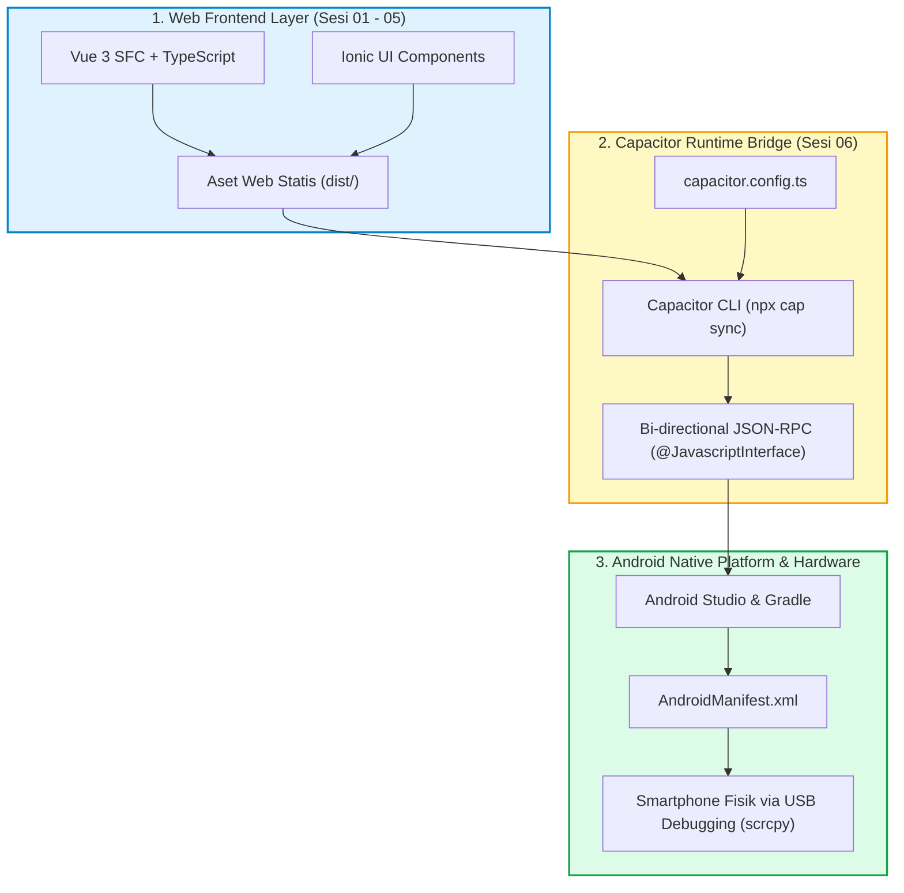

---

### 📌 Slide 01: Orientasi Sesi 06: Capacitor Runtime Bridge & Platform Android
* **Sub-CPMK:** Memahami arsitektur transformasi aplikasi hybrid dari peramban web desktop menuju aplikasi native Android sejati.
* **Alat yang Digunakan:** Google Chrome (klik ganda berkas HTML untuk membuka modul interaktif), Chrome DevTools (`F12`), Visual Studio Code.
* **Narasi Dosen:**  
  *"Selamat datang rekan-rekan mahasiswa Fakultas Sains dan Teknologi Universitas Terbuka di Sesi 06! Dari Sesi 01 hingga Sesi 05, kita telah berhasil merancang antarmuka mobile modern menggunakan Vue 3, TypeScript, dan Ionic di dalam peramban web. Namun, tujuan akhir mata kuliah kita adalah menghasilkan aplikasi yang terinstal nyata di smartphone Android pengguna. Hari ini kita menyeberangi jembatan tersebut dengan teknologi Capacitor Runtime Bridge! Kita akan membedah bagaimana kode web kita dihubungkan langsung dengan SDK Android asli tanpa mengorbankan performa laptop Anda. Mari kita mulai transformasi ini bersama-sama!"*
* **Poin Kunci:**
  * Transformasi dari lingkungan terisolasi (*sandbox*) peramban web desktop menuju lingkungan perangkat native Android.
  * Tiga Lapisan Arsitektur: *Web Layer* (Vue SFC + Ionic), *Bridge Layer* (Capacitor Runtime RPC), dan *Native Layer* (Android OS SDK & Hardware).
  * Empat Target Pembelajaran Sesi 06: Arsitektur Bridge, Struktur Folder Android, Manifest & Permissions, serta Pengujian Ponsel Fisik via USB.
* **Diagram Konsep:**
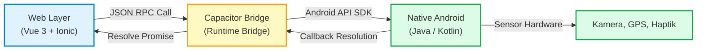
* **Tautan Kode Mandiri:**  
  👉 [`slide_01_orientasi_sesi_06_bridge.html`](../contoh_kode_program/sesi_06_capacitor_android/slide_01_orientasi_sesi_06_bridge.html)

---

### 📌 Slide 02: Evolusi Runtime: Apache Cordova vs Capacitor
* **Sub-CPMK:** Membedakan secara kritis paradigma 'Black Box' Apache Cordova dengan paradigma modern 'Source-First' Capacitor.
* **Alat yang Digunakan:** Google Chrome (menjalankan komparator interaktif), Text Editor, Git Version Control.
* **Narasi Dosen:**  
  *"Banyak modul atau buku literatur lama masih mengulas Apache Cordova. Namun di dunia industri teknologi saat ini, pengembang telah beralih sepenuhnya ke Capacitor. Mengapa demikian? Cordova memperlakukan proyek native sebagai kotak hitam sekali pakai yang di-generate ulang setiap kali build. Akibatnya, mahasiswa dilarang menyentuh kode Java karena kodenya akan tertimpa! Sebaliknya, Capacitor menganut filosofi 'Source-First': folder android/ adalah kode sumber asli milik Anda seutuhnya yang di-commit ke repositori Git dan dapat disunting langsung di Android Studio. Anda bebas memasang library Java perbankan atau SDK khusus tanpa takut kodenya hilang terhapus. Konsep ini merupakan materi kunci dalam menjawab Diskusi 6 Tuton kita!"*
* **Poin Kunci:**
  * Apache Cordova (*Legacy*): Folder `platforms/` diabaikan oleh Git, bergantung pada berkas konfigurasi XML raksasa yang rentan bentrok (*conflict*).
  * Capacitor (*Modern Standard*): Folder `android/` berstatus kode sumber utama yang dikelola Git, konfigurasi bersih berbasis TypeScript dengan *type safety*.
  * Bebas instalasi paket global: Cukup dijalankan menggunakan npx lokal (`npx cap`).
* **Diagram Konsep:**
```mermaid
flowchart TD
  subgraph CordovaOld ["Pendekatan Legacy: Apache Cordova (Black Box)"]
    CWeb["Web Assets"] --> CBuild["Cordova CLI Generator"]
    CBuild -->|Menimpa Berkas| CPlat["platforms/android (Artefak Sementara)"]
    CPlat -.->|Dilarang Disunting Manual| CGit["Di-ignore dari Git"]
  end

  subgraph CapModern ["Standar Industri: Capacitor (Source-First)"]
    CapWeb["dist/ Folder (Vue Bundel)"] --> CapSync["npx cap sync"]
    CapSync -->|Menyalin Aset Publik| CapNative["android/ (Kode Sumber Utama)"]
    CapNative -->|Bebas Disunting di Android Studio| CapGit["Di-commit ke Repositori Git"]
  end

  style CordovaOld fill:#fee2e2,stroke:#dc2626,stroke-width:2px
  style CapModern fill:#dcfce7,stroke:#16a34a,stroke-width:2px
```
* **Tautan Kode Mandiri:**  
  👉 [`slide_02_komparasi_capacitor_vs_cordova.html`](../contoh_kode_program/sesi_06_capacitor_android/slide_02_komparasi_capacitor_vs_cordova.html)

---

### 📌 Slide 03: Cara Kerja Runtime Bridge: Pesan Dua Arah (Web &harr; Native)
* **Sub-CPMK:** Menganalisis alur komunikasi data asinkron dua arah (JSON-RPC) antara WebView dan Android OS.
* **Alat yang Digunakan:** Google Chrome (simulasi paket RPC real-time), Chrome DevTools Console (`F12`).
* **Narasi Dosen:**  
  *"Pernahkah Anda bertanya-tanya, bagaimana sebuah tombol di komponen Vue bisa memicu getaran fisik di ponsel Anda? Peramban Chromium WebView diisolasi dalam kotak pasir (sandbox) yang sangat ketat tanpa izin hardware. Ketika kode Anda memanggil `await Haptics.vibrate()`, Capacitor mengemas instruksi tersebut menjadi paket serial JSON-RPC. Paket ini dikirimkan melintasi antarmuka `@JavascriptInterface` Android. Thread pool latar belakang Java mengeksekusi layanan `Vibrator` native, dan hasilnya dikirim balik ke WebView via `evaluateJavascript()` untuk menuntaskan Promise di Vue. Semua berlangsung secara asinkron sehingga animasi layar Anda tetap mulus 60 FPS!"*
* **Poin Kunci:**
  * Isolasi Sandbox WebView Chromium vs Akses Hardware Sistem Operasi Android.
  * 4 Tahapan Pipeline Pesan: Pemanggilan JS, Serialisasi JSON, Eksekusi Thread Java Native, dan Resolusi Callback.
  * Arsitektur Asinkron Non-Blocking: Menjaga antarmuka pengguna tidak pernah mengalami *freeze* atau *jank*.
* **Diagram Konsep:**
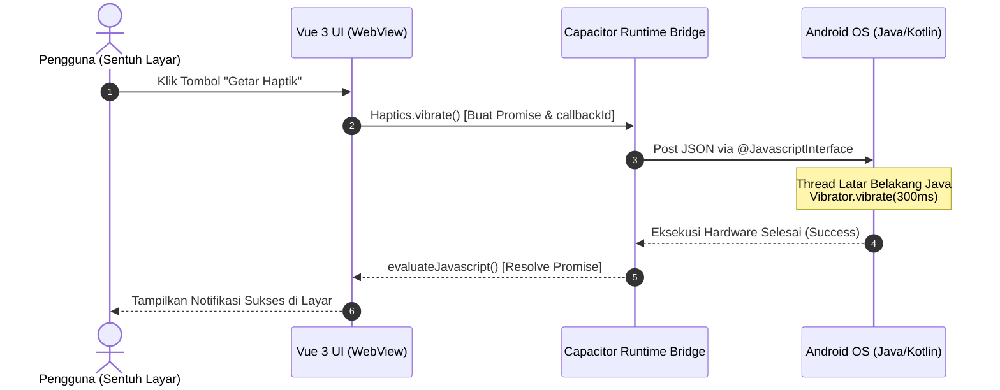
* **Tautan Kode Mandiri:**  
  👉 [`slide_03_cara_kerja_runtime_bridge.html`](../contoh_kode_program/sesi_06_capacitor_android/slide_03_cara_kerja_runtime_bridge.html)

---

### 📌 Slide 04: Konfigurasi Utama: `capacitor.config.ts`
* **Sub-CPMK:** Menyusun dan memvalidasi berkas konfigurasi sentral Capacitor dengan format Reverse-Domain appId.
* **Alat yang Digunakan:** Visual Studio Code (membuka berkas `capacitor.config.ts`), Google Chrome (generator & validator interaktif).
* **Narasi Dosen:**  
  *"Setiap aplikasi Android di seluruh dunia wajib memiliki nomor identitas unik yang tidak boleh sama dengan aplikasi lain. Di ekosistem Capacitor, identitas ini didefinisikan di berkas sentral `capacitor.config.ts`. Properti `appId` harus menggunakan format Reverse-Domain, seperti `id.ac.ut.mobileportal`. Jangan pernah menggunakan huruf besar, spasi, atau simbol khusus pada `appId`, karena Google Play Store dan sistem Android akan menolaknya! Berkas ini juga menentukan folder sumber aset web kita, yaitu folder `dist/` hasil kompilasi Vite."*
* **Poin Kunci:**
  * Tiga Properti Wajib: `appId` (identitas paket unik), `appName` (judul aplikasi di ponsel), dan `webDir` (folder aset build).
  * Validasi Sintaks `appId`: Huruf kecil semua, diawali abjad, dipisahkan titik minimal 2 segmen (contoh: `id.ac.ut.namaapp`).
  * Opsi Live Reload: Mengarahkan `server.url` ke IP komputer lokal untuk pengujian instan tanpa perlu build ulang terus-menerus.
* **Diagram Konsep:**
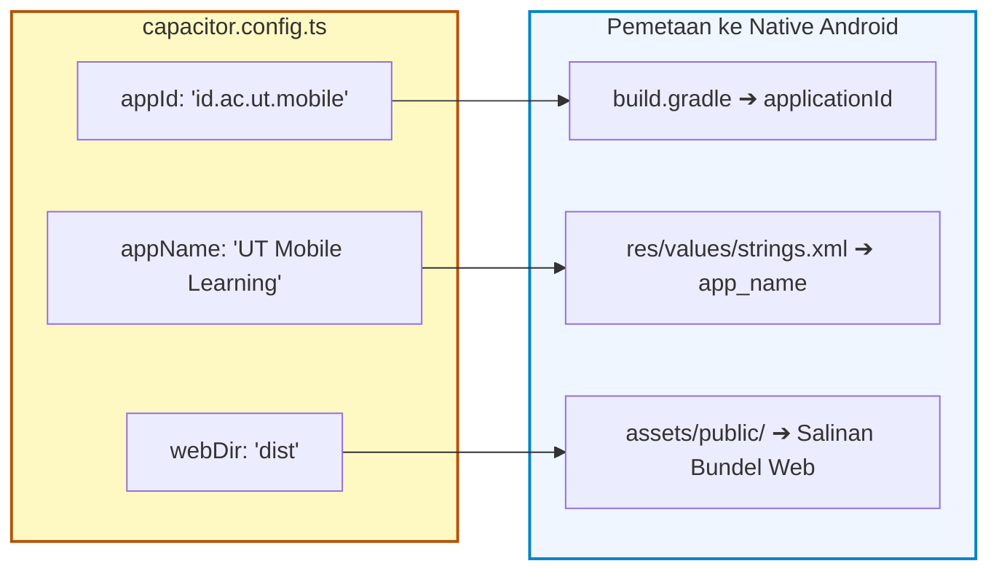
* **Tautan Kode Mandiri:**  
  👉 [`slide_04_konfigurasi_capacitor_config.html`](../contoh_kode_program/sesi_06_capacitor_android/slide_04_konfigurasi_capacitor_config.html)

---

### 📌 Slide 05: Alur 4 Perintah Kunci Capacitor CLI
* **Sub-CPMK:** Mengeksekusi workflow kompilasi dan sinkronisasi proyek web ke native secara teratur dan berurutan.
* **Alat yang Digunakan:** Terminal / PowerShell di VS Code (`Ctrl + ` `), Node.js runtime (`npm` / `npx`), Android Studio.
* **Narasi Dosen:**  
  *"Bagi pemula, menghafal perintah tanpa memahami alur urutannya akan menimbulkan kebingungan. Ada 4 tahapan kunci: Langkah 1, jalankan `npm run build` untuk mengompilasi kode Vue menjadi aset web statis di folder `dist/`. Langkah 2, jalankan `npx cap add android` hanya sekali saja saat inisialisasi awal proyek. Langkah 3, jalankan `npx cap sync` setiap kali Anda selesai memperbarui kode Vue atau memasang plugin baru. Langkah 4, jalankan `npx cap open android` untuk meluncurkan Android Studio. Ingat, jangan pernah menjalankan `npx cap sync` sebelum `npm run build`, itu kesalahan klasik yang membuat perubahan kode Anda tidak muncul di ponsel!"*
* **Poin Kunci:**
  * 1. `npm run build`: Menghasilkan bundel teroptimasi di folder `dist/`.
  * 2. `npx cap add android`: Membuat direktori native `android/` beserta wrapper Gradle (cukup 1x di awal).
  * 3. `npx cap sync`: Menyalin aset dari `dist/` ke native assets dan menyelaraskan plugin Capacitor.
  * 4. `npx cap open android`: Membuka direktori native di dalam Android Studio secara otomatis.
* **Diagram Konsep:**
```mermaid
flowchart LR
  S1["1. npm run build<br>(Vite Compile SFC)"] -->|Folder dist/ terbentuk| S2["2. npx cap add android<br>(Scaffold folder android/)"]
  S2 -->|Inisialisasi 1x di awal| S3["3. npx cap sync<br>(Copy aset & plugin)"]
  S3 -->|Aset tersinkronisasi| S4["4. npx cap open android<br>(Buka di Android Studio)"]
  S4 -->|Kompilasi APK| S5["Run di Smartphone Fisik ▶"]

  style S1 fill:#eff6ff,stroke:#0284c7,stroke-width:2px
  style S2 fill:#fef9c3,stroke:#b45309,stroke-width:2px
  style S3 fill:#dcfce7,stroke:#16a34a,stroke-width:2px
  style S4 fill:#faf5ff,stroke:#9333ea,stroke-width:2px
  style S5 fill:#ffe600,stroke:#000000,stroke-width:2px
```
* **Tautan Kode Mandiri:**  
  👉 [`slide_05_alur_perintah_cli_capacitor.html`](../contoh_kode_program/sesi_06_capacitor_android/slide_05_alur_perintah_cli_capacitor.html)

---

### 📌 Slide 06: Anatomi Struktur Folder `android/`
* **Sub-CPMK:** Menjelajahi struktur pohon folder native Android hasil kompilasi Capacitor.
* **Alat yang Digunakan:** VS Code File Explorer, Android Studio (Project Tool Window), Google Chrome.
* **Narasi Dosen:**  
  *"Saat pertama kali membuka folder `android/`, jangan panik melihat banyaknya subdirektori! Mari kita bedah bersama: Folder `app/src/main/assets/public/` adalah tempat seluruh bundel HTML, JS, dan CSS kita bermukim di dalam HP. Berkas `MainActivity.java` adalah gerbang pembuka Activity yang otomatis mewarisi BridgeActivity. Folder `res/` adalah rumah bagi ikon aplikasi dan tata warna XML. Sedangkan berkas `AndroidManifest.xml` adalah cetak biru identitas resmi aplikasi kepada sistem operasi Android. Pahami peta ini, maka Anda akan percaya diri mengelola proyek native!"*
* **Poin Kunci:**
  * `android/build.gradle` (Level Proyek) vs `android/app/build.gradle` (Level Modul Aplikasi).
  * `variables.gradle`: Berkas sentral untuk mengelola versi SDK Android dan pustaka eksternal.
  * `MainActivity.java`: Meng-extend `com.getcapacitor.BridgeActivity`.
  * `res/mipmap` & `res/drawable`: Direktori resource ikon aplikasi dengan resolusi adaptif (*mdpi* hingga *xxxhdpi*).
* **Diagram Konsep:**
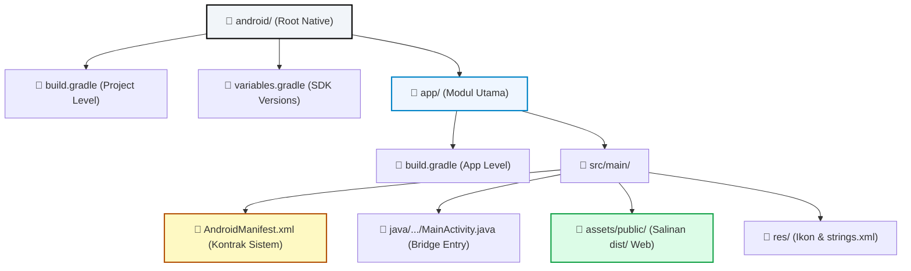
* **Tautan Kode Mandiri:**  
  👉 [`slide_06_anatomi_folder_android.html`](../contoh_kode_program/sesi_06_capacitor_android/slide_06_anatomi_folder_android.html)

---

### 📌 Slide 07: Konfigurasi Android SDK pada `build.gradle`
* **Sub-CPMK:** Mengatur versi kompatibilitas Android SDK (`minSdk`, `targetSdk`, `compileSdk`) dan versioining rilis.
* **Alat yang Digunakan:** VS Code / Android Studio (membuka `android/app/build.gradle` dan `variables.gradle`), Google Chrome.
* **Narasi Dosen:**  
  *"Parameter SDK di Gradle menentukan seberapa luas aplikasi Anda dapat digunakan masyarakat luas. Nilai `minSdk` menetapkan versi Android terendah yang sanggup menginstal aplikasi kita—Capacitor mensyaratkan minimal API 22 (Android 5.1) atau API 24 (Android 7.0). Sementara `targetSdk` menyatakan versi Android terbaru yang sudah diuji perilakunya secara optimal, misalnya API 34 untuk Android 14. Sedangkan `versionCode` adalah bilangan bulat yang wajib dinaikkan satu angka (+1) setiap kali Anda merilis pembaruan ke Play Store. Pahami hubungan ketiganya agar aplikasi Anda tidak ditolak sistem!"*
* **Poin Kunci:**
  * `minSdk`: Ambang batas minimal sistem operasi (perangkat di bawah versi ini tidak dapat menginstal).
  * `targetSdk`: Versi target perilaku dan kebijakan keamanan privasi yang diterapkan (standar Play Store 2024/2025: API 34).
  * `compileSdk`: Ketersediaan API Android yang dipakai compiler Java/Kotlin saat waktu kompilasi (*compile-time*).
  * `versionCode` (integer internal) vs `versionName` (string semantik untuk pengguna, cth: "1.0.0").
* **Diagram Konsep:**
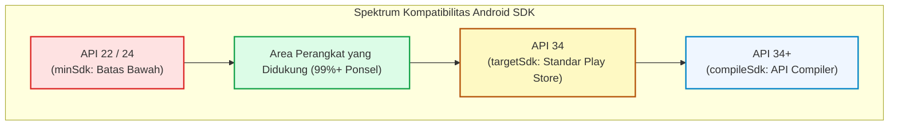
* **Tautan Kode Mandiri:**  
  👉 [`slide_07_konfigurasi_build_gradle.html`](../contoh_kode_program/sesi_06_capacitor_android/slide_07_konfigurasi_build_gradle.html)

---

### 📌 Slide 08: Anatomi Berkas `AndroidManifest.xml`
* **Sub-CPMK:** Mendeklarasikan izin perangkat keras (hardware permissions) dan mengonfigurasi orientasi Activity.
* **Alat yang Digunakan:** VS Code / Android Studio (membuka `android/app/src/main/AndroidManifest.xml`), Google Chrome.
* **Narasi Dosen:**  
  *"Berkas `AndroidManifest.xml` ibarat kontrak hukum dan paspor resmi aplikasi Anda di hadapan sistem operasi Android. Jika Anda lupa mencantumkan tag `<uses-permission android:name='android.permission.CAMERA' />` di berkas ini, maka sekeren apa pun kode Vue Anda, sistem operasi akan langsung melempar SecurityException dan aplikasi Anda akan seketika crash saat tombol pemindai barcode ditekan! Di berkas ini pula kita mendaftarkan Activity utama yang menampilkan ikon aplikasi di Home Screen."*
* **Poin Kunci:**
  * Tag `<uses-permission>`: Mendeklarasikan izin perangkat keras (INTERNET, CAMERA, ACCESS_FINE_LOCATION, READ_MEDIA_IMAGES).
  * Tag `<application>`: Konfigurasi nama aplikasi, tema visual, ikon launcher, dan opsi `android:usesCleartextTraffic`.
  * Tag `<activity>`: Titik awal eksekusi antarmuka dengan filter `android.intent.action.MAIN` dan `android.intent.category.LAUNCHER`.
* **Diagram Konsep:**
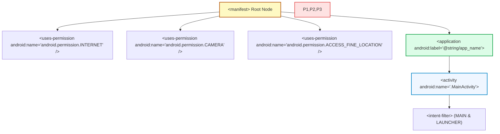
* **Tautan Kode Mandiri:**  
  👉 [`slide_08_anatomi_android_manifest.html`](../contoh_kode_program/sesi_06_capacitor_android/slide_08_anatomi_android_manifest.html)

---

### 📌 Slide 09: Manajemen Hak Akses Runtime (Runtime Permissions)
* **Sub-CPMK:** Menerapkan pola perizinan dinamis asinkron pada runtime Android modern menggunakan TypeScript.
* **Alat yang Digunakan:** Google Chrome (simulator dialog izin sistem Android), DevTools Console (`F12`), Smartphone Android Fisik.
* **Narasi Dosen:**  
  *"Mencatat izin di AndroidManifest saja belum cukup! Sejak Android 6.0 hingga Android 14 sekarang, Google menerapkan kebijakan Runtime Permissions: pengguna berhak menolak izin kapan pun mereka mau. Oleh karena itu, di kode TypeScript kita wajib menerapkan alur dua langkah yang elegan: periksa dulu dengan `checkPermissions()`. Jika belum diizinkan, tampilkan dialog interaktif via `requestPermissions()`. Jika pengguna memilih 'Jangan Izinkan', berikan penjelasan yang ramah dan jangan biarkan aplikasi Anda tiba-tiba macet!"*
* **Poin Kunci:**
  * Izin Normal (diberikan otomatis saat instal, misal INTERNET) vs Izin Sensitif/Dangerous (wajib persetujuan interaktif pengguna, misal Kamera & Lokasi).
  * Tiga Status Izin di Capacitor: `granted` (disetujui), `prompt` (belum pernah ditanya), dan `denied` (ditolak).
  * Prinsip *Just-in-Time*: Mintalah izin hanya ketika pengguna secara sengaja hendak memakai fitur tersebut, bukan saat aplikasi baru pertama dibuka.
* **Diagram Konsep:**
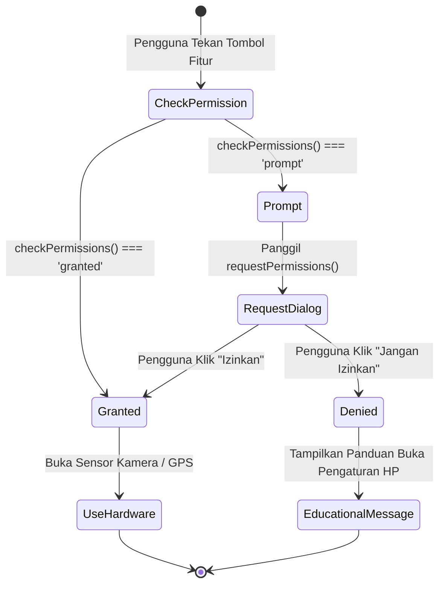
* **Tautan Kode Mandiri:**  
  👉 [`slide_09_manajemen_runtime_permissions.html`](../contoh_kode_program/sesi_06_capacitor_android/slide_09_manajemen_runtime_permissions.html)

---

### 📌 Slide 10: Pengenalan Antarmuka Android Studio
* **Sub-CPMK:** Mengoperasikan elemen-elemen kunci antarmuka Android Studio untuk kompilasi dan debugging.
* **Alat yang Digunakan:** Android Studio (Ladybug / Hedgehog), Google Chrome (peta interaktif IDE).
* **Narasi Dosen:**  
  *"Android Studio adalah IDE resmi buatan Google berbasis IntelliJ IDEA. Bagi pengembang pemula, melihat puluhan menu dan tombol di layar mungkin terasa membingungkan. Namun tenang saja, untuk proyek Capacitor, instrumen yang wajib Anda kuasai hanya empat: Pertama, tombol Sync Project with Gradle Files (ikon gajah) saat memasang plugin baru. Kedua, Target Device Selector untuk memilih nama ponsel Anda. Ketiga, tombol Run (segitiga hijau ▶) untuk mengompilasi APK. Dan keempat, panel Logcat di bilah bawah untuk melihat pesan console.log JavaScript Anda secara langsung dari sistem Android!"*
* **Poin Kunci:**
  * Project Tool Window: Memilih mode tampilan struktur "Android" yang bersih dan terorganisir.
  * Gradle Sync (Ikon Gajah 🐘): Mengunduh dependensi Maven dan pustaka native plugin yang baru ditambahkan via npm.
  * Target Device Selector: Mendeteksi nomor seri smartphone fisik yang terhubung via kabel USB.
  * Logcat Window: Konsol pemantau jejak sistem dengan filter `package:mine` atau tag `Capacitor`.
* **Diagram Konsep:**
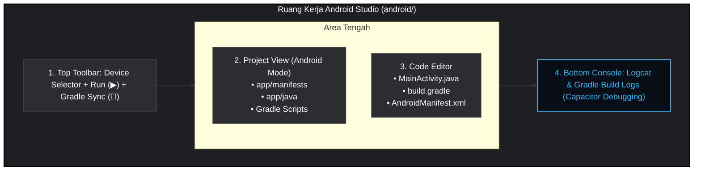
* **Tautan Kode Mandiri:**  
  👉 [`slide_10_pengenalan_android_studio.html`](../contoh_kode_program/sesi_06_capacitor_android/slide_10_pengenalan_android_studio.html)

---

### 📌 Slide 11: Solusi Ramah Laptop: Emulator AVD vs Ponsel Fisik
* **Sub-CPMK:** Menghitung perbandingan konsumsi beban RAM laptop antara emulator AVD dan ponsel fisik via USB.
* **Alat yang Digunakan:** Task Manager Windows (`Ctrl + Shift + Esc`), Smartphone Android Fisik + Kabel USB, Google Chrome (kalkulator memori interaktif).
* **Narasi Dosen:**  
  *"Banyak mahasiswa mengeluh laptopnya macet, kipasnya berisik, dan kodingnya terhambat saat masuk ke materi Android. Mengapa? Karena mereka memaksakan menjalankan Emulator Android Virtual Device (AVD) pada laptop bertopologi RAM 4GB atau 8GB! Emulator AVD memakan alokasi RAM 3.5 hingga 4.5 GB tersendiri. Solusi cerdas dan hemat dari kami adalah: gunakan smartphone Android fisik pribadi Anda! Dengan kabel data USB, daemon ADB di laptop hanya memakan RAM sekitar 50 megabyte. Laptop Anda tetap dingin, baterai awet, dan uji coba sensor hardware akurat 100%!"*
* **Poin Kunci:**
  * Kalkulasi Beban RAM Emulator AVD: Windows OS (~2.8GB) + Android Studio/Gradle (~2.5GB) + QEMU AVD (~3.8GB) = ~9.1GB (Pasti menyebabkan Out-Of-Memory di laptop 4–8GB!).
  * Mode Ponsel Fisik via USB: Beban daemon `adb.exe` hanya ~50MB, seluruh beban komputasi antarmuka ditanggung prosesor smartphone.
  * Keuntungan Tambahan: Pengujian sensor asli (kamera, getar, GPS) tanpa lag dan interaksi layar sentuh jari nyata.
* **Diagram Konsep:**
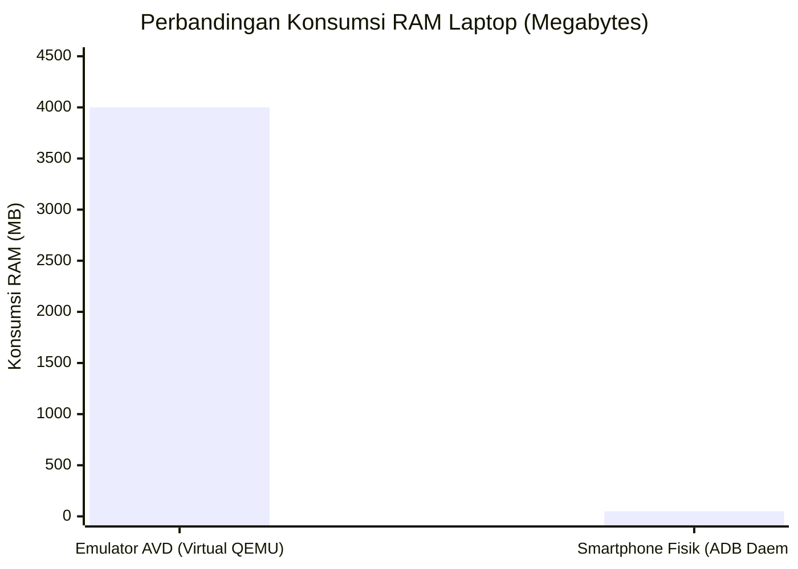
* **Tautan Kode Mandiri:**  
  👉 [`slide_11_dilema_ram_emulator_vs_device.html`](../contoh_kode_program/sesi_06_capacitor_android/slide_11_dilema_ram_emulator_vs_device.html)

---

### 📌 Slide 12: Panduan Resmi Praktis: Aktivasi USB Debugging di Berbagai Merk HP
* **Sub-CPMK:** Mengaktifkan Opsi Pengembang, otorisasi kunci RSA ADB, dan USB Debugging di berbagai merek smartphone Android.
* **Alat yang Digunakan:** Smartphone Fisik Android (Xiaomi, Samsung, OPPO, Vivo, Pixel, Infinix), Kabel USB data, Terminal / PowerShell (`adb devices`).
* **Narasi Dosen:**  
  *"Bagaimana cara menyambungkan ponsel ke laptop? Menu Opsi Pengembang (Developer Options) sengaja disembunyikan pabrikan demi keamanan pengguna awam. Masuklah ke Settings > About Phone, lalu ketuk 'Build Number' sebanyak 7 kali berturut-turut hingga muncul tulisan 'You are now a developer!'. Aktifkan sakelar USB Debugging, colokkan kabel data ke laptop, dan saat muncul dialog keamanan di layar HP, centang 'Always allow from this computer' lalu klik Allow. Buka PowerShell dan ketik `adb devices`. Jika statusnya sudah 'device', Anda sudah siap meluncur!"*
* **Poin Kunci:**
  * Jalur Menu Ketukan 7x: Samsung (*Software info*), Xiaomi (*MIUI/OS version*), OPPO/Realme (*Version*), Vivo (*Software version*), Infinix (*My phone*).
  * Catatan Kritis Xiaomi/MIUI: Wajib mengaktifkan 3 opsi sekaligus: *USB Debugging*, *Install via USB*, dan *USB Debugging (Security settings)*.
  * Handshake Kriptografi RSA: Memastikan laptop Anda terotorisasi dengan aman oleh smartphone.
* **Diagram Konsep:**
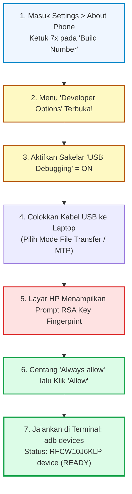
* **Tautan Berkas:**  
  👉 [🌐 **Simulator Interaktif Multi-Merk:** `slide_12_panduan_usb_debugging_android.html`](../contoh_kode_program/sesi_06_capacitor_android/slide_12_panduan_usb_debugging_android.html)  
  👉 [📄 **Panduan Dokumen Teks Lengkap:** `slide_12_panduan_usb_debugging_android.md`](../contoh_kode_program/sesi_06_capacitor_android/slide_12_panduan_usb_debugging_android.md)

---

### 📌 Slide 13: Mirroring Layar Cepat & Hemat RAM dengan `scrcpy`
* **Sub-CPMK:** Mengoperasikan tool open-source `scrcpy` untuk menampilkan dan merekam layar ponsel di desktop.
* **Alat yang Digunakan:** scrcpy CLI (Genymobile), Terminal / PowerShell, Kabel USB Data, Google Chrome.
* **Narasi Dosen:**  
  *"Saat mengerjakan tugas atau presentasi di hadapan dosen dan teman sekelas, Anda tentu ingin layar smartphone Anda tampil jelas di monitor laptop. Jangan menggunakan aplikasi mirroring berbasis Wi-Fi yang penuh iklan dan memberatkan sistem! Gunakan `scrcpy` buatan Genymobile. scrcpy dibuat menggunakan bahasa C murni yang sangat ringan (< 70 MB RAM), berlatensi sangat rendah (35-70 ms), dan Anda bahkan bisa mengontrol HP menggunakan mouse serta mengetik dengan keyboard laptop. Anda juga bisa merekam video demo tugas langsung menjadi file MP4 dengan perintah `scrcpy --record demo.mp4`!"*
* **Poin Kunci:**
  * Konsumsi RAM komputer sangat minimal (< 70MB) dengan framerate mulus hingga 60 FPS pada resolusi asli smartphone.
  * Interaksi Dua Arah: Klik mouse sebagai sentuhan jari, keyboard laptop sebagai masukan pengetikan teks cepat.
  * Perekaman Layar Otomatis: Menyimpan demo interaksi aplikasi ke format `.mp4` untuk lampiran pengumpulan tugas di LMS UT.
* **Diagram Konsep:**
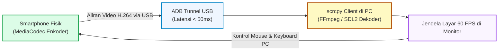
* **Tautan Kode Mandiri:**  
  👉 [`slide_13_panduan_scrcpy_mirroring.html`](../contoh_kode_program/sesi_06_capacitor_android/slide_13_panduan_scrcpy_mirroring.html)

---

### 📌 Slide 14: Inspeksi WebView dengan `chrome://inspect`
* **Sub-CPMK:** Memanfaatkan Chrome Remote Debugging untuk menginspeksi DOM, konsol JavaScript, dan request jaringan di perangkat Android.
* **Alat yang Digunakan:** Google Chrome Desktop (`chrome://inspect/#devices`), Kabel USB, Smartphone Fisik.
* **Narasi Dosen:**  
  *"Banyak mahasiswa mengira bahwa setelah aplikasi dikompilasi ke ponsel, kita tidak bisa lagi melakukan 'Inspect Element'. Itu keliru! Cukup buka Google Chrome di laptop Anda, ketik `chrome://inspect/#devices`, dan peramban akan mendeteksi aplikasi Ionic yang sedang aktif di HP Anda. Klik tautan biru 'inspect', maka jendela Chrome DevTools desktop akan terbuka! Anda dapat memeriksa struktur tag Ionic di tab Elements, melihat baris error di tab Console, hingga memantau latensi API di tab Network secara real-time!"*
* **Poin Kunci:**
  * Akses Praktis: Cukup ketik `chrome://inspect/#devices` di bilah alamat Google Chrome komputer.
  * Panel Elements & Styles: Mengubah CSS secara langsung di smartphone untuk melihat perubahan visual instan.
  * Fitur Screencast: Memproyeksikan tampilan layar ponsel langsung di dalam panel DevTools desktop laptop.
* **Diagram Konsep:**
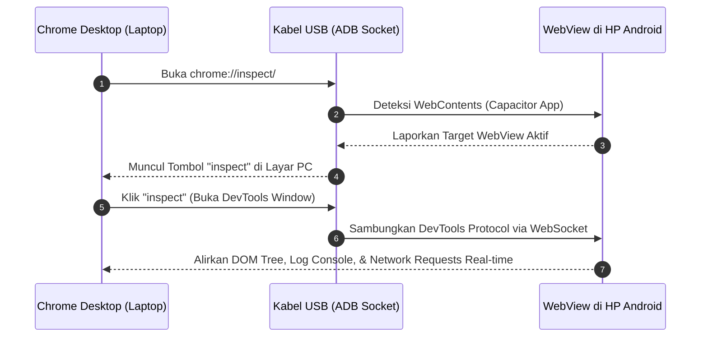
* **Tautan Kode Mandiri:**  
  👉 [`slide_14_chrome_remote_debugging_inspect.html`](../contoh_kode_program/sesi_06_capacitor_android/slide_14_chrome_remote_debugging_inspect.html)

---

### 📌 Slide 15: Keamanan WebView & Bahaya Cross-Site Scripting (XSS)
* **Sub-CPMK:** Menerapkan prinsip pengamanan aplikasi mobile hybrid dari serangan XSS dan pembatasan cleartext traffic.
* **Alat yang Digunakan:** Google Chrome (lab uji sanitasi input interaktif), VS Code (pemeriksaan berkas HTML & CSP).
* **Narasi Dosen:**  
  *"Pada aplikasi web desktop biasa, serangan XSS mungkin hanya mencuri token sesi browser. Namun pada aplikasi mobile hybrid dengan Capacitor Bridge, celah XSS berakibat sangat fatal! Skrip jahat yang disuntikkan penyerang dapat memanggil Runtime Bridge native untuk membaca file penyimpanan ponsel, mencuri kontak, atau menyalakan pelacak GPS secara diam-diam! Oleh karena itu, patuhi 3 aturan baku ini: hindari penggunaan `v-html` untuk data masukan pengguna, terapkan Content Security Policy (CSP) yang ketat, dan gunakan origin lokal `https://localhost` yang aman!"*
* **Poin Kunci:**
  * Eskalasi Kerentanan Mobile: Celah XSS di WebView dapat melompat melintasi bridge menuju API sistem operasi native.
  * Sanitasi Baku Vue: Mengutamakan interpolasi kurung kurawal ganda `{{ text }}` yang otomatis menetralkan karakter berbahaya (`<` menjadi `&lt;`).
  * Penegakan TLS: Membatasi izin `usesCleartextTraffic` hanya untuk keperluan server pengembangan lokal.
* **Diagram Konsep:**
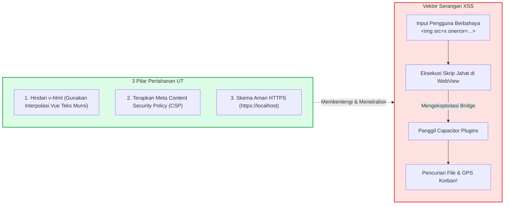
* **Tautan Kode Mandiri:**  
  👉 [`slide_15_keamanan_webview_dan_xss.html`](../contoh_kode_program/sesi_06_capacitor_android/slide_15_keamanan_webview_dan_xss.html)

---

### 📌 Slide 16: Cheatsheet Diagnostik & Troubleshooting Error Android Studio & Gradle
* **Sub-CPMK:** Mengidentifikasi dan memecahkan 6 galat (errors) umum dalam proses sinkronisasi dan kompilasi Gradle.
* **Alat yang Digunakan:** Android Studio (Gradle Settings, Logcat, Build Output), Terminal / PowerShell, Text Editor.
* **Narasi Dosen:**  
  *"Dalam praktikum pemrograman mobile, mengalami error kompilasi adalah hal yang 100% wajar dan manusiawi. Kami telah merangkum 6 error klasik yang paling sering ditemui mahasiswa UT: mulai dari Java Version Mismatch yang dapat diselesaikan dengan menyetel Gradle JDK ke jbr-17, lupa menjalankan `npm run build` sebelum `npx cap sync`, status ADB unauthorized, galat nama resource AAPT2 yang memuat huruf besar atau spasi, error Cleartext HTTP, hingga masalah Out-Of-Memory Gradle pada laptop RAM 4GB. Buka konsol interaktif ini untuk menyalin solusi perbaikannya!"*
* **Poin Kunci:**
  * Solusi Versi Java: Menyelaraskan Gradle JDK ke JetBrains Runtime (jbr-17) di menu Settings Android Studio.
  * Solusi Aset Hilang: Selalu jalankan `npm run build` sebelum `npx cap sync`.
  * Standar AAPT2: Nama berkas gambar di `res/drawable/` wajib huruf kecil murni dengan garis bawah (contoh: `logo_ut.png`).
  * Batas Memori Gradle: Membatasi alokasi heap di `gradle.properties` (`org.gradle.jvmargs=-Xmx1024m`).
* **Diagram Konsep:**
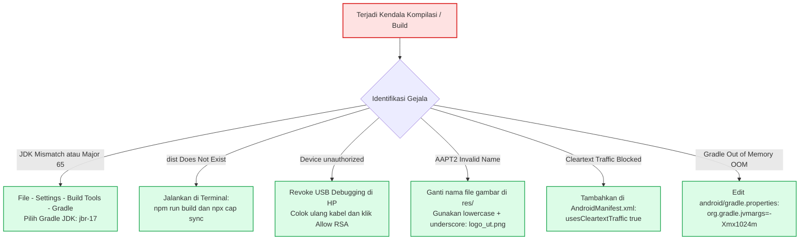
* **Tautan Berkas:**  
  👉 [🌐 **Konsol Diagnostik Interaktif:** `slide_16_troubleshooting_build_android.html`](../contoh_kode_program/sesi_06_capacitor_android/slide_16_troubleshooting_build_android.html)  
  👉 [📄 **Buku Saku Cheatsheet Teks Lengkap:** `slide_16_troubleshooting_build_android.md`](../contoh_kode_program/sesi_06_capacitor_android/slide_16_troubleshooting_build_android.md)

---

### 📌 Slide 17: Master Solusi Lab Quest 06: Capacitor Bridge & Android Platform Inspector
* **Sub-CPMK:** Membangun dashboard pemeriksa status jembatan runtime Capacitor dan pengujian plugin terpadu.
* **Alat yang Digunakan:** Google Chrome (menjalankan dashboard inspektor lengkap), DevTools (`F12`), Smartphone Android Fisik via USB.
* **Narasi Dosen:**  
  *"Sebagai pembuktian kemampuan praktikum Sesi 06, mari kita bedah Master Solusi Lab Quest 06! Kita membangun aplikasi cerdas 'Capacitor Bridge & Platform Inspector'. Aplikasi ini mampu mendeteksi secara otomatis apakah dirinya berjalan di peramban web desktop biasa atau di dalam container native Android, membaca resolusi layar serta status daya baterai, memantau jaringan, dan menyediakan panel pengujian interaktif untuk memicu getaran haptik dan salin clipboard lengkap dengan jendela log paket JSON-RPC secara transparan. Pelajari kodenya untuk meraih nilai sempurna 100!"*
* **Poin Kunci:**
  * Deteksi Dinamis Lingkungan Runtime (`Capacitor.isNativePlatform()` vs Web fallback).
  * Pengujian Asinkron Plugin Native: Haptics, Clipboard, Network, dan Battery API.
  * Logging visual transaksi JSON-RPC Wire secara interaktif dan real-time.
  * Rubrik Penilaian Resmi Lab Quest 06 (Skor Maksimal: 100 Poin).
* **Diagram Konsep:**
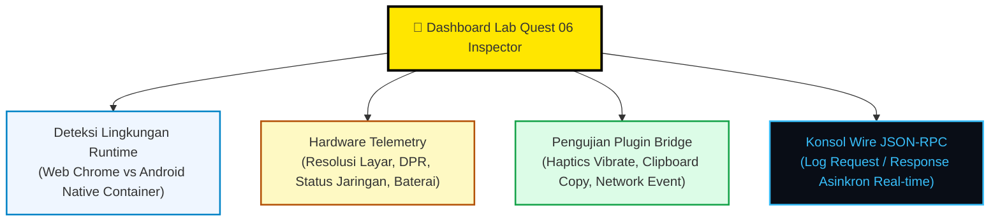
* **Tautan Kode Mandiri:**  
  👉 [`slide_17_lab_quest_06_bridge_tester.html`](../contoh_kode_program/sesi_06_capacitor_android/slide_17_lab_quest_06_bridge_tester.html)

---

### 📌 Slide 18: Jembatan Menuju Sesi 07: REST API, Offline Storage & TUGAS TUTORIAL 3
* **Sub-CPMK:** Mengantisipasi integrasi data cloud eksternal, penyimpanan offline lokal, dan pembukaan tagihan Tugas Tutorial 3.
* **Alat yang Digunakan:** Google Chrome, VS Code, Postman / REST Client, Smartphone Android Fisik.
* **Narasi Dosen:**  
  *"Selamat atas keberhasilan rekan-rekan mahasiswa menyelesaikan Sesi 06 dengan gemilang! Kini pondasi jembatan native Android Anda telah berdiri kokoh. Pada Sesi 07 pekan depan, kita akan memasuki puncak materi teknis: menghubungkan aplikasi mobile dengan server cloud Universitas Terbuka via Asynchronous REST API, menerapkan strategi penyimpanan data lokal offline-first agar aplikasi tetap lancar digunakan saat mahasiswa kehilangan sinyal internet, serta mengakses sensor kamera asli. Dan yang paling penting: TUGAS TUTORIAL 3 (evaluasi praktikum penutup berbobot 20%) akan resmi dibuka! Persiapkan lingkungan belajar Anda dan sampai jumpa di Sesi 07!"*
* **Poin Kunci:**
  * 3 Pilar Utama Sesi 07: Asynchronous REST API Cloud Backend, Offline-First Storage Persistence (Preferences & SQLite), dan Native Hardware Camera Sensors.
  * Pembukaan Tagihan Resmi Evaluasi: **TUGAS TUTORIAL 3 (TUTON 3)** dengan bobot nilai terbesar (20%).
  * Pesan motivasi akademik Dosen untuk menjaga ritme belajar mandiri yang konsisten.
* **Diagram Konsep:**
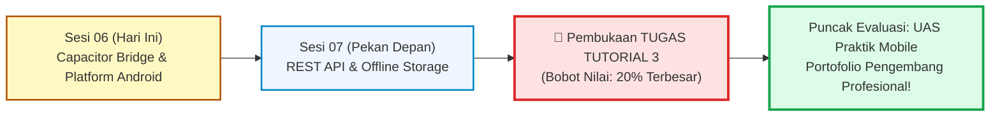
* **Tautan Kode Mandiri:**  
  👉 [`slide_18_preview_sesi_07_api_storage.html`](../contoh_kode_program/sesi_06_capacitor_android/slide_18_preview_sesi_07_api_storage.html)

---

## 📚 Daftar Pustaka & Standar Mutu Akademik

1. **Ionic Framework & Capacitor Core Team.** (2024). *Capacitor Documentation: Cross-Platform Native Runtime Architecture, Plugins API, & Android Integration*. https://capacitorjs.com/docs
2. **Google Android Open Source Project (AOSP) Developers.** (2024). *Configure on-device developer options, Android Debug Bridge (adb) protocol specification, & App Manifest Overview*. https://developer.android.com/studio/debug/dev-options
3. **Google Android Developers.** (2024). *Meet Android Studio, Configure Gradle Builds, & Meet Google Play's Target API Level Requirement*. https://developer.android.com/build
4. **Google Chrome for Developers.** (2024). *Remote Debugging Android Devices & WebViews with Chrome DevTools*. https://developer.chrome.com/docs/devtools/remote-debugging
5. **Genymobile.** (2024). *scrcpy: Display and control your Android device over USB with high performance and low latency*. https://github.com/Genymobile/scrcpy
6. **Open Web Application Security Project (OWASP).** (2024). *OWASP Mobile Top 10 Security Risks: M8 - Security Misconfiguration & Client-Side Injections in Hybrid WebViews*. https://owasp.org/www-project-mobile-top-10/
7. **Prafanto, A.** (2025). *Buku Materi Pokok (BMP) Pemrograman Berbasis Perangkat Bergerak (MSIM4401 / STSI4303)*. Tangerang Selatan: Penerbit Universitas Terbuka.
8. **Tim Pengembang Kurikulum FST UT.** (2025). *Rancangan Aktivitas Tutorial (RAT) dan Satuan Acara Tutorial (SAT) STSI4303*. Tangerang Selatan: Universitas Terbuka.
