# 📱 NASKAH & SLIDE SESI 07: REST API, OFFLINE STORAGE, NATIVE PLUGINS, & PRAKTIKUM STUDI KASUS MANDIRI
## Mata Kuliah: Pemrograman Berbasis Perangkat Bergerak (STSI4303 / MSIM4401)
### Program Studi: S1 Sistem Informasi & S1 Informatika — Fakultas Sains dan Teknologi (FST) Universitas Terbuka
### Dosen Pengampu: Anton Prafanto, S.Kom., M.T.
### Modul Acuan BMP: Modul 8 & 9 (MSIM4401/STSI4303)

---

> [!TIP]
> **Akses Cepat Materi, Simulator Interaktif, & Kode Program Sesi 07:**
> - 🌐 **18 Berkas Contoh Program HTML Siap Dijalankan:** [`contoh_kode_program/sesi_07_api_storage_plugins/`](../contoh_kode_program/sesi_07_api_storage_plugins/)
> - 📋 **Checklist Kesiapan Praktikum (Slide 16):** [`slide_16_rubrik_tugas_tutorial_3.html`](../contoh_kode_program/sesi_07_api_storage_plugins/slide_16_rubrik_tugas_tutorial_3.html) • [📄 Buku Saku Praktikum Markdown](../contoh_kode_program/sesi_07_api_storage_plugins/slide_16_rubrik_tugas_tutorial_3.md)
> - 🎯 **Studi Kasus Interaktif: UT Study Tracker (Slide 17):** [`slide_17_solusi_tugas_3_study_tracker.html`](../contoh_kode_program/sesi_07_api_storage_plugins/slide_17_solusi_tugas_3_study_tracker.html)
> - 🖥️ **Slide Presentasi PowerPoint (PPTX 18 Slide Neo-Brutalisme):** [`SESI_07_REST_API_Storage_dan_Native_Plugins.pptx`](SESI_07_REST_API_Storage_dan_Native_Plugins.pptx)

> [!NOTE]
> **Pemberitahuan Resmi Penugasan & Penilaian:**  
> Seluruh penugasan resmi (Tugas Tutorial 3), pengumpulan berkas/video, dan evaluasi nilai semester mahasiswa dikelola secara terpusat melalui LMS resmi Universitas Terbuka di [**https://elearning.ut.ac.id/**](https://elearning.ut.ac.id/). Repositori ini difokuskan 100% murni pada penyampaian materi perkuliahan, demonstrasi kode terbuka, dan studi kasus praktikum mandiri.

---

## 🛠️ Panduan Alat & Lingkungan Belajar (Ramah Pemula)

Bagi rekan-rekan mahasiswa yang baru pertama kali mempelajari komunikasi data jaringan (*network fetch*), penyimpanan persisten offline, serta integrasi sensor fisik smartphone, jangan merasa cemas! Seluruh materi praktikum Sesi 07 telah dirancang dengan prinsip **Zero Friction (Tanpa Beban)** sehingga dapat diuji secara instan di komputer atau laptop dengan spesifikasi standar (RAM 4–8 GB):

1. **Google Chrome / Peramban Web Modern:**
   * **Fungsi:** Menjalankan seluruh 18 berkas mandiri `.html` secara langsung via protokol `file:///` tanpa perlu menginstal atau menyalakan server lokal seperti Node.js atau Apache.
   * **Cara Penggunaan:** Cukup klik ganda (*double-click*) berkas `.html` yang ingin dipelajari, atau seret (*drag-and-drop*) berkas ke jendela peramban Anda.
2. **Google Chrome DevTools (`F12` atau `Ctrl + Shift + I`):**
   * **Tab Console (`Console`):** Tempat melihat log pesan transaksi data JSON, pembacaan koordinat GPS, serta melacak galat (*error message*) saat request jaringan gagal.
   * **Tab Jaringan (`Network`):** Sangat krusial untuk Sesi 07! Anda dapat menyaring permintaan bertipe `Fetch/XHR` untuk melihat request URL, header otentikasi JWT, payload respon JSON mentah dari server, status code (200, 404, 500), serta menguji ketahanan aplikasi dengan menyimulasikan mode **Offline** melalui dropdown *Throttling*.
   * **Tab Aplikasi (`Application`):** Digunakan untuk menginspeksi isi data fisik yang tersimpan pada menu *Storage* $\rightarrow$ *Local Storage* dan *IndexedDB*.
3. **Mode Ponsel / Toggle Device Toolbar (`Ctrl + Shift + M`):**
   * **Fungsi:** Mengubah tampilan peramban desktop menjadi kanvas smartphone virtual (contoh: Samsung Galaxy, iPhone, atau Pixel) agar Anda dapat merasakan tata letak responsif aplikasi secara nyata.
4. **Visual Studio Code (VS Code):**
   * **Fungsi:** Editor teks utama untuk membuka, membaca, dan memodifikasi baris kode JavaScript/TypeScript, template antarmuka, serta berkas CSS.
5. **Peramban Smartphone Fisik (Android / iOS):**
   * **Fungsi:** Khusus untuk Slide 10 (GPS) dan Slide 12 (Kamera), Anda dapat membuka berkas HTML langsung di peramban smartphone Anda untuk merasakan akses sensor satelit GPS asli dan kamera ponsel tanpa perlu kompilasi APK yang berat.
6. **Layanan REST API Terbuka (Open-Meteo):**
   * **Fungsi:** Penyedia data cuaca live global tanpa perlu registrasi akun atau API key. Mahasiswa dapat menguji endpoint secara langsung dengan mengetikkan URL di bilah alamat peramban.

---

## 🗺️ Gambaran Umum Sesi

Sesi ketujuh ini merupakan **tonggak evaluasi tutorial ketiga (Milestone 3: TUGAS TUTORIAL 3)** yang berbobot **20%** dari total nilai Tutorial Online (Tuton) di Universitas Terbuka. Sesi ini mematangkan kemampuan mahasiswa dalam mengembangkan aplikasi mobile terintegrasi skala penuh (*full-stack client mobile*). Tiga pilar utama yang dipelajari pada sesi ini meliputi:

1. **Cloud Data Integration (REST API Asinkron):** Memahami arsitektur komunikasi data client-server stateless via HTTP, konsumsi data modern menggunakan `fetch()` dan `async/await`, penanganan galat jaringan berbasis pertahanan berlapis `try-catch-finally`, serta tata kelola status antarmuka (*loading UX*) menggunakan spinner dan skeleton shimmer.
2. **Offline-First Storage Persistence:** Mengelola penyimpanan data lokal pada perangkat agar aplikasi tetap dapat dibuka dan digunakan meski mahasiswa sedang berada di daerah tanpa sinyal internet (*blank spot*), melalui komparasi spektrum memori (RAM, LocalStorage, IndexedDB, SQLite, Capacitor Preferences), operasi CRUD, serialisasi JSON, dan strategi caching.
3. **Hardware Sensors & Native Plugins:** Mengakses sensor fisik smartphone menggunakan plugin resmi Capacitor, mencakup pembacaan koordinat satelit GPS (`@capacitor/geolocation`), validasi radius presensi kampus via Rumus Haversine, pemotretan dokumen belajar via kamera (`@capacitor/camera`), deteksi status koneksi internet (`@capacitor/network`), pemisahan logika melalui Service Layer, serta proteksi data via JWT Bearer Token.

Sesi ini ditutup dengan pembedahan menyeluruh soal, rubrik evaluasi resmi, dan peluncuran master solusi **TUGAS TUTORIAL 3: Aplikasi UT Study Tracker & Presensi Belajar Mobile**.

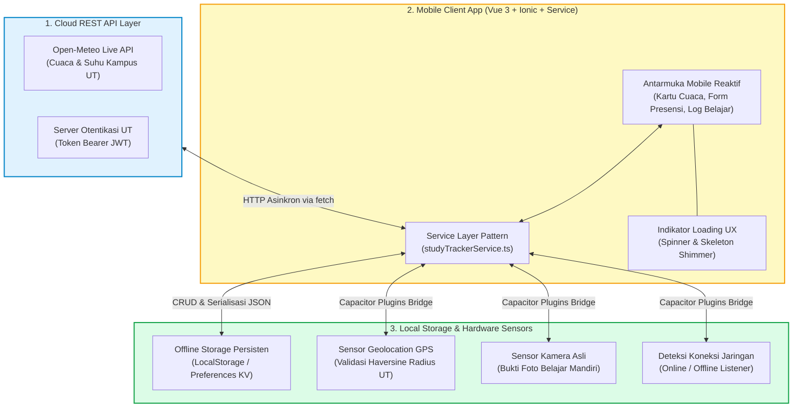

---

## 📊 Daftar 18 Slide Pembahasan & Berkas Kode Mandiri

---

### 📌 Slide 01: Orientasi Sesi 07, Peta Sub-CPMK 7 & Pembukaan TUGAS TUTORIAL 3
* **Sub-CPMK:** Memahami keterkaitan kompetensi integrasi data cloud, penyimpanan lokal, dan pembukaan evaluasi Tugas Tutorial 3.
* **Alat yang Digunakan:** Google Chrome (klik ganda berkas HTML untuk membuka modul orientasi), Chrome DevTools (`F12`), Visual Studio Code.
* **Narasi Dosen:**  
  *"Selamat berjumpa kembali rekan-rekan mahasiswa Fakultas Sains dan Teknologi Universitas Terbuka di Sesi 07! Hari ini kita mencapai tonggak evaluasi tutorial terakhir sebelum Ujian Akhir Semester: TUGAS TUTORIAL 3 resmi dibuka dengan bobot 20% nilai! Di sesi ini, kita merakit seluruh ilmu yang telah kita pelajari sejak Sesi 01 hingga 06: menghubungkan aplikasi ke server cloud via REST API, menyimpan data secara mandiri agar tidak hilang saat offline, dan mengaktifkan sensor fisik smartphone seperti GPS dan kamera. Mari kita maksimalkan sesi penugasan ini untuk mengamankan nilai A!"*
* **Poin Kunci:**
  * Tugas Tutorial 3 berdurasi 2 pekan di LMS Tuton UT (Bobot 20% Nilai Akhir).
  * Kasus Proyek Terintegrasi: Aplikasi UT Study Tracker & Presensi Belajar Mobile.
  * Tiga Pilar Kompetensi: Integrasi REST API, Offline Storage Persisten, dan Native Hardware Plugins.
  * Tagihan Resmi: Laporan PDF Lengkap, Repositori Kode GitHub Publik, dan Tautan Video Demo YouTube (Unlisted).
* **Diagram Konsep:**
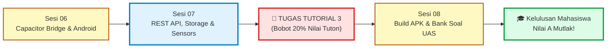
* **Tautan Kode Mandiri:**  
  👉 [`slide_01_orientasi_sesi_dan_tugas_3.html`](../contoh_kode_program/sesi_07_api_storage_plugins/slide_01_orientasi_sesi_dan_tugas_3.html)

---

### 📌 Slide 02: Konsep REST API: Protokol HTTP, JSON & Status Code
* **Sub-CPMK:** Menganalisis arsitektur pertukaran data client-server stateless berbasis REST dan format JSON.
* **Alat yang Digunakan:** Google Chrome, Chrome DevTools (`F12` $\rightarrow$ Tab Network $\rightarrow$ Filter Fetch/XHR), Browser URL Address Bar.
* **Narasi Dosen:**  
  *"Smartphone Anda tidak menyimpan seluruh database kampus di dalam memorinya. Ketika Anda membuka jadwal kuliah atau mengirim catatan tugas, aplikasi mengirimkan permintaan HTTP ke server cloud UT. Inilah arsitektur REST API: komunikasi dua arah yang bersifat stateless, di mana setiap permintaan berdiri sendiri. Ada 4 kata kerja utama: GET untuk mengambil data, POST untuk mengirim data baru, PUT untuk memperbarui, dan DELETE untuk menghapus. Jawaban dari server dibungkus dalam format universal JSON disertai kode status HTTP, seperti 200 OK jika sukses, 404 jika data tidak ditemukan, atau 500 jika server sedang mengalami gangguan."*
* **Poin Kunci:**
  * Arsitektur Client-Server & Stateless: Server tidak menyimpan konteks sesi client secara permanen.
  * 4 Metode Utama HTTP: GET (Ambil), POST (Tambah), PUT (Perbarui), DELETE (Hapus).
  * Struktur Status Codes: 2xx (Sukses/OK), 4xx (Kesalahan Klien/Not Found), 5xx (Kesalahan Server).
  * JSON (JavaScript Object Notation): Format standar pertukaran data teks yang ringan dan mudah dibaca.
* **Diagram Konsep:**
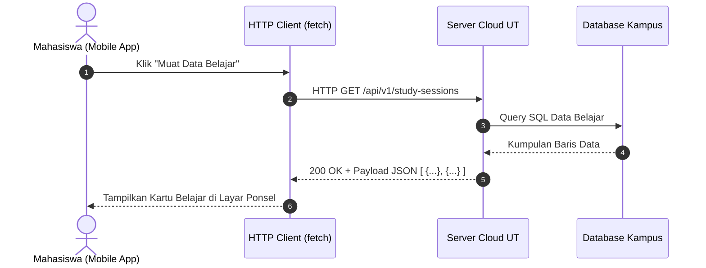
* **Tautan Kode Mandiri:**  
  👉 [`slide_02_konsep_rest_api_asinkron.html`](../contoh_kode_program/sesi_07_api_storage_plugins/slide_02_konsep_rest_api_asinkron.html)

---

### 📌 Slide 03: Pemanggilan Data Asinkron: `fetch()` & `async/await`
* **Sub-CPMK:** Menerapkan pemanggilan HTTP asinkron modern dengan struktur penanganan error `try-catch-finally`.
* **Alat yang Digunakan:** Google Chrome, DevTools (`F12` $\rightarrow$ Tab Console), Visual Studio Code.
* **Narasi Dosen:**  
  *"Dalam pemrograman mobile modern, jangan pernah membekukan thread antarmuka saat menunggu balasan server. Kita menggunakan kombinasi fungsi bawaan `fetch()` dengan kata kunci `async/await`. Pola pertahanan terbaik selalu menggunakan tiga blok: `try` untuk mengeksekusi request dan mengurai JSON, `catch` untuk menangkap galat koneksi internet terputus, dan `finally` untuk memastikan status loading dinonaktifkan. Ingat jebakan klasik pemula: `fetch()` tidak akan melempar galat Promise jika server membalas dengan status 404 atau 500. Oleh sebab itu, kita wajib memeriksa kondisi `if (!response.ok)` secara manual!"*
* **Poin Kunci:**
  * Sintaks Asinkron Bersih: `const response = await fetch(url)`.
  * Validasi Wajib: `if (!response.ok) throw new Error('Status: ' + response.status)`.
  * Blok `try-catch-finally`: Memisahkan jalur sukses, tangkapan galat, dan pembersihan status.
  * Garansi Blok `finally`: Menjamin pemutar loading (*spinner*) pasti berhenti berputar dalam kondisi apa pun.
* **Diagram Konsep:**
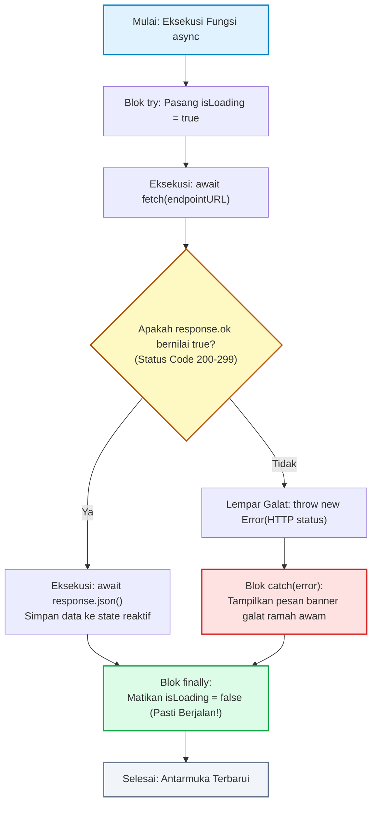
* **Tautan Kode Mandiri:**  
  👉 [`slide_03_fetch_api_dan_async_await.html`](../contoh_kode_program/sesi_07_api_storage_plugins/slide_03_fetch_api_dan_async_await.html)

---

### 📌 Slide 04: Mengelola UX Pemuatan: Spinner & `ion-skeleton-text`
* **Sub-CPMK:** Mengimplementasikan indikator pemuatan data responsif dan animasi skeleton placeholder shimmer.
* **Alat yang Digunakan:** Google Chrome, DevTools (`F12` $\rightarrow$ Tab Elements & Console), Mode Ponsel (`Ctrl + Shift + M`).
* **Narasi Dosen:**  
  *"Pengguna smartphone sangat sensitif terhadap kecepatan respon aplikasi. Jika layar ponsel dibiarkan putih membeku tanpa indikasi apa pun saat memuat data, pengguna akan mengira aplikasi hang dan menutupnya secara paksa. Di Ionic, kita memiliki dua senjata visual: komponen `<ion-spinner>` untuk indikator putar sederhana, dan `<ion-skeleton-text animated>` untuk efek kerangka berdenyut (*shimmer*). Riset psikologi antarmuka membuktikan bahwa efek skeleton membuat waktu tunggu terasa 50% lebih cepat karena pengguna telah melihat bayangan bentuk kartu konten yang akan datang!"*
* **Poin Kunci:**
  * Masalah UX Layar Kosong (*Blank Screen Syndrome*): Memicu kecemasan dan pengabaian aplikasi.
  * `<ion-spinner>`: Indikator visual ringkas untuk proses singkat (contoh: tombol simpan formulir).
  * `<ion-skeleton-text animated>`: Efek placeholder kartu berdenyut yang memproyeksikan tata letak konten.
  * Transisi Halus: Menggantikan kerangka abu-abu dengan data riil secara instan begitu Promise selesai.
* **Diagram Konsep:**
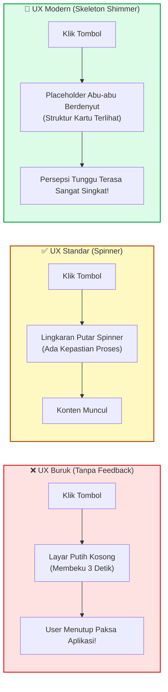
* **Tautan Kode Mandiri:**  
  👉 [`slide_04_indikator_pemuatan_loading.html`](../contoh_kode_program/sesi_07_api_storage_plugins/slide_04_indikator_pemuatan_loading.html)

---

### 📌 Slide 05: Integrasi Data Publik: Cuaca Sentra Layanan UT Daerah
* **Sub-CPMK:** Menghubungkan aplikasi dengan endpoint live REST API eksternal (Open-Meteo) tanpa kerumitan API key.
* **Alat yang Digunakan:** Google Chrome, DevTools (`F12` $\rightarrow$ Tab Network $\rightarrow$ Preview JSON), Koneksi Internet Aktif.
* **Narasi Dosen:**  
  *"Untuk memenuhi Kriteria 1 Tugas Tutorial 3, aplikasi kita membutuhkan integrasi REST API nyata yang bebas biaya dan tidak menyulitkan mahasiswa dengan pendaftaran kartu kredit. Kami memilih Open-Meteo API: penyedia data cuaca dan prakiraan cuaca global yang 100% terbuka tanpa perlu mendaftar token API key! Anda cukup mengirimkan parameter koordinat lintang (*latitude*) dan bujur (*longitude*) kantor UT daerah Anda, dan server cloud akan membalas dengan data suhu udara, kecepatan angin, serta kode cuaca secara real-time. Sangat mudah dan profesional!"*
* **Poin Kunci:**
  * URL Endpoint: `https://api.open-meteo.com/v1/forecast?latitude=-6.2146&longitude=106.8451&current_weather=true`.
  * Tanpa Autentikasi Ribet: Akses terbuka langsung via protokol HTTPS.
  * Parsing Objek JSON: Mengambil nilai `current_weather.temperature` (°C), `windspeed` (km/jam), dan `weathercode`.
  * Memenuhi Penuh Kriteria 1 Tugas Tutorial 3 (Bobot Maksimal 30 Poin).
* **Diagram Konsep:**
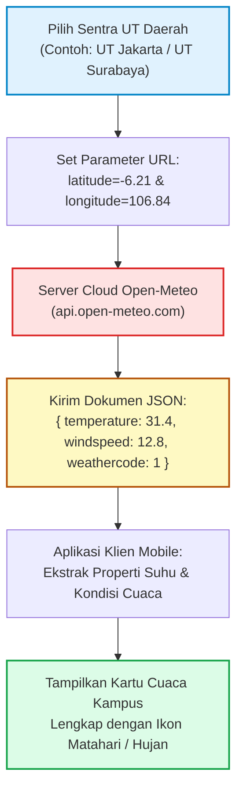
* **Tautan Kode Mandiri:**  
  👉 [`slide_05_integrasi_live_api_cuaca.html`](../contoh_kode_program/sesi_07_api_storage_plugins/slide_05_integrasi_live_api_cuaca.html)

---

### 📌 Slide 06: Spektrum Opsi Penyimpanan Data Mobile
* **Sub-CPMK:** Membandingkan kelebihan dan batasan 5 media penyimpanan data lokal pada perangkat bergerak.
* **Alat yang Digunakan:** Google Chrome, DevTools (`F12` $\rightarrow$ Tab Application $\rightarrow$ Storage Inspector).
* **Narasi Dosen:**  
  *"Di manakah kita harus menyimpan data catatan belajar mahasiswa di smartphone? Kita memiliki spektrum 5 media penyimpanan: Variabel RAM di Vue sangat cepat namun data langsung musnah ketika aplikasi di-reload. Web LocalStorage sangat mudah digunakan namun hanya sanggup menampung teks hingga 5MB. IndexedDB mampu menampung ratusan megabyte secara NoSQL. Plugin `@capacitor/preferences` memanfaatkan SharedPreferences native Android yang aman dan asinkron. Sedangkan jika Anda membutuhkan kueri relasional SQL tabel kompleks, gunakan plugin SQLite. Untuk kebutuhan Tugas Tutorial 3, LocalStorage atau Capacitor Preferences adalah pilihan yang paling ideal dan praktis!"*
* **Poin Kunci:**
  * Memori RAM (Ephemeral/Sementara) vs Storage Fisik (Persisten/Tahan Restart).
  * Web LocalStorage: Batas ~5MB, API Sinkron, Format Teks String Sederhana.
  * Capacitor Preferences: Berbasis Asinkron (Promise), Terpetakan ke SharedPreferences Android.
  * IndexedDB & SQLite: Solusi skala besar untuk transaksi data offline ribuan baris.
* **Diagram Konsep:**
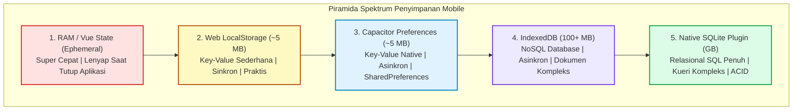
* **Tautan Kode Mandiri:**  
  👉 [`slide_06_komparasi_opsi_penyimpanan_mobile.html`](../contoh_kode_program/sesi_07_api_storage_plugins/slide_06_komparasi_opsi_penyimpanan_mobile.html)

---

### 📌 Slide 07: Operasi Key-Value dengan `@capacitor/preferences`
* **Sub-CPMK:** Mengeksekusi operasi simpan, baca, dan hapus data lokal persisten menggunakan Capacitor Preferences.
* **Alat yang Digunakan:** Google Chrome, DevTools (`F12` $\rightarrow$ Tab Console), Visual Studio Code.
* **Narasi Dosen:**  
  *"Plugin resmi `@capacitor/preferences` adalah standar utama dalam ekosistem Ionic untuk mengelola preferensi pengguna. Mengapa plugin ini lebih unggul dibanding LocalStorage biasa? Karena Capacitor Preferences bekerja secara non-blocking berbasis Promise dan secara otomatis memetakan datanya ke berkas XML SharedPreferences di Android serta UserDefaults di iOS. Metode dasarnya sangat elegan: `Preferences.set()` untuk menulis data, `Preferences.get()` untuk membaca kembali nilai, dan `Preferences.remove()` untuk menghapus kunci tertentu."*
* **Poin Kunci:**
  * 4 Metode Utama: `set({ key, value })`, `get({ key })`, `remove({ key })`, `clear()`.
  * Integrasi Platform Native: Menulis langsung ke direktori privat aplikasi Android.
  * Asynchronous Non-blocking I/O: Menjaga kelancaran antarmuka 60 FPS tanpa jeda patah-patah.
  * Pemenuhan Kriteria 2 Tugas Tutorial 3 (Bobot Maksimal 25 Poin).
* **Diagram Konsep:**
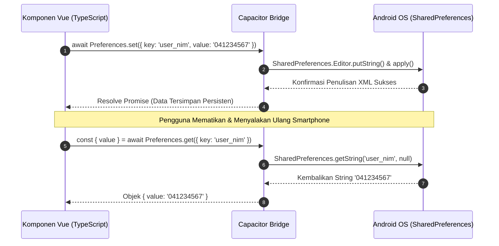
* **Tautan Kode Mandiri:**  
  👉 [`slide_07_capacitor_preferences_kv.html`](../contoh_kode_program/sesi_07_api_storage_plugins/slide_07_capacitor_preferences_kv.html)

---

### 📌 Slide 08: Serialisasi Array Objek: `JSON.stringify()` & `JSON.parse()`
* **Sub-CPMK:** Mengelola struktur data koleksi kompleks pada media penyimpanan berbasis teks.
* **Alat yang Digunakan:** Google Chrome, DevTools (`F12` $\rightarrow$ Tab Application $\rightarrow$ Local Storage & Tab Console).
* **Narasi Dosen:**  
  *"Media penyimpanan lokal di ponsel pintar hanya dapat menerima data berjenis teks (*string*). Jika Anda memaksakan untuk menyimpan array objek daftar sesi belajar mahasiswa secara langsung, data Anda akan rusak menjadi teks hampa `[object Object]`! Solusi mutlaknya adalah proses serialisasi: panggil `JSON.stringify()` saat hendak menyimpan data ke storage, dan panggil `JSON.parse()` saat membaca kembali string tersebut menjadi array objek JavaScript. Selalu bungkus proses pembacaan dalam blok try-catch agar aplikasi Anda tidak mogok jika berkas storage mengalami kerusakan!"*
* **Poin Kunci:**
  * Serialisasi Data: Mengubah Array/Objek JavaScript menjadi Teks String JSON (`JSON.stringify`).
  * Deserialisasi Data: Mengurai Teks String JSON kembali menjadi Struktur Objek Asli (`JSON.parse`).
  * Jebakan `[object Object]`: Terjadi jika objek mentah disimpan tanpa proses stringify terlebih dahulu.
  * Defensive Coding: Nilai fallback default array kosong `[]` jika storage masih bernilai `null`.
* **Diagram Konsep:**
```mermaid
flowchart LR
  subgraph Simpan ["Proses Penyimpanan (Save)"]
    Obj1["Array Objek JavaScript:<br>[ { modul: 'Modul 8', jam: 2 } ]"] -->|JSON.stringify| Str1["String JSON Murni:<br>'[{\"modul\":\"Modul 8\",\"jam\":2}]'"]
    Str1 -->|localStorage.setItem| Storage1[("Local Storage<br>(Format Teks)")]
  end

  subgraph Baca ["Proses Pembacaan (Load)"]
    Storage2[("Local Storage<br>(Format Teks)")] -->|localStorage.getItem| Str2["String JSON Murni"]
    Str2 -->|JSON.parse| Obj2["Array Objek JavaScript Aktif<br>(Dapat di-loop dengan v-for)"]
  end

  style Simpan fill:#e0f2fe,stroke:#0284c7,stroke-width:2px
  style Baca fill:#dcfce7,stroke:#16a34a,stroke-width:2px
```
* **Tautan Kode Mandiri:**  
  👉 [`slide_08_serialisasi_objek_json_storage.html`](../contoh_kode_program/sesi_07_api_storage_plugins/slide_08_serialisasi_objek_json_storage.html)

---

### 📌 Slide 09: Arsitektur Offline-First & Strategi Caching
* **Sub-CPMK:** Merancang arsitektur aplikasi tangguh offline dengan strategi Cache-First dan Network-First.
* **Alat yang Digunakan:** Google Chrome, DevTools (`F12` $\rightarrow$ Tab Network $\rightarrow$ Dropdown Throttling $\rightarrow$ Pilih Offline).
* **Narasi Dosen:**  
  *"Banyak rekan mahasiswa Universitas Terbuka yang belajar di daerah pelosok dengan sinyal internet seluler yang sering terputus. Aplikasi mobile modern tidak boleh menyerah dan menampilkan dinosaurus offline! Terapkan prinsip Offline-First: simpan salinan respon server terakhir ke penyimpanan lokal. Ketika mahasiswa membuka aplikasi di tengah hutan tanpa koneksi internet, aplikasi tetap menyajikan data cache lokal secara instan disertai label ramah 'Mode Offline Aktif'. Ada dua strategi caching utama: Network-First (coba ambil dari server dulu, jika gagal baru beralih ke cache) dan Cache-First (tampilkan data lokal seketika 0 ms, lalu perbarui data dari server di latar belakang)."*
* **Poin Kunci:**
  * Filosofi Offline-First: Memperlakukan ketiadaan koneksi internet sebagai kondisi normal, bukan kesalahan fatal.
  * Strategi Network-First: Prioritas data teranyar; beralih ke cache lokal jika terjadi galat jaringan (*timeout*).
  * Strategi Cache-First (Stale-While-Revalidate): Tampilan kilat seketika (*instant perceived performance*).
  * Notifikasi Visual Transparan: Menampilkan pita status ramah pengguna saat data disajikan dari memori cache.
* **Diagram Konsep:**
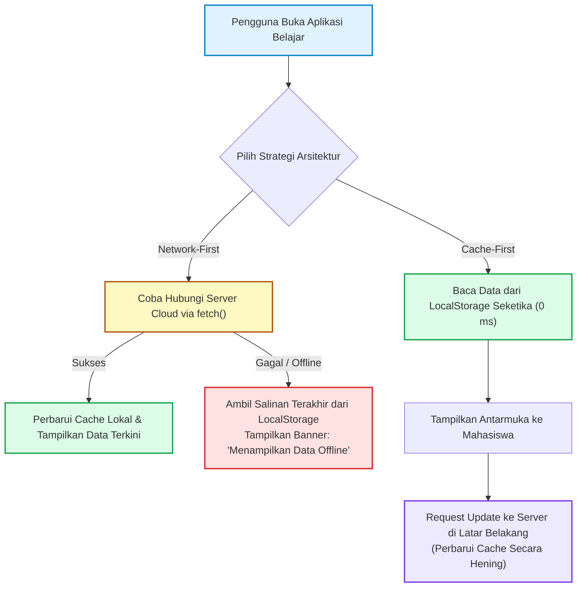
* **Tautan Kode Mandiri:**  
  👉 [`slide_09_arsitektur_offline_first_caching.html`](../contoh_kode_program/sesi_07_api_storage_plugins/slide_09_arsitektur_offline_first_caching.html)

---

### 📌 Slide 10: Integrasi Sensor GPS dengan `@capacitor/geolocation`
* **Sub-CPMK:** Mengakses koordinat presisi lintang dan bujur menggunakan plugin resmi Geolocation.
* **Alat yang Digunakan:** Google Chrome (Izinkan Izin Lokasi di Peramban), DevTools (`F12`), Smartphone Pribadi.
* **Narasi Dosen:**  
  *"Saatnya kita menghubungkan kode program dengan sensor perangkat keras smartphone! Plugin resmi `@capacitor/geolocation` memberikan akses langsung ke sistem penentu posisi global (GPS). Cukup dengan satu baris instruksi: `await Geolocation.getCurrentPosition({ enableHighAccuracy: true })`, aplikasi kita akan menerima data koordinat lintang (*latitude*), bujur (*longitude*), dan radius akurasi dalam meter. Di modul kode mandiri ini, kami juga telah menyiapkan mekanisme fallback berbasis peramban desktop sehingga Anda dapat langsung mencobanya di laptop tanpa kendala!"*
* **Poin Kunci:**
  * Akses Sensor Satelit: Mengambil koordinat geospasial lintang (*lat*) dan bujur (*lng*).
  * Opsi `enableHighAccuracy: true`: Mengaktifkan antena GPS fisik untuk presisi maksimal (toleransi < 15 meter).
  * Siklus Izin Lokasi: Meminta izin *ACCESS_FINE_LOCATION* secara aman sesuai kaidah privasi modern.
  * Tautan Peta Terbuka: Membuka koordinat langsung ke aplikasi Google Maps atau OpenStreetMap.
* **Diagram Konsep:**
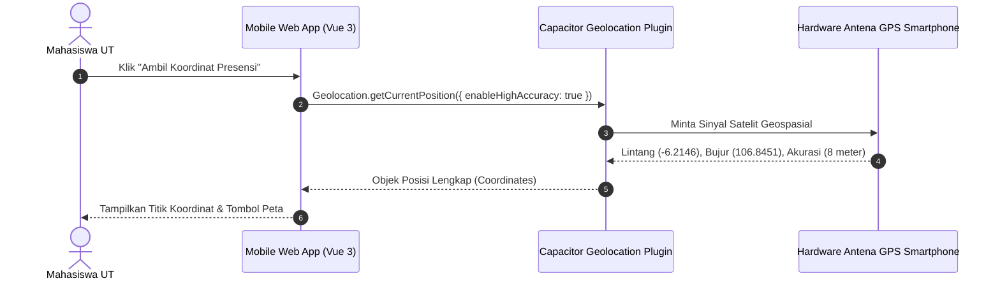
* **Tautan Kode Mandiri:**  
  👉 [`slide_10_plugin_geolocation_koordinat.html`](../contoh_kode_program/sesi_07_api_storage_plugins/slide_10_plugin_geolocation_koordinat.html)

---

### 📌 Slide 11: Validasi Presensi Geofencing via Rumus Haversine
* **Sub-CPMK:** Menerapkan formula matematis Haversine untuk memvalidasi radius jarak presensi ujian/tatap muka.
* **Alat yang Digunakan:** Google Chrome, DevTools (`F12` $\rightarrow$ Tab Console untuk inspeksi variabel kalkulasi), VS Code.
* **Narasi Dosen:**  
  *"Bagaimana cara memastikan bahwa mahasiswa benar-benar hadir belajar di gedung kampus UT daerah dan tidak menitip absen dari tempat tidur di rumah? Kita menerapkan teknologi Geofencing! Karena bumi berbentuk bulat, jarak antara titik koordinat GPS mahasiswa dan gedung kampus UT dihitung menggunakan Rumus Matematika Haversine. Jika jarak yang dihitung berada di dalam radius toleransi—misalnya maksimal 500 meter—maka tombol presensi menjadi hijau dan disetujui. Namun jika berada di luar radius, presensi akan ditolak dengan penjelasan jarak yang akurat. Inilah perpaduan hebat antara matematika dan rekayasa perangkat lunak!"*
* **Poin Kunci:**
  * Konsep Lingkaran Besar (*Great-Circle Distance*) pada Permukaan Bola Bumi ($R \approx 6.371\text{ km}$).
  * Algoritma Haversine: Mengonversi selisih sudut lintang/bujur dari derajat ke radian menggunakan fungsi sinus dan kosinus.
  * Penegakan Radius Kampus (*Geofence Radius*): Membatasi presensi hanya jika jarak $\le 500\text{ meter}$.
  * Penerapan Nyata: Sistem absensi tutorial tatap muka (TTM) dan ujian tatap muka terpercaya.
* **Diagram Konsep:**
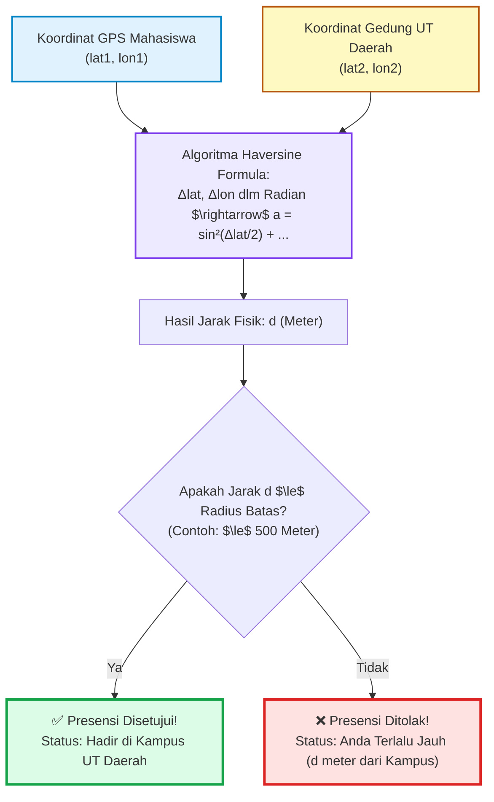
* **Tautan Kode Mandiri:**  
  👉 [`slide_11_geofencing_validasi_lokasi_ut.html`](../contoh_kode_program/sesi_07_api_storage_plugins/slide_11_geofencing_validasi_lokasi_ut.html)

---

### 📌 Slide 12: Integrasi Kamera Perangkat dengan `@capacitor/camera`
* **Sub-CPMK:** Menangkap foto bukti kegiatan belajar mandiri menggunakan antarmuka asinkron Capacitor Camera.
* **Alat yang Digunakan:** Google Chrome (Kamera Laptop / File Picker), Smartphone Android/iOS (Kamera Fisik Asli).
* **Narasi Dosen:**  
  *"Bukti fisik kegiatan belajar mandiri mahasiswa UT dapat divalidasi melalui foto modul BMP atau swafoto saat sesi belajar berlangsung. Menggunakan plugin `@capacitor/camera`, memicu kamera semudah memanggil fungsi `Camera.getPhoto()`. Anda dapat memilih format keluaran `DataUrl` (string teks berformat Base64) yang sangat praktis karena dapat disimpan langsung ke LocalStorage atau dikirim via JSON REST API. Di berkas kode mandiri kita, tersedia pula tombol pemilih berkas gambar (*file picker*) sebagai cadangan jika laptop Anda tidak dilengkapi webcam!"*
* **Poin Kunci:**
  * Opsi Format Foto: `CameraResultType.DataUrl` (Base64 Teks) vs `CameraResultType.Uri` (Path Berkas Lokal).
  * Optimasi Kompresi: Mengatur parameter `quality: 80` untuk mencegah ukuran string membengkak.
  * Sumber Masukan Fleksibel: Mendukung pemotretan kamera langsung (`CameraSource.Camera`) maupun galeri foto.
  * Memenuhi Kriteria 3 Tugas Tutorial 3 (Bobot Maksimal 25 Poin).
* **Diagram Konsep:**
```mermaid
sequenceDiagram
  autonumber
  actor Mahasiswa as Mahasiswa UT
  participant App as Antarmuka Mobile (Vue 3)
  participant CameraPlugin as Capacitor Camera Plugin
  participant Sensor as Sensor Hardware Kamera Ponsel

  Mahasiswa->>App: Klik "Ambil Foto Modul BMP"
  App->>CameraPlugin: Camera.getPhoto({ quality: 80, resultType: DataUrl })
  CameraPlugin->>Sensor: Nyalakan Modul Kamera Native
  Mahasiswa->>Sensor: Bidik & Jepret Foto Modul
  Sensor-->>CameraPlugin: Biner Raw Gambar
  CameraPlugin-->>App: String Base64 ('data:image/jpeg;base64,...')
  App-->>Mahasiswa: Tampilkan Thumbnail Foto Bukti Belajar
```
* **Tautan Kode Mandiri:**  
  👉 [`slide_12_plugin_camera_capture_photo.html`](../contoh_kode_program/sesi_07_api_storage_plugins/slide_12_plugin_camera_capture_photo.html)

---

### 📌 Slide 13: Deteksi Status Jaringan dengan `@capacitor/network`
* **Sub-CPMK:** Memasang pemantau (listener) status konektivitas internet untuk sinkronisasi otomatis.
* **Alat yang Digunakan:** Google Chrome, DevTools (`F12` $\rightarrow$ Network Throttling: Online/Offline), Laptop WiFi Toggle.
* **Narasi Dosen:**  
  *"Aplikasi mobile yang cerdas harus peka terhadap status koneksi internetnya. Menggunakan plugin `@capacitor/network`, kita dapat memasang pemantau acara (*event listener*) `networkStatusChange`. Begitu ponsel mendeteksi sinyal internet kembali aktif setelah sebelumnya offline, aplikasi secara otomatis menampilkan banner hijau 'Koneksi Pulih' dan mengeksekusi antrean sinkronisasi (*offline sync queue*) untuk mengunggah catatan belajar yang tertunda ke server cloud UT. Ini adalah pengalaman pengguna tingkat tinggi (*seamless synchronization*)!"*
* **Poin Kunci:**
  * Properti Status: `connected` (boolean) dan `connectionType` (wifi, cellular, none, unknown).
  * Event Listener Real-Time: `Network.addListener('networkStatusChange', status => { ... })`.
  * Konsep Antrean Sinkronisasi (*Sync Queue*): Menampung operasi simpan saat offline dan mengunggahnya saat online.
  * Umpan Balik Antarmuka: Mengubah warna bilah status secara responsif sesuai kondisi internet.
* **Diagram Konsep:**
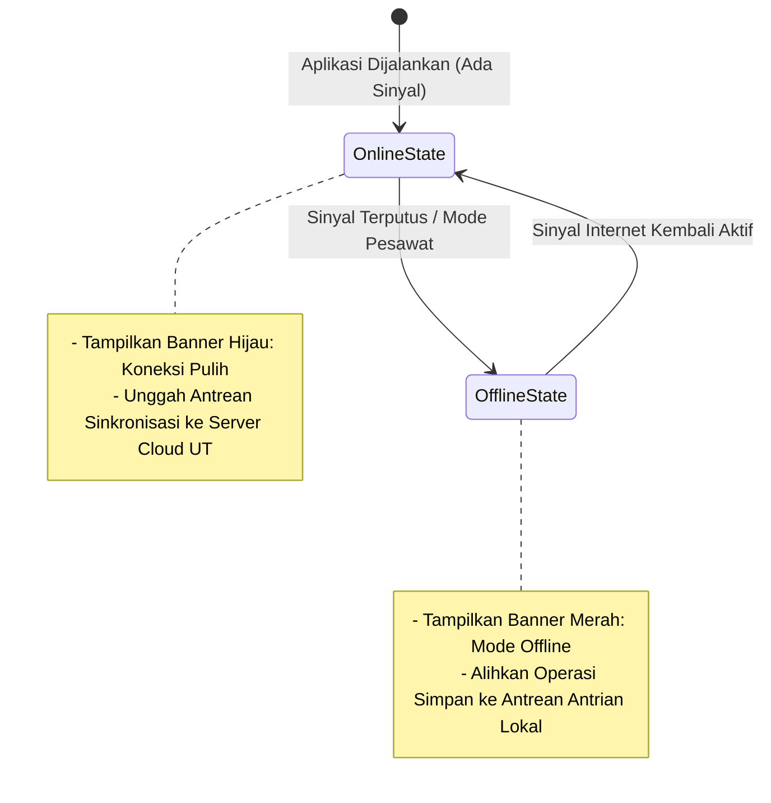
* **Tautan Kode Mandiri:**  
  👉 [`slide_13_plugin_network_status_detection.html`](../contoh_kode_program/sesi_07_api_storage_plugins/slide_13_plugin_network_status_detection.html)

---

### 📌 Slide 14: Arsitektur Bersih: Pemisahan Logika via Service Layer
* **Sub-CPMK:** Menerapkan Service Pattern untuk memisahkan urusan UI dengan logika akses data REST dan Storage.
* **Alat yang Digunakan:** Visual Studio Code, Google Chrome, DevTools (`F12` $\rightarrow$ Console).
* **Narasi Dosen:**  
  *"Jangan pernah menumpuk kode pemanggilan REST API, kueri storage, dan kalkulasi data di dalam berkas template komponen Vue Anda! Praktik tersebut membuat kode Anda menjadi 'spaghetti' kusut yang sangat sulit diuji dan dirawat. Terapkan prinsip Separation of Concerns dengan membuat lapisan berkas layanan khusus, misalnya `studyTrackerService.ts`. Komponen antarmuka Anda cukup memanggil `StudyTrackerService.getAll()` atau `save()`. Jika suatu saat endpoint server cloud UT berubah, Anda hanya perlu memperbaiki satu berkas layanan saja tanpa menyentuh tampilan antarmuka!"*
* **Poin Kunci:**
  * Prinsip *Separation of Concerns* (Pemisahan Tanggung Jawab): UI fokus pada tampilan, Service fokus pada logika data.
  * Pola Service Layer (`studyTrackerService.ts`): Menyediakan antarmuka fungsi bersih yang dapat digunakan kembali (*reusable*).
  * Kemudahan Pemeliharaan (*Maintainability*): Perubahan struktur API atau storage tidak merusak desain template.
  * Memenuhi Kriteria 4 Tugas Tutorial 3 (Bobot Maksimal 20 Poin).
* **Diagram Konsep:**
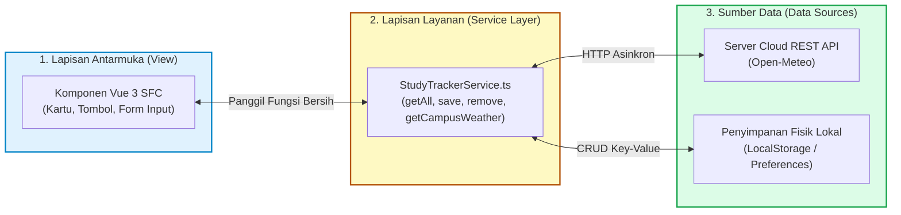
* **Tautan Kode Mandiri:**  
  👉 [`slide_14_clean_architecture_service_pattern.html`](../contoh_kode_program/sesi_07_api_storage_plugins/slide_14_clean_architecture_service_pattern.html)

---

### 📌 Slide 15: Keamanan API: Manajemen Token JWT & Header Authorization
* **Sub-CPMK:** Mengamankan transaksi data private mahasiswa menggunakan JSON Web Token (JWT) dan Header Bearer.
* **Alat yang Digunakan:** Google Chrome, DevTools (`F12` $\rightarrow$ Tab Network $\rightarrow$ Request Headers & Tab Console).
* **Narasi Dosen:**  
  *"Saat mengakses data sensitif seperti riwayat nilai tugas atau presensi pribadi, server kampus membutuhkan bukti keabsahan identitas Anda. Server menerbitkan tiket digital terenkripsi bernama JSON Web Token (JWT). Token ini disimpan secara aman di memori lokal dan dilampirkan pada setiap permintaan HTTP melalui header standar `Authorization: Bearer <token>`. Waspadai aturan krusial keamanan web ini: bagian payload JWT hanya di-encode dalam Base64 dan sangat mudah dibaca siapa saja, jadi jangan pernah menyimpan kata sandi (*plaintext password*) di dalamnya!"*
* **Poin Kunci:**
  * 3 Struktur Anatomi JWT: Header (Algoritma), Payload (Klaim Identitas & Masa Berlaku), Signature (Tanda Tangan Kriptografi).
  * Format Header Standar: `headers: { 'Authorization': 'Bearer ' + token }`.
  * Penanganan Galat 401 Unauthorized: Menghapus token kedaluwarsa dan mengarahkan pengguna kembali ke halaman login.
  * Prinsip *Least Privilege*: Hanya menyimpan informasi identitas minimal (*user_id*, *role*) di dalam payload token.
* **Diagram Konsep:**
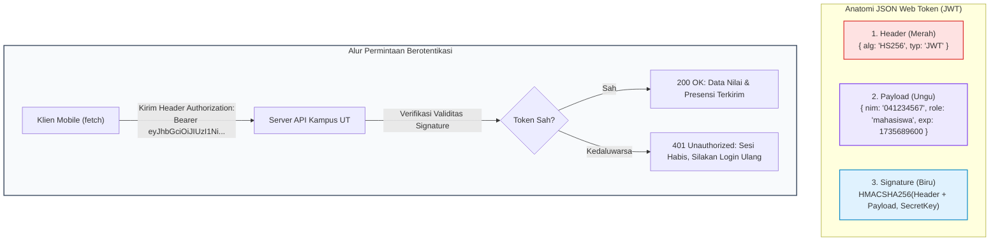
* **Tautan Kode Mandiri:**  
  👉 [`slide_15_keamanan_token_jwt_dan_interceptor.html`](../contoh_kode_program/sesi_07_api_storage_plugins/slide_15_keamanan_token_jwt_dan_interceptor.html)

---

### 📌 Slide 16: Pedoman & Rubrik Penilaian Resmi TUGAS TUTORIAL 3 (Skala 0–100)
* **Sub-CPMK:** Membedah 4 kriteria evaluasi praktikum Tugas Tutorial 3 untuk meraih skor maksimal 100.
* **Alat yang Digunakan:** Google Chrome (membuka kalkulator rubrik interaktif), Visual Studio Code, Markdown Viewer.
* **Narasi Dosen:**  
  *"Sebelum mulai menulis baris kode tugas, mari kita bedah bersama rubrik evaluasi resmi Tugas Tutorial 3 yang berbobot 20% nilai Tuton. Ada 4 pilar penilaian yang wajib Anda penuhi: Kriteria 1 berbobot 30 poin untuk konsumsi REST API asinkron dengan loading indicator; Kriteria 2 berbobot 25 poin untuk operasi CRUD penyimpanan offline persisten; Kriteria 3 berbobot 25 poin untuk integrasi sensor fisik (GPS atau Kamera); dan Kriteria 4 berbobot 20 poin untuk kebersihan arsitektur kode serta video demo YouTube yang komunikatif. Kami telah menyediakan kalkulator simulator interaktif di berkas HTML pendamping agar Anda dapat mengaudit skor Anda sendiri secara mandiri!"*
* **Poin Kunci:**
  * **Kriteria 1 (30 Poin):** Integrasi Live REST API Asinkron (`fetch()`, `async/await`, Spinner/Skeleton, Penanganan Galat Jaringan).
  * **Kriteria 2 (25 Poin):** Offline Storage Persisten (CRUD Catatan Belajar, `JSON.stringify`, `JSON.parse`, Data Bertahan Saat Refresh).
  * **Kriteria 3 (25 Poin):** Akses Sensor Perangkat Keras (Geolocation GPS Radius Kampus atau Camera Pemotret Bukti Belajar).
  * **Kriteria 4 (20 Poin):** Kerapian Arsitektur, Desain Mobile Responsif, Laporan PDF Lengkap, dan Video Demo YouTube (Unlisted).
  * **Total Evaluasi:** 100 Poin (Bobot 20% terhadap Nilai Akhir Mata Kuliah).
* **Diagram Konsep:**
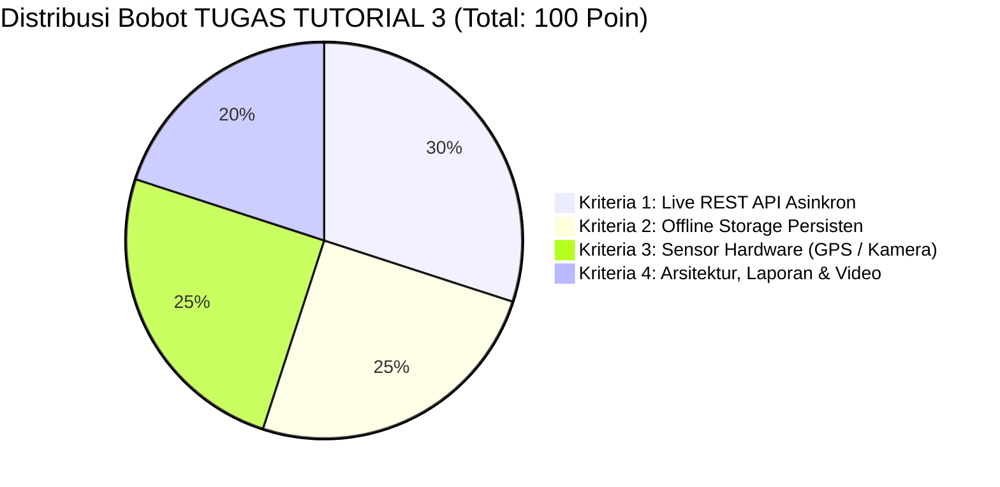
* **Tautan Berkas Pendamping:**  
  👉 [🌐 **Kalkulator Skor & Simulator Rubrik Interaktif:** `slide_16_rubrik_tugas_tutorial_3.html`](../contoh_kode_program/sesi_07_api_storage_plugins/slide_16_rubrik_tugas_tutorial_3.html)  
  👉 [📄 **Buku Saku Panduan Rubrik Teks Lengkap:** `slide_16_rubrik_tugas_tutorial_3.md`](../contoh_kode_program/sesi_07_api_storage_plugins/slide_16_rubrik_tugas_tutorial_3.md)

---

### 📌 Slide 17: Master Solusi Resmi Tugas Tutorial 3: UT Study Tracker & Presensi Belajar
* **Sub-CPMK:** Menelaah dan menguji arsitektur aplikasi mobile lengkap yang mengintegrasikan REST API, Storage, GPS, dan Kamera.
* **Alat yang Digunakan:** Google Chrome, DevTools (`F12`), Mode Ponsel (`Ctrl + Shift + M`), Koneksi Internet Aktif.
* **Narasi Dosen:**  
  *"Inilah mahakarya penutup praktikum kita: Master Solusi Resmi Tugas Tutorial 3 bernama 'UT Study Tracker & Presensi Belajar Mobile'. Aplikasi ini menyatukan seluruh pilar yang telah kita pelajari: memuat prakiraan cuaca kampus terkini via live REST API Open-Meteo, mengunci titik koordinat GPS mahasiswa dan memvalidasi jaraknya ke gedung kampus UT daerah, melampirkan foto bukti fisik modul BMP belajar, menghitung total jam belajar secara dinamis, serta menyimpan seluruh riwayat secara permanen di storage lokal sehingga tidak hilang saat peramban direfresh. Berkas ini adalah rujukan nyata peraih skor 100 yang siap Anda pelajari dan modifikasi!"*
* **Poin Kunci:**
  * Integrasi Penuh 4 Pilar dalam Satu Antarmuka Terpadu (*Unified Dashboard*).
  * Dasbor Statistik Real-Time: Total Jam Belajar, Jumlah Modul Dituntaskan, dan Status Presensi Lokasi.
  * Operasi CRUD Lengkap: Tambah catatan belajar baru, lihat riwayat, filter kategori modul, dan hapus data.
  * Arsitektur Tangguh: Data tersimpan persisten di LocalStorage dengan format serialisasi JSON yang rapi.
* **Diagram Konsep:**
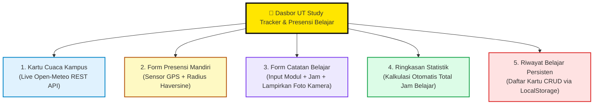
* **Tautan Kode Mandiri:**  
  👉 [`slide_17_solusi_tugas_3_study_tracker.html`](../contoh_kode_program/sesi_07_api_storage_plugins/slide_17_solusi_tugas_3_study_tracker.html)

---

### 📌 Slide 18: Jembatan Menuju Sesi 08: Rilis APK Stand-alone & Sukses UAS
* **Sub-CPMK:** Mengantisipasi finalisasi rilis paket APK produksi mandiri, pembuatan keystore digital, dan persiapan UAS.
* **Alat yang Digunakan:** Google Chrome, Visual Studio Code, Android Studio, Smartphone Android Pribadi.
* **Narasi Dosen:**  
  *"Selamat atas pencapaian luar biasa rekan-rekan mahasiswa Fakultas Sains dan Teknologi Universitas Terbuka! Anda telah menaklukkan seluruh materi teknis pengembangan aplikasi mobile modern dengan hasil yang sangat membanggakan. Di Sesi 08 pekan depan—sesi pamungkas perkuliahan kita—kita akan melangkah ke tahap puncak: membuat Digital Keystore mandiri, menandatangani kode (*code signing*), dan mengompilasi APK Release mandiri yang dapat langsung dibagikan lewat WhatsApp dan diinstal di ponsel siapa pun tanpa memerlukan kabel atau komputer! Tidak hanya itu, kami juga telah menyiapkan pembahasan akbar 50 Bank Soal UAS STSI4303 untuk mengantar Anda meraih nilai A mutlak. Sampai jumpa di Sesi 08 penutup!"*
* **Poin Kunci:**
  * Agenda Sesi 08: Pembuatan Keystore Digital, Build APK Release Standalone, Minifikasi ProGuard/R8.
  * Pembahasan Akbar: 50 Bank Soal Komprehensif Ujian Akhir Semester (UAS STSI4303 / MSIM4401).
  * Pengecekan Akhir Portofolio: Memastikan Tugas Tutorial 1, 2, dan 3 telah terunggah sempurna di LMS Tuton UT.
  * Transformasi Mahasiswa: Siap menjadi Pengembang Aplikasi Mobile Hybrid Profesional!
* **Diagram Konsep:**
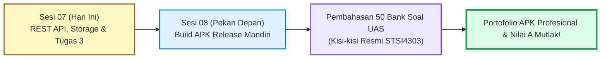
* **Tautan Kode Mandiri:**  
  👉 [`slide_18_preview_sesi_08_build_apk_uas.html`](../contoh_kode_program/sesi_07_api_storage_plugins/slide_18_preview_sesi_08_build_apk_uas.html)

---

## 📚 Daftar Pustaka & Standar Mutu Akademik

1. **Capacitor Core Engineering Team.** (2024). *Capacitor Plugins API Documentation: Preferences, Geolocation, Camera, and Network Integration*. https://capacitorjs.com/docs/apis
2. **MDN Web Docs Community.** (2024). *Fetch API Specification, Using Fetch, & Promises / async-await asynchronous programming in JavaScript*. Mozilla Developer Network. https://developer.mozilla.org/en-US/docs/Web/API/Fetch_API
3. **Open-Meteo Weather Forecast API.** (2024). *Open-Source Free Weather API Documentation (No API Key Required)*. https://open-meteo.com/en/docs
4. **Internet Engineering Task Force (IETF).** (2015). *RFC 7519: JSON Web Token (JWT) Architecture and Security Claims*. https://datatracker.ietf.org/doc/html/rfc7519
5. **Sinnott, R. W.** (1984). *Virtues of the Haversine*. Sky and Telescope, 68(2), 159. (Formula for calculating great-circle distances between pairs of coordinates on a sphere).
6. **W3C Geolocation Working Group.** (2022). *Geolocation API Specification (Recommendation)*. World Wide Web Consortium. https://www.w3.org/TR/geolocation/
7. **Prafanto, A.** (2025). *Buku Materi Pokok (BMP) Pemrograman Berbasis Perangkat Bergerak (MSIM4401 / STSI4303)*. Modul 8: Akses Web Service & REST API; Modul 9: Penyimpanan Data & Akses Sensor Perangkat Bergerak. Tangerang Selatan: Penerbit Universitas Terbuka.
8. **Tim Pengembang Kurikulum FST UT.** (2025). *Rancangan Aktivitas Tutorial (RAT) dan Satuan Acara Tutorial (SAT) STSI4303*. Tangerang Selatan: Universitas Terbuka.
