# 📱 NASKAH & SLIDE SESI 08: BUILD APK RELEASE, DIGITAL SIGNING, & 50 BANK SOAL UAS
## Mata Kuliah: Pemrograman Berbasis Perangkat Bergerak (STSI4303 / MSIM4401)
### Program Studi: S1 Sistem Informasi & S1 Informatika — Fakultas Sains dan Teknologi (FST) Universitas Terbuka
### Dosen Pengampu: Anton Prafanto, S.Kom., M.T.
### Modul Acuan BMP: Modul 9 (Kompilasi, Distribusi & Pemeliharaan) & Review Komprehensif Modul 1 s.d. 9

---

> [!TIP]
> **Akses Cepat Materi, Simulator Interaktif, & Kode Program Sesi 08 (Grand Finale):**
> - 🌐 **18 Berkas Contoh Program HTML Siap Dijalankan:** [`contoh_kode_program/sesi_08_build_apk_uas/`](../contoh_kode_program/sesi_08_build_apk_uas/)
> - 📋 **Kisi-kisi Resmi Komprehensif UAS 9 Modul BMP (Slide 12):** [`slide_12_kisi_kisi_uas_modul_1_sampai_9.html`](../contoh_kode_program/sesi_08_build_apk_uas/slide_12_kisi_kisi_uas_modul_1_sampai_9.html)
> - 🏆 **Master Solusi Lab Quest 08: APK Validator & 50 Soal Exam Engine (Slide 17):** [`slide_17_lab_quest_08_apk_validator.html`](../contoh_kode_program/sesi_08_build_apk_uas/slide_17_lab_quest_08_apk_validator.html)
> - 🖥️ **Slide Presentasi PowerPoint (PPTX 18 Slide Neo-Brutalisme):** [`SESI_08_Optimasi_Build_APK_dan_Bank_Soal_UAS.pptx`](SESI_08_Optimasi_Build_APK_dan_Bank_Soal_UAS.pptx)

---

## 🛠️ Panduan Alat & Lingkungan Belajar (Ramah Awam & Pemula)

Bagi rekan-rekan mahasiswa yang baru pertama kali memasuki tahapan kompilasi biner (*binary build*), penandatanganan kriptografi digital (*keystore signing*), dan persiapan Ujian Akhir Semester (UAS), jangan berkecil hati atau merasa cemas! Seluruh materi Sesi 08 dirancang dengan filosofi **The Zero-Friction Courseware Framework** yang sangat ramah terhadap komputer atau laptop dengan spesifikasi standar (RAM 4–8 GB):

1. **Google Chrome / Microsoft Edge:**
   * **Fungsi:** Menjalankan seluruh 18 berkas mandiri `.html` secara langsung lewat protokol `file:///` tanpa perlu menyalakan server lokal Node.js atau Apache.
   * **Cara Penggunaan:** Cukup klik ganda (*double-click*) berkas `.html` yang ingin dipelajari, atau seret (*drag-and-drop*) berkas ke jendela peramban Anda.
2. **Google Chrome DevTools (`F12` atau `Ctrl + Shift + I`):**
   * **Tab Application:** Digunakan khusus pada Slide 10 untuk memeriksa status *Manifest* PWA, *Service Workers*, dan isi memori *Cache Storage*.
   * **Tab Network:** Digunakan pada Slide 08 untuk menginspeksi ukuran berkas aset grafis WebP dan efek *tree-shaking* pada transfer jaringan.
   * **Tab Console:** Menguji ekspresi JavaScript dan memantau respon event simulator secara *real-time*.
3. **Mode Perangkat Mobile (`Ctrl + Shift + M`):**
   * **Fungsi:** Mengubah tampilan peramban desktop menjadi kanvas layar ponsel pintar (*smartphone virtual*) agar Anda dapat menguji responsivitas antarmuka aplikasi.
4. **Terminal / Shell (PowerShell / Git Bash / Command Prompt):**
   * **Fungsi:** Tempat mengeksekusi utilitas Java JDK `keytool` (membuat sertifikat digital) dan perintah Gradle Wrapper `./gradlew assembleRelease` (menghasilkan berkas APK biner mandiri).
5. **Smartphone Fisik Android:**
   * **Fungsi:** Digunakan untuk menguji instalasi mandiri (*sideloading*) berkas `app-release.apk` hasil build secara langsung tanpa memerlukan kabel data atau komputer.

---

## 🗺️ Gambaran Umum Sesi 08

Sesi kedelapan ini merupakan **puncak penutup perkuliahan (Grand Finale & Sesi Penutup Semester)** yang mengantarkan mahasiswa dari ranah kode pengembangan menuju produk perangkat lunak biner mandiri yang siap digunakan oleh masyarakat luas. Fokus utama sesi ini terbagi menjadi dua pilar esensial:

1. **Engineering & Deployment (Kompilasi Biner & Rilis Stand-alone):**
   Mahasiswa mempelajari siklus rilis aplikasi mobile profesional, pembuatan sertifikat digital Keystore RSA 2048-bit via utilitas `keytool`, konfigurasi penandatanganan otomatis (`signingConfigs`) pada `android/app/build.gradle`, eksekusi kompilasi `./gradlew assembleRelease` untuk menghasilkan berkas `.apk` mandiri yang dapat dipasang (*sideloading*) tanpa PC dan tanpa ketergantungan pada Google Play Store, optimasi biner melalui minifikasi R8 / ProGuard (`minifyEnabled` dan `shrinkResources`), optimasi aset web (kompresi gambar WebP, tree shaking ES modules), audit keamanan pra-rilis (proteksi cleartext traffic HTTPS, sanitasi izin permission), alternatif distribusi Progressive Web App (PWA) via Service Worker Cache, serta pemahaman standar publikasi Google Play Console dan format modern Android App Bundle (`.aab`).
2. **Academic Mastery & Exam Preparation (50 Bank Soal Komprehensif UAS):**
   Pembedahan menyeluruh kisi-kisi resmi Ujian Akhir Semester (UAS) STSI4303 / MSIM4401 yang mencakup 9 Modul Buku Materi Pokok (BMP) UT. Sesi ini menyajikan 50 butir soal pilihan ganda akademik berkualitas tinggi lengkap dengan kunci jawaban dan pembahasan pedagogis, serta ditutup dengan **Master Solusi Lab Quest 08** berupa Interactive APK Release Validator & 50-Question UAS Exam Engine berwaktu mundur 90 menit.

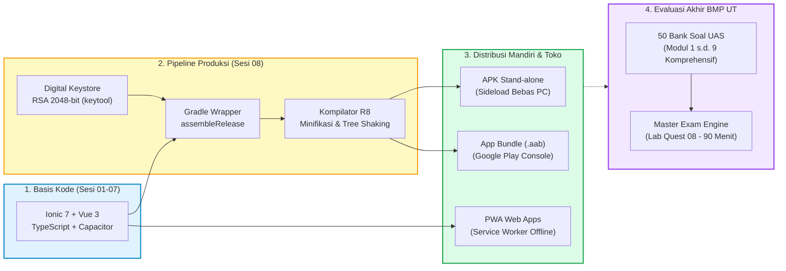

---

## 📊 Daftar 18 Slide Pembahasan & Berkas Kode Mandiri

---

### 📌 Slide 01: Orientasi Sesi 08: Rilis APK Stand-alone & Sukses UAS
* **Sub-CPMK:** Memahami alur kerja transformasi kode sumber web hybrid menjadi berkas biner mandiri dan kesiapan menghadapi UAS.
* **Alat & Lingkungan Uji:** Google Chrome / Edge di PC atau smartphone, buka berkas HTML via `file:///`.
* **Narasi Dosen Pengampu:**  
  *"Selamat berjumpa di garis akhir perkuliahan kita, rekan-rekan mahasiswa Fakultas Sains dan Teknologi Universitas Terbuka yang saya banggakan! Di Sesi 08 penutup ini, kita akan merayakan pencapaian besar: mengubah kode yang telah kita susun sejak Sesi 01 menjadi berkas installer mandiri (`.apk`) yang bisa Anda kirimkan lewat WhatsApp atau Google Drive dan langsung dipasang di ponsel keluarga, rekan, atau calon pengguna tanpa perlu kabel data atau laptop. Selain itu, kita akan membedah tuntas 50 bank soal UAS komprehensif agar Anda siap meraih nilai A mutlak!"*
* **Poin Kunci Pembahasan:**
  * Transformasi menyeluruh dari mode pengembangan (*development*) menuju biner rilis produksi (*production release*).
  * Dua pilar kelulusan sesi penutup: Biner APK mandiri dan kesiapan 100% menghadapi UAS 9 Modul BMP UT.
  * Penerapan filosofi *zero-friction*: pembelajaran ramah komputer standar tanpa kendala kuota besar.
* **Diagram Mermaid:**
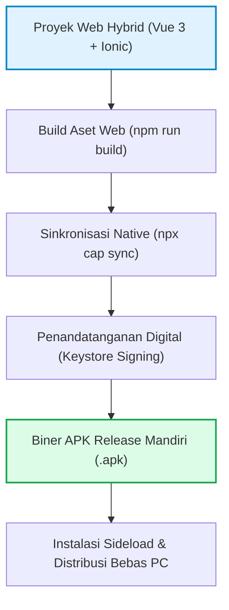
* **Tautan Berkas Kode Mandiri:**  
  👉 [`slide_01_orientasi_sesi_08_final.html`](../contoh_kode_program/sesi_08_build_apk_uas/slide_01_orientasi_sesi_08_final.html)

---

### 📌 Slide 02: Siklus Rilis Aplikasi Mobile (Development to Maintenance)
* **Sub-CPMK:** Menganalisis 5 fase siklus hidup rilis aplikasi mobile dari alpha testing hingga pasca rilis.
* **Alat & Lingkungan Uji:** Google Chrome, DevTools `F12`.
* **Narasi Dosen Pengampu:**  
  *"Membangun aplikasi mobile profesional tidak pernah berhenti ketika kode selesai diketik di editor teks. Terdapat siklus rilis terstruktur yang membedakan seorang pembuat kode amatir dengan insinyur perangkat lunak profesional: fase Development (pengembangan fitur), Alpha Testing (pengujian fungsional internal), Beta Testing (pengujian pada sekelompok pengguna riil), Production Release (distribusi biner terverifikasi), serta Post-Release Monitoring (pemantauan galat crash dan pembaruan berkala). Mari kita pahami setiap tahapannya dengan seksama!"*
* **Poin Kunci Pembahasan:**
  * 5 Fase Rilis: Development $\rightarrow$ Alpha $\rightarrow$ Beta $\rightarrow$ Production $\rightarrow$ Maintenance.
  * Standar penomoran versi Android: `versionCode` (bilangan bulat monoton naik untuk sistem) dan `versionName` (format semver `x.y.z` untuk manusia).
  * Manajemen *rollback* dan strategi mitigasi bencana jika terjadi *bug* pada versi produksi.
* **Diagram Mermaid:**
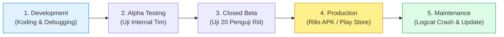
* **Tautan Berkas Kode Mandiri:**  
  👉 [`slide_02_siklus_rilis_aplikasi_mobile.html`](../contoh_kode_program/sesi_08_build_apk_uas/slide_02_siklus_rilis_aplikasi_mobile.html)

---

### 📌 Slide 03: Pembuatan Digital Keystore via `keytool`
* **Sub-CPMK:** Membangun sertifikat kriptografi digital mandiri menggunakan utilitas standar JDK `keytool`.
* **Alat & Lingkungan Uji:** Terminal PowerShell / Bash / CMD, utilitas JDK `keytool`.
* **Narasi Dosen Pengampu:**  
  *"Sistem operasi Android memberlakukan aturan keamanan mutlak: tidak ada satu pun berkas APK yang diizinkan terpasang tanpa tanda tangan digital yang valid. Sertifikat ini dibungkus di dalam berkas Keystore (`.keystore` atau `.jks`). Kita membuatnya menggunakan utilitas bawaan Java JDK yaitu keytool dengan algoritma RSA 2048-bit dan masa berlaku minimal 10.000 hari (lebih dari 25 tahun). Ingat pesan penting saya: simpan berkas ini dan kata sandinya dengan sangat aman! Jika Anda kehilangan keystore asli, Anda tidak akan pernah bisa memperbarui aplikasi Anda di ponsel pengguna!"*
* **Poin Kunci Pembahasan:**
  * Perintah resmi pembuatan: `keytool -genkeypair -v -keystore ut-release.keystore -alias utkey -keyalg RSA -keysize 2048 -validity 10000`.
  * Keystore berfungsi sebagai 'Kartu Tanda Penduduk' digital bagi pengembang di mata sistem operasi Android.
  * Praktik keamanan terbaik: Berkas `.keystore` wajib dimasukkan ke `.gitignore` dan pantang di-commit ke repositori publik GitHub!
* **Diagram Mermaid:**
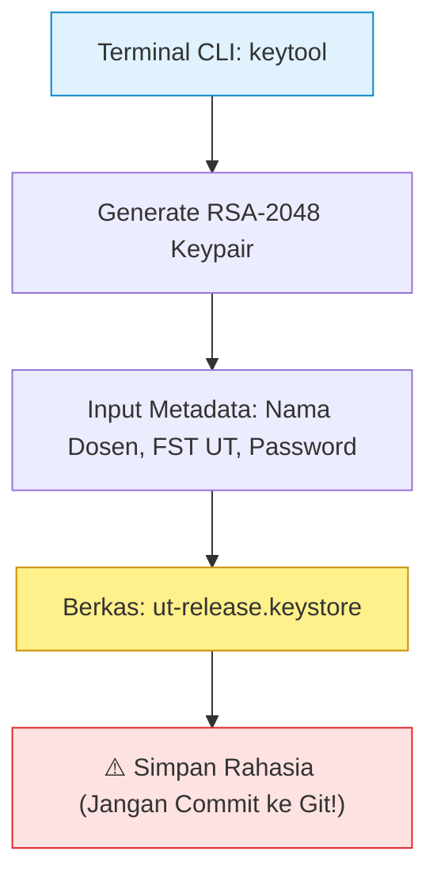
* **Tautan Berkas Kode Mandiri:**  
  👉 [`slide_03_pembuatan_keystore_digital.html`](../contoh_kode_program/sesi_08_build_apk_uas/slide_03_pembuatan_keystore_digital.html)

---

### 📌 Slide 04: Konfigurasi Otomasi Signing pada `build.gradle`
* **Sub-CPMK:** Mengonfigurasi penandatanganan biner otomatis pada skrip Gradle Android Studio.
* **Alat & Lingkungan Uji:** Visual Studio Code / Editor Teks, berkas `android/app/build.gradle`.
* **Narasi Dosen Pengampu:**  
  *"Menandatangani berkas APK secara manual setiap kali melakukan build tentu sangat melelahkan dan rentan kesalahan manusia. Melalui berkas skrip `android/app/build.gradle`, kita dapat mengonfigurasi blok `signingConfigs` khusus tipe rilis. Kita tautkan berkas keystore, kata sandi, dan alias kuncinya. Di lingkungan industri profesional, kata sandi tidak ditulis langsung (hardcoded) di skrip, melainkan dipanggil dari berkas `gradle.properties` lokal atau variabel sistem (environment variables) demi menjamin keamanan."*
* **Poin Kunci Pembahasan:**
  * Blok konfigurasi Gradle: `signingConfigs { release { storeFile file('...') ... } }`.
  * Mengikat konfigurasi penandatanganan pada `buildTypes { release { signingConfig signingConfigs.release } }`.
  * Pemisahan kredensial sensitif menggunakan file `gradle.properties` lokal yang diabaikan oleh Git.
* **Diagram Mermaid:**
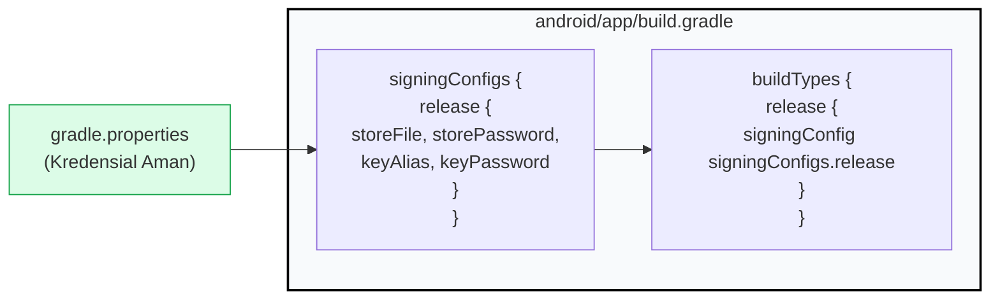
* **Tautan Berkas Kode Mandiri:**  
  👉 [`slide_04_konfigurasi_signing_build_gradle.html`](../contoh_kode_program/sesi_08_build_apk_uas/slide_04_konfigurasi_signing_build_gradle.html)

---

### 📌 Slide 05: Kompilasi APK Release Stand-alone via Gradle Wrapper
* **Sub-CPMK:** Mengeksekusi perintah CLI Gradle Wrapper untuk menghasilkan berkas installer mandiri `.apk`.
* **Alat & Lingkungan Uji:** Terminal shell pada folder `android/`, perintah `./gradlew assembleRelease`.
* **Narasi Dosen Pengampu:**  
  *"Kini tiba saatnya melahirkan berkas biner mandiri perdana Anda! Masuklah ke subdirektori `android/` melalui terminal, lalu jalankan perintah `./gradlew assembleRelease`. Mesin kompilator Gradle akan bekerja mengompilasi kode sumber Java/Kotlin, memproses seluruh aset web Capacitor, menjalankan penyusutan biner, menandatanganinya dengan sertifikat digital, dan menyelaraskan struktur data berkas (zipalign). Hasil akhirnya adalah berkas `app-release.apk` mandiri yang tersimpan rapi di direktori `build/outputs/apk/release/`!"*
* **Poin Kunci Pembahasan:**
  * Perintah eksekusi: `./gradlew assembleRelease` (Linux/macOS/PowerShell) atau `gradlew.bat assembleRelease` (Command Prompt).
  * Lokasi penyimpanan biner: `android/app/build/outputs/apk/release/app-release.apk`.
  * Verifikasi biner melalui utilitas `apksigner verify --verbose app-release.apk` (memastikan skema tanda tangan v2/v3 aktif).
* **Diagram Mermaid:**
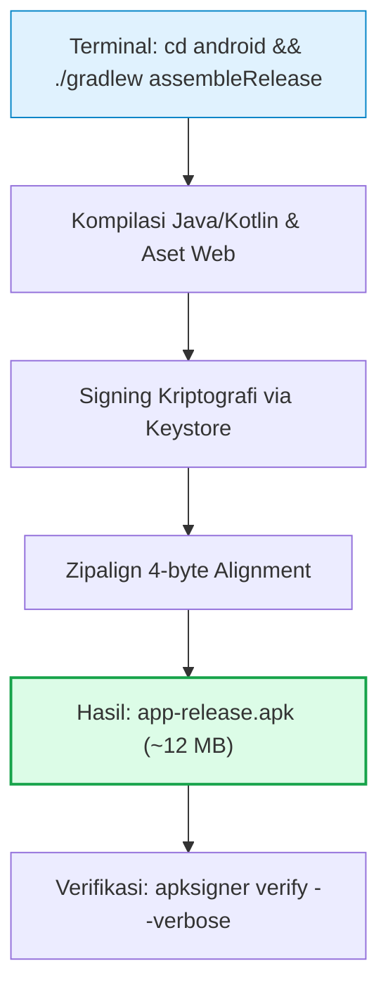
* **Tautan Berkas Kode Mandiri:**  
  👉 [`slide_05_kompilasi_apk_assemble_release.html`](../contoh_kode_program/sesi_08_build_apk_uas/slide_05_kompilasi_apk_assemble_release.html)

---

### 📌 Slide 06: Instalasi Mandiri (Sideloading) APK ke Smartphone Tanpa PC
* **Sub-CPMK:** Memahami mekanisme sideloading APK, perizinan sumber tidak dikenal, dan pengujian independen.
* **Alat & Lingkungan Uji:** Smartphone Android fisik, aplikasi File Manager / WhatsApp / Google Drive.
* **Narasi Dosen Pengampu:**  
  *"Setelah berkas `app-release.apk` selesai dibuat, bagaimana cara membagikannya ke orang lain? Sangat mudah: cukup unggah berkas APK tersebut ke Google Drive atau kirimkan langsung melalui chat WhatsApp! Ketika rekan Anda mengetuk berkas tersebut di HP Android, sistem akan menampilkan dialog keamanan 'Install Unknown Apps' (Pasang Aplikasi dari Sumber Tidak Dikenal). Begitu izin diberikan, aplikasi Anda terpasang dengan ikon dan nama resmi, berjalan secara mandiri 100% tanpa butuh kabel USB maupun komputer!"*
* **Poin Kunci Pembahasan:**
  * Konsep dan mekanisme *Sideloading* pada ekosistem Android.
  * Penjelasan dialog keamanan sistem: *Unknown Sources* dan *Play Protect Unrecognized Developer*.
  * Kemandirian eksekusi aplikasi mobile pada container Android System WebView tanpa server eksternal.
* **Diagram Mermaid:**
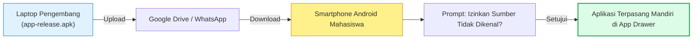
* **Tautan Berkas Kode Mandiri:**  
  👉 [`slide_06_instalasi_apk_mandiri_tanpa_pc.html`](../contoh_kode_program/sesi_08_build_apk_uas/slide_06_instalasi_apk_mandiri_tanpa_pc.html)

---

### 📌 Slide 07: Optimasi Biner: Minifikasi R8 & ProGuard Native
* **Sub-CPMK:** Menerapkan teknik kompresi kode native melalui compiler R8 dan konfigurasi ProGuard.
* **Alat & Lingkungan Uji:** Visual Studio Code, file `android/app/build.gradle` dan `proguard-rules.pro`.
* **Narasi Dosen Pengampu:**  
  *"Aplikasi rilis produksi tidak boleh berukuran besar dan boros memori. Google menyematkan kompilator cerdas bernama R8 di dalam Android Gradle Plugin. Dengan menyetel `minifyEnabled true` dan `shrinkResources true`, R8 akan melakukan tree-shaking native: membuang class Java pihak ketiga yang tidak pernah dipakai, mengaburkan nama method menjadi karakter acak (obfuscation) agar kode sulit dibajak, serta memangkas ukuran biner APK hingga 40% lebih ringan!"*
* **Poin Kunci Pembahasan:**
  * Pengaturan sakelar optimasi: `minifyEnabled true` dan `shrinkResources true`.
  * Obfuscation: Menyamarkan struktur kode dari upaya dekompilasi pihak luar.
  * Berkas aturan pengecualian `proguard-rules.pro` untuk mencegah plugin berbasis refleksi terhapus secara keliru.
* **Diagram Mermaid:**
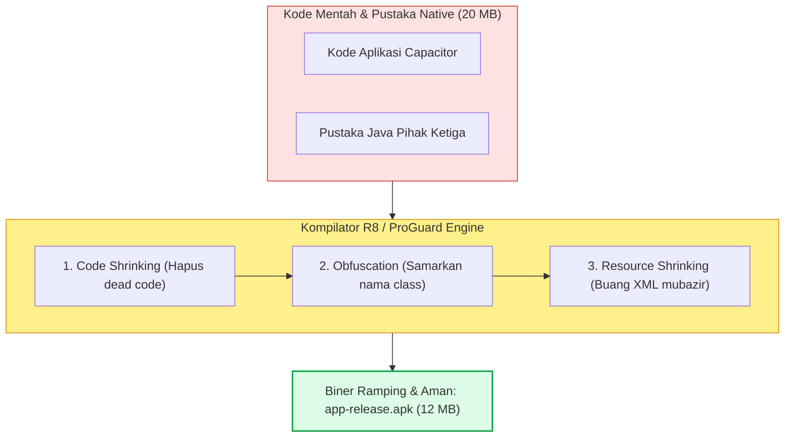
* **Tautan Berkas Kode Mandiri:**  
  👉 [`slide_07_optimasi_minifikasi_r8_proguard.html`](../contoh_kode_program/sesi_08_build_apk_uas/slide_07_optimasi_minifikasi_r8_proguard.html)

---

### 📌 Slide 08: Optimasi Web Assets: Kompresi WebP & Tree Shaking
* **Sub-CPMK:** Menganalisis teknik optimasi aset front-end untuk mempercepat kecepatan loading awal WebView.
* **Alat & Lingkungan Uji:** Google Chrome, DevTools `F12` (Tab Network & Console), VS Code.
* **Narasi Dosen Pengampu:**  
  *"Di sisi aplikasi web hybrid, kecepatan render awal pada WebView sangat dipengaruhi oleh bobot aset statis. Ubahlah gambar berformat PNG/JPEG yang berat menjadi format WebP modern yang mampu menghemat ukuran hingga 70% tanpa penurunan ketajaman kasat mata. Terapkan pula modular import selektif pada ikon Ionicons untuk memangkas ribuan ikon yang tidak dipakai. Dengan demikian, waktu inisialisasi aplikasi melonjak dari 3.2 detik menjadi 0.8 detik seketika!"*
* **Poin Kunci Pembahasan:**
  * Format kompresi gambar modern: WebP dan vektor SVG.
  * Tree-shaking pada pustaka front-end: `import { personOutline } from 'ionicons/icons'` alih-alih `import * as icons`.
  * Memangkas waktu *First Contentful Paint (FCP)* di bawah 1.5 detik untuk menjamin animasi 60 FPS yang mulus.
* **Diagram Mermaid:**
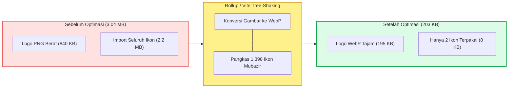
* **Tautan Berkas Kode Mandiri:**  
  👉 [`slide_08_optimasi_aset_dan_tree_shaking.html`](../contoh_kode_program/sesi_08_build_apk_uas/slide_08_optimasi_aset_dan_tree_shaking.html)

---

### 📌 Slide 09: Audit Keamanan Aplikasi Pra-Rilis
* **Sub-CPMK:** Melakukan checklist audit keamanan komprehensif pada konfigurasi AndroidManifest dan jaringan.
* **Alat & Lingkungan Uji:** Editor VS Code, inspeksi berkas `AndroidManifest.xml` dan `capacitor.config.ts`.
* **Narasi Dosen Pengampu:**  
  *"Sebelum melepas aplikasi ke tangan masyarakat luas, audit keamanan adalah harga mati yang tidak boleh ditawar! Buka berkas `AndroidManifest.xml`: pastikan `android:debuggable` bernilai false. Larang keras `usesCleartextTraffic` agar aplikasi menolak koneksi HTTP biasa tanpa enkripsi (wajib HTTPS TLS 1.3). Dan bersihkan seluruh deklarasi izin permission yang tidak relevan agar aplikasi Anda tidak dianggap berisiko atau dicurigai sebagai spyware oleh sistem keamanan Android!"*
* **Poin Kunci Pembahasan:**
  * Larangan keras meletakkan kunci rahasia (*hardcoded API Secret*) pada berkas JavaScript sisi klien.
  * Penegakan protokol komunikasi data aman (*HTTPS Enforcement*) via *Network Security Config*.
  * Sanitasi deklarasi izin `<uses-permission>` berpedoman pada prinsip hak istimewa terkecil (*Principle of Least Privilege*).
* **Diagram Mermaid:**
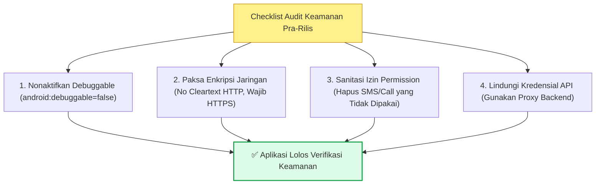
* **Tautan Berkas Kode Mandiri:**  
  👉 [`slide_09_audit_keamanan_sebelum_rilis.html`](../contoh_kode_program/sesi_08_build_apk_uas/slide_09_audit_keamanan_sebelum_rilis.html)

---

### 📌 Slide 10: Distribusi Alternatif: Progressive Web App (PWA) Offline
* **Sub-CPMK:** Menerapkan Service Worker Cache API dan Web App Manifest untuk instalasi tanpa toko aplikasi.
* **Alat & Lingkungan Uji:** Google Chrome / Edge, DevTools `F12` (Tab Application $\rightarrow$ Manifest & Service Workers).
* **Narasi Dosen Pengampu:**  
  *"Bagaimana jika pengguna Anda memakai ponsel iPhone atau ruang penyimpanan di HP-nya sangat sempit? Solusi modernnya adalah Progressive Web App (PWA). Cukup sediakan berkas `manifest.json` dan skrip latar belakang `sw.js` (Service Worker), maka peramban akan memunculkan prompt 'Tambahkan ke Layar Utama'. Berkas HTML, CSS, dan data disalin ke memori Cache Storage lokal, sehingga aplikasi portal belajar mahasiswa tetap terbuka seketika bahkan saat kuota internet habis!"*
* **Poin Kunci Pembahasan:**
  * Anatomi `manifest.json`: `short_name`, `icons`, `start_url`, dan `display: standalone`.
  * Siklus hidup Service Worker: fase `install` (precaching aset), `activate` (pembersihan cache lama), dan intercept event `fetch`.
  * Distribusi langsung ke pengguna tanpa biaya akun Google Play Store ($25) maupun Apple Developer ($99/tahun).
* **Diagram Mermaid:**
```mermaid
flowchart LR
  Browser["Browser Pengguna (UI)"] -->|fetch('/data')| SW["Service Worker Proxy"]
  SW -->|Cek Ketersediaan| Cache["Cache Storage (Lokal HP)"]
  Cache -->|Cache Hit (0 ms)| Fast["✅ Buka Cepat (Mode Offline OK)"]
  SW -->|Cache Miss| Net["🌐 Remote Cloud Server (Online)"]
  style Browser fill:#E0F2FE,stroke:#0284C7
  style SW fill:#FEF08A,stroke:#CA8A04
  style Cache fill:#DCFCE7,stroke:#16A34A
```
* **Tautan Berkas Kode Mandiri:**  
  👉 [`slide_10_pwa_service_worker_offline.html`](../contoh_kode_program/sesi_08_build_apk_uas/slide_10_pwa_service_worker_offline.html)

---

### 📌 Slide 11: Distribusi Google Play Console & Standar Android App Bundle (.aab)
* **Sub-CPMK:** Memahami ekosistem rilis Google Play Store, format AAB, dan alur track pengujian rilis.
* **Alat & Lingkungan Uji:** Browser web Google Play Console (`play.google.com/console`), terminal `./gradlew bundleRelease`.
* **Narasi Dosen Pengampu:**  
  *"Jika Anda ingin meluncurkan aplikasi ke katalog resmi Google Play Store, Google kini mewajibkan format Android App Bundle (`.aab`) melalui perintah `./gradlew bundleRelease`. Mengapa bukan APK biasa? Karena Play Store memanfaatkan Dynamic Delivery untuk memecah berkas AAB menjadi paket-paket kecil sesuai arsitektur CPU (ARM64 vs ARMv7) dan resolusi layar tiap ponsel pengguna, menghemat ukuran unduh hingga 35%. Anda juga wajib melewati tahapan track pengujian, termasuk aturan 20 penguji selama 14 hari untuk akun baru!"*
* **Poin Kunci Pembahasan:**
  * Perbedaan esensial APK Monolithic (semua library dibungkus jadi satu) versus AAB (dipecah otomatis di cloud).
  * 4 Jalur Rilis (*Release Tracks*): *Internal Testing*, *Closed Testing* (20 penguji opt-in aktif 14 hari), *Open Testing*, dan *Production*.
  * Checklist aset visual Store Listing: App Icon 512x512 PNG, Feature Graphic 1024x500, dan URL Kebijakan Privasi HTTPS.
* **Diagram Mermaid:**
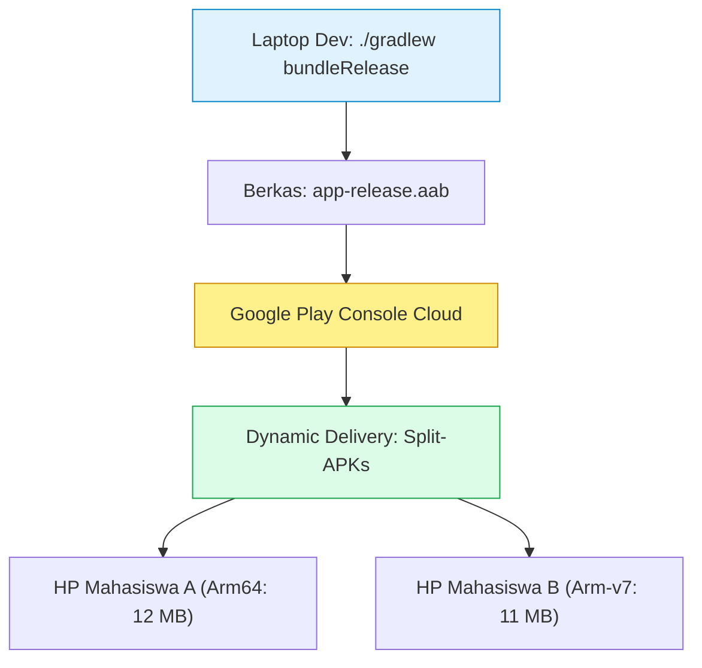
* **Tautan Berkas Kode Mandiri:**  
  👉 [`slide_11_distribusi_google_play_console.html`](../contoh_kode_program/sesi_08_build_apk_uas/slide_11_distribusi_google_play_console.html)

---

### 📌 Slide 12: Pemetaan Kisi-kisi Soal UAS: Modul 1 sampai Modul 9 BMP
* **Sub-CPMK:** Memetakan distribusi bobot kompetensi dan pola soal UAS mata kuliah STSI4303 / MSIM4401.
* **Alat & Lingkungan Uji:** Google Chrome, Buku Materi Pokok (BMP) UT STSI4303/MSIM4401.
* **Narasi Dosen Pengampu:**  
  *"Ujian Akhir Semester di Universitas Terbuka disusun dengan standar mutu akademik yang sangat terukur mengacu pada Buku Materi Pokok (BMP). Modul 1–2 mencakup 20% (Arsitektur Hybrid & Vue 3), Modul 3–5 mencakup 32% (TypeScript, Navigasi UI, Formulir, Regex, Dark Mode), Modul 6–8 mencakup 32% (Capacitor Bridge, Android Studio, REST API, Storage Persisten, Sensor), dan Modul 9 mencakup 16% (Build APK Release & Troubleshooting). Pahami pola soalnya, pelajari taksonomi kognitifnya, dan Anda pasti sukses!"*
* **Poin Kunci Pembahasan:**
  * Matriks distribusi proporsional 9 Modul BMP UT.
  * Distribusi tingkat kognitif Bloom: C1 Pengetahuan (20%), C2 Pemahaman (30%), C3 Penerapan (35%), dan C4 Analisis (15%).
  * Strategi manajemen waktu pengerjaan: 50 butir soal dalam waktu 90 menit (~1.8 menit per butir soal).
* **Diagram Mermaid:**
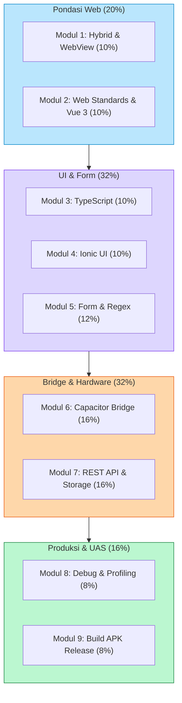
* **Tautan Berkas Kode Mandiri:**  
  👉 [`slide_12_kisi_kisi_uas_modul_1_sampai_9.html`](../contoh_kode_program/sesi_08_build_apk_uas/slide_12_kisi_kisi_uas_modul_1_sampai_9.html)

---

### 📌 Slide 13: Bank Soal UAS Bagian 1 (Soal 01 - 15): Arsitektur Hybrid & Vue.js 3
* **Sub-CPMK:** Menguji penguasaan konsep arsitektur hybrid, WebView, standar web modern, dan sistem reaktivitas Vue 3.
* **Alat & Lingkungan Uji:** Google Chrome / Edge, DevTools `F12` Console tab untuk verifikasi ekspresi reaktif.
* **Narasi Dosen Pengampu:**  
  *"Bagian pertama dari bank soal komprehensif kita menguji pondasi: Mengapa aplikasi hybrid berjalan di dalam container WebView? Bagaimana mesin Vue.js 3 memanfaatkan JavaScript Proxy API untuk mendeteksi perubahan nilai variabel reaktif secara otomatis? Kapan kita harus memilih ref() dibanding reactive()? Dan mengapa direktif v-model begitu esensial dalam pengikatan data dua arah? Mari kita uji jawaban Anda secara langsung pada lembar interaktif ini!"*
* **Poin Kunci Pembahasan:**
  * 15 butir soal pilihan ganda akademik berkualitas tinggi mencakup Modul 1 dan Modul 2 BMP UT.
  * Fitur interaktif: Pilihan opsi A/B/C/D, penandaan warna real-time, dan tombol pembahasan pedagogis lengkap.
  * Analisis peran mesin peramban internal Android System WebView berbasis Chromium.
* **Diagram Mermaid:**
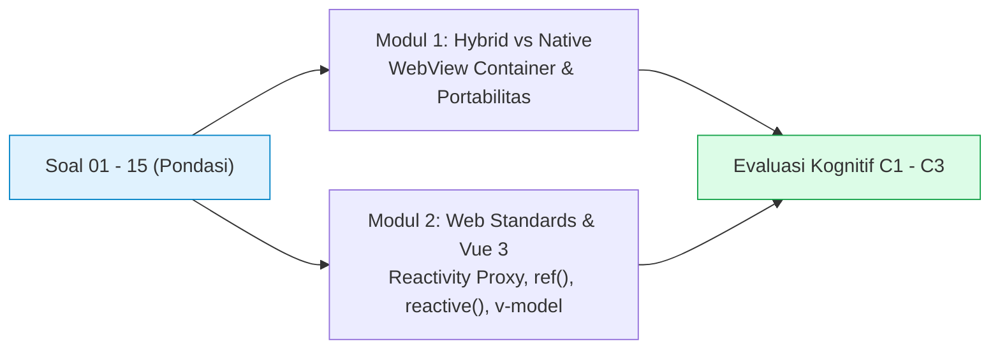
* **Tautan Berkas Kode Mandiri:**  
  👉 [`slide_13_bank_soal_uas_bagian_1.html`](../contoh_kode_program/sesi_08_build_apk_uas/slide_13_bank_soal_uas_bagian_1.html)

---

### 📌 Slide 14: Bank Soal UAS Bagian 2 (Soal 16 - 30): TypeScript, Ionic Grid & Dark Mode
* **Sub-CPMK:** Menguji pemahaman static typing TypeScript, sistem tata letak responsive grid, sanitasi Regex, dan tema gelap.
* **Alat & Lingkungan Uji:** Google Chrome / Edge, pengujian pola Regex di Console.
* **Narasi Dosen Pengampu:**  
  *"Bagian kedua membawa kita ke ranah antarmuka visual dan keamanan tipe data: Mengapa interface dan optional property (?) pada TypeScript sangat ampuh mencegah galat runtime? Bagaimana sistem 12-kolom Ionic Grid secara cerdas mengatur susunan kolom kartu saat dibuka di ponsel versus layar lebar? Dan pola regex seperti apa yang menjamin validasi 9 digit angka NIM mahasiswa UT secara akurat? Kuasai bagian ini untuk mengamankan nilai ujian Anda!"*
* **Poin Kunci Pembahasan:**
  * 15 butir soal pilihan ganda berbobot mencakup Modul 3, 4, dan 5 BMP UT.
  * Analisis potongan kode interface TypeScript dan pencocokan pola regex `^\d{9}$`.
  * Desain antarmuka mobile adaptif memanfaatkan variabel CSS dan preferensi tema gelap (*Dark Mode*).
* **Diagram Mermaid:**
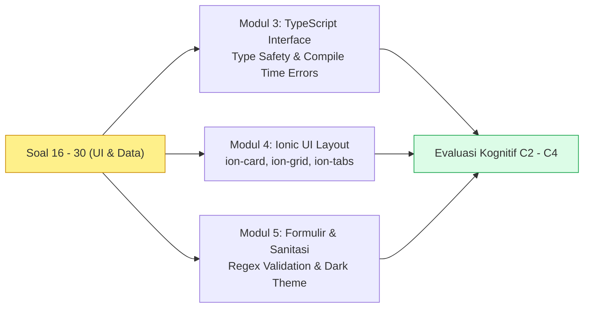
* **Tautan Berkas Kode Mandiri:**  
  👉 [`slide_14_bank_soal_uas_bagian_2.html`](../contoh_kode_program/sesi_08_build_apk_uas/slide_14_bank_soal_uas_bagian_2.html)

---

### 📌 Slide 15: Bank Soal UAS Bagian 3 (Soal 31 - 45): Capacitor Bridge, API & Storage
* **Sub-CPMK:** Menguji kompetensi komunikasi native bridge, integrasi REST API, penyimpanan lokal, dan akses sensor.
* **Alat & Lingkungan Uji:** Google Chrome DevTools (Tab Network & Application), Android Studio Logcat.
* **Narasi Dosen Pengampu:**  
  *"Di bagian ketiga, kita memasuki jantung kapabilitas aplikasi mobile: Bagaimana protokol jembatan Capacitor menerjemahkan pemanggilan JavaScript menjadi eksekusi fungsi native Java/Kotlin? Mengapa npx cap sync wajib dijalankan setiap kali ada pembaruan aset web? Mengapa blok try-catch-finally mutlak diperlukan pada penanganan fetch data jaringan? Dan mengapa Capacitor Preferences jauh lebih andal dibanding localStorage biasa saat memori OS menipis? Ujilah pemahaman Anda sekarang!"*
* **Poin Kunci Pembahasan:**
  * 15 butir soal mencakup Modul 6, 7, dan 8 BMP UT.
  * Pembahasan skenario *offline-first*, pembacaan satelit GPS Geolocation, dan perizinan Camera.
  * Pembedahan teknik pelacakan galat menggunakan Chrome Remote Inspect (`chrome://inspect`) dan Android Studio Logcat.
* **Diagram Mermaid:**
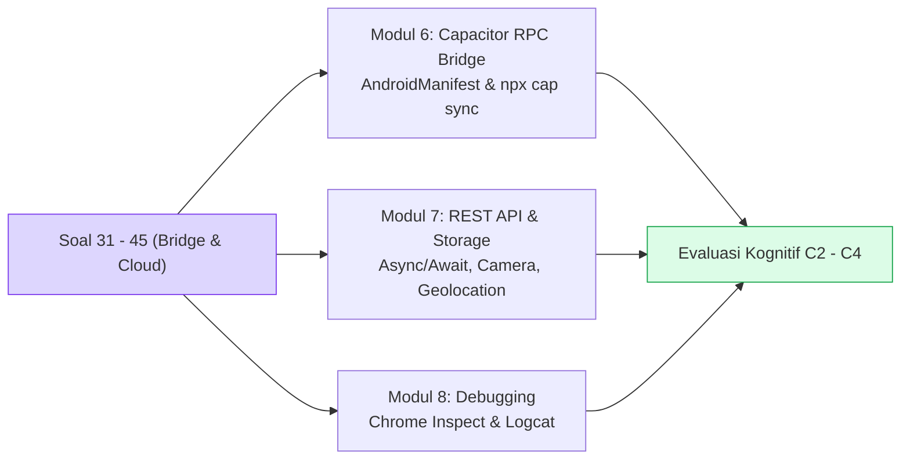
* **Tautan Berkas Kode Mandiri:**  
  👉 [`slide_15_bank_soal_uas_bagian_3.html`](../contoh_kode_program/sesi_08_build_apk_uas/slide_15_bank_soal_uas_bagian_3.html)

---

### 📌 Slide 16: Bank Soal UAS Bagian 4 (Soal 46 - 50): Keystore, Build & Kasus Produksi
* **Sub-CPMK:** Menganalisis skenario tingkat lanjut penandatanganan digital, kompilasi Gradle, dan pemecahan masalah (troubleshooting).
* **Alat & Lingkungan Uji:** Terminal CLI, Android Studio Build Analyzer, Browser Chrome.
* **Narasi Dosen Pengampu:**  
  *"Lima soal pamungkas ini menguji kematangan Anda sebagai insinyur perangkat lunak: Mengapa penandatanganan biner dengan digital keystore wajib dilakukan? Mengapa perintah assembleRelease berbeda secara fundamental dengan bundleRelease? Dan studi kasus produksi klasik: Mengapa aplikasi yang berjalan sempurna di Chrome desktop tiba-tiba mengalami layar putih total (White Screen of Death) saat dipasang di ponsel Android versi lawas? Pelajari analisis solusinya agar Anda tidak terjebak!"*
* **Poin Kunci Pembahasan:**
  * 5 butir soal analisis tingkat tinggi (*high-order thinking skills*) mencakup Modul 9 BMP UT.
  * Analisis akar masalah insiden *White Screen of Death (WSOD)* dan solusinya (pembaruan System WebView dan target transpilasi ES2015).
  * Pemahaman mitigasi risiko jika berkas *digital keystore* hilang atau rusak.
* **Diagram Mermaid:**
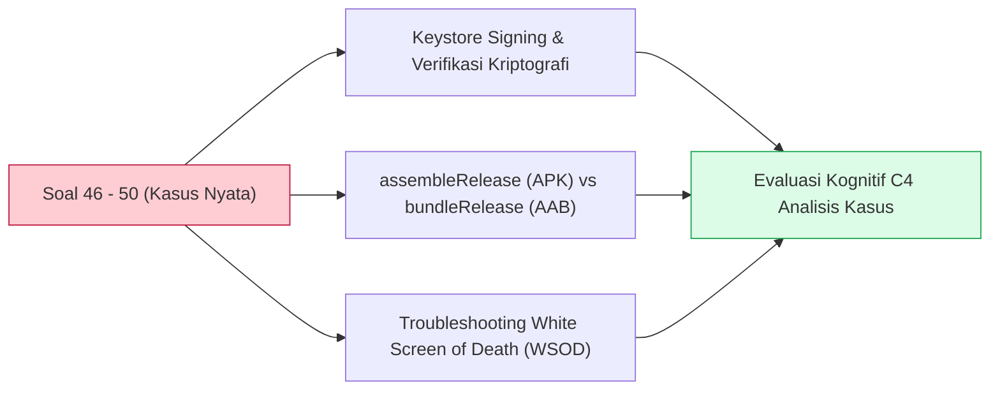
* **Tautan Berkas Kode Mandiri:**  
  👉 [`slide_16_bank_soal_uas_bagian_4.html`](../contoh_kode_program/sesi_08_build_apk_uas/slide_16_bank_soal_uas_bagian_4.html)

---

### 📌 Slide 17: Master Solusi Lab Quest 08: APK Release Validator & 50 Soal UAS Engine
* **Sub-CPMK:** Mengoperasikan simulator audit kesiapan APK rilis dan menuntaskan simulasi penuh 50 soal UAS dengan batas waktu 90 menit.
* **Alat & Lingkungan Uji:** Google Chrome / Edge di PC atau smartphone, buka berkas HTML mandiri via `file:///`.
* **Narasi Dosen Pengampu:**  
  *"Inilah mahakarya praktikum penutup perkuliahan kita: Master Solusi Lab Quest 08! Aplikasi mandiri ini dilengkapi dua instrumen utama: Tab 1 adalah APK Release Readiness Audit untuk memverifikasi apakah proyek Anda sudah memenuhi standar keamanan sebelum dibagikan ke publik. Dan Tab 2 adalah Engine Simulasi Penuh 50 Soal UAS berwaktu mundur 90 menit dengan matriks nomor soal interaktif, penilaian otomatis skala 0–100, serta penentuan predikat kelulusan resmi UT. Ujilah kemampuan Anda sekarang dan raih nilai terbaik!"*
* **Poin Kunci Pembahasan:**
  * **Tab 1 (Readiness Audit):** 6 Parameter audit kritis (Keystore, Signing, Debuggable, Cleartext, Permissions, dan SDK 34/35).
  * **Tab 2 (UAS Exam Simulator):** Ujian komprehensif 50 butir soal lengkap dengan penghitung waktu mundur (*countdown timer*) 90 menit, status pengerjaan soal, dan evaluasi hasil instan.
  * Berjalan 100% mandiri pada peramban web tanpa memerlukan dependensi Node server tambahan (*Zero-Friction*).
* **Diagram Mermaid:**
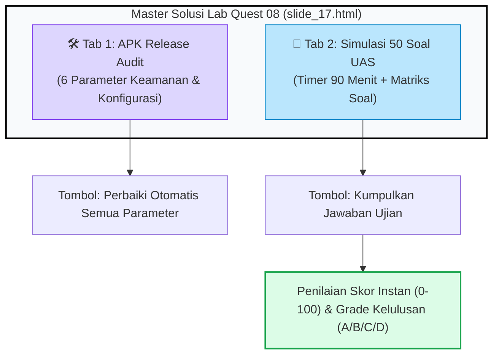
* **Tautan Berkas Kode Mandiri:**  
  👉 [`slide_17_lab_quest_08_apk_validator.html`](../contoh_kode_program/sesi_08_build_apk_uas/slide_17_lab_quest_08_apk_validator.html)

---

### 📌 Slide 18: Penutup Semester: Refleksi Perkuliahan & Pesan Dosen
* **Sub-CPMK:** Memaknai pencapaian kompetensi 8 sesi perkuliahan dan merencanakan pengembangan portofolio karir mobile profesional.
* **Alat & Lingkungan Uji:** Google Chrome / Edge, akun GitHub publik mahasiswa, profil LinkedIn.
* **Narasi Dosen Pengampu:**  
  *"Selamat rekan-rekan mahasiswa Universitas Terbuka dari Sabang sampai Merauke! Kalian telah menuntaskan seluruh rangkaian 8 sesi perkuliahan Pemrograman Berbasis Perangkat Bergerak (STSI4303 / MSIM4401). Kalian telah membuktikan bahwa dengan tekad kuat dan pendekatan zero-friction, mahasiswa UT mampu menguasai ekosistem industri modern: Ionic, Vue 3, TypeScript, Capacitor, hingga rilis mandiri APK. Teruslah berkarya, bangun portofolio GitHub yang membanggakan, dan bawalah manfaat nyata bagi kemajuan bangsa! Sukses besar di UAS dan sampai jumpa di panggung wisuda Universitas Terbuka!"*
* **Poin Kunci Pembahasan:**
  * Rangkuman pencapaian kurikulum 8 sesi dari pengenalan komponen web hingga biner produksi.
  * Tiga langkah strategis pasca perkuliahan: Portofolio GitHub, eksplorasi fitur enterprise (FCM Push Notifications, SQLite), dan persiapan karir industri.
  * Pesan inspiratif dan refleksi akademik oleh Dosen Pengampu Pak Anton Prafanto, S.Kom., M.T.
* **Diagram Mermaid:**
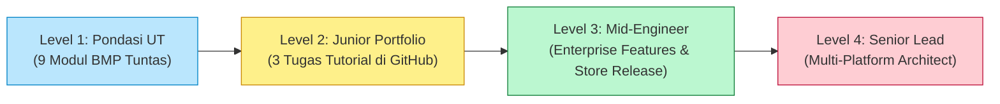
* **Tautan Berkas Kode Mandiri:**  
  👉 [`slide_18_penutup_semester_pesan_dosen.html`](../contoh_kode_program/sesi_08_build_apk_uas/slide_18_penutup_semester_pesan_dosen.html)

---

## 📚 Daftar Pustaka & Referensi Akademik

1. **Universitas Terbuka.** (2024). *Buku Materi Pokok STSI4303 / MSIM4401: Pemrograman Berbasis Perangkat Bergerak (Edisi Terbaru)*. Tangerang Selatan: Penerbit Universitas Terbuka.
2. **Google Android Open Source Project.** (2024). *Application Signing, APK Signature Scheme v2/v3, and R8 Code Shrinker*. Android Developers Documentation.
3. **Google Play Console Help.** (2024). *About Android App Bundles and Dynamic Delivery Architecture*. Google Support Documentation.
4. **W3C Web Application Security Working Group.** (2024). *Service Workers Specification W3C Recommendation*. World Wide Web Consortium.
5. **Bloom, B. S., et al.** (1956/2001). *Taxonomy of Educational Objectives: Cognitive Domain (Revised by Anderson & Krathwohl)*. New York: David McKay Company.
6. **IEEE Computer Society.** (2023). *Software Engineering Body of Knowledge (SWEBOK Guide V4.0)*. IEEE Press.
7. **Russell, A.** (2015). *Progressive Web Apps: Escaping Tabs Without Losing Our Soul*. Infrequently Noted Technical Reports.

---

## 👨‍🏫 Profil Pengampu & Kontak Akademik

* **Dosen Pengampu:** Anton Prafanto, S.Kom., M.T.
* **Program Studi:** Sistem Informasi & Informatika — Fakultas Sains dan Teknologi (FST)
* **Institusi:** Universitas Terbuka (UT)
* **Repositori Resmi Pembelajaran:** [`https://github.com/antonprafanto/tuweb_mobile2025.git`](https://github.com/antonprafanto/tuweb_mobile2025.git)
